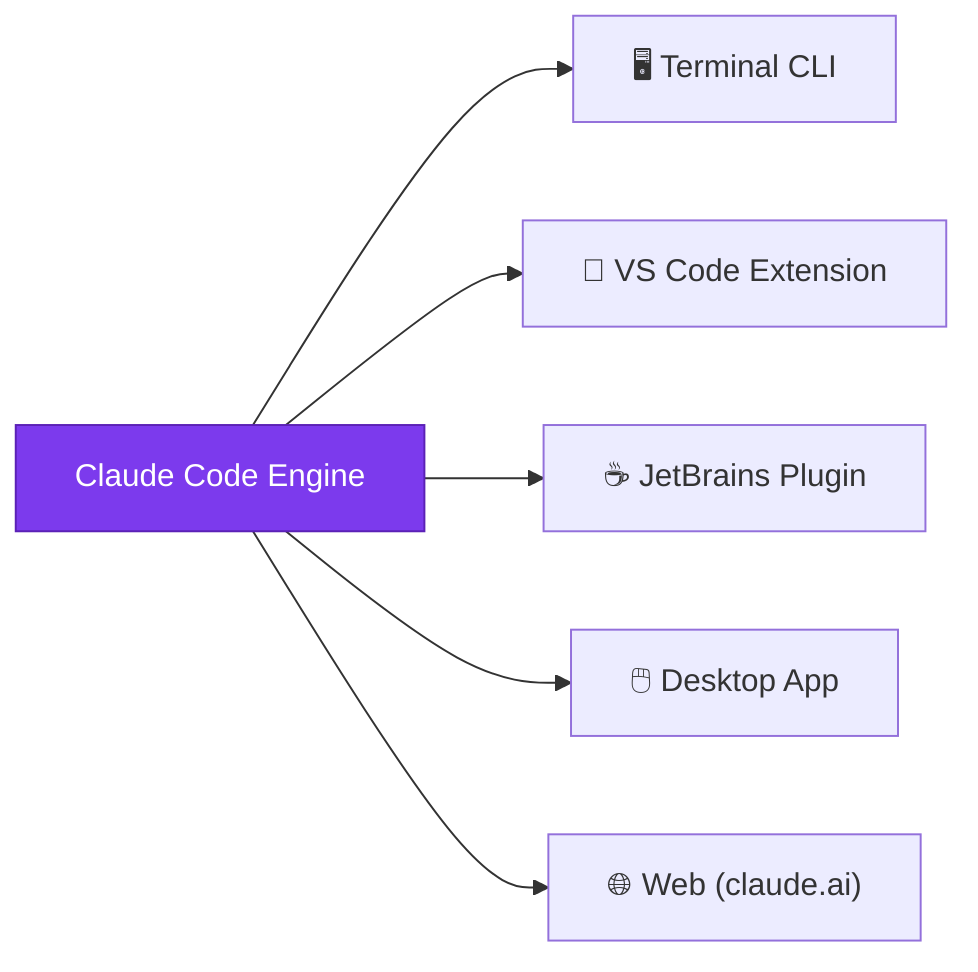
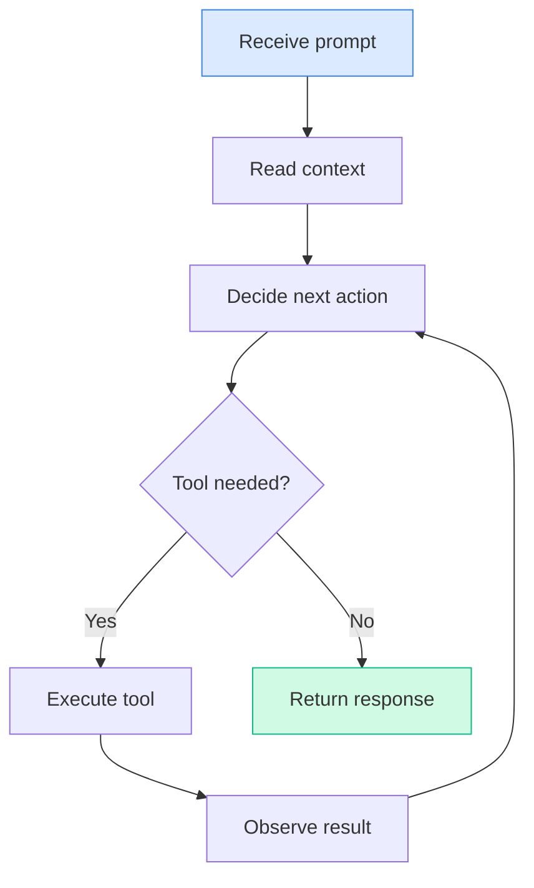

# What Is Claude Code?

---
title: Claude Code Overview — Agentic Coding for Every Surface
path: 01-basic
type: concept
audience: [All Developers]
last_verified: 2026-03-14
order: 1
source: https://code.claude.com/docs/en/overview
---

## Core Concept

Claude Code is an **AI-powered agentic coding tool** built by Anthropic. Unlike a chatbot that answers questions and waits, Claude Code:

- **Reads** your entire codebase
- **Edits** files across multiple directories
- **Runs** shell commands and validates results
- **Integrates** with your development tools (Git, GitHub CLI, MCP servers)
- **Works autonomously** through problems while you watch, redirect, or step away

> The key mental shift: instead of writing code yourself and asking Claude to review it, you **describe what you want** and Claude figures out how to build it.

---

## Available Surfaces

Claude Code runs on every major development surface:

| Surface | Best For |
|---------|----------|
| **Terminal CLI** | Full-featured, power users, CI/CD scripting |
| **VS Code** | Inline coding, file navigation, IDE integration |
| **JetBrains** | IntelliJ, PyCharm, WebStorm users |
| **Desktop App** | Visual session management, parallel sessions |
| **Web** | Browser-based, Anthropic cloud infrastructure |

All surfaces connect to the same Claude Code engine — your CLAUDE.md files, settings, and MCP servers work across all of them.

---

## What You Can Do

| Capability | Example |
|------------|---------|
| Build features & fix bugs | "implement user authentication with OAuth2" |
| Create commits & PRs | "commit with a descriptive message and open a PR" |
| Connect tools via MCP | "use the Slack MCP to post a deploy notification" |
| Customise with skills & hooks | "run eslint after every file edit" |
| Run agent teams | "spawn 3 reviewers to audit this PR in parallel" |
| Pipe, script, automate | `cat error.log \| claude -p "explain this"` |

---

## Key Architectural Concepts

### The Agentic Loop

Claude Code operates in a continuous **tool-use loop**:

### Context Window — The Core Constraint

The context window holds your entire conversation: every message, file read, and command output. **Performance degrades as context fills.** This is the single most important resource to manage.

| Factor | Impact |
|--------|--------|
| Long sessions | Context fills with irrelevant history |
| Large file reads | Each file consumes tokens |
| Verbose command output | Build logs, test output bloat context |
| Auto-compaction | Claude summarises when nearing limits |

**Key takeaway:** Use `/clear` between unrelated tasks. Use subagents for research. Keep sessions focused.

---

## Integration Ecosystem

| Integration | Purpose |
|-------------|---------|
| GitHub Actions | Automated PR reviews, issue triage |
| GitHub Code Review | Auto code review on every PR |
| Slack | Route bug reports to pull requests |
| Chrome Extension | Debug live web applications |
| Agent SDK | Build custom agents programmatically |
| Remote Control | Control local sessions from mobile |

---

## Next Steps

- **02-cc-install.md** → Get Claude Code installed and running
- **03-cc-claudemd.md** → Set up persistent project memory
- **05-cc-workflows.md** → Common development workflows
