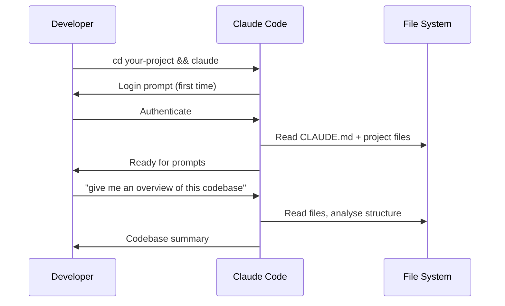

# Installation & First Session

---
title: Installing Claude Code and Running Your First Session
path: 01-basic
type: tutorial
audience: [All Developers]
last_verified: 2026-03-14
order: 2
source: https://code.claude.com/docs/en/quickstart
---

## Installation Methods

### Native Install (Recommended)

Auto-updates in the background to keep you on the latest version.

**macOS / Linux / WSL:**
```bash
curl -fsSL https://claude.ai/install.sh | bash
```

**Windows PowerShell:**
```powershell
irm https://claude.ai/install.ps1 | iex
```

**Windows CMD:**
```cmd
curl -fsSL https://claude.ai/install.cmd -o install.cmd && install.cmd && del install.cmd
```

> **Note:** Windows requires [Git for Windows](https://git-scm.com/downloads/win). Install it first.

### Homebrew (macOS)
```bash
brew install claude-code
```

### WinGet (Windows)
```cmd
winget install Anthropic.ClaudeCode
```

---

## First Session



### Step-by-step

1. **Navigate to your project:**
   ```bash
   cd /path/to/your-project
   ```

2. **Start Claude Code:**
   ```bash
   claude
   ```

3. **Authenticate** (first time only) — you'll be prompted to log in

4. **Ask your first question:**
   ```
   give me an overview of this codebase
   ```

---

## Authentication Options

| Method | Command | For |
|--------|---------|-----|
| Standard login | `claude auth login` | Personal accounts |
| SSO login | `claude auth login --sso` | Enterprise SSO |
| Email pre-fill | `claude auth login --email you@co.com` | Known email |
| Check status | `claude auth status` | Verify login state |
| Logout | `claude auth logout` | Switch accounts |

---

## Session Types

| Type | How to Start | Use For |
|------|-------------|---------|
| Interactive | `claude` | Day-to-day development |
| With initial prompt | `claude "explain this project"` | Quick questions |
| Non-interactive | `claude -p "query"` | Scripts, CI/CD, piping |
| Continue last | `claude -c` or `claude --continue` | Resume recent work |
| Resume named | `claude -r "session-name"` | Pick up specific tasks |

---

## Initialise Project Memory

Run `/init` in your first session to generate a starter `CLAUDE.md`:

```
/init
```

Claude analyses your codebase — detecting build systems, test frameworks, and code patterns — and creates a `CLAUDE.md` file with:
- Build commands
- Test instructions
- Project conventions

Refine it over time with project-specific instructions Claude can't infer from code alone.

---

## Verify Installation

```bash
# Check version
claude --version

# Check authentication
claude auth status

# Verify with a quick query
claude -p "What version of Claude Code am I running?"
```

---

## Updating

Native installations auto-update. To force an update:

```bash
claude update
```

---

## Next Steps

- **03-cc-claudemd.md** → Set up persistent project memory
- **04-cc-cli.md** → Master CLI commands and flags
