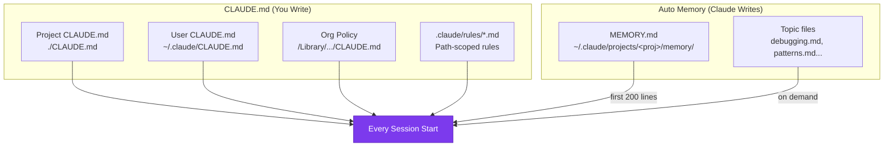

# CLAUDE.md & Auto Memory

---
title: Persistent Context — CLAUDE.md Files and Auto Memory
path: 01-basic
type: concept
audience: [All Developers]
last_verified: 2026-03-14
order: 3
source: https://code.claude.com/docs/en/memory
---

## Two Memory Systems

Claude Code has two complementary ways to carry knowledge across sessions:



| Aspect | CLAUDE.md | Auto Memory |
|--------|-----------|-------------|
| **Who writes it** | You | Claude |
| **What it contains** | Instructions, rules | Learnings, patterns |
| **Scope** | Project / user / org | Per working tree |
| **Loaded into** | Every session (full) | Every session (first 200 lines) |
| **Use for** | Coding standards, workflows | Build commands, debugging insights |

---

## CLAUDE.md — Project Instructions

### Where to Place CLAUDE.md Files

| Location | Scope | Shared Via |
|----------|-------|------------|
| `./CLAUDE.md` or `./.claude/CLAUDE.md` | This project | Git (version control) |
| `~/.claude/CLAUDE.md` | All your projects | Local only |
| `/Library/Application Support/ClaudeCode/CLAUDE.md` (macOS) | Organisation | MDM / IT policy |
| **Subdirectories** | On-demand when working in that dir | Git |

### Writing Effective CLAUDE.md

**Target:** Under 200 lines per file. Longer files consume more context and reduce adherence.

**Include (things Claude can't guess):**
- Build/test commands: `npm test`, `pytest -x`
- Code style rules that differ from defaults
- Branch naming, PR conventions
- Architectural decisions specific to your project
- Developer environment quirks (required env vars)
- Common gotchas or non-obvious behaviours

**Exclude (things Claude already knows):**
- Standard language conventions
- Self-evident practices ("write clean code")
- File-by-file codebase descriptions
- Long tutorials or API documentation (link instead)

### Example CLAUDE.md

```markdown
# Code style
- Use ES modules (import/export), not CommonJS (require)
- Destructure imports when possible

# Workflow
- Be sure to typecheck when done making code changes
- Prefer running single tests, not the whole suite

# Architecture
- API handlers live in src/api/handlers/
- Database models use Drizzle ORM
- Tests mirror src/ structure under tests/
```

### Import Syntax

Pull in external files with `@path`:

```markdown
See @README.md for project overview.
See @package.json for available npm commands.

# Additional Instructions
- Git workflow: @docs/git-instructions.md
- Personal: @~/.claude/my-project-instructions.md
```

- Relative paths resolve from the importing file
- Max 5 hops of recursive imports
- First external import triggers an approval dialog

---

## .claude/rules/ — Scoped Instructions

For larger projects, split instructions into topic files:

```
.claude/
├── CLAUDE.md              # Main project instructions
└── rules/
    ├── code-style.md      # Code style guidelines
    ├── testing.md          # Testing conventions
    └── security.md         # Security requirements
```

### Path-Specific Rules

Scope rules to specific files using YAML frontmatter:

```markdown
---
paths:
  - "src/api/**/*.ts"
---

# API Development Rules
- All endpoints must include input validation
- Use standard error response format
- Include OpenAPI documentation comments
```

Rules without `paths` load unconditionally. Path-scoped rules trigger when Claude reads matching files.

---

## Auto Memory

Claude automatically saves notes for itself: build commands, debugging insights, architecture patterns, workflow habits.

### How It Works

1. Claude decides what's worth remembering during your session
2. Notes saved to `~/.claude/projects/<project>/memory/`
3. `MEMORY.md` acts as an index — first 200 lines loaded every session
4. Topic files (e.g. `debugging.md`) read on demand

### Managing Auto Memory

```bash
# Browse memory in-session
/memory

# Toggle on/off
/memory  → select toggle

# Disable via environment
CLAUDE_CODE_DISABLE_AUTO_MEMORY=1
```

All memory files are plain Markdown. Edit or delete at any time.

---

## Troubleshooting

| Problem | Solution |
|---------|----------|
| Claude ignores CLAUDE.md | File too long — prune to <200 lines. Check `/memory` to verify it's loaded |
| Conflicting instructions | Review all CLAUDE.md files + rules/ for contradictions |
| Lost after `/compact` | CLAUDE.md survives compaction. Conversation-only instructions don't |
| Instructions not followed | Make them more specific. Add emphasis ("IMPORTANT:") |
| Auto memory too noisy | Run `/memory`, edit or delete unwanted entries |

---

## Next Steps

- **04-cc-cli.md** → CLI commands and flags reference
- **06-cc-skills.md** → Skills for on-demand knowledge (intermediate)
