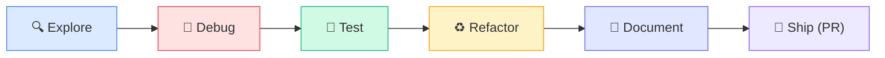
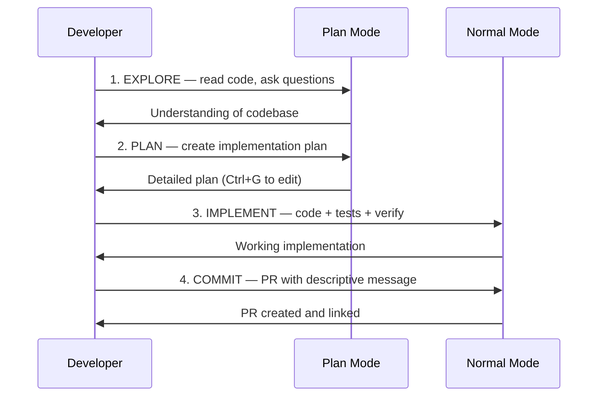

# Common Workflows

---
title: Everyday Claude Code Workflows — Explore, Fix, Test, Ship
path: 01-basic
type: tutorial
audience: [All Developers]
last_verified: 2026-03-14
order: 5
source: https://code.claude.com/docs/en/common-workflows
---

## Workflow Map



---

## 1. Explore a Codebase

Best approach for onboarding or understanding unfamiliar code.

```
give me an overview of this codebase
```

```
explain the main architecture patterns used here
```

```
how is authentication handled?
```

```
trace the login process from front-end to database
```

**Tips:**
- Start broad, then narrow down to specific areas
- Ask about coding conventions and project-specific terms
- Use `@` to reference specific files: `Explain @src/auth/login.ts`

---

## 2. Fix Bugs

Share the error and let Claude diagnose and repair.

```
I'm seeing this error when I run npm test: [paste error]
```

```
fix the login bug. Users report login fails after session timeout.
Check auth flow in src/auth/, especially token refresh.
Write a failing test first, then fix it.
```

**Best practice:** Include reproduction steps, the error message, and whether it's intermittent.

---

## 3. Write & Run Tests

```
find functions in NotificationsService.swift without test coverage
```

```
add tests for the notification service edge cases
```

```
run the new tests and fix any failures
```

Claude examines existing test files to match style, frameworks, and assertion patterns.

---

## 4. Refactor Code

```
find deprecated API usage in our codebase
```

```
refactor utils.js to use ES2024 features while maintaining the same behavior
```

```
run tests for the refactored code
```

**Tips:** Ask for small, testable increments. Request backward compatibility when needed.

---

## 5. Handle Documentation

```
find functions without proper JSDoc comments in the auth module
```

```
add JSDoc comments to the undocumented functions in auth.js
```

```
check if the documentation follows our project standards
```

---

## 6. Create Pull Requests

```
summarize the changes I've made to the authentication module
```

```
create a pr
```

```
enhance the PR description with more context about security improvements
```

When you create a PR via `gh pr create`, the session auto-links. Resume later with `claude --from-pr 123`.

---

## 7. Use Plan Mode (Read-Only Analysis)

Plan Mode instructs Claude to analyse without modifying files.

**Enter Plan Mode:**
- `Shift+Tab` (cycle through modes)
- `claude --permission-mode plan`
- `claude --permission-mode plan -p "Analyze the auth system"`

**Workflow:**
```
I need to refactor our auth system to use OAuth2.
Create a detailed migration plan.
```

Press `Ctrl+G` to open the plan in your editor for direct editing.

---

## 8. Work with Images

Provide visual context by dragging, pasting, or referencing images:

```
Here's a screenshot of the error. What's causing it?
[paste image]
```

```
Generate CSS to match this design mockup
[paste mockup image]
```

Use `Cmd+Click` (Mac) or `Ctrl+Click` (Win/Linux) on image links to preview.

---

## 9. Reference Files with @

```
Explain the logic in @src/utils/auth.js
```

```
What's the structure of @src/components?
```

```
Compare @src/old-api.ts with @src/new-api.ts
```

`@` references add the file content to the conversation and load any CLAUDE.md in that file's directory.

---

## 10. Resume & Manage Sessions

```bash
# Continue most recent session
claude --continue

# Resume by name
claude --resume auth-refactor

# Name a session at startup
claude -n "oauth-migration"

# Rename mid-session
/rename oauth-migration
```

### Session picker (`/resume`):
| Key | Action |
|-----|--------|
| `↑/↓` | Navigate sessions |
| `Enter` | Resume selected |
| `P` | Preview session |
| `R` | Rename session |
| `/` | Search filter |
| `A` | Toggle all projects |
| `B` | Filter by git branch |

---

## 11. Use Extended Thinking

Enabled by default. Include "ultrathink" in your prompt for maximum reasoning depth.

```
ultrathink — design a rate limiting system that handles distributed state
```

Toggle with `Option+T` (Mac) / `Alt+T` (Win/Linux). View thinking with `Ctrl+O` (verbose mode).

---

## The Four-Phase Workflow (Best Practice)



---

## Next Steps

- **06-cc-skills.md** → Reusable skills and custom commands
- **10-cc-prompts.md** → Master effective prompting (intermediate)
