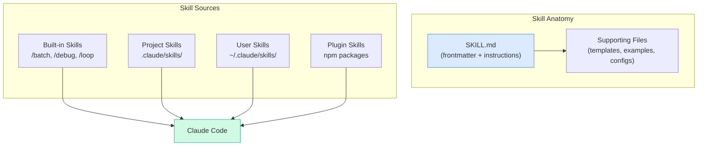

# Skills & SKILL.md

---
title: Creating and Managing Claude Code Skills
path: 02-intermediate
type: reference
audience: [Intermediate, Advanced]
last_verified: 2026-03-14
order: 6
source: https://code.claude.com/docs/en/skills
---

## What Are Skills?

Skills are reusable instruction bundles that extend Claude Code's capabilities. They provide structured context — domain knowledge, conventions, or task-specific procedures — that Claude loads on demand.



---

## Built-in Skills

Available out of the box — invoke with `/skill-name`:

| Skill | Description |
|-------|-------------|
| `/batch` | Scalable editing across many files |
| `/claude-api` | Use the Anthropic Messages API |
| `/debug` | Systematic debugging with markers |
| `/loop` | Run shell commands in a loop with auto-fix |
| `/simplify` | Reduce code complexity |

---

## Creating a Custom Skill

### 1. Choose a Location

| Location | Scope | Path |
|----------|-------|------|
| Project skill | Team-shared | `.claude/skills/my-skill/SKILL.md` |
| User skill | Personal (all projects) | `~/.claude/skills/my-skill/SKILL.md` |

### 2. Write SKILL.md

Every skill needs a `SKILL.md` file with YAML frontmatter:

```markdown
---
name: react-component
description: Create consistent React components following project patterns
arguments:
  - name: component_name
    description: Name of the React component to create
    required: true
  - name: variant
    description: Component variant (page, shared, form)
    required: false
    default: shared
---

# React Component Creator

Create a new React component following our project conventions.

## Steps
1. Read existing component examples in `src/components/`
2. Match the project's naming convention and file structure
3. Include proper TypeScript types
4. Add unit tests using the project's test framework
5. Export from the relevant barrel file

## File Structure to Create
- `src/components/{{ component_name }}/{{ component_name }}.tsx`
- `src/components/{{ component_name }}/{{ component_name }}.test.tsx`
- `src/components/{{ component_name }}/index.ts`
```

### 3. Invoke the Skill

```
/react-component component_name=UserProfile variant=page
```

Or reference with `@`:
```
Use the @react-component skill to build a Dashboard component
```

---

## SKILL.md Frontmatter Reference

| Field | Type | Required | Description |
|-------|------|----------|-------------|
| `name` | string | Yes | Unique skill identifier (kebab-case) |
| `description` | string | Yes | One-line description shown in skill list |
| `arguments` | array | No | Typed arguments the skill accepts |
| `arguments[].name` | string | Yes | Argument name |
| `arguments[].description` | string | Yes | Argument description |
| `arguments[].required` | bool | No | Whether argument is required (default: false) |
| `arguments[].default` | any | No | Default value if not provided |

---

## Skill Types

### Reference Skills
Provide context and guidelines — Claude decides how to apply them:

```markdown
---
name: api-conventions
description: Our API design conventions and patterns
---

# API Conventions

## Naming
- Use plural nouns for collections: `/users`, `/orders`
- Use kebab-case for multi-word paths: `/user-profiles`

## Response Format
Always return JSON with this envelope:
{ "data": ..., "meta": { "page": 1, "total": 100 } }
```

### Task Skills
Step-by-step procedures Claude follows:

```markdown
---
name: add-endpoint
description: Add a new REST API endpoint
arguments:
  - name: resource
    description: Resource name (singular)
    required: true
---

# Add API Endpoint

1. Create route file in `src/routes/{{ resource }}.ts`
2. Create controller in `src/controllers/{{ resource }}Controller.ts`
3. Create service in `src/services/{{ resource }}Service.ts`
4. Add validation schema in `src/validators/{{ resource }}.ts`
5. Register route in `src/routes/index.ts`
6. Write tests in `tests/routes/{{ resource }}.test.ts`
7. Run `npm test` to verify
```

---

## Supporting Files

Skills can include additional files alongside `SKILL.md`:

```
.claude/skills/add-endpoint/
  SKILL.md
  templates/
    route.ts.template
    controller.ts.template
    service.ts.template
  examples/
    user-endpoint.ts
```

Reference them in your skill instructions:
```markdown
Use the template in `templates/route.ts.template` as a starting point.
Refer to `examples/user-endpoint.ts` for a working example.
```

---

## Dynamic Context Injection

Skills can instruct Claude to read project files at execution time:

```markdown
---
name: new-migration
description: Create a database migration following project patterns
---

# Create Migration

Before creating the migration:
1. Read `src/db/migrations/` to understand naming conventions
2. Read the latest migration file for schema patterns
3. Check `src/db/schema.ts` for the current schema

Then create the new migration following the same patterns.
```

---

## Running Skills in Subagents

Skills can be pre-loaded into subagents via frontmatter:

```markdown
---
name: code-reviewer
description: Reviews code for quality and security
tools:
  - Read
  - Grep
  - Glob
  - LS
skills:
  - api-conventions
  - security-checklist
---
```

The subagent inherits the skill's context automatically.

---

## Skill Discovery

```bash
# List all available skills
/skills

# View skill details
/skill react-component

# Search for skills
/skills search "api"
```

---

## Next Steps

- **07-cc-subagents.md** → Build custom agents that use skills
- **08-cc-hooks.md** → Automate skill triggers with hooks
