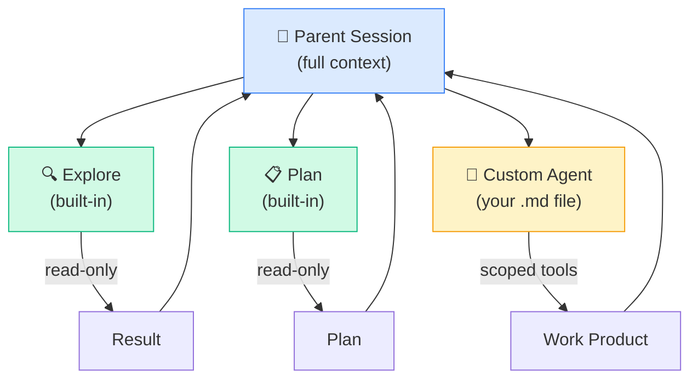

# Subagents

---
title: Custom Subagents — Specialized Agents for Focused Tasks
path: 02-intermediate
type: reference
audience: [Intermediate, Advanced]
last_verified: 2026-03-14
order: 7
source: https://code.claude.com/docs/en/sub-agents
---

## What Are Subagents?

Subagents are specialized Claude instances scoped to a particular task. Each runs in its own context with defined tools, permissions, and memory — then reports back to the parent session.



---

## Built-in Subagents

| Agent | Scope | Usage |
|-------|-------|-------|
| **Explore** | Read-only codebase exploration. Fast search + file reads. | Claude auto-delegates search tasks |
| **Plan** | Analysis-only. Creates plans without modifying files. | Invoked via Plan Mode or `Shift+Tab` |
| **General-purpose** | Full-capability agent for delegated tasks | Claude spawns as needed for subtasks |

---

## Creating a Custom Subagent

Place an `.md` file in `.claude/agents/` (project) or `~/.claude/agents/` (user):

### File Structure

```
.claude/agents/
  code-reviewer.md
  db-reader.md
  security-auditor.md
```

### Agent Definition (Frontmatter + Instructions)

```markdown
---
name: code-reviewer
description: Reviews code changes for quality, patterns, and security
tools:
  - Read
  - Grep
  - Glob
  - LS
  - Bash(git diff:*)
  - Bash(git log:*)
disallowedTools:
  - Write
  - Edit
permissionMode: bypassPermissions
model: sonnet
maxTurns: 10
skills:
  - api-conventions
  - security-checklist
mcpServers:
  - sonarqube
hooks:
  PreToolUse:
    - matcher: Write
      command: "echo 'DENY: Read-only agent'"
memory:
  persistent: false
---

# Code Reviewer

You are an expert code reviewer. Analyze changes for:

1. **Correctness** — Logic errors, edge cases, null safety
2. **Patterns** — Consistency with project conventions
3. **Security** — OWASP Top 10, injection, auth gaps
4. **Performance** — N+1 queries, unnecessary allocations
5. **Readability** — Naming, comments, complexity

## Output Format
Provide findings as:
- 🔴 Critical (must fix)
- 🟡 Warning (should fix)
- 🟢 Suggestion (nice to have)
```

### Invoke the Agent

```
/code-reviewer Review the changes in the auth module
```

Or reference with `@`:
```
Ask @code-reviewer to review my latest changes
```

---

## Frontmatter Reference

| Field | Type | Default | Description |
|-------|------|---------|-------------|
| `name` | string | — | Unique agent identifier |
| `description` | string | — | Short description for agent list |
| `tools` | string[] | all | Allowed tools (allowlist) |
| `disallowedTools` | string[] | none | Blocked tools (denylist) |
| `permissionMode` | string | `default` | `default` / `bypassPermissions` / `plan` |
| `model` | string | session | `sonnet` / `haiku` / `opus` |
| `maxTurns` | int | 25 | Maximum conversation turns |
| `skills` | string[] | none | Pre-loaded skill names |
| `mcpServers` | string[] | none | MCP servers to connect |
| `hooks` | object | none | Lifecycle hooks (see 08-cc-hooks.md) |
| `memory` | object | — | Memory configuration |
| `memory.persistent` | bool | false | Persist memory across sessions |
| `background` | bool | false | Run as background agent |
| `isolation` | string | `shared` | `shared` / `isolated` filesystem view |

---

## Tool Control

### Allowlist Pattern
Only specified tools are available:
```yaml
tools:
  - Read
  - Grep
  - Glob
  - LS
  - Bash(git:*)
```

### Denylist Pattern
All tools except specified ones:
```yaml
disallowedTools:
  - Write
  - Edit
  - Bash(rm:*)
```

### Bash Tool Filtering
Restrict shell commands with glob patterns:
```yaml
tools:
  - Bash(npm test:*)      # Only npm test commands
  - Bash(git diff:*)      # Only git diff
  - Bash(cat:*)           # Only cat
```

---

## MCP Server Scoping

Subagents can connect to specific MCP servers:

```yaml
mcpServers:
  - database        # Only this agent talks to the DB
  - sonarqube       # Code quality scanning
```

The agent only sees tools from listed MCP servers, plus its allowed built-in tools.

---

## Permission Modes

| Mode | Behavior |
|------|----------|
| `default` | Asks user for permission on sensitive operations |
| `bypassPermissions` | Auto-approves within allowed tool scope |
| `plan` | Read-only — no file modifications |

⚠️ `bypassPermissions` only applies to the tool allowlist. If a tool isn't in `tools:`, it's still blocked regardless.

---

## Agent Memory

```yaml
memory:
  persistent: true       # Remember across sessions
  scope: project         # project / user / global
```

With persistent memory, the agent accumulates knowledge across invocations — useful for reviewers or auditors that learn project patterns.

---

## Practical Examples

### Database Reader (Read-Only)
```markdown
---
name: db-reader
description: Query databases without modification
tools:
  - Read
  - mcp__database__query
disallowedTools:
  - Write
  - Edit
  - mcp__database__execute
permissionMode: bypassPermissions
---

Read-only database agent. Only SELECT queries. Never INSERT, UPDATE, or DELETE.
```

### Security Auditor
```markdown
---
name: security-auditor
description: OWASP-aware security scan
tools:
  - Read
  - Grep
  - Glob
  - LS
permissionMode: plan
skills:
  - security-checklist
maxTurns: 20
---

Scan for OWASP Top 10 vulnerabilities. Report severity, location, and remediation.
```

### Debugging Agent
```markdown
---
name: debugger
description: Systematic debugging with test reproduction
tools:
  - Read
  - Grep
  - Glob
  - Bash(npm test:*)
  - Bash(node:*)
skills:
  - debugging-workflow
maxTurns: 15
---

Debug systematically: reproduce → isolate → diagnose → verify fix.
```

---

## Subagent vs Skill — When to Use Which

| Feature | Skill | Subagent |
|---------|-------|----------|
| **Scope** | Instructions/context only | Full agent with own tools |
| **Tool control** | Inherits parent tools | Has own allowlist/denylist |
| **Persistence** | Stateless | Can persist memory |
| **MCP access** | Parent's servers | Own server scope |
| **Best for** | Templates, conventions, procedures | Specialized autonomous tasks |

---

## Next Steps

- **08-cc-hooks.md** → Lifecycle hooks for agent automation
- **11-cc-teams.md** → Coordinate multiple agents as a team (advanced)
