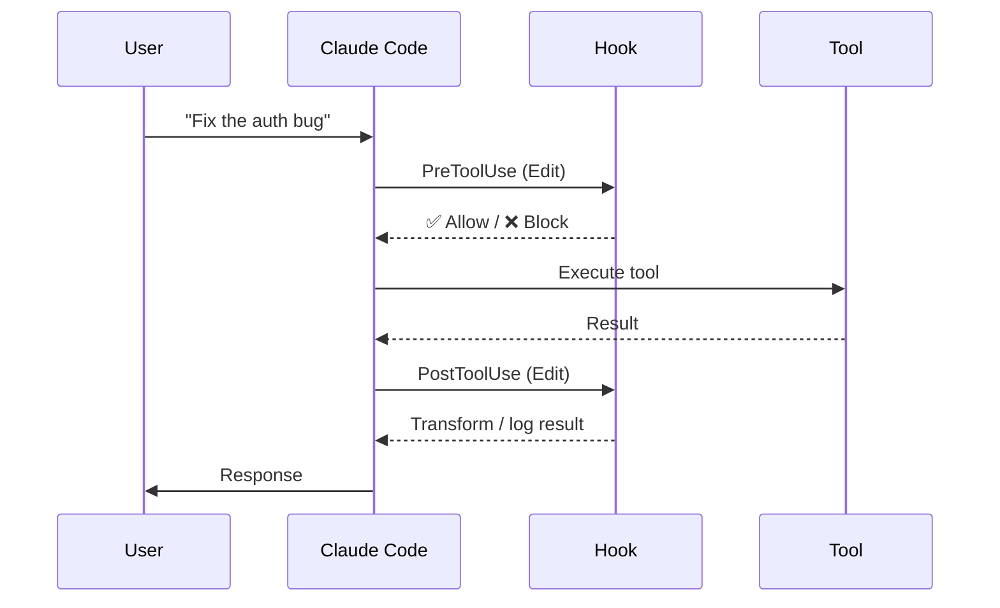

# Hooks

---
title: Lifecycle Hooks — Automate Pre/Post Tool Actions
path: 02-intermediate
type: reference
audience: [Intermediate, Advanced]
last_verified: 2026-03-14
order: 8
source: https://code.claude.com/docs/en/hooks-guide
---

## What Are Hooks?

Hooks let you inject custom logic at specific points in Claude Code's execution lifecycle — before or after tool use, on notifications, at session boundaries, and more.



---

## Hook Events

| Event | When Fired | Use Cases |
|-------|-----------|-----------|
| `SessionStart` | Session begins | Set env vars, validate setup |
| `UserPromptSubmit` | User sends a message | Enrich prompt, add context |
| `PreToolUse` | Before a tool runs | Validate, gate, transform args |
| `PermissionRequest` | Permission prompt shown | Auto-approve/deny patterns |
| `PostToolUse` | After a tool completes | Log, transform, validate output |
| `Notification` | Claude sends a notification | Custom alerts, Slack/email |
| `SubagentStart` | Subagent spawns | Inject context, log |
| `SubagentStop` | Subagent completes | Collect results, clean up |
| `Stop` | Session ends | Save state, clean up |
| `ConfigChange` | Settings modified | Validate, propagate |

---

## Hook Configuration

Hooks live in `.claude/hooks/` or in agent frontmatter.

### File-Based Hook

`.claude/hooks/pre-edit-lint.json`:
```json
{
  "event": "PreToolUse",
  "matcher": "Edit",
  "hooks": [
    {
      "type": "command",
      "command": "npx eslint --fix ${file}"
    }
  ]
}
```

### In Agent Frontmatter

```yaml
hooks:
  PreToolUse:
    - matcher: Write
      command: "echo '⚠️ Write operation detected'"
    - matcher: Bash(rm:*)
      command: "echo 'DENY: Destructive command blocked'"
  PostToolUse:
    - matcher: Edit
      command: "npx eslint --fix ${file}"
  Notification:
    - command: "osascript -e 'display notification \"Claude needs attention\"'"
```

---

## Hook Types

### 1. Command Hooks
Run a shell command:

```json
{
  "type": "command",
  "command": "npm run lint -- ${file}",
  "timeout": 30000
}
```

### 2. Prompt Hooks
Inject text into Claude's context:

```json
{
  "type": "prompt",
  "prompt": "Remember: all new files must have copyright headers."
}
```

### 3. Agent Hooks
Delegate to a subagent:

```json
{
  "type": "agent",
  "agent": "security-auditor",
  "prompt": "Review this change for security issues: ${diff}"
}
```

### 4. HTTP Hooks
Call an external API:

```json
{
  "type": "http",
  "url": "https://internal-api.example.com/hooks/code-review",
  "method": "POST",
  "headers": {
    "Authorization": "Bearer ${REVIEW_API_KEY}"
  },
  "body": {
    "file": "${file}",
    "diff": "${diff}"
  }
}
```

---

## Matchers

Matchers filter which tool invocations trigger the hook:

| Matcher | Matches |
|---------|---------|
| `Edit` | Any Edit tool call |
| `Write` | Any Write tool call |
| `Bash` | Any Bash command |
| `Bash(npm:*)` | Bash commands starting with `npm` |
| `Bash(rm:*)` | Bash commands starting with `rm` |
| `Read` | Any Read tool call |
| `*` | All tool calls |

### Glob Patterns for Bash

```yaml
# Only match git commands
- matcher: Bash(git:*)

# Match npm test and npm run test
- matcher: Bash(npm test:*)

# Match any python execution
- matcher: Bash(python:*)
```

---

## Hook Input/Output

### Input (stdin)

Hooks receive JSON on stdin:

```json
{
  "event": "PreToolUse",
  "tool": "Edit",
  "arguments": {
    "file": "src/auth/login.ts",
    "oldString": "...",
    "newString": "..."
  },
  "session": {
    "id": "abc123",
    "name": "auth-refactor"
  }
}
```

### Output (stdout)

Hooks can return structured JSON:

```json
{
  "action": "allow",
  "message": "Lint passed ✅"
}
```

| `action` | Behavior |
|----------|----------|
| `allow` | Proceed with tool execution |
| `deny` | Block tool execution, show message |
| `transform` | Modify tool arguments before execution |

### Exit Codes

| Code | Meaning |
|------|---------|
| `0` | Success — proceed |
| `1` | Failure — block tool execution |
| `2` | Warning — proceed but log warning |

---

## Practical Hook Examples

### Auto-Lint on Edit

```json
{
  "event": "PostToolUse",
  "matcher": "Edit",
  "hooks": [{
    "type": "command",
    "command": "npx eslint --fix ${file} && npx prettier --write ${file}"
  }]
}
```

### Block Destructive Commands

```json
{
  "event": "PreToolUse",
  "matcher": "Bash(rm -rf:*)",
  "hooks": [{
    "type": "command",
    "command": "echo '{\"action\": \"deny\", \"message\": \"Destructive command blocked\"}'"
  }]
}
```

### Notify on Completion

```json
{
  "event": "Stop",
  "hooks": [{
    "type": "command",
    "command": "terminal-notifier -title 'Claude Code' -message 'Session complete'"
  }]
}
```

### Copyright Header on New Files

```json
{
  "event": "PostToolUse",
  "matcher": "Write",
  "hooks": [{
    "type": "command",
    "command": "scripts/add-copyright-header.sh ${file}"
  }]
}
```

### Auto-Test After Edit

```json
{
  "event": "PostToolUse",
  "matcher": "Edit",
  "hooks": [{
    "type": "command",
    "command": "npm test -- --related ${file}",
    "timeout": 60000
  }]
}
```

---

## Hook Execution Order

When multiple hooks match:

1. **Project hooks** (`.claude/hooks/`) run first
2. **User hooks** (`~/.claude/hooks/`) run second
3. **Agent-defined hooks** run last
4. Within each scope, hooks run in declaration order
5. If any hook returns `deny`, the chain stops

---

## Next Steps

- **09-cc-context.md** → Manage context window effectively
- **12-cc-automate.md** → Automate with CI/CD and non-interactive mode (advanced)
