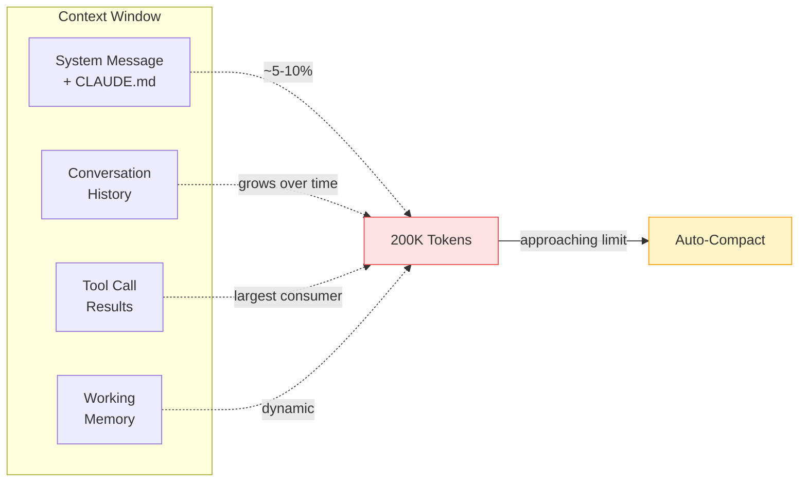

# Context Management

---
title: Context Window — Manage, Compact, and Optimize
path: 02-intermediate
type: guide
audience: [Intermediate, Advanced]
last_verified: 2026-03-14
order: 9
source: https://code.claude.com/docs/en/common-workflows
---

## Context Window Model

Claude Code operates within a finite context window (~200K tokens). Every message, file read, tool output, and response consumes tokens. Managing context is critical for effective long sessions.



---

## Key Commands

| Command | Purpose |
|---------|---------|
| `/clear` | Reset conversation history (keeps system prompt) |
| `/compact` | Summarize conversation to free tokens |
| `/compact [instructions]` | Compact with custom focus instructions |
| `/btw` | Side question without derailing main task |
| `/resume` | Resume a previous session with full context |
| `Ctrl+L` | Clear screen (visual only — context unchanged) |

---

## Auto-Compaction

When context approaches the limit, Claude Code automatically compacts:

1. Summarizes conversation history into key points
2. Preserves essential context (files modified, decisions made)
3. Discards verbose tool outputs
4. Continues seamlessly

You don't need to manage this — but understanding it helps you work more effectively.

---

## Manual Compaction

Use `/compact` proactively when:
- You've explored many files and want to focus
- Switching from exploration to implementation
- Tool outputs have been verbose (test results, logs)

```
/compact Focus on the auth module changes and test results
```

This tells Claude what to prioritize when summarizing.

---

## Session Strategies

### Short Sessions (< 30 min)
- Start fresh for each distinct task
- Name sessions: `claude -n "fix-auth-bug"`
- Don't worry about compaction

### Medium Sessions (30-120 min)
- Use `/compact` when switching phases (explore → implement)
- Use `/btw` for tangential questions
- Use subagents for investigations (keeps parent context clean)

### Long Sessions (> 2 hours)
- Break into sub-sessions with clear boundaries
- Use `/compact` every 30-45 minutes
- Delegate heavy exploration to Explore subagent
- Consider `/clear` + summarize when changing topics entirely

---

## Subagent Delegation for Context

Heavy explorations belong in subagents — they don't consume parent context:

```
Use a subagent to explore how error handling works across
the entire codebase and report back a summary
```

The subagent searches, reads files, and reports a condensed summary. The parent session only sees the summary — not all the raw file reads.

---

## `/btw` — Side Questions

Ask tangential questions without derailing the current task:

```
/btw What version of TypeScript are we using?
```

Claude answers briefly and returns to the main task context.

---

## Session Resume & Naming

```bash
# Name a session
claude -n "oauth-migration"

# Resume last session
claude --continue

# Resume by name
claude --resume oauth-migration

# List recent sessions
claude --sessions

# Resume from PR context
claude --from-pr 123
```

### Session Picker
Press `/resume` in-session to open an interactive session browser with search, rename, and preview capabilities.

---

## Context Budget Estimation

| Content Type | Approximate Token Cost |
|-------------|----------------------|
| 1 line of code | ~10-15 tokens |
| Average source file (200 lines) | ~2,000-3,000 tokens |
| `npm test` output (passing) | ~500-1,500 tokens |
| `npm test` output (failing, verbose) | ~3,000-10,000 tokens |
| Git diff (medium PR) | ~2,000-5,000 tokens |
| Your message (1 paragraph) | ~50-100 tokens |
| Claude's response (detailed) | ~500-2,000 tokens |

**Rule of thumb:** You can work with ~50-80 files in a session before needing compaction.

---

## Tips for Efficient Context Use

1. **Be specific** — "Fix the login validation in `src/auth/validate.ts`" uses less context than "Fix the login"
2. **Use `@` references** — `@src/auth/validate.ts` loads exactly what you need
3. **Delegate searches** — Let Explore subagent handle broad codebase queries
4. **Compact before implementing** — After exploration, compact to focus the implementation
5. **Name sessions** — Makes resume reliable and prevents re-exploration
6. **Use `/btw`** — Keeps side questions from polluting main task context

---

## Next Steps

- **10-cc-prompts.md** → Write effective prompts for better results
- **12-cc-automate.md** → Non-interactive mode for automation (advanced)
