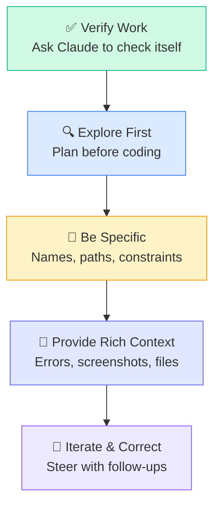

# Prompting Best Practices

---
title: Effective Prompting — Get Better Results from Claude Code
path: 02-intermediate
type: guide
audience: [All Developers]
last_verified: 2026-03-14
order: 10
source: https://code.claude.com/docs/en/best-practices
---

## The Five Principles



---

## 1. Verify Work — Make Claude Check Itself

The single most effective pattern: ask Claude to prove its work.

**Good:**
```
Fix the auth bug. After fixing, run the test suite and verify
all tests pass. If any fail, fix them.
```

**Better:**
```
Fix the timeout bug in session handling. Write a failing test first
that demonstrates the issue, then fix the code until the test passes.
Finally, run the full test suite to check for regressions.
```

### Verification Techniques

| Technique | Example |
|-----------|---------|
| Run tests | "Run tests after each change" |
| Type-check | "Run `tsc --noEmit` to verify types" |
| Lint | "Run the linter and fix any issues" |
| Build | "Make sure the project builds" |
| Self-review | "Review your changes for edge cases" |

---

## 2. Explore First — Plan Before Coding

Use the **Explore → Plan → Code → Verify** cycle:

```
1. Explore the auth module structure — read the key files
2. Create a plan for adding OAuth2 support
3. Implement the plan
4. Run all auth tests to verify
```

Or use Plan Mode explicitly:
```
[Shift+Tab to enter Plan Mode]
Analyze the payment processing system and create a plan
for adding Stripe webhook handling.
```

Then switch to Normal Mode to implement.

---

## 3. Be Specific — Names, Paths, Constraints

**Vague (slow, imprecise):**
```
Fix the login
```

**Specific (fast, accurate):**
```
Fix the login timeout in src/auth/session.ts.
The session TTL check on line 42 uses seconds instead of milliseconds.
The fix should maintain backward compatibility with existing sessions.
```

### Specificity Checklist

- ✅ File paths or module names
- ✅ Function or class names
- ✅ Error messages (exact text)
- ✅ Expected vs. actual behavior
- ✅ Constraints (performance, compatibility, style)
- ✅ Framework version (e.g., "React 19", "Node 22")

---

## 4. Provide Rich Context

### Include Error Messages
```
I'm getting this error when running npm test:

TypeError: Cannot read property 'userId' of undefined
    at AuthService.validate (src/auth/service.ts:42:15)
    at processTicksAndRejections (internal/process/task_queues.js:95:5)
```

### Include Screenshots
Paste or drag images directly:
```
Here's a screenshot of the UI bug — the modal is rendering
behind the overlay:
[paste screenshot]
```

### Reference Files
```
Look at @src/auth/service.ts and @src/auth/types.ts
to understand the current auth flow, then fix the
validation error.
```

### Include Reproduction Steps
```
Steps to reproduce:
1. Login with valid credentials
2. Wait 30 minutes (session timeout)
3. Click any navigation link
4. Error: "Session expired" even though "Remember me" was checked
```

---

## 5. Iterate and Course-Correct

Course-correcting is normal and efficient. Use follow-ups:

```
That's close, but use the existing SessionManager class
instead of creating a new one.
```

```
Good logic, but match the error handling pattern
used in src/auth/oauth.ts.
```

```
This works for the happy path. Now handle the case
where the token is expired but the refresh token is valid.
```

### Undo and Redirect

If Claude goes in the wrong direction:
```
Undo that change. Instead, approach it by modifying the
middleware rather than the route handler.
```

---

## Prompt Patterns

### The Interview Pattern
Don't know the right prompt? Ask Claude to ask you:

```
I need to add caching to our API. Interview me about
the requirements before implementing anything.
```

### The Constraint Pattern
Set boundaries upfront:

```
Refactor the auth module with these constraints:
- No new dependencies
- Keep the public API unchanged
- Must pass all existing tests
- TypeScript strict mode
```

### The Teaching Pattern
Learn while doing:

```
Fix the race condition in the WebSocket handler.
Explain each change and why it fixes the issue.
```

### The Comparison Pattern
Get multiple options:

```
Show me 3 different approaches to implementing rate limiting
for our API. Compare trade-offs for each.
```

---

## CLAUDE.md as Prompt Foundation

Your `CLAUDE.md` file is a persistent prompt that runs on every session:

```markdown
# Project: MyApp

## Build & Test
- `npm test` — run all tests
- `npm run lint` — run linter
- `npm run build` — build project

## Conventions
- Use TypeScript strict mode
- Prefer functional components
- Error messages must be user-friendly (no stack traces in UI)
- All new code must have tests

## Architecture
- src/api/ — REST API routes
- src/services/ — Business logic
- src/models/ — Database models
```

This means every prompt inherits these rules automatically — you don't need to repeat them.

---

## Anti-Patterns to Avoid

| Anti-Pattern | Better Approach |
|-------------|----------------|
| "Fix everything" | Focus on one specific issue |
| Kitchen-sink sessions (4+ hours) | Break into focused 30-60 min sessions |
| Over-specified CLAUDE.md (1000+ lines) | Keep CLAUDE.md under 500 lines |
| Ignoring verification | Always ask Claude to test/verify |
| No context (just "fix it") | Error messages, files, reproduction steps |
| Immediate correction on every line | Let Claude finish, then review holistically |

---

## Next Steps

- **06-cc-skills.md** → Create reusable skills for common tasks
- **12-cc-automate.md** → Non-interactive automation (advanced)
- **15-cc-mastery.md** → Expert-level patterns and intuition (advanced)
