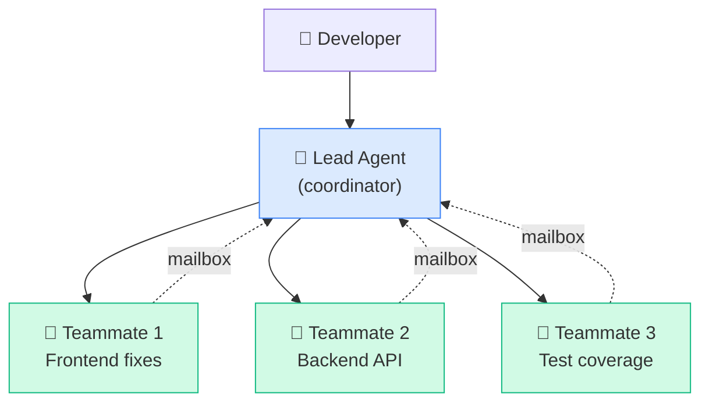
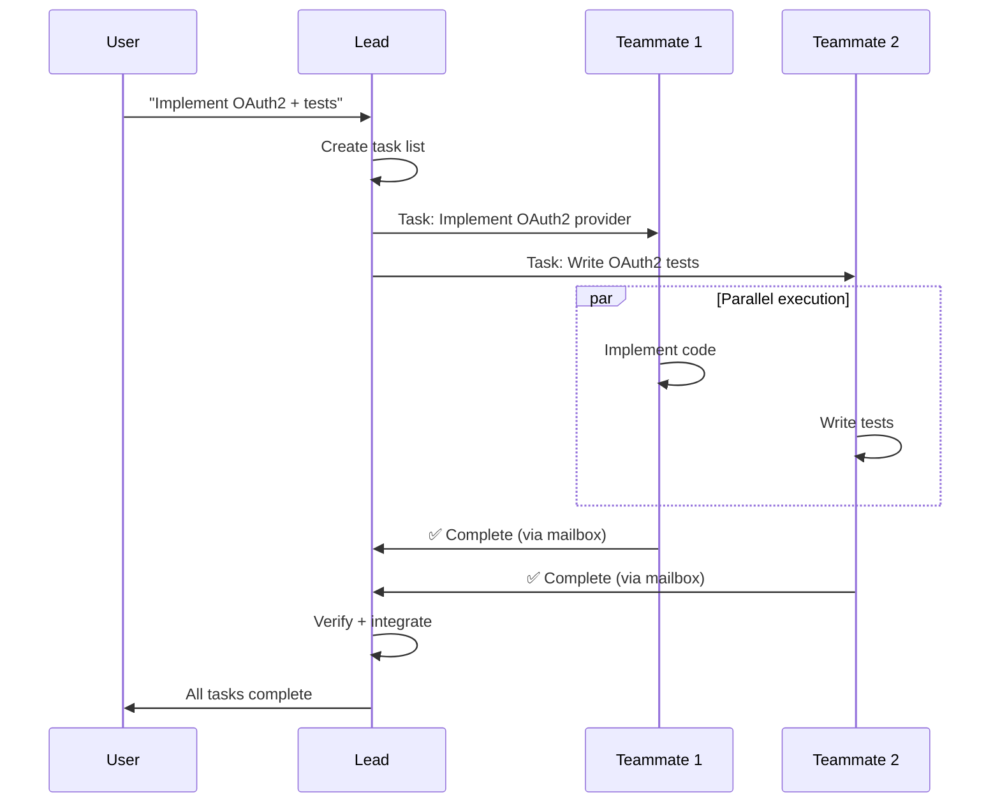

# Agent Teams

---
title: Multi-Agent Coordination — Parallel Teams and Messaging
path: 03-advanced
type: reference
audience: [Advanced]
last_verified: 2026-03-14
order: 11
source: https://code.claude.com/docs/en/agent-teams
---

## What Are Agent Teams?

Agent Teams allow multiple Claude Code instances to work in parallel, each focused on a specific subtask. A **lead agent** coordinates **teammate agents** through a shared task list and mailbox system.



---

## Enable Agent Teams

Set the environment variable:

```bash
export CLAUDE_AGENT_TEAMS=1
```

Or in `.claude/settings.json`:
```json
{
  "agentTeams": true
}
```

---

## Architecture

### Components

| Component | Role |
|-----------|------|
| **Lead Agent** | Creates task list, assigns to teammates, monitors progress |
| **Teammates** | Execute assigned tasks independently |
| **Task List** | Shared queue of work items with status tracking |
| **Mailbox** | Async message passing between lead and teammates |

### Communication Flow



---

## Task List

The lead creates a structured task list:

```
Create a team to work on these tasks in parallel:
1. Refactor the auth module to use JWT
2. Update all API tests to use the new auth
3. Create a migration script for existing sessions
4. Update documentation
```

Claude creates teammate agents for independent tasks and manages dependencies.

### Task States

| State | Meaning |
|-------|---------|
| `pending` | Not yet assigned |
| `assigned` | Given to a teammate |
| `in-progress` | Teammate is working |
| `complete` | Work finished, result reported |
| `blocked` | Waiting on another task |

---

## Display Modes

### In-Process Mode
All agents run in the same terminal. Status updates interleaved:

```
[Lead] Creating task list...
[Teammate 1] Working on: Refactor auth module
[Teammate 2] Working on: Update API tests
[Teammate 1] ✅ Auth module refactored
[Teammate 2] ✅ Tests updated
[Lead] All tasks complete. Integrating...
```

### Tmux Mode
Each agent gets its own tmux pane for visual monitoring:

```bash
# Requires tmux installed
brew install tmux  # macOS
```

Each pane shows one agent's output in real-time.

---

## Practical Examples

### Parallel Code Review

```
Create a team to review this PR:
- Teammate 1: Review frontend changes for React best practices
- Teammate 2: Review backend changes for security issues
- Teammate 3: Review test coverage and edge cases

Combine all findings into a single review summary.
```

### Competing Hypotheses

```
I have a performance bug in the dashboard loading.
Create a team where each teammate investigates a
different hypothesis:
- Teammate 1: Check database queries for N+1 issues
- Teammate 2: Check API response payload sizes
- Teammate 3: Check frontend rendering performance

Report which hypothesis explains the slowdown.
```

### Feature Implementation

```
Implement user notifications:
- Teammate 1: Backend API endpoints (src/api/notifications.ts)
- Teammate 2: Database schema and migrations (src/db/)
- Teammate 3: Frontend notification component (src/components/)
- Teammate 4: Email service integration (src/services/)

Coordinate on the shared interface types.
```

---

## Context and Communication

### Shared Context
- All teammates share the same project directory
- Each teammate has its own conversation context (independent)
- The lead agent provides task-specific instructions

### Mailbox Messaging
- Teammates report status and results to the lead via mailbox
- Lead can send follow-up instructions to specific teammates
- Messages are async — teammates don't need to wait for each other

### Conflict Resolution
- File conflicts are resolved by the lead agent
- Non-overlapping files: teammates work freely in parallel
- Overlapping files: lead sequences dependent tasks

---

## Hooks with Agent Teams

```yaml
hooks:
  SubagentStart:
    - command: "echo 'Teammate started: ${agent_name}'"
  SubagentStop:
    - command: "echo 'Teammate finished: ${agent_name} — status: ${status}'"
```

---

## Best Practices

1. **Independent tasks** — Assign tasks that don't modify the same files
2. **Clear boundaries** — Specify exact files/modules per teammate
3. **Shared interfaces** — Define types/interfaces before parallelizing
4. **Lead verification** — Have the lead run integration tests after assembly
5. **Reasonable team size** — 2-4 teammates is optimal; more adds coordination overhead

---

## Limitations

- Teammates share the filesystem — concurrent edits to the same file can conflict
- Each teammate consumes its own context window
- Network-heavy tasks (API calls, builds) may bottleneck
- Not available in all Claude Code surfaces (terminal only currently)

---

## Next Steps

- **12-cc-automate.md** → CI/CD and non-interactive automation
- **07-cc-subagents.md** → Single-agent delegation (intermediate)
