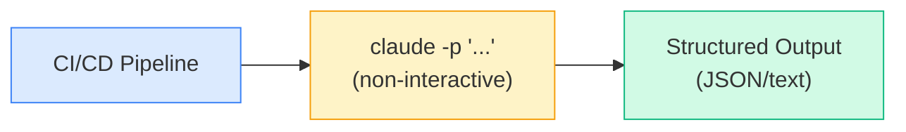

# Automation & CI/CD

---
title: Non-Interactive Mode — Scripting, Pipelines, and Fan-Out
path: 03-advanced
type: reference
audience: [Advanced]
last_verified: 2026-03-14
order: 12
source: https://code.claude.com/docs/en/best-practices
---

## Non-Interactive Mode

Run Claude Code without human interaction — ideal for CI/CD, batch processing, and automated workflows.



---

## Core Flags for Automation

| Flag | Description |
|------|-------------|
| `-p "prompt"` | Non-interactive mode — run prompt and exit |
| `--output-format json` | Structured JSON output |
| `--output-format text` | Plain text output (default) |
| `--output-format stream-json` | Streaming JSON (line-delimited) |
| `--allowedTools` | Restrict available tools |
| `--permission-mode bypassPermissions` | Skip permission prompts |
| `--model` | Select model (sonnet/haiku/opus) |
| `--max-turns` | Limit conversation turns |
| `--no-user-input` | Guarantee no stdin reads |

---

## Basic Automation Patterns

### One-Shot Command
```bash
claude -p "Explain the purpose of src/auth/login.ts" --output-format text
```

### JSON Output for Parsing
```bash
claude -p "List all TODO comments in the codebase" --output-format json | jq '.result'
```

### Piped Input
```bash
cat error.log | claude -p "Analyze this error log and suggest fixes"
```

```bash
git diff HEAD~1 | claude -p "Review this diff for bugs and security issues"
```

---

## CI/CD Integration

### GitHub Actions — PR Review Bot

```yaml
name: Claude Code Review
on: [pull_request]

jobs:
  review:
    runs-on: ubuntu-latest
    steps:
      - uses: actions/checkout@v4
      - name: Review PR
        run: |
          git diff origin/main...HEAD | claude -p \
            "Review this diff. Report bugs, security issues, and style violations. \
             Output as JSON with severity levels." \
            --output-format json \
            --permission-mode bypassPermissions \
            --allowedTools Read,Grep,Glob \
            > review.json
      - name: Post Review
        run: |
          # Parse review.json and post as PR comment
          gh pr comment ${{ github.event.pull_request.number }} \
            --body "$(cat review.json | jq -r '.result')"
```

### Pre-Commit Hook

```bash
#!/bin/bash
# .git/hooks/pre-commit
STAGED=$(git diff --cached --name-only)
claude -p "Check these staged files for issues: $STAGED" \
  --output-format json \
  --allowedTools Read,Grep \
  --permission-mode bypassPermissions \
  --max-turns 5
```

### Automated Test Generation

```bash
claude -p "Generate unit tests for all untested functions in src/services/" \
  --permission-mode bypassPermissions \
  --allowedTools Read,Write,Grep,Glob,Bash
```

---

## Fan-Out Pattern

Process multiple files in parallel using shell tools:

```bash
# Fan out across all service files
find src/services -name "*.ts" | xargs -P 4 -I {} \
  claude -p "Add JSDoc comments to all exported functions in {}" \
    --permission-mode bypassPermissions \
    --allowedTools Read,Edit
```

```bash
# Parallel review of changed files
git diff --name-only HEAD~1 | xargs -P 3 -I {} \
  claude -p "Review {} for potential bugs" \
    --output-format json \
    --allowedTools Read,Grep
```

### Writer / Reviewer Pattern

Two-pass automation for quality:

```bash
# Pass 1: Writer generates code
claude -p "Implement the UserNotification service following our patterns" \
  --permission-mode bypassPermissions > /dev/null

# Pass 2: Reviewer checks the work
claude -p "Review the UserNotification service for correctness, security, and test coverage" \
  --output-format json \
  --allowedTools Read,Grep,Glob
```

---

## Tool Restrictions for Safety

```bash
# Read-only analysis
claude -p "Analyze the codebase architecture" \
  --allowedTools Read,Grep,Glob,LS

# Only allow specific bash commands
claude -p "Run tests and report results" \
  --allowedTools "Read,Bash(npm test:*)"

# Full access for implementation
claude -p "Implement the feature described in FEATURE.md" \
  --allowedTools Read,Write,Edit,Grep,Glob,LS,Bash \
  --permission-mode bypassPermissions
```

---

## Structured Output Parsing

### JSON Output Format

```bash
result=$(claude -p "List all API endpoints" --output-format json)
echo "$result" | jq '.result'        # Main output
echo "$result" | jq '.cost_usd'     # Cost tracking
echo "$result" | jq '.duration_ms'  # Duration
echo "$result" | jq '.num_turns'    # Turns used
```

### Stream JSON for Real-Time Processing

```bash
claude -p "Refactor all utils" --output-format stream-json | while read -r line; do
  event=$(echo "$line" | jq -r '.type')
  case "$event" in
    "assistant") echo "Claude: $(echo "$line" | jq -r '.message')" ;;
    "tool_use") echo "Tool: $(echo "$line" | jq -r '.tool')" ;;
    "result") echo "Done: $(echo "$line" | jq -r '.result')" ;;
  esac
done
```

---

## Session Management in Automation

```bash
# Continue a named session programmatically
claude --continue --session-id "migration-batch" \
  -p "Process the next batch of files"

# Resume from a PR
claude --from-pr 456 -p "Address the review comments"
```

---

## Cost Control

| Strategy | Implementation |
|----------|---------------|
| Model selection | `--model haiku` for simple tasks |
| Turn limits | `--max-turns 5` to cap iterations |
| Tool restrictions | `--allowedTools Read,Grep` (no writes) |
| Timeout | Wrap in `timeout 120 claude -p "..."` |
| Batch sizing | Process 10 files per invocation, not 100 |

---

## Next Steps

- **11-cc-teams.md** → Parallel multi-agent execution
- **08-cc-hooks.md** → Lifecycle hooks for pipeline automation (intermediate)
