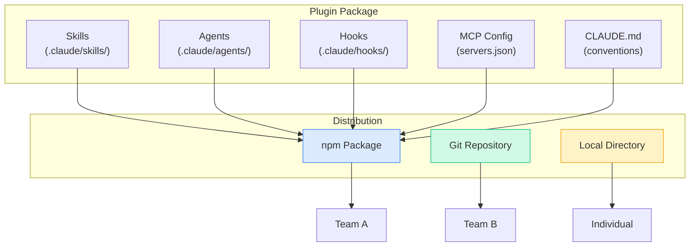

# Plugins & Distribution

---
title: Package Skills, Hooks, and Agents for Sharing
path: 03-advanced
type: reference
audience: [Advanced]
last_verified: 2026-03-14
order: 13
source: https://code.claude.com/docs/en/skills
---

## What Are Plugins?

Plugins bundle skills, hooks, agents, and MCP configurations into distributable packages. Teams can share standardized workflows, coding standards, and tool integrations.



---

## Plugin Structure

```
my-claude-plugin/
├── package.json            # npm package metadata
├── .claude/
│   ├── skills/
│   │   ├── react-component/
│   │   │   └── SKILL.md
│   │   └── api-endpoint/
│   │       ├── SKILL.md
│   │       └── templates/
│   ├── agents/
│   │   ├── code-reviewer.md
│   │   └── security-auditor.md
│   ├── hooks/
│   │   ├── pre-edit-lint.json
│   │   └── post-write-format.json
│   └── settings.json       # MCP server configs
├── CLAUDE.md               # Project conventions
└── README.md
```

---

## Creating a Plugin

### 1. Initialize

```bash
mkdir my-team-plugin && cd my-team-plugin
npm init -y
```

### 2. Add Plugin Metadata

`package.json`:
```json
{
  "name": "@myteam/claude-code-plugin",
  "version": "1.0.0",
  "description": "Team conventions for Claude Code",
  "keywords": ["claude-code-plugin"],
  "claudeCode": {
    "skills": [".claude/skills/*"],
    "agents": [".claude/agents/*"],
    "hooks": [".claude/hooks/*"]
  }
}
```

### 3. Add Skills

`.claude/skills/react-component/SKILL.md`:
```markdown
---
name: react-component
description: Create React components following team standards
arguments:
  - name: name
    description: Component name
    required: true
---

Create a React component using our team's patterns:
1. TypeScript functional component with Props interface
2. CSS Modules for styling
3. Unit test with React Testing Library
4. Storybook story
5. Export from barrel file
```

### 4. Add Agents

`.claude/agents/security-scan.md`:
```markdown
---
name: security-scan
description: OWASP-aware security scanner
tools:
  - Read
  - Grep
  - Glob
permissionMode: plan
---

Scan for OWASP Top 10 vulnerabilities. Check for:
- SQL injection
- XSS
- CSRF
- Authentication bypass
- Sensitive data exposure

Report findings with severity and remediation steps.
```

### 5. Add Hooks

`.claude/hooks/auto-format.json`:
```json
{
  "event": "PostToolUse",
  "matcher": "Edit",
  "hooks": [{
    "type": "command",
    "command": "npx prettier --write ${file}"
  }]
}
```

### 6. Add Project Standards

`CLAUDE.md`:
```markdown
# Team Standards

## Code Style
- TypeScript strict mode
- Functional React components
- CSS Modules (no styled-components)

## Testing
- React Testing Library (not Enzyme)
- 80% coverage minimum
- All new code must have tests

## Git
- Conventional commits
- Squash merge only
- PR required for main
```

---

## Distribution Methods

### npm Package

```bash
# Publish
npm publish --access public

# Install (consumer)
npm install @myteam/claude-code-plugin
```

### Git Repository

```bash
# Consumer adds as dependency
npm install git+https://github.com/myteam/claude-code-plugin.git
```

### Local Path (Monorepo)

```json
{
  "dependencies": {
    "@myteam/claude-code-plugin": "file:../shared/claude-plugin"
  }
}
```

---

## Consuming Plugins

Once installed, plugin artifacts are auto-discovered:

1. **Skills** appear in `/skills` list
2. **Agents** appear in agent invocation menu
3. **Hooks** activate based on their event triggers
4. **CLAUDE.md** merged into project context

### Override Plugin Defaults

Project-level files take precedence over plugin files:

```
.claude/skills/react-component/SKILL.md    ← Your override
node_modules/@team/plugin/.claude/skills/   ← Plugin default
```

---

## Plugin Versioning

Follow semver for plugin updates:

| Change | Version Bump |
|--------|-------------|
| New skill/agent added | Minor (1.1.0) |
| Existing skill behavior changed | Major (2.0.0) |
| Bug fix in templates | Patch (1.0.1) |
| New hook added | Minor (1.1.0) |
| Breaking CLAUDE.md change | Major (2.0.0) |

---

## Plugin Testing

```bash
# Test skills locally
cd my-plugin
claude -p "Use the @react-component skill to create a TestWidget" \
  --allowedTools Read,Write,Edit

# Validate hook execution
claude -p "Edit any file and verify the auto-format hook runs" \
  --allowedTools Read,Edit
```

---

## Next Steps

- **06-cc-skills.md** → Deep dive into skill creation (intermediate)
- **07-cc-subagents.md** → Building individual subagents (intermediate)
- **08-cc-hooks.md** → Hook event reference (intermediate)
