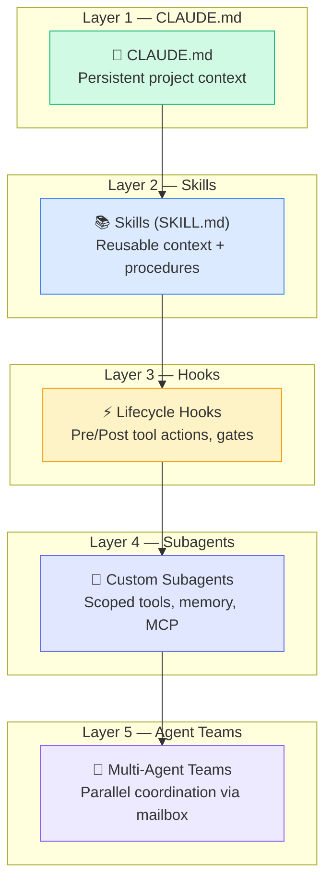
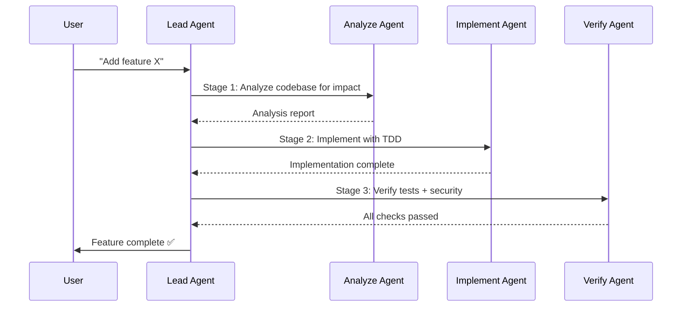
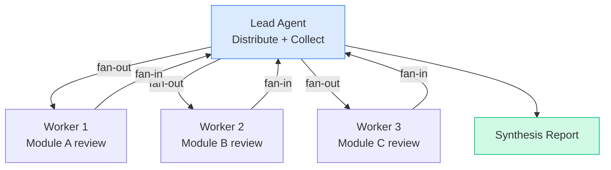
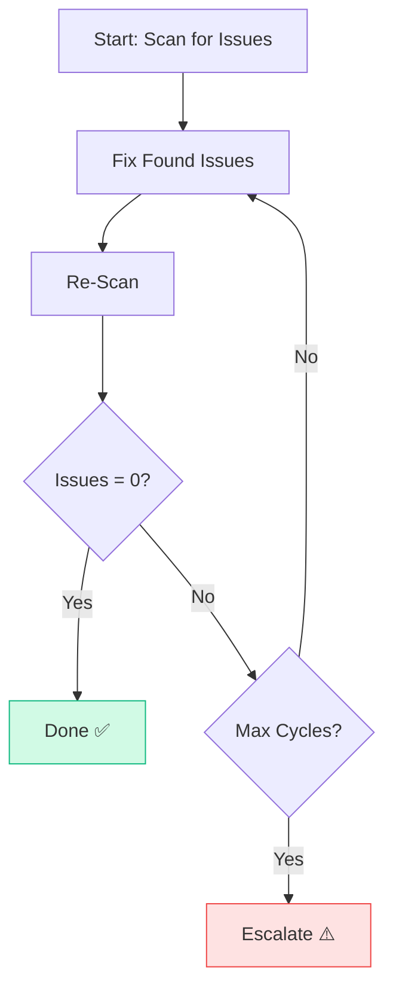
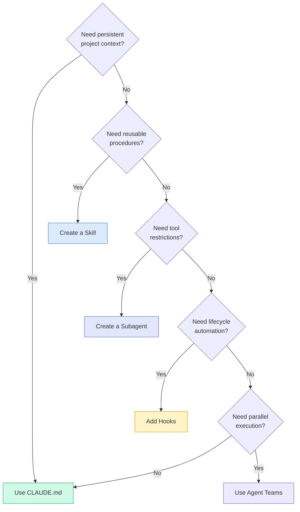

# Agent & Skill Orchestration

---
title: Orchestration Patterns — Coordinating Agents, Skills, Hooks, and Teams
path: 03-advanced
type: reference
audience: [Advanced, Architects]
last_verified: 2026-03-14
order: 14
source: synthesised from code.claude.com/docs + CORTEX architecture patterns
---

## The Orchestration Stack

Claude Code provides a layered orchestration model. Each layer adds coordination capability on top of the previous one.



---

## Orchestration Patterns

### Pattern 1: Intent Router

Route user requests to the right agent based on keywords or context.

**CLAUDE.md as Router:**
```markdown
# Routing Rules
- Security-related requests → @security-auditor
- Database queries → @db-reader
- Frontend work → @ui-builder
- Code review → @code-reviewer
```

**Dedicated Router Agent:**
```markdown
---
name: router
description: Classify intent and delegate to specialist agents
tools:
  - Read
  - Grep
  - Glob
---

Classify the user's request:
1. If security/vulnerability → delegate to @security-auditor
2. If database/query → delegate to @db-reader
3. If test/coverage → delegate to @test-writer
4. If refactor/improve → delegate to @code-improver
5. Otherwise → handle directly
```

### Pattern 2: Pipeline (Sequential Stages)

Chain agents in a defined order — each stage's output feeds the next.



**Implementation with hooks + skills:**
```markdown
---
name: feature-pipeline
description: Multi-stage feature implementation
skills:
  - code-conventions
  - security-checklist
---

Execute this pipeline:
1. ANALYZE: Read affected files, assess impact, identify test gaps
2. PLAN: Create implementation plan (use Plan Mode thinking)
3. TEST: Write failing tests first (TDD — red phase)
4. IMPLEMENT: Write minimum code to pass tests (green phase)
5. REFACTOR: Clean up, apply conventions, verify security
6. VERIFY: Run full test suite, lint, type-check
```

### Pattern 3: Fan-Out / Fan-In

Distribute independent work to parallel agents, then collect results.



**Using Agent Teams:**
```
Create a team to review all three service modules in parallel:
- Teammate 1: Review src/services/auth/ for security
- Teammate 2: Review src/services/payment/ for error handling
- Teammate 3: Review src/services/notification/ for performance

Synthesize findings into a single prioritized report.
```

**Using non-interactive fan-out:**
```bash
# Fan-out across modules
for module in auth payment notification; do
  claude -p "Review src/services/$module/ for quality issues" \
    --output-format json \
    --allowedTools Read,Grep,Glob > "review-$module.json" &
done
wait

# Fan-in: synthesize
claude -p "Synthesize these review reports into one prioritized list" \
  review-auth.json review-payment.json review-notification.json
```

### Pattern 4: Gate / Guardian

Enforce quality gates before allowing operations to proceed.

```markdown
---
name: quality-gate
description: Pre-commit quality guardian
tools:
  - Read
  - Grep
  - Glob
  - Bash(npm test:*)
  - Bash(npx eslint:*)
permissionMode: bypassPermissions
---

Before any code commit, verify:
1. All tests pass: `npm test`
2. Lint clean: `npx eslint src/`
3. Type-check: `npx tsc --noEmit`
4. No TODO/FIXME in changed files
5. No console.log in production code

If ANY check fails, report the issue and block.
```

**With hooks enforcement:**
```json
{
  "event": "PreToolUse",
  "matcher": "Bash(git commit:*)",
  "hooks": [{
    "type": "agent",
    "agent": "quality-gate",
    "prompt": "Run quality checks before this commit"
  }]
}
```

### Pattern 5: Convergence Loop

Iteratively fix issues until a quality threshold is met.



```markdown
---
name: convergence-fixer
description: Fix issues in a loop until clean
---

Execute this loop (max 3 cycles):
1. SCAN: Run linter, type-checker, and tests
2. FIX: Address all found issues
3. RE-SCAN: Run checks again
4. If issues remain and cycles < 3, go to step 2
5. If issues remain after 3 cycles, report unfixed items
```

### Pattern 6: Specialist Delegation

The lead agent identifies the domain and delegates to the right specialist.

```markdown
---
name: tech-lead
description: Smart delegation to domain specialists
skills:
  - project-conventions
---

You are the tech lead. Analyze the user's request and delegate:

## Specialists Available
- @frontend-dev: React components, CSS, accessibility
- @backend-dev: API endpoints, database, auth
- @devops-eng: CI/CD, Docker, deployment
- @security-eng: Vulnerability scanning, OWASP checks

## Rules
1. Analyze the request scope
2. Identify the primary domain
3. Delegate to the appropriate specialist
4. Review the specialist's output before presenting
5. If cross-domain, coordinate multiple specialists sequentially
```

---

## Composition Matrix

| Pattern | Agents | Skills | Hooks | Teams | Best For |
|---------|--------|--------|-------|-------|----------|
| Intent Router | ✅ | — | — | — | Multi-purpose entry point |
| Pipeline | ✅ | ✅ | ✅ | — | Sequential workflows (TDD, deploy) |
| Fan-Out/Fan-In | — | — | — | ✅ | Parallel analysis, review |
| Gate / Guardian | ✅ | — | ✅ | — | Quality enforcement |
| Convergence Loop | ✅ | ✅ | — | — | Iterative repair (lint, audit) |
| Specialist Delegation | ✅ | ✅ | — | optional | Domain-specific expertise |

---

## Designing Your Orchestration

### Decision Flowchart



### Complexity Budget

| Complexity | Use |
|-----------|-----|
| **Low** (1 file, 1 task) | CLAUDE.md + direct prompt |
| **Medium** (multi-file, conventions) | Skills for procedures + CLAUDE.md for context |
| **High** (multi-domain, quality gates) | Subagents with scoped tools + hooks for gates |
| **Very High** (parallel, cross-cutting) | Agent Teams with lead coordinator |

---

## Anti-Patterns in Orchestration

| Anti-Pattern | Problem | Fix |
|-------------|---------|-----|
| God Agent | One agent with all tools and responsibilities | Split into specialist subagents |
| Over-hooking | Hooks on every tool call | Hook only critical operations |
| Circular delegation | Agent A delegates to B, B delegates to A | Define clear hierarchy |
| Fan-out without fan-in | Parallel work with no synthesis | Always collect and review results |
| Tool sprawl | Every agent has access to all MCP servers | Scope MCP per agent's role |
| Skill bloat | SKILL.md > 500 lines | Split into focused skills + supporting files |

---

## Next Steps

- **15-cc-mastery.md** → How CORTEX accelerates Claude Code skill/agent development
- **11-cc-teams.md** → Agent Teams deep dive
- **08-cc-hooks.md** → Lifecycle hooks reference (intermediate)
