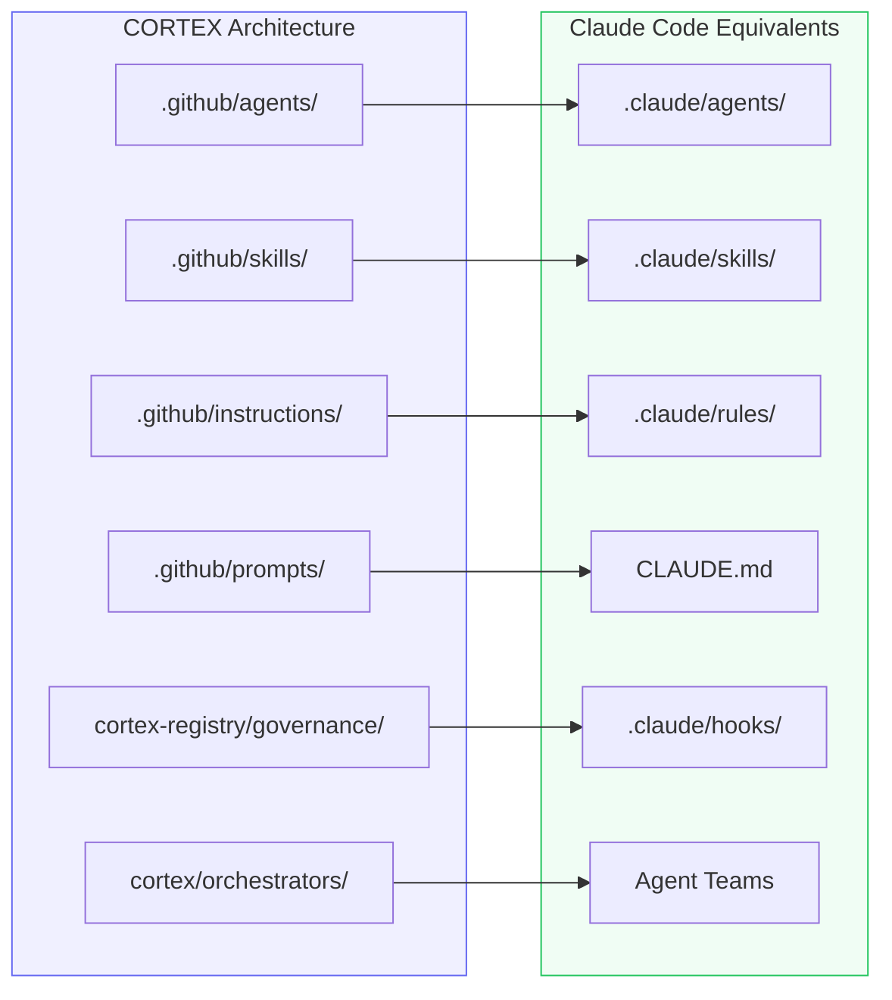
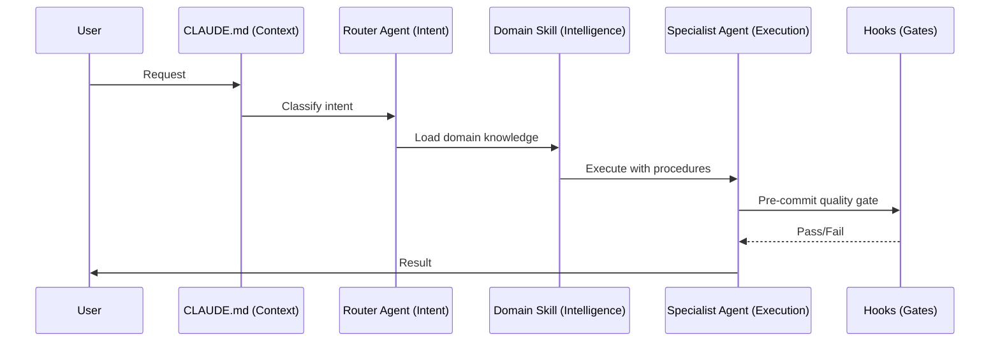
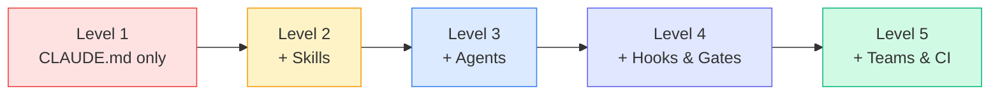

# CORTEX for Claude Code Development

---
title: How CORTEX Accelerates Claude Code Skill & Agent Development
path: 03-advanced
type: reference
audience: [Advanced, Architects, CORTEX Users]
last_verified: 2026-03-14
order: 15
source: synthesised from CORTEX architecture + Claude Code patterns
---

## Why CORTEX Matters for Claude Code

CORTEX (**CO**gnitive **R**eal-**T**ime **EX**ecution) is a production-grade AI Engineering Framework with 314 orchestrators, 36 MCP tools, and 61 governance rules. It solves at scale the same problems Claude Code's agent/skill system addresses:

- **Intent routing** → How to classify and delegate requests
- **Quality gates** → How to enforce standards automatically
- **Knowledge management** → How to organize reusable context
- **Orchestration** → How to coordinate multiple AI agents

CORTEX's battle-tested patterns translate directly into Claude Code configurations.

---

## Architecture Mapping



| CORTEX Concept | Claude Code Equivalent | Example |
|----------------|----------------------|---------|
| `.github/agents/*.md` | `.claude/agents/*.md` | Specialist agent definitions with scoped tools |
| `.github/skills/*/SKILL.md` | `.claude/skills/*/SKILL.md` | Reusable domain knowledge + procedures |
| `.github/instructions/*.md` | `.claude/rules/*.md` | Path-scoped coding conventions |
| `.github/prompts/*.prompt.md` | `CLAUDE.md` + agent frontmatter | Persistent project context and rules |
| `cortex-registry/governance/` | `.claude/hooks/` + hook configs | Automated quality enforcement |
| `MasterOrchestrator` | Lead agent in Agent Teams | Central coordinator that routes work |
| `IntentRouter` | Router agent pattern | Classifies request → picks specialist |
| Governance YAMLs (61 rules) | Pre-commit hooks + guardian agents | Automated compliance at commit-time |
| Intelligence Facade | Explore subagent | Code analysis and codebase Q&A |
| `OrchestratorProtocolMixin` | Agent frontmatter contract | Standard interface all agents implement |

---

## Pattern 1: Gateway Skill → Claude Code Skill Hierarchy

**CORTEX's approach:** A gateway skill (`cortex/SKILL.md`) classifies intent, then routes to domain skills (`cortex-tdd`, `cortex-audit`, `cortex-debug`, etc.).

**Claude Code translation:**

```
.claude/skills/
├── gateway/
│   └── SKILL.md          ← Intent classifier
├── tdd-workflow/
│   └── SKILL.md          ← TDD procedures
├── security-audit/
│   └── SKILL.md          ← Security checks
│   └── owasp-checklist.md
└── code-review/
    └── SKILL.md          ← Review workflow
    └── style-guide.md
```

**Gateway SKILL.md:**
```markdown
---
name: project-gateway
description: Route requests to the right domain skill
---

## Intent Classification
Analyze the user's request and load the appropriate skill:

| Signal Words | Skill to Load |
|-------------|---------------|
| implement, feature, build, add | tdd-workflow |
| security, vulnerability, OWASP | security-audit |
| review, PR, code quality | code-review |
| test, coverage, spec | tdd-workflow |
| fix, bug, error | tdd-workflow |
| refactor, clean, improve | code-review |
```

---

## Pattern 2: Agent Index → Lazy-Loading Registry

**CORTEX's approach:** `AGENT-INDEX.md` (~200 tokens) lists all agents with one-line descriptions. Full agent files (1–2.5K tokens each) load only when needed.

**Claude Code translation:**

Create a lightweight index agent:

```markdown
---
name: agent-directory
description: Registry of available specialist agents
tools:
  - Read
  - Glob
---

## Available Agents (delegate via @agent-name)

| Agent | Domain | When to Use |
|-------|--------|-------------|
| @frontend-dev | UI | React, CSS, accessibility |
| @backend-api | API | REST endpoints, auth, DB |
| @test-writer | Testing | Unit tests, integration, E2E |
| @security-scan | Security | OWASP, CVE, dependency audit |
| @doc-writer | Docs | README, API docs, guides |

Load the full agent only when the user's request matches its domain.
```

This keeps the context window lean — only the relevant agent gets loaded.

---

## Pattern 3: 4-Stage Pipeline → Claude Code Feature Workflow

**CORTEX's pipeline:** Interaction → Intent → Intelligence → Execution

**Claude Code equivalent using agent + skills + hooks:**



**Concrete implementation:**

1. **CLAUDE.md** — project context (replaces Interaction stage)
2. **Router agent** — classifies intent (replaces IntentRouter)
3. **Domain skill** — provides procedures and knowledge (replaces Intelligence)
4. **Specialist agent** — executes with scoped tools (replaces Execution)
5. **Hooks** — enforce quality gates (replaces Governance)

---

## Pattern 4: Governance Rules → Hook Enforcement

**CORTEX's approach:** 61 governance YAMLs enforced at pre-commit, CI, and runtime.

**Claude Code translation — hooks as governance:**

```json
{
  "hooks": {
    "preCommit": [
      {
        "type": "agent",
        "agent": "quality-gate",
        "prompt": "Verify: tests pass, lint clean, no secrets in diff"
      }
    ],
    "prePush": [
      {
        "type": "command",
        "command": "npm test && npm run lint"
      }
    ]
  }
}
```

**Guardian agent (mirrors CORTEX EnforcementOrchestrator):**
```markdown
---
name: governance-enforcer
description: Enforce project rules before sensitive operations
tools:
  - Read
  - Grep
  - Bash(npm test:*, npx eslint:*, npx tsc:*)
permissionMode: bypassPermissions
---

## Rules (non-negotiable)
1. Tests must pass before any commit
2. No `console.log` in production code
3. All public functions must have JSDoc comments
4. No TODO/FIXME in committed code
5. Import order: external → internal → relative
6. No hardcoded secrets or API keys
```

---

## Pattern 5: CORTEX Instructions → Claude Code Rules

**CORTEX's approach:** File-scoped instructions (`cortex-python.instructions.md` → `cortex/**/*.py`).

**Claude Code translation — rules with glob patterns:**

```
.claude/rules/
├── python-conventions.md    ← applies to **/*.py
├── test-standards.md        ← applies to tests/**/*.py
├── yaml-governance.md       ← applies to config/**/*.yaml
└── api-design.md            ← applies to src/api/**/*.ts
```

Each rule file uses frontmatter:
```markdown
---
description: Python coding conventions
globs: ["**/*.py"]
---

## Conventions
- Type hints on all function signatures
- Docstrings for public methods
- snake_case for functions and variables
- UPPER_SNAKE_CASE for constants
```

---

## Pattern 6: CORTEX Audit Pipeline → Claude Code Review Agent

**CORTEX's approach:** 9-stage audit pipeline with 41 checks.

**Claude Code translation as a review agent:**

```markdown
---
name: code-auditor
description: Multi-stage code review and quality audit
skills:
  - security-checklist
  - code-conventions
tools:
  - Read
  - Grep
  - Glob
  - Bash(npm test:*, npx eslint:*, npx tsc:*)
---

## Audit Pipeline (execute in order)

### Stage 1: Structure
- Verify file organization matches conventions
- Check for orphaned files

### Stage 2: Quality
- Run linter: `npx eslint src/`
- Run type-check: `npx tsc --noEmit`

### Stage 3: Tests
- Run tests: `npm test`
- Check coverage thresholds

### Stage 4: Security
- Scan for hardcoded secrets
- Check dependency vulnerabilities: `npm audit`

### Stage 5: Documentation
- Verify README is current
- Check API doc completeness

Report results as a checklist with ✅/❌ per stage.
```

---

## Building a CORTEX-Style System in Claude Code

### Step-by-Step Scaffold

```bash
# 1. Create the directory structure
mkdir -p .claude/{agents,skills,rules,hooks}
mkdir -p .claude/skills/{gateway,tdd,security,review}

# 2. Create CLAUDE.md (project context — replaces master prompt)
cat > CLAUDE.md << 'EOF'
# Project: MyApp
## Architecture
- Frontend: React + TypeScript
- Backend: Node.js + Express
- Database: PostgreSQL
## Routing Rules
- Security → @security-auditor
- Features → @feature-builder
- Reviews → @code-reviewer
EOF

# 3. Create gateway skill
cat > .claude/skills/gateway/SKILL.md << 'EOF'
---
name: intent-router
description: Classify requests and route to domain skills
---
Analyze intent and load the matching domain skill.
EOF

# 4. Create specialist agents
cat > .claude/agents/feature-builder.md << 'EOF'
---
name: feature-builder
description: TDD feature implementation
skills: [tdd]
tools: [Read, Write, Bash(npm test:*)]
---
Implement features using red-green-refactor TDD cycle.
EOF
```

### Maturity Progression



| Level | CORTEX Analogy | What You Add |
|-------|---------------|-------------|
| 1 | `copilot-instructions.md` only | `CLAUDE.md` with project context |
| 2 | + Skills loaded on demand | `.claude/skills/` with SKILL.md files |
| 3 | + Agent registry + specialists | `.claude/agents/` with scoped tool access |
| 4 | + Governance enforcement | Hooks for quality gates + guardian agents |
| 5 | + Parallel orchestration + CI | Agent Teams + `claude -p` in CI pipelines |

---

## Key Lessons from CORTEX

1. **Start with intent classification** — CORTEX routes all 33 intent types through IntentRouter. In Claude Code, define clear routing rules in CLAUDE.md or a gateway skill.

2. **Scope tools aggressively** — CORTEX agents get only the tools they need. In Claude Code, use agent frontmatter `tools:` to restrict access.

3. **Lazy-load knowledge** — CORTEX's AGENT-INDEX.md is ~200 tokens; full agents load on demand. In Claude Code, keep CLAUDE.md lean and use skills for detailed procedures.

4. **Enforce at boundaries** — CORTEX uses 61 governance rules at pre-commit. In Claude Code, use hooks and guardian agents at commit/push boundaries.

5. **Converge iteratively** — CORTEX's convergence gate (CORE-068) re-runs checks until clean. In Claude Code, build convergence loops into agent instructions.

6. **Separate knowledge from execution** — CORTEX skills hold *what to know*; orchestrators hold *what to do*. In Claude Code, skills hold reference knowledge; agents hold execution logic.

---

## Quick Reference Cards

### Converting a CORTEX Skill to Claude Code

```
CORTEX:                          Claude Code:
.github/skills/cortex-tdd/      .claude/skills/tdd/
  SKILL.md                      →  SKILL.md
  references/checks.md          →  tdd-checklist.md

Frontmatter mapping:
  name → name
  description → description
  argument-hint → (in description)
  user-invocable: true → (default)
```

### Converting a CORTEX Agent to Claude Code

```
CORTEX:                          Claude Code:
.github/agents/core/CORTEX.md   .claude/agents/lead.md

Frontmatter mapping:
  scope → (in description)
  agent_id → name
  capabilities → skills
  mcp_tools → tools
  collaborators → (use @agent delegation)
  priority → (ordering in CLAUDE.md routing table)
```

---

## Next Steps

- **14-cc-archit.md** → General orchestration patterns (not CORTEX-specific)
- **06-cc-skills.md** → Skills fundamentals (intermediate)
- **07-cc-subagents.md** → Custom subagent creation (intermediate)
