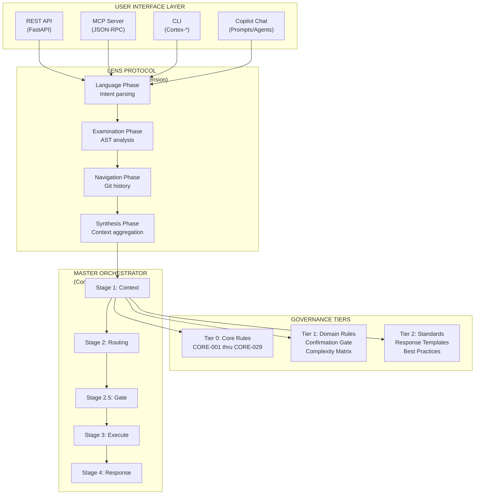
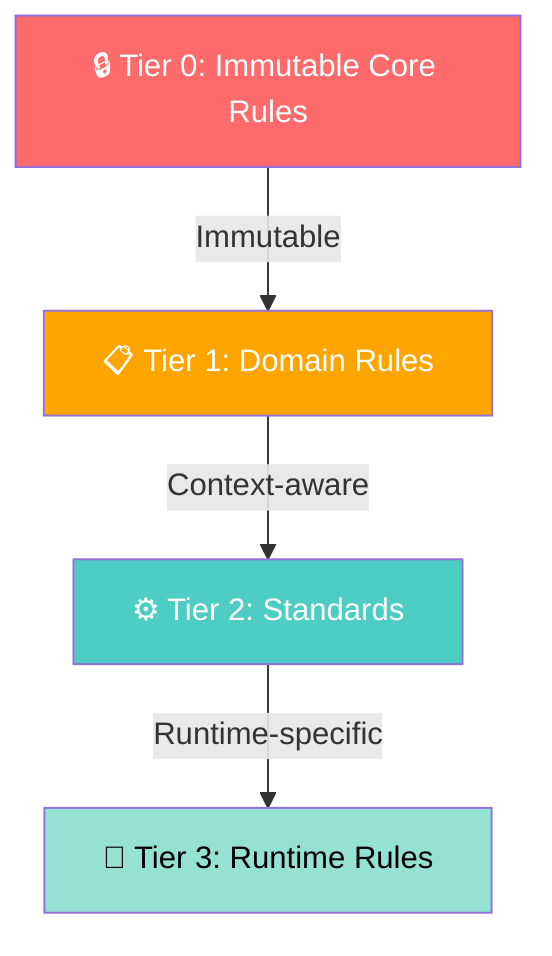
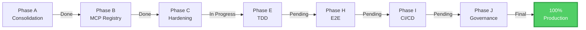
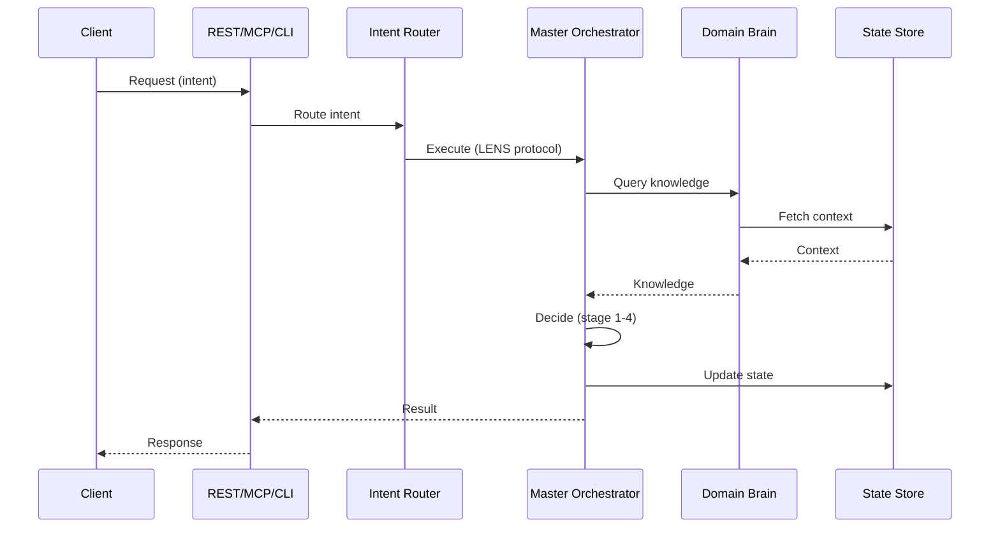
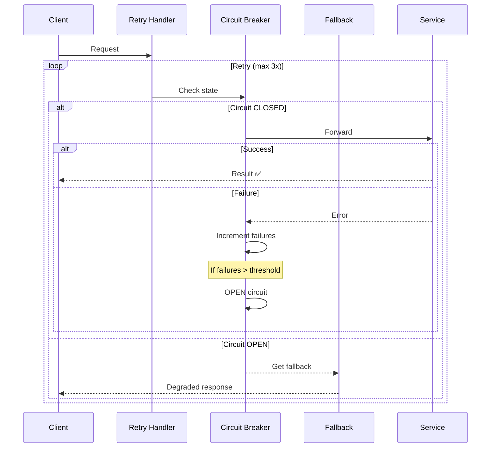

# System Architecture Diagram

This page demonstrates Mermaid diagram rendering in the CORTEX documentation.

## Architecture Overview

## Governance Tier Hierarchy

## Phase Dependencies

## Orchestration Flow

## Error Recovery Pattern

---

**Note:** All diagrams on this page render using Mermaid.js. If you see code instead of graphics, verify that MkDocs Mermaid support is enabled in `mkdocs.yml`.

For more architecture details, see:
- [System Overview](../02-architecture/1-system-overview.md)
- [LENS Protocol](../02-architecture/7-intent-router.md)
- [Governance Rules](../02-architecture/governance-rules.md)
