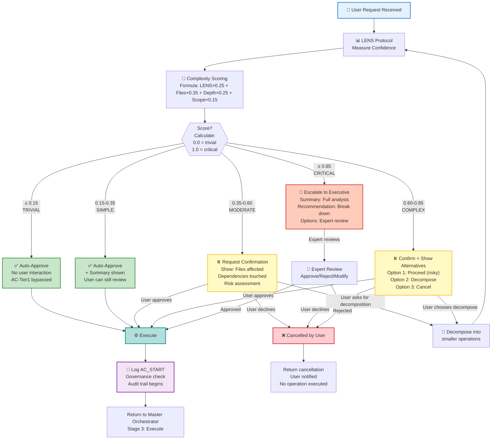
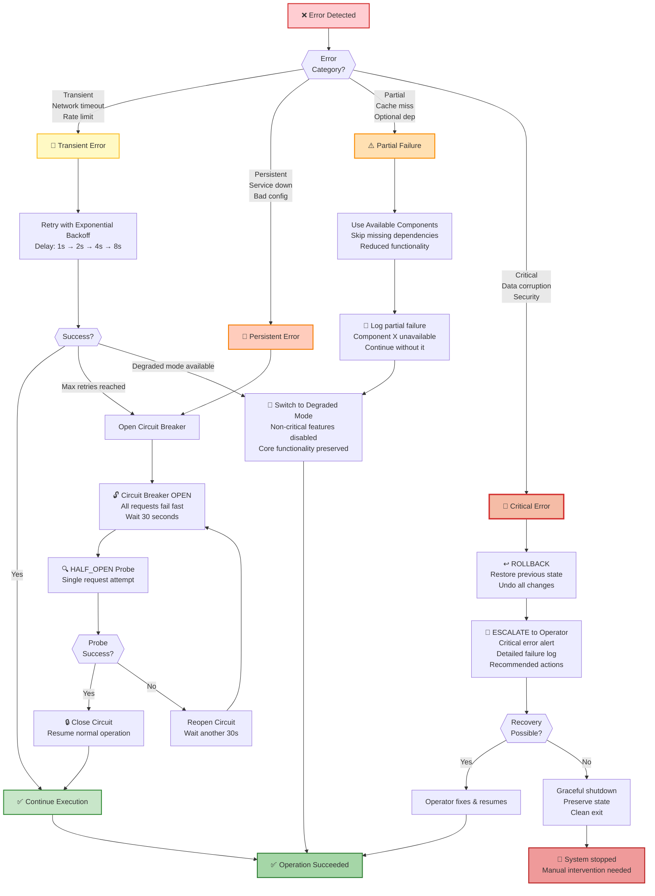
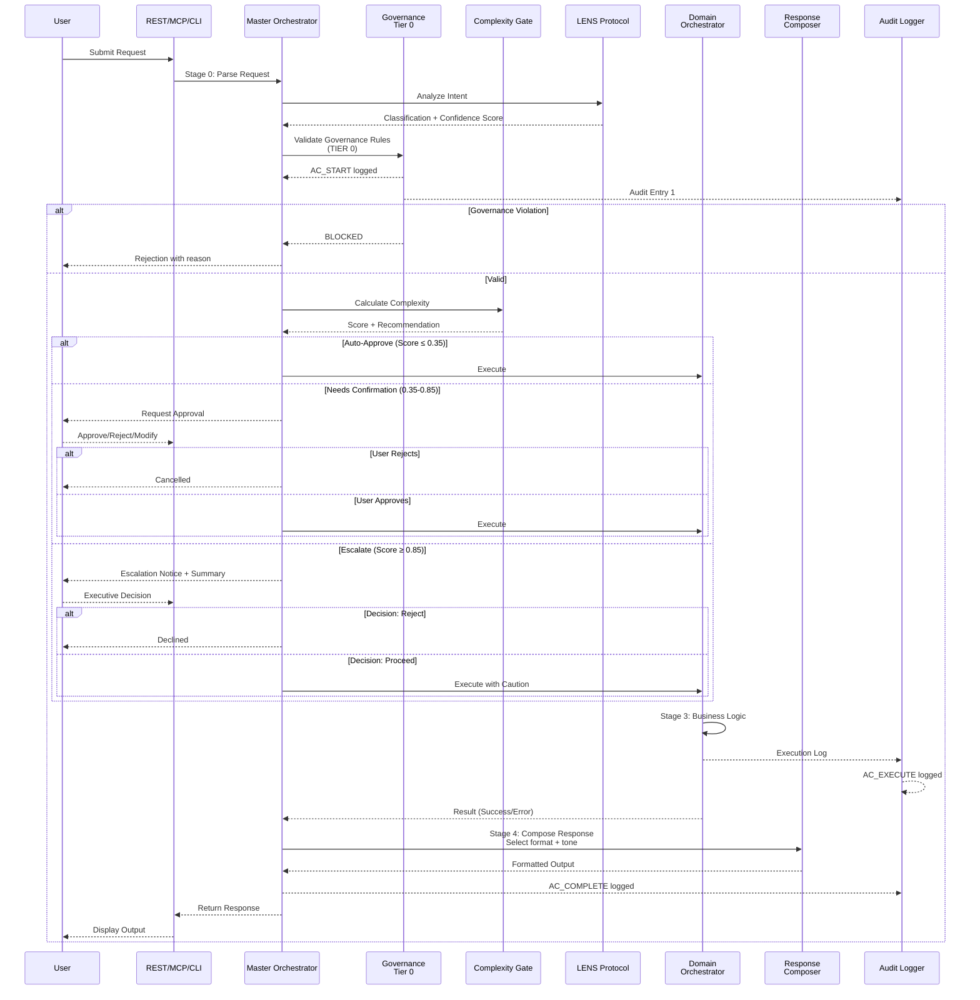

# CORTEX Visualization Examples & Quick Reference

**Authority:** cortex-doc.prompt.md | **Status:** 📋 Implementation Guide

---

## 🎯 This Document

Provides concrete examples and quick-start code for implementing recommended visualizations.

---

## Part 1: Mermaid Diagram Examples

### Example 1: Complexity-Aware Confirmation Gate Decision Tree

**File:** `docs/04-architecture/_diagrams/approval-gate-decision-tree.mmd`



**How It Works:**
- Flowchart shows all decision paths from single score calculation
- Color-coded by risk level (green = safe, red = risky)
- Annotations explain each phase
- Shows user interaction points
- Leads to execution or cancellation

**To Embed in Markdown:**
```markdown
## Approval Gate Decision Tree

Shows how CORTEX determines whether to auto-approve, request confirmation, or escalate an operation.

```mermaid
[diagram code from above]
```
```

---

### Example 2: Error Recovery Paths

**File:** `docs/04-architecture/_diagrams/error-recovery-paths.mmd`



---

### Example 3: Master Orchestrator - Enhanced Sequence Diagram

**File:** `docs/02-orchestrators/diagrams/03-master-orchestrator-sequence-enhanced.mmd`



---

## Part 2: D3.js Visualization Examples

### Example 1: Governance Pyramid (D3.js Sunburst)

**File:** `docs/_diagrams/d3/governance-pyramid.html`

```html
<!DOCTYPE html>
<html>
<head>
    <meta charset="utf-8">
    <title>CORTEX Governance Pyramid</title>
    <style>
        body {
            font-family: -apple-system, BlinkMacSystemFont, "Segoe UI", Roboto;
            margin: 0;
            padding: 20px;
            background: #f5f5f5;
        }
        .container {
            max-width: 1200px;
            margin: 0 auto;
            background: white;
            padding: 30px;
            border-radius: 8px;
            box-shadow: 0 2px 8px rgba(0,0,0,0.1);
        }
        h1 {
            color: #1976D2;
            margin: 0 0 10px 0;
        }
        .subtitle {
            color: #666;
            margin-bottom: 20px;
            font-size: 14px;
        }
        #chart {
            display: flex;
            justify-content: center;
            margin: 30px 0;
        }
        svg {
            max-width: 100%;
            height: auto;
        }
        .tooltip {
            position: absolute;
            background: rgba(0,0,0,0.8);
            color: white;
            padding: 8px 12px;
            border-radius: 4px;
            font-size: 12px;
            pointer-events: none;
            display: none;
            z-index: 1000;
        }
        .legend {
            display: grid;
            grid-template-columns: repeat(auto-fit, minmax(200px, 1fr));
            gap: 15px;
            margin-top: 30px;
        }
        .legend-item {
            display: flex;
            align-items: center;
            gap: 8px;
        }
        .legend-color {
            width: 20px;
            height: 20px;
            border-radius: 3px;
        }
    </style>
</head>
<body>
    <div class="container">
        <h1>CORTEX Governance Tiers - Interactive Pyramid</h1>
        <p class="subtitle">
            Hover over rules to see details. Click to navigate to documentation.
            Inner rings are immutable; outer rings are progressively more flexible.
        </p>
        
        <div id="chart"></div>
        
        <div class="tooltip" id="tooltip"></div>
        
        <div class="legend">
            <div class="legend-item">
                <div class="legend-color" style="background: #D32F2F;"></div>
                <span>TIER 0: CORE Rules (Immutable)</span>
            </div>
            <div class="legend-item">
                <div class="legend-color" style="background: #1976D2;"></div>
                <span>TIER 1: Architectural (Admin-only)</span>
            </div>
            <div class="legend-item">
                <div class="legend-color" style="background: #0288D1;"></div>
                <span>TIER 2: Templates (User-extendable)</span>
            </div>
            <div class="legend-item">
                <div class="legend-color" style="background: #388E3C;"></div>
                <span>TIER 3: Knowledge (Domain-driven)</span>
            </div>
        </div>
    </div>

    <script src="https://d3js.org/d3.v7.min.js"></script>
    <script>
        const data = {
            name: "CORTEX Governance",
            children: [
                {
                    name: "TIER 0 - CORE Rules (29 Immutable)",
                    tier: 0,
                    color: "#D32F2F",
                    children: [
                        {
                            name: "Orchestration",
                            category: true,
                            children: [
                                { name: "CORE-001: Incremental Execution", value: 1 },
                                { name: "CORE-006: Setup Verification", value: 1 },
                                { name: "CORE-007: Teardown", value: 1 },
                                { name: "CORE-010: Holistic Context", value: 1 }
                            ]
                        },
                        {
                            name: "Quality",
                            category: true,
                            children: [
                                { name: "CORE-011: Type Hints", value: 1 },
                                { name: "CORE-012: Docstrings", value: 1 },
                                { name: "CORE-013: No Bare Except", value: 1 },
                                { name: "CORE-014: Circular Imports", value: 1 },
                                { name: "CORE-015: Test Coverage", value: 1 }
                            ]
                        },
                        {
                            name: "Workflow",
                            category: true,
                            children: [
                                { name: "CORE-008: TDD Enforcement", value: 1 },
                                { name: "CORE-009: Intent Routing", value: 1 },
                                { name: "CORE-016: No Hardcoding", value: 1 },
                                { name: "CORE-017: Feature Flags", value: 1 }
                            ]
                        },
                        {
                            name: "Safety",
                            category: true,
                            children: [
                                { name: "CORE-002: Complexity Awareness", value: 1 },
                                { name: "CORE-003: Rate Limiting", value: 1 },
                                { name: "CORE-004: Graceful Degradation", value: 1 },
                                { name: "CORE-005: Rollback Capability", value: 1 }
                            ]
                        },
                        {
                            name: "Audit",
                            category: true,
                            children: [
                                { name: "CORE-026: Git Checkpoints", value: 1 },
                                { name: "CORE-027: Audit Trail", value: 1 },
                                { name: "CORE-028: Hash Chain", value: 1 },
                                { name: "CORE-029: Response Headers", value: 1 }
                            ]
                        }
                    ]
                },
                {
                    name: "TIER 1 - Architectural (Admin-modifiable)",
                    tier: 1,
                    color: "#1976D2",
                    children: [
                        {
                            name: "AC-001 through AC-050",
                            value: 50
                        }
                    ]
                },
                {
                    name: "TIER 2 - Templates (80+ User-extendable)",
                    tier: 2,
                    color: "#0288D1",
                    children: [
                        {
                            name: "Python Orchestrator Template",
                            value: 1
                        },
                        {
                            name: "REST Endpoint Template",
                            value: 1
                        },
                        {
                            name: "Test Template",
                            value: 1
                        }
                    ]
                },
                {
                    name: "TIER 3 - Knowledge (Domain-specific)",
                    tier: 3,
                    color: "#388E3C",
                    children: [
                        {
                            name: "TDD Best Practices",
                            value: 1
                        },
                        {
                            name: "API Design Patterns",
                            value: 1
                        },
                        {
                            name: "Company Standards",
                            value: 1
                        }
                    ]
                }
            ]
        };

        // SVG dimensions
        const width = 800;
        const height = 800;

        // Create SVG
        const svg = d3.select("#chart").append("svg")
            .attr("width", width)
            .attr("height", height);

        // Create hierarchy
        const hierarchy = d3.hierarchy(data)
            .sum(d => d.value)
            .sort((a, b) => b.value - a.value);

        // Create partition layout
        const partition = d3.partition()
            .size([2 * Math.PI, 300]);

        partition(hierarchy);

        // Define arc generator
        const arc = d3.arc()
            .startAngle(d => d.x0)
            .endAngle(d => d.x1)
            .innerRadius(d => d.y0)
            .outerRadius(d => d.y1);

        // Create tooltip
        const tooltip = d3.select("#tooltip");

        // Render slices
        svg.selectAll("g")
            .data(hierarchy.leaves())
            .enter()
            .append("g")
            .append("path")
            .attr("d", arc)
            .style("fill", d => d.parent.data.color)
            .style("stroke", "white")
            .style("stroke-width", 2)
            .style("opacity", 0.8)
            .on("mouseover", function(event, d) {
                d3.select(this).style("opacity", 1);
                tooltip
                    .style("display", "block")
                    .html(`<strong>${d.data.name}</strong>`)
                    .style("left", (event.pageX + 10) + "px")
                    .style("top", (event.pageY - 28) + "px");
            })
            .on("mousemove", function(event) {
                tooltip
                    .style("left", (event.pageX + 10) + "px")
                    .style("top", (event.pageY - 28) + "px");
            })
            .on("mouseout", function(event, d) {
                d3.select(this).style("opacity", 0.8);
                tooltip.style("display", "none");
            });

        // Add labels
        svg.selectAll("text")
            .data(hierarchy.leaves())
            .enter()
            .append("text")
            .attr("transform", d => {
                const angle = (d.x0 + d.x1) / 2;
                const radius = (d.y0 + d.y1) / 2;
                return `
                    rotate(${angle * 180 / Math.PI - 90})
                    translate(${radius},0)
                `;
            })
            .style("font-size", "11px")
            .style("text-anchor", "middle")
            .style("fill", "white")
            .style("text-shadow", "1px 1px 2px rgba(0,0,0,0.5)")
            .text(d => d.data.name.substring(0, 15));
    </script>
</body>
</html>
```

**How It Works:**
- Sunburst chart with tiers as concentric rings
- TIER 0 at center (immutable, most constrained)
- Outer rings progressively more flexible
- Hover shows rule details
- Color-coded by tier

---

### Example 2: Request Lifecycle Sankey (Python Data Generation)

**File:** `docs/_diagrams/d3/generate-request-lifecycle-data.py`

```python
#!/usr/bin/env python3
"""
Generate request lifecycle data for D3.js Sankey visualization.

This script creates JSON data showing how requests flow through CORTEX,
including decision points, errors, and exits.
"""

import json
from typing import List, Dict, Any


def generate_request_lifecycle_data() -> Dict[str, Any]:
    """Generate complete request lifecycle data."""
    
    # Define all stages
    stages = [
        {
            "id": "entry_rest",
            "name": "REST Entry",
            "type": "entry",
            "description": "HTTP request via FastAPI"
        },
        {
            "id": "entry_mcp",
            "name": "MCP Entry",
            "type": "entry",
            "description": "JSON-RPC request"
        },
        {
            "id": "entry_cli",
            "name": "CLI Entry",
            "type": "entry",
            "description": "Command-line invocation"
        },
        {
            "id": "auth",
            "name": "Authentication",
            "type": "gate",
            "description": "Verify credentials"
        },
        {
            "id": "lens_lang",
            "name": "LENS: Language",
            "type": "processing",
            "description": "Tokenize intent"
        },
        {
            "id": "lens_exam",
            "name": "LENS: Examination",
            "type": "processing",
            "description": "Analyze context"
        },
        {
            "id": "lens_nav",
            "name": "LENS: Navigation",
            "type": "processing",
            "description": "Explore domain"
        },
        {
            "id": "lens_syn",
            "name": "LENS: Synthesis",
            "type": "processing",
            "description": "Select orchestrator"
        },
        {
            "id": "gov_tier0",
            "name": "Governance Tier 0",
            "type": "gate",
            "description": "CORE rules check"
        },
        {
            "id": "complexity",
            "name": "Complexity Gate",
            "type": "gate",
            "description": "Calculate score"
        },
        {
            "id": "auto_approve",
            "name": "Auto-Approve",
            "type": "decision",
            "description": "Score ≤ 0.35"
        },
        {
            "id": "user_confirm",
            "name": "User Confirmation",
            "type": "decision",
            "description": "Request approval"
        },
        {
            "id": "escalate",
            "name": "Escalation",
            "type": "decision",
            "description": "Executive review"
        },
        {
            "id": "orchestrator",
            "name": "Domain Orchestrator",
            "type": "processing",
            "description": "Business logic"
        },
        {
            "id": "domain_brain",
            "name": "Domain Brain Query",
            "type": "processing",
            "description": "Knowledge lookup"
        },
        {
            "id": "response_comp",
            "name": "Response Composition",
            "type": "processing",
            "description": "Format output"
        },
        {
            "id": "audit",
            "name": "Audit Trail",
            "type": "processing",
            "description": "Log AC_COMPLETE"
        },
        {
            "id": "exit_rest",
            "name": "REST Exit",
            "type": "exit",
            "description": "HTTP response"
        },
        {
            "id": "exit_mcp",
            "name": "MCP Exit",
            "type": "exit",
            "description": "JSON-RPC response"
        },
        {
            "id": "exit_cli",
            "name": "CLI Exit",
            "type": "exit",
            "description": "CLI output"
        },
        {
            "id": "error_rejected",
            "name": "Error: Rejected",
            "type": "error",
            "description": "User declined"
        },
        {
            "id": "error_governance",
            "name": "Error: Governance",
            "type": "error",
            "description": "CORE rule violated"
        },
        {
            "id": "error_execution",
            "name": "Error: Execution",
            "type": "error",
            "description": "Business logic failed"
        },
    ]
    
    # Define flows (source -> target -> value)
    flows = [
        # Entry points
        ("entry_rest", "auth", 40),
        ("entry_mcp", "auth", 30),
        ("entry_cli", "auth", 30),
        
        # Auth success
        ("auth", "lens_lang", 95),
        
        # LENS phases
        ("lens_lang", "lens_exam", 95),
        ("lens_exam", "lens_nav", 95),
        ("lens_nav", "lens_syn", 95),
        
        # Governance
        ("lens_syn", "gov_tier0", 95),
        ("gov_tier0", "complexity", 90),
        
        # Complexity decisions
        ("complexity", "auto_approve", 50),
        ("complexity", "user_confirm", 35),
        ("complexity", "escalate", 5),
        
        # Approval paths
        ("auto_approve", "orchestrator", 50),
        ("user_confirm", "orchestrator", 33),
        ("user_confirm", "error_rejected", 2),
        ("escalate", "orchestrator", 4),
        ("escalate", "error_rejected", 1),
        
        # Governance failures
        ("gov_tier0", "error_governance", 5),
        
        # Execution
        ("orchestrator", "domain_brain", 80),
        ("orchestrator", "response_comp", 10),
        ("orchestrator", "error_execution", 7),
        ("domain_brain", "response_comp", 80),
        
        # Response & Audit
        ("response_comp", "audit", 90),
        
        # Exits (success)
        ("audit", "exit_rest", 38),
        ("audit", "exit_mcp", 28),
        ("audit", "exit_cli", 28),
        
        # Error exits
        ("error_rejected", "exit_rest", 2),
        ("error_governance", "exit_rest", 5),
        ("error_execution", "exit_rest", 7),
    ]
    
    return {
        "stages": stages,
        "flows": flows,
        "title": "CORTEX Request Lifecycle",
        "description": "Complete flow from request entry to response exit",
        "metrics": {
            "total_stages": len(stages),
            "total_flows": len(flows),
            "entry_points": 3,
            "exit_points": 6,
            "decision_points": 3,
            "error_paths": 3,
        }
    }


if __name__ == "__main__":
    data = generate_request_lifecycle_data()
    
    # Save to JSON
    with open("request-lifecycle-data.json", "w") as f:
        json.dump(data, f, indent=2)
    
    print("✅ Generated request-lifecycle-data.json")
    print(f"   Stages: {data['metrics']['total_stages']}")
    print(f"   Flows: {data['metrics']['total_flows']}")
    print(f"   Entry points: {data['metrics']['entry_points']}")
    print(f"   Error paths: {data['metrics']['error_paths']}")
```

---

## Part 3: Integration with mkdocs.yml

**Update:** `mkdocs.yml`

```yaml
plugins:
  - search
  - mermaid2:
      arguments:
        theme: default
        flowchart:
          curve: linear

nav:
  - Home: index.md
  
  - Architecture:
      - Overview: 04-architecture/0-overview.md
      - System Overview: 04-architecture/1-system-overview.md
      - Design Principles: 04-architecture/2-design-principles.md
      - Orchestration Engine: 04-architecture/3-orchestration-engine.md
      
      - Diagrams & Visualizations:
          - Recommendations: 04-architecture/DIAGRAM-VISUALIZATION-RECOMMENDATIONS.md
          - Mermaid Diagrams:
              - Approval Gate Decision Tree: 04-architecture/_diagrams/approval-gate-decision-tree.mmd
              - Error Recovery Paths: 04-architecture/_diagrams/error-recovery-paths.mmd
          - D3.js Visualizations:
              - Governance Pyramid: _diagrams/d3/governance-pyramid.html
              - Request Lifecycle: _diagrams/d3/request-lifecycle-sankey.html

      - Resilience Patterns: 04-architecture/5-resilience-patterns.md
```

---

## Part 4: CSS Styling for D3.js Visualizations

**File:** `docs/_diagrams/d3/styles.css`

```css
/* ============================================================================
   D3.js Visualization Styles
   ============================================================================ */

:root {
    /* Tier colors */
    --tier0-color: #D32F2F;
    --tier1-color: #1976D2;
    --tier2-color: #0288D1;
    --tier3-color: #388E3C;
    
    /* Flow colors */
    --success-color: #66BB6A;
    --warning-color: #FBC02D;
    --error-color: #EF5350;
    --info-color: #29B6F6;
    
    /* Neutrals */
    --text-primary: #212121;
    --text-secondary: #757575;
    --border-light: #E0E0E0;
    --background: #FAFAFA;
}

/* Dark mode support */
@media (prefers-color-scheme: dark) {
    :root {
        --text-primary: #FFFFFF;
        --text-secondary: #BDBDBD;
        --border-light: #424242;
        --background: #212121;
    }
}

/* Container */
.d3-container {
    display: flex;
    flex-direction: column;
    gap: 20px;
    padding: 20px;
    background: var(--background);
    border-radius: 8px;
    border: 1px solid var(--border-light);
}

.d3-container h2 {
    color: var(--text-primary);
    margin: 0 0 10px 0;
    font-size: 24px;
}

.d3-container .subtitle {
    color: var(--text-secondary);
    font-size: 14px;
    margin-bottom: 20px;
}

/* SVG Elements */
.d3-visualization svg {
    max-width: 100%;
    height: auto;
    display: block;
    margin: 0 auto;
}

/* Tooltips */
.d3-tooltip {
    position: absolute;
    background: rgba(33, 33, 33, 0.95);
    color: white;
    padding: 8px 12px;
    border-radius: 4px;
    font-size: 12px;
    pointer-events: none;
    display: none;
    z-index: 1000;
    backdrop-filter: blur(4px);
    box-shadow: 0 2px 8px rgba(0, 0, 0, 0.2);
}

.d3-tooltip.visible {
    display: block;
}

/* Legend */
.d3-legend {
    display: grid;
    grid-template-columns: repeat(auto-fit, minmax(200px, 1fr));
    gap: 15px;
    margin-top: 20px;
    padding: 15px;
    background: rgba(0, 0, 0, 0.02);
    border-radius: 4px;
}

.d3-legend-item {
    display: flex;
    align-items: center;
    gap: 10px;
    font-size: 13px;
    color: var(--text-secondary);
}

.d3-legend-color {
    width: 16px;
    height: 16px;
    border-radius: 2px;
    flex-shrink: 0;
}

/* Interactive elements */
.d3-clickable {
    cursor: pointer;
    transition: opacity 0.2s ease;
}

.d3-clickable:hover {
    opacity: 0.8;
}

/* Responsive */
@media (max-width: 768px) {
    .d3-legend {
        grid-template-columns: 1fr;
    }
    
    .d3-container {
        padding: 15px;
    }
}
```

---

## Part 5: Quick Start Checklist

### Before Implementation

- [ ] Review recommendations document thoroughly
- [ ] Prioritize which 3-5 diagrams to implement first
- [ ] Allocate developer resources (est. 40-60 hours for first 5 diagrams)
- [ ] Set up D3.js development environment

### Implementation Steps

- [ ] Create `docs/_diagrams/d3/` directory structure
- [ ] Copy and customize Mermaid examples
- [ ] Implement D3.js boilerplate template
- [ ] Create Python data generation scripts
- [ ] Build first visualization (Governance Pyramid recommended)
- [ ] Test responsive design and accessibility
- [ ] Integrate with mkdocs.yml
- [ ] User testing and feedback collection
- [ ] Iterate on design based on feedback

### Maintenance

- [ ] Establish process to keep diagrams current
- [ ] Document any new visualization templates
- [ ] Track performance metrics
- [ ] Gather user feedback quarterly

---

**Version:** 1.0  
**Status:** ✅ Ready for Implementation  
**Next Step:** Select diagrams to implement and begin Phase 1
