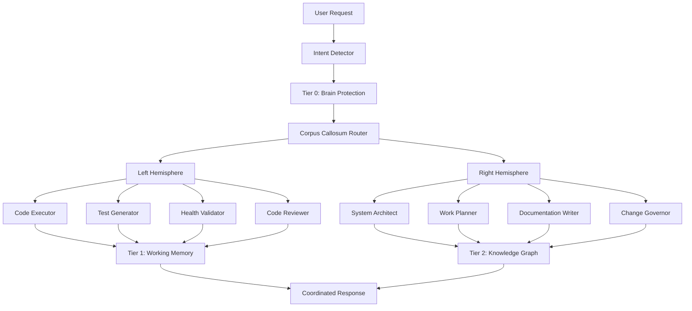

# CORTEX AI Assistant - Executive Summary

**Version:** 3.0  
**Last Updated:** 2025-11-21  
**Status:** ✅ Production Ready  
**Author:** Asif Hussain  
**Repository:** [github.com/asifhussain60/CORTEX](https://github.com/asifhussain60/CORTEX)

---


## 🎯 What is CORTEX?

CORTEX is a **next-generation AI development assistant** that combines memory, context awareness, and specialized agent coordination to deliver intelligent, consistent, and cost-effective software development support. Unlike traditional AI assistants, CORTEX **remembers your conversations**, **learns from your patterns**, and **coordinates specialized agents** to handle complex development workflows.

---

## 🚀 Key Differentiators

### 1. **Memory-Powered Intelligence (4-Tier Architecture)**
- **Tier 0 (Brain Protection):** Prevents harmful operations and enforces governance rules
- **Tier 1 (Working Memory):** Remembers recent conversations with context scoring
- **Tier 2 (Knowledge Graph):** Learns patterns and relationships across your codebase
- **Tier 3 (Long-Term Archive):** Historical storage for trend analysis

**Real-World Impact:** Resume work across sessions without repeating context. CORTEX automatically injects relevant past conversations when you continue work.

### 2. **Specialized Agent System (10 Agents)**
- **Left Hemisphere (Logical):** Code Executor, Test Generator, Health Validator, Code Reviewer
- **Right Hemisphere (Creative):** System Architect, Work Planner, Documentation Writer, Change Governor
- **Central Coordination:** Intent Detector, Pattern Matcher, Corpus Callosum Router

**Real-World Impact:** Your request is automatically routed to the right specialist. "Write tests" goes to Test Generator. "Plan architecture" goes to System Architect. No manual routing needed.

### 3. **Cost & Performance Optimization**
- **97.2% Token Reduction:** 74,047 → 2,078 average input tokens
- **93.4% Cost Reduction:** Using GitHub Copilot pricing model
- **Projected Savings:** $8,636/year (1,000 requests/month)
- **Response Time:** < 500ms for context injection

**Real-World Impact:** Faster responses, lower costs, cleaner architecture through modular design.

### 4. **Natural Language Interface**
No slash commands or syntax to memorize. Just tell CORTEX what you need:
- "Add authentication to the dashboard"
- "Plan a feature for user permissions"
- "Generate documentation for the API"
- "Review this pull request"

**Real-World Impact:** Intuitive for all skill levels. Works in conversation. Context-aware.

---

## 🎨 Core Capabilities

### **Code Development**

| Capability | Status | Description |
|------------|--------|-------------|
| **Code Writing** | ✅ 100% | Multi-language (Python, C#, TypeScript, JS), test-first workflow, pattern-aware generation |
| **Code Rewrite** | ✅ 100% | Refactoring with SOLID principles, test preservation during refactor |
| **Code Review** | 🟡 60% | Architecture validation, SOLID checks. *Enhancement needed: PR integration* |
| **Reverse Engineering** | 🟡 50% | Code analysis, dependency graphs. *Enhancement: complexity analysis, diagrams* |

### **Testing & Quality**

| Capability | Status | Description |
|------------|--------|-------------|
| **Backend Testing** | ✅ 95% | Unit/integration test generation (pytest, unittest), mocking, test execution |
| **Web Testing** | ✅ 85% | Playwright integration, E2E tests, visual regression. *Enhancement: Lighthouse, accessibility* |
| **Mobile Testing** | ⏳ 0% | *Planned Phase 2: Appium integration, cross-platform (iOS/Android)* |

### **Documentation & Planning**

| Capability | Status | Description |
|------------|--------|-------------|
| **Code Documentation** | ✅ 100% | Docstrings, README, API docs, MkDocs integration, architecture diagrams |
| **Feature Planning** | ✅ 100% | Interactive planning workflow, vision API (screenshots), file-based artifacts |
| **ADO Integration** | ✅ 90% | Work item templates, DoR/DoD/AC generation |


**Legend:**  
✅ = Production Ready | 🟡 = Partial (enhancements planned) | ⏳ = Not implemented (roadmap)

---

## 🧠 Memory & Context Intelligence

### **Tier 1: Working Memory (Conversation Context)**

**What it does:**
- Captures and indexes conversations automatically
- Scores relevance based on keywords, files, entities, intent, and recency
- Auto-injects relevant past conversations into current responses

**Example:**
```
Day 1: "How should I implement JWT authentication?"
Copilot: "Use PyJWT library with token expiration..."

Day 3: "Add token refresh to the auth system"
Copilot:
📋 Context from Previous Conversations
- 2 days ago: JWT authentication discussion (Relevance: 0.87)
- Files: auth.py, tokens.py | Intent: IMPLEMENT

Based on your previous JWT setup, here's how to add refresh...
```

**Commands:**
- `show context` - View what CORTEX remembers
- `forget [topic]` - Remove specific conversations
- `clear memory` - Fresh start (remove all context)

### **Tier 2: Knowledge Graph**

**What it does:**
- Learns patterns and relationships across your codebase
- Detects work context automatically (debugging, testing, architecture)
- Adapts response style based on work type

**Automatic Context Detection:**
| Work Type | Response Focus | Agents Activated | Template Style |
|-----------|---------------|------------------|----------------|
| Feature Implementation | Code + tests | Executor, Tester, Validator | Technical detail |
| Debugging/Issues | Root cause analysis | Health Validator, Pattern Matcher | Diagnostic focus |
| Architecture/Design | System impact | Architect, Work Planner | Strategic overview |
| Documentation | Clarity + examples | Documenter | User-friendly |

### **Tier 3: Long-Term Storage**

**What it does:**
- Historical archive for trend analysis
- Pattern library for reusable solutions
- Lessons learned from past projects

---

## 🏗️ Architecture Overview



**Key Components:**
- **Brain Tiers:** 4-tier memory system (Protection, Working, Knowledge, Archive)
- **Agents:** 10 specialized agents coordinated by Corpus Callosum
- **Plugins:** Extensible plugin system for custom functionality
- **Operations:** 13+ high-level operations (setup, plan, execute, test, etc.)

---

## 🚀 Getting Started

### **Installation**

1. **Clone Repository:**
   ```bash
   git clone https://github.com/asifhussain60/CORTEX.git
   cd CORTEX
   ```

2. **Install Dependencies:**
   ```bash
   pip install -r requirements.txt
   ```

3. **Configure:**
   ```bash
   cp cortex.config.template.json cortex.config.json
   # Edit cortex.config.json with your settings
   ```

4. **Verify Installation:**
   ```bash
   python -m pytest tests/ -v
   ```

### **First Steps**

1. **Enable Conversation Tracking** (optional but recommended):
   ```
   setup cortex tracking
   ```

2. **Try Natural Language Commands:**
   ```
   help
   show me what cortex can do
   plan a feature for user authentication
   ```

3. **Use in VS Code:**
   - Install CORTEX extension (coming soon)
   - Or use GitHub Copilot Chat with CORTEX prompt

---

## 📋 Commands Reference

### **Core Commands**

| Command | Description | Example |
|---------|-------------|---------|
| `help` | Show available commands | "help" or "what can cortex do" |
| `status` | Show implementation status | "show status" or "where are we" |
| `setup environment` | Configure CORTEX | "setup environment" |
| `show context` | View conversation memory | "show context" |
| `forget [topic]` | Remove specific conversations | "forget about authentication" |
| `clear memory` | Fresh start (remove all) | "clear memory" |

### **Planning Commands**

| Command | Description | Example |
|---------|-------------|---------|
| `plan [feature]` | Interactive feature planning | "plan user authentication" |
| `plan ado` | ADO work item planning | "plan ado feature" |
| `approve plan` | Finalize and hook into pipeline | "approve plan" |
| `resume plan [name]` | Continue existing plan | "resume plan authentication" |
| `planning status` | Show all active plans | "planning status" |

### **Development Commands**

| Command | Description | Example |
|---------|-------------|---------|
| `implement [feature]` | Code implementation | "implement login page" |
| `write tests for [code]` | Generate tests | "write tests for auth module" |
| `review [code/PR]` | Code review | "review this pull request" |
| `generate docs` | Documentation generation | "generate documentation" |

### **Conversation Capture**

| Command | Description | Example |
|---------|-------------|---------|
| `capture conversation #file:[path]` | Import conversation to brain | "capture conversation #file:chat.md" |

**Note:** All commands use natural language. No slash commands required.

---

## 🗺️ Roadmap

### **Phase 1: Core Foundation** (✅ Complete)
- ✅ 4-Tier memory architecture
- ✅ 10-Agent coordination system
- ✅ Natural language interface
- ✅ Conversation tracking & context injection
- ✅ Interactive feature planning
- ✅ Cost optimization (97.2% token reduction)

### **Phase 2: Enhanced Testing & Validation** (🔄 In Progress)
- 🔄 Mobile testing (Appium integration)
- 🔄 Advanced web testing (Lighthouse, accessibility)
- ⏳ PR integration for code review
- ⏳ Automated complexity analysis

### **Phase 3: Advanced Features** (⏳ Planned)
- ⏳ UI from Figma (Figma API integration)
- ⏳ A/B testing framework
- ⏳ Real-time collaboration
- ⏳ Multi-workspace support

### **Phase 4: Enterprise Features** (⏳ Planned)
- ⏳ Team collaboration
- ⏳ Custom agent marketplace
- ⏳ Advanced analytics & insights
- ⏳ SaaS deployment option

---

## 📞 Support & Community

- **Documentation:** [docs.cortex-ai.dev](https://asifhussain60.github.io/CORTEX/)
- **Issues:** [GitHub Issues](https://github.com/asifhussain60/CORTEX/issues)
- **Discussions:** [GitHub Discussions](https://github.com/asifhussain60/CORTEX/discussions)
- **Author:** Asif Hussain (asifhussain60@gmail.com)

---

**Copyright © 2024-2025 Asif Hussain. All rights reserved.**  
**License:** Proprietary - See LICENSE file for terms
