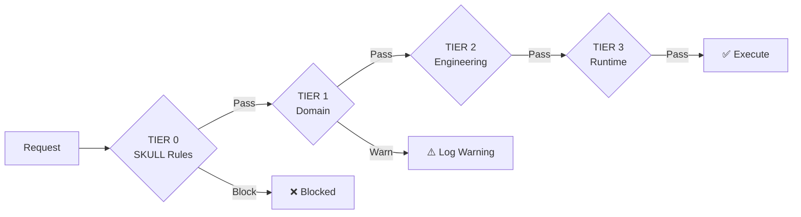

# CORTEX Quick Start Overview

> **One-Page Technical-to-Business Translation Guide**  
> Last Updated: 2026-01-21 | Authority: cortex-impl-map.yaml v3.9

---

## 🎯 What is CORTEX?

CORTEX is an **autonomous, governance-aware development orchestration platform** that routes user intent through intelligent classification, applies multi-tier governance rules, and executes operations with full audit trails.

| Business Need | CORTEX Solution |
|---------------|-----------------|
| Consistent code quality | 29 immutable TIER 0 governance rules |
| Predictable automation | 4-stage orchestration pipeline |
| Audit compliance | Hash-chain verified audit logs |
| Knowledge reuse | Domain Brain with conflict resolution |

---

## 📁 YAML Configuration Maps

| YAML File | Purpose | Business Value |
|-----------|---------|----------------|
| [`core-rules.yaml`](02-architecture/governance-rules.md) | 29 SKULL rules (immutable governance) | Enforces code quality, security, and consistency |
| [`cortex-impl-map.yaml`](02-architecture/6-implementation-phases.md) | Implementation phases & status tracking | Project roadmap visibility |
| [`manifest.yaml`](../cortex-registry/manifest.yaml) | Orchestrator registry manifest | Centralized orchestrator discovery |
| `tier1/*.yaml` | Domain-specific rules | Department/team customization |
| `tier2/*.yaml` | Engineering standards | Code style, testing requirements |
| `tier3/*.yaml` | Runtime context rules | Dynamic, situation-aware governance |

### Tier Precedence
```
TIER 0 (Immutable) → TIER 1 (Domain) → TIER 2 (Engineering) → TIER 3 (Runtime)
     HIGHEST              ↓                  ↓                  LOWEST
```

→ [Governance Rules Reference](05-reference/governance-rules-reference.md)

---

## 🎭 Orchestrators

### Master Orchestrator (Entry Point)

All requests flow through `MasterOrchestrator` — the central coordination hub.

```
User Request → Intent Router → Master Orchestrator → Domain Orchestrator → Execution
```

| Orchestrator | Responsibility | When to Use |
|--------------|----------------|-------------|
| **MasterOrchestrator** | Central routing, governance validation | All requests (automatic) |
| **GovernanceOrchestrator** | Rule evaluation, compliance checks | Policy validation |
| **ACOrchestrator** | Acceptance criteria tracking | Feature implementation |
| **PlanningOrchestrator** | Multi-phase execution planning | Complex workflows |
| **AnalysisOrchestrator** | Code analysis, pattern detection | Code reviews |

→ [Orchestration Engine](02-architecture/3-orchestration-engine.md)

### Orchestrator Registry

Orchestrators self-register using the `@register_with_master` decorator:

```python
from cortex.orchestrators.registry import register_with_master

@register_with_master(domain="governance", priority=1)
class MyOrchestrator(BaseOrchestratorV4):
    ...
```

**Registry Features:**
- Lock-free concurrent registration
- Priority-based routing
- Domain isolation
- Health monitoring

→ [Developing Custom Orchestrators](04-guides/integration/1-developing-custom-orchestrators.md)

---

## ⚖️ Governance Evaluation

### Composite Request Evaluation

When a request arrives, governance evaluates in sequence:



**Evaluation Order:**
1. **TIER 0** — Immutable rules (CORE-001 to CORE-030) — Cannot be overridden
2. **TIER 1** — Domain rules — Team/department specific
3. **TIER 2** — Engineering standards — Code quality gates
4. **TIER 3** — Runtime context — Dynamic situation rules

→ [Governance Rules](02-architecture/governance-rules.md)

---

## 🔍 LENS Protocol (AST Scanning)

LENS is the 4-phase intent comprehension framework:

| Phase | Action | Output |
|-------|--------|--------|
| **L**anguage | Parse natural language intent | Intent classification |
| **E**xamination | AST analysis of code structure | Code context |
| **N**avigation | Git history, change patterns | Historical context |
| **S**ynthesis | Aggregate all context | Confidence score |

### Efficient LENS Usage

```python
from cortex.intent_router.classifier import IntentClassifier
from cortex.intent_router.context_manager import ContextManager

# Initialize with context caching
classifier = IntentClassifier()
context = ContextManager(cache_ttl=300)  # 5-min cache

# Classify with confidence threshold
result = classifier.classify(user_input, context=context)
if result.confidence >= 0.7:
    # Auto-execute with high confidence
    orchestrator.execute(result.intent)
elif result.confidence >= 0.5:
    # Disambiguate medium confidence
    options = disambiguator.get_options(result)
else:
    # Request clarification
    request_user_clarification()
```

**Performance Tips:**
- Use `ContextManager` with caching for repeated queries
- Set appropriate confidence thresholds (0.7 for auto, 0.5 for disambiguate)
- Leverage `MultiModalIntentProcessor` for mixed input types

→ [Intent Router](02-architecture/7-intent-router.md)

---

## 💬 Conversation Protocol

Orchestrators communicate using the `ConversationProtocol` for multi-turn interactions:

```python
from cortex.orchestrators.core.conversation_protocol import (
    ConversationProtocol,
    ContinuationDecision
)

class MyOrchestrator(BaseOrchestratorV4):
    def execute(self, context):
        protocol = ConversationProtocol(self)
        
        # Check if continuation needed
        decision = protocol.evaluate_state(context)
        
        if decision == ContinuationDecision.COMPLETE:
            return self.finalize(context)
        elif decision == ContinuationDecision.CONTINUE:
            return protocol.generate_continuation_prompt(context)
        elif decision == ContinuationDecision.BLOCKED:
            return protocol.report_blocker(context)
```

### Conversation States

| State | Meaning | Action |
|-------|---------|--------|
| `COMPLETE` | Task finished successfully | Return result |
| `CONTINUE` | More work needed | Generate continuation prompt |
| `BLOCKED` | Cannot proceed | Report blocker, request intervention |
| `PAUSED` | Awaiting external input | Save state, wait |

→ [Conversation Protocol ADR](02-architecture/adrs/adr-005-conversation-protocol.md)

---

## 🚀 Quick Commands

```bash
# Start documentation server
docs\serve-docs.bat

# Run governance validation
python -m cortex.brain.core.governance_registry --validate

# Test intent router
pytest tests/unit/intent_router/ -v

# Start MCP server
python -m cortex.mcp.server
```

---

## 📊 Current Status

| Component | Coverage | Status |
|-----------|----------|--------|
| Intent Router | 128/128 (100%) | ✅ Production Ready |
| Governance Engine | 348/368 (95%) | ✅ Production Ready |
| Infrastructure | 472/472 (100%) | ✅ Production Ready |
| Orchestrators | 412/613 (67%) | ⏳ In Progress |
| Domain Brain | 213/353 (60%) | ⏳ In Progress |

→ [Implementation Status](05-reference/implementation-status.md)

---

## 🔗 Discovery & Auto-Wiring System (NEW)

The **Discovery & Auto-Wiring System** automatically identifies and integrates production-ready components at runtime.

| Resource | Purpose |
|----------|---------|
| [Quick Start Guide](DISCOVERY-QUICKSTART.md) | 5-minute guide to running discovery |
| [Full System Documentation](DISCOVERY-AUTOWIRING-SYSTEM.md) | Complete discovery system reference |
| Discovery Scanner | `cortex/testing/discovery_scanner.py` |
| Integration Tests | `tests/unit/testing/test_discovery_*.py` |

**Key Capabilities:**
- ✅ Dynamic orchestrator discovery
- ✅ LENS component identification (Language, Examination, Navigation, Synthesis)
- ✅ Infrastructure component discovery (CircuitBreaker, RetryStrategy, etc.)
- ✅ Governance component auto-wiring
- ✅ MCP toolkit discovery
- ✅ 90+ comprehensive tests
- ✅ Auto-wiring of critical components on initialization

**Quick Command:** `python tests/unit/testing/run_discovery_tests.py --verbose`

---

## 🔗 Deep Dive Links

| Topic | Link |
|-------|------|
| Full Architecture | [System Overview](02-architecture/1-system-overview.md) |
| All Governance Rules | [Governance Rules Reference](05-reference/governance-rules-reference.md) |
| API Reference | [API Overview](03-api-reference/0-overview.md) |
| Development Setup | [Development Setup](07-contributing/2-development-setup.md) |
| Testing Strategy | [Testing Strategy](07-contributing/3-testing-strategy.md) |
| Discovery System | [Discovery & Auto-Wiring](DISCOVERY-AUTOWIRING-SYSTEM.md) |
| Discovery Quick Start | [Quick Start Guide](DISCOVERY-QUICKSTART.md) |
| Troubleshooting | [Troubleshooting](04-guides/operations/4-troubleshooting.md) |
