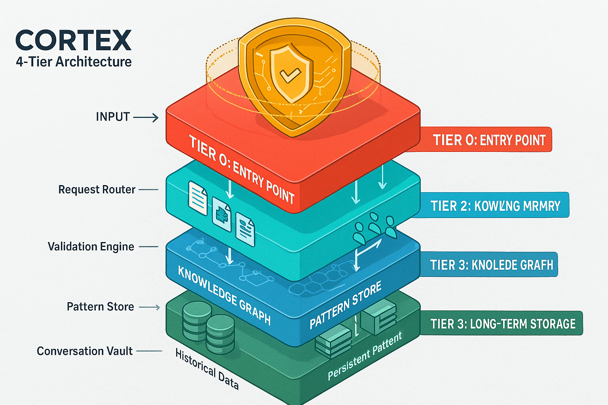

# 🏗️ Architecture Diagrams

Visual representations of CORTEX's core architectural components and system design.

---

## Three-Tier Architecture

CORTEX's revolutionary three-tier memory system that enables persistent intelligence across conversations.

<figure>
  
  <figcaption><strong>Tier 0 (Brain Protection):</strong> Seven-layer SKULL defense system protecting CORTEX integrity 
  <strong>Tier 1 (Conversation Memory):</strong> Working memory storing recent conversations for contextual responses 
  <strong>Tier 2 (Knowledge Graph):</strong> Long-term pattern storage learning from validated conversations</figcaption>
</figure>

**Key Features:**
- 🛡️ **Tier 0**: Semantic validation, mutation prevention, integrity enforcement
- 🧠 **Tier 1**: SQLite-based conversation storage, entity extraction, relevance scoring
- 📊 **Tier 2**: Pattern learning, confidence scoring, namespace isolation

**Related Documentation:**
- [CAPABILITIES-MATRIX.md](CAPABILITIES-MATRIX.md) - Complete capability listing
- [FEATURES.md](FEATURES.md) - Feature descriptions

---

## Agent Coordination System

Ten specialized agents orchestrated through the Corpus Callosum for intelligent task routing.

<figure>
  
  <figcaption><strong>10 Specialized Agents:</strong> Executor, Tester, Architect, Documenter, Health Validator, Pattern Matcher, Work Planner, Intent Detector, Conversation Manager, Security Auditor 
  <strong>Corpus Callosum:</strong> Central orchestrator managing agent selection, coordination, and load balancing</figcaption>
</figure>

**Agent Roles:**
- ⚡ **Executor**: Code implementation and file operations
- 🧪 **Tester**: Test generation and validation
- 🏗️ **Architect**: System design and technical decisions
- 📚 **Documenter**: Documentation generation and maintenance
- 🏥 **Health Validator**: System health monitoring
- 🔍 **Pattern Matcher**: Pattern recognition from conversation history
- 📋 **Work Planner**: Feature planning and task breakdown
- 🎯 **Intent Detector**: Natural language intent classification
- 💬 **Conversation Manager**: Tier 1 conversation import and export
- 🔒 **Security Auditor**: OWASP validation and vulnerability detection

**Related Documentation:**
- [HELP-SYSTEM.md](HELP-SYSTEM.md) - Agent interaction guide
- [FEATURES.md](FEATURES.md) - Agent capabilities

---

## Complete System Architecture

End-to-end view of CORTEX showing all components, integrations, and data flows.

<figure>
  
  <figcaption><strong>Complete CORTEX Ecosystem:</strong> GitHub Copilot Chat interface → Intent Router → Agent Coordinator → Three-Tier Memory → Plugin System → External Integrations 
  <strong>Data Flow:</strong> User input → Natural language processing → Agent execution → Memory persistence → Response generation</figcaption>
</figure>

**System Components:**
- 🎯 **Entry Point**: GitHub Copilot Chat with natural language interface
- 🧭 **Intent Router**: Template matching and natural language routing
- 🎭 **Agent System**: 10 specialized agents with Corpus Callosum orchestration
- 🧠 **Memory System**: Three-tier architecture (SKULL, Conversations, Patterns)
- 🔌 **Plugin System**: Extensible architecture for custom functionality
- 🔗 **Integrations**: Git monitoring, ADO planning, documentation generation

**Related Documentation:**
- [index.md](index.md) - Getting started guide
- [CAPABILITIES-MATRIX.md](CAPABILITIES-MATRIX.md) - Complete system capabilities

---

## Navigation

- **[Home](index.md)** - Return to documentation home
- **[Integration Diagrams](integration-diagrams.md)** - Data flows and integrations
- **[Operational Diagrams](operational-diagrams.md)** - Workflows and processes
- **[Planning Diagrams](planning-diagrams.md)** - Strategic and planning systems

---

**Image Source:** Generated from DALL-E 3 prompts created by Enterprise Documentation Orchestrator  
**Diagram Metadata:** See [IMAGE-CATALOG.yaml](images/diagrams/IMAGE-CATALOG.yaml)  
**Copyright:** © 2024-2025 Asif Hussain. All rights reserved.
