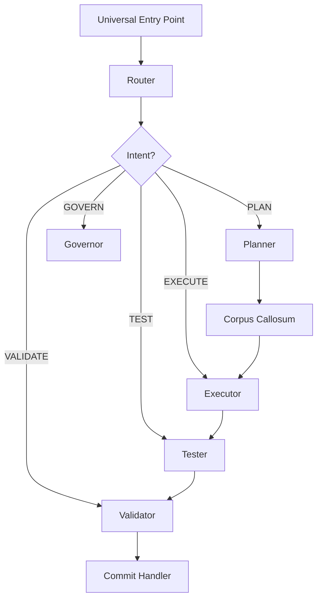

# Agent System

The Agent System in CORTEX implements the **LEFT BRAIN** tactical execution layer.

## Overview

CORTEX uses 10 specialist agents, each with a single responsibility (SRP):

| Agent | File | Responsibility |
|-------|------|----------------|
| Router | intent-router.md | Intent classification & routing |
| Planner | work-planner.md | Multi-phase strategic plans |
| Executor | code-executor.md | Code implementation (test-first) |
| Tester | test-generator.md | Test creation & execution |
| Validator | health-validator.md | System health checks |
| Governor | change-governor.md | CORTEX change reviews |
| Error Corrector | error-corrector.md | Fix Copilot mistakes |
| Session Resumer | session-resumer.md | Resume after breaks |
| Screenshot Analyzer | screenshot-analyzer.md | Extract requirements from images |
| Commit Handler | commit-handler.md | Intelligent git commits |

## Agent Workflow

## Coming Soon

Full documentation of each agent's capabilities, workflows, and configuration options.

For now, see [cortex.md](../../prompts/user/cortex.md) for complete details.
