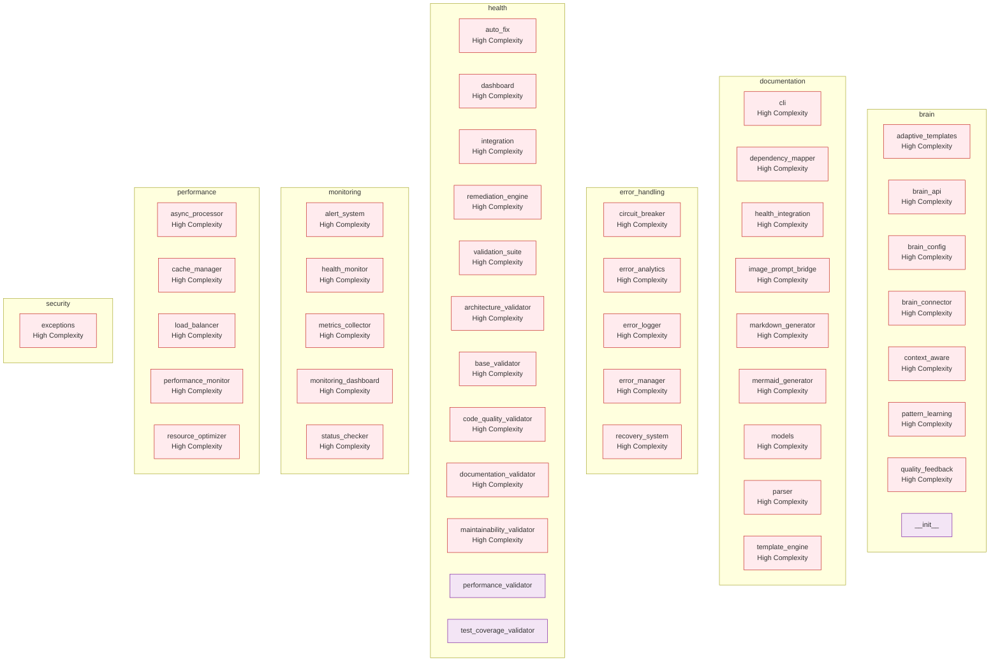

# epmo Documentation

| Property | Value |
|----------|-------|
| **Generated** | 2025-11-19T14:59:27.667147 |
| **Version** | 1.0.0 |
| **Format** | markdown |
| **Modules** | 52 |
| **Classes** | 170 |
| **Functions** | 720 |
| **Diagrams** | 1 (1 Mermaid, 3 AI) |

## Overview

### Summary

This Entry Point Module contains **52 files** with **170 classes** and **720 functions**, totaling **22,697 lines of code**.

The module has **94 external dependencies**.

**Visual Documentation:** 1 diagrams (1 technical, 3 presentation)

## Architecture

### Structure

The architecture consists of 52 modules with 412 dependencies.

### External Dependencies

- `abc`
- `adaptive_templates`
- `alert_system`
- `architecture_validator`
- `argparse`
- `ast`
- `async_processor`
- `asyncio`
- `audit`
- `authentication`
- ... and 84 more

### Diagrams

#### EPMO Architecture Overview

Complete architectural view with technical details and professional presentation

**Technical Diagram:**

**Professional Visualization:**

*AI Generation Prompt:* [View Prompt](None)

*Description:* Professional architecture diagram for the epmo system showing component relationships and data flow

## API Reference

### adaptive_templates

*File: `brain\adaptive_templates.py`*

Adaptive Template System - Intelligent Template Selection and Optimization
Feature 5.3: Brain-Enhanced Template Management

Uses CORTEX Brain patterns to intelligently select and optimize documentation templates
based on project context, team preferences, and historical success patterns.

#### `TemplateRecommendation`

Template recommendation with confidence scoring

#### `AdaptiveConfiguration`

Adaptive configuration for template generation

#### `AdaptiveTemplateSystem`

Intelligent template system that learns from usage patterns and adapts
template selection and configuration based on CORTEX Brain knowledge.

**Methods:**

- `recommend_template(self, project_context, user_preferences, quality_requirements)` → `TemplateRecommendation`

  Recommend optimal template based on context and learned patterns

Args:
    project_context: Project characteristics and context
    user_preferences: User/team preferences
    quality_requirements: Required quality thresholds
    
Returns:
    Template recommendation with reasoning

- `create_adaptive_configuration(self, recommendation, context)` → `AdaptiveConfiguration`

  Create adaptive configuration from template recommendation

Args:
    recommendation: Template recommendation
    context: Project context
    
Returns:
    Adaptive configuration for documentation generation

- `update_template_performance(self, template_name, success, quality_score)`

  Update template performance metrics based on usage outcome

Args:
    template_name: Name of template used
    success: Whether generation was successful
    quality_score: Quality score achieved

- `get_template_analytics(self)` → `Dict[str, Any]`

  Get analytics on template performance and usage

#### `recommend_template(self, project_context, user_preferences, quality_requirements)` → `TemplateRecommendation`

Recommend optimal template based on context and learned patterns

Args:
    project_context: Project characteristics and context
    user_preferences: User/team preferences
    quality_requirements: Required quality thresholds
    
Returns:
    Template recommendation with reasoning

#### `create_adaptive_configuration(self, recommendation, context)` → `AdaptiveConfiguration`

Create adaptive configuration from template recommendation

Args:
    recommendation: Template recommendation
    context: Project context
    
Returns:
    Adaptive configuration for documentation generation

#### `update_template_performance(self, template_name, success, quality_score)`

Update template performance metrics based on usage outcome

Args:
    template_name: Name of template used
    success: Whether generation was successful
    quality_score: Quality score achieved

#### `get_template_analytics(self)` → `Dict[str, Any]`

Get analytics on template performance and usage

### brain_api

*File: `brain\brain_api.py`*

Brain Integration API - Comprehensive CORTEX Brain Documentation Integration
Feature 5.7: Unified Brain-Enhanced Documentation System

Central API connecting documentation generation with CORTEX Brain's cognitive framework,
conversation context, and development insights for intelligent, adaptive documentation.

#### `BrainGenerationRequest`

Comprehensive request for brain-enhanced documentation generation

#### `BrainGenerationResult`

Comprehensive result from brain-enhanced generation

#### `BrainSystemStatus`

Status of the brain integration system

#### `BrainIntegrationAPI`

Central API for CORTEX Brain enhanced documentation generation.
Provides unified interface to all brain-enhanced capabilities.

**Methods:**

- `generate_enhanced_documentation(self, request)` → `BrainGenerationResult`

  Generate documentation using full brain enhancement capabilities

Args:
    request: Comprehensive generation request
    
Returns:
    Brain-enhanced generation result

- `submit_user_feedback(self, generation_id, feedback)` → `bool`

  Submit user feedback for quality learning

Args:
    generation_id: ID of generation to provide feedback for
    feedback: User feedback data
    
Returns:
    True if feedback recorded successfully

- `get_system_status(self)` → `BrainSystemStatus`

  Get comprehensive system status

- `get_generation_analytics(self, days)` → `Dict[str, Any]`

  Get analytics on documentation generation performance

- `export_brain_data(self, output_path, include_analytics)` → `bool`

  Export comprehensive brain integration data

Args:
    output_path: Path to save exported data
    include_analytics: Whether to include analytics data
    
Returns:
    True if export successful

- `close(self)`

  Clean up brain integration resources

#### `create_brain_integration_api(brain_root, enable_learning, enable_optimization)` → `BrainIntegrationAPI`

Factory function to create brain integration API with error handling

Args:
    brain_root: Path to cortex-brain directory
    enable_learning: Enable pattern learning capabilities
    enable_optimization: Enable performance optimizations
    
Returns:
    BrainIntegrationAPI instance

#### `create_simple_generation_request(project_path, output_path)` → `BrainGenerationRequest`

Factory function to create simple generation request

Args:
    project_path: Path to project to document
    output_path: Path for output documentation
    **kwargs: Additional request parameters
    
Returns:
    BrainGenerationRequest instance

#### `generate_enhanced_documentation(self, request)` → `BrainGenerationResult`

Generate documentation using full brain enhancement capabilities

Args:
    request: Comprehensive generation request
    
Returns:
    Brain-enhanced generation result

#### `submit_user_feedback(self, generation_id, feedback)` → `bool`

Submit user feedback for quality learning

Args:
    generation_id: ID of generation to provide feedback for
    feedback: User feedback data
    
Returns:
    True if feedback recorded successfully

#### `get_system_status(self)` → `BrainSystemStatus`

Get comprehensive system status

#### `get_generation_analytics(self, days)` → `Dict[str, Any]`

Get analytics on documentation generation performance

#### `export_brain_data(self, output_path, include_analytics)` → `bool`

Export comprehensive brain integration data

Args:
    output_path: Path to save exported data
    include_analytics: Whether to include analytics data
    
Returns:
    True if export successful

#### `close(self)`

Clean up brain integration resources

### brain_config

*File: `brain\brain_config.py`*

Brain-Enhanced Configuration System - Intelligent Parameter Adaptation
Feature 5.4: Context-Aware Configuration Management

Intelligently adapts documentation generation parameters based on project context,
team preferences, historical patterns, and quality metrics from CORTEX Brain.

#### `ConfigurationContext`

Context information for intelligent configuration

#### `IntelligentConfiguration`

AI-optimized configuration for documentation generation

#### `ConfigurationLearning`

Learning data from configuration usage

#### `BrainEnhancedConfig`

Intelligent configuration system that learns from CORTEX Brain patterns
to optimize documentation generation parameters for specific contexts.

**Methods:**

- `generate_intelligent_config(self, context, user_preferences, constraints)` → `IntelligentConfiguration`

  Generate intelligent configuration based on context and learned patterns

Args:
    context: Project and team context
    user_preferences: User/team preferences
    constraints: Time, resource, or other constraints
    
Returns:
    Optimized configuration with reasoning

- `record_configuration_outcome(self, config_id, context, success, quality_scores, user_satisfaction, adjustments_made)`

  Record outcome of configuration usage for learning

Args:
    config_id: Unique configuration identifier
    context: Context where configuration was used
    success: Whether generation was successful
    quality_scores: Quality metrics achieved
    user_satisfaction: User satisfaction rating (0-1)
    adjustments_made: List of adjustments made during usage

- `get_configuration_analytics(self)` → `Dict[str, Any]`

  Get analytics on configuration performance and learning

#### `generate_intelligent_config(self, context, user_preferences, constraints)` → `IntelligentConfiguration`

Generate intelligent configuration based on context and learned patterns

Args:
    context: Project and team context
    user_preferences: User/team preferences
    constraints: Time, resource, or other constraints
    
Returns:
    Optimized configuration with reasoning

#### `record_configuration_outcome(self, config_id, context, success, quality_scores, user_satisfaction, adjustments_made)`

Record outcome of configuration usage for learning

Args:
    config_id: Unique configuration identifier
    context: Context where configuration was used
    success: Whether generation was successful
    quality_scores: Quality metrics achieved
    user_satisfaction: User satisfaction rating (0-1)
    adjustments_made: List of adjustments made during usage

#### `get_configuration_analytics(self)` → `Dict[str, Any]`

Get analytics on configuration performance and learning

### brain_connector

*File: `brain\brain_connector.py`*

CORTEX Brain Connector - Interface to CORTEX Brain Knowledge Systems
Feature 5.1: Brain Database Integration

Provides secure, efficient access to CORTEX Brain's Tier 2 Knowledge Graph and development
context systems for documentation pattern learning and adaptive generation.

#### `PatternRecord`

Represents a pattern from Tier 2 knowledge graph

#### `QualityMetrics`

Quality metrics for documentation generation feedback

#### `BrainConnector`

Secure connector to CORTEX Brain knowledge systems with read-only access
to pattern learning data and safe write access for documentation metrics.

**Methods:**

- `get_documentation_patterns(self, category, min_confidence, limit)` → `List[PatternRecord]`

  Retrieve documentation patterns from Tier 2 knowledge graph

Args:
    category: Filter by pattern category
    min_confidence: Minimum confidence threshold
    limit: Maximum patterns to return
    
Returns:
    List of pattern records relevant to documentation generation

- `search_patterns_by_intent(self, intent, context_tags)` → `List[PatternRecord]`

  Search patterns using FTS5 full-text search based on intent and context

Args:
    intent: Documentation intent/goal
    context_tags: Context tags for relevance filtering
    
Returns:
    List of relevant patterns sorted by relevance

- `get_file_relationships(self, file_path)` → `Dict[str, float]`

  Get files that are frequently modified together with the given file

Args:
    file_path: Path to analyze relationships for
    
Returns:
    Dictionary mapping related file paths to confidence scores

- `load_knowledge_graph(self)` → `Dict[str, Any]`

  Load knowledge graph YAML with pattern insights

- `load_development_context(self)` → `Dict[str, Any]`

  Load development context with project metrics

- `get_recent_corrections(self, days)` → `List[Dict[str, Any]]`

  Get recent corrections to learn from mistakes

Args:
    days: Number of days to look back
    
Returns:
    List of correction records

- `record_documentation_quality(self, metrics)`

  Record quality metrics for documentation generation feedback

Args:
    metrics: Quality metrics to record

- `get_template_usage_patterns(self)` → `Dict[str, Dict]`

  Get patterns of template usage for adaptive template selection

Returns:
    Dictionary of template usage statistics and patterns

- `close(self)`

  Close all database connections

#### `create_brain_connector(brain_root)` → `BrainConnector`

Factory function to create BrainConnector with error handling

Args:
    brain_root: Optional path to cortex-brain directory
    
Returns:
    BrainConnector instance or None if initialization fails

#### `get_documentation_patterns(self, category, min_confidence, limit)` → `List[PatternRecord]`

Retrieve documentation patterns from Tier 2 knowledge graph

Args:
    category: Filter by pattern category
    min_confidence: Minimum confidence threshold
    limit: Maximum patterns to return
    
Returns:
    List of pattern records relevant to documentation generation

#### `search_patterns_by_intent(self, intent, context_tags)` → `List[PatternRecord]`

Search patterns using FTS5 full-text search based on intent and context

Args:
    intent: Documentation intent/goal
    context_tags: Context tags for relevance filtering
    
Returns:
    List of relevant patterns sorted by relevance

#### `get_file_relationships(self, file_path)` → `Dict[str, float]`

Get files that are frequently modified together with the given file

Args:
    file_path: Path to analyze relationships for
    
Returns:
    Dictionary mapping related file paths to confidence scores

#### `load_knowledge_graph(self)` → `Dict[str, Any]`

Load knowledge graph YAML with pattern insights

#### `load_development_context(self)` → `Dict[str, Any]`

Load development context with project metrics

#### `get_recent_corrections(self, days)` → `List[Dict[str, Any]]`

Get recent corrections to learn from mistakes

Args:
    days: Number of days to look back
    
Returns:
    List of correction records

#### `record_documentation_quality(self, metrics)`

Record quality metrics for documentation generation feedback

Args:
    metrics: Quality metrics to record

#### `get_template_usage_patterns(self)` → `Dict[str, Dict]`

Get patterns of template usage for adaptive template selection

Returns:
    Dictionary of template usage statistics and patterns

#### `close(self)`

Close all database connections

### context_aware

*File: `brain\context_aware.py`*

Context-Aware Documentation Generator - Domain Intelligence Integration
Feature 5.6: Knowledge Graph Powered Documentation

Uses project context from CORTEX Brain knowledge graph to generate more relevant
and targeted documentation based on domain expertise and best practices.

#### `ProjectContext`

Enhanced project context with domain intelligence

#### `DomainKnowledge`

Domain-specific knowledge and patterns

#### `ContextualRecommendation`

Context-aware recommendation for documentation

#### `ContextAwareGenerator`

Intelligent documentation generator that uses project context and domain
knowledge from CORTEX Brain to create highly relevant, targeted documentation.

**Methods:**

- `analyze_project_context(self, project_path, existing_context)` → `ProjectContext`

  Analyze project to extract comprehensive context information

Args:
    project_path: Path to project root
    existing_context: Pre-existing context data
    
Returns:
    Comprehensive project context

- `generate_contextual_recommendations(self, context, current_config)` → `List[ContextualRecommendation]`

  Generate context-aware recommendations for documentation

Args:
    context: Project context information
    current_config: Current documentation configuration
    
Returns:
    List of contextual recommendations

- `enhance_documentation_config(self, base_config, context, recommendations)` → `Dict[str, Any]`

  Enhance documentation configuration with context-aware optimizations

Args:
    base_config: Base documentation configuration
    context: Project context
    recommendations: Contextual recommendations
    
Returns:
    Enhanced configuration with context optimizations

- `get_context_analytics(self)` → `Dict[str, Any]`

  Get analytics on context analysis and recommendations

#### `analyze_project_context(self, project_path, existing_context)` → `ProjectContext`

Analyze project to extract comprehensive context information

Args:
    project_path: Path to project root
    existing_context: Pre-existing context data
    
Returns:
    Comprehensive project context

#### `generate_contextual_recommendations(self, context, current_config)` → `List[ContextualRecommendation]`

Generate context-aware recommendations for documentation

Args:
    context: Project context information
    current_config: Current documentation configuration
    
Returns:
    List of contextual recommendations

#### `enhance_documentation_config(self, base_config, context, recommendations)` → `Dict[str, Any]`

Enhance documentation configuration with context-aware optimizations

Args:
    base_config: Base documentation configuration
    context: Project context
    recommendations: Contextual recommendations
    
Returns:
    Enhanced configuration with context optimizations

#### `get_context_analytics(self)` → `Dict[str, Any]`

Get analytics on context analysis and recommendations

### pattern_learning

*File: `brain\pattern_learning.py`*

Pattern Learning Engine - Adaptive Documentation Pattern Learning
Feature 5.2: Learning from Documentation Patterns and User Feedback

Analyzes successful documentation approaches, learns from user feedback, and suggests
improvements based on historical data and quality metrics.

#### `DocumentationPattern`

Learned documentation pattern

#### `LearningInsight`

Learning insight from pattern analysis

#### `PatternLearningEngine`

Learns from documentation generation patterns and user feedback to improve
future documentation generation through adaptive optimization.

**Methods:**

- `analyze_successful_patterns(self, min_success_rate, min_usage_count)` → `List[DocumentationPattern]`

  Analyze patterns with high success rates to identify best practices

Args:
    min_success_rate: Minimum success rate threshold
    min_usage_count: Minimum usage count for reliability
    
Returns:
    List of successful documentation patterns

- `learn_from_feedback(self, generation_id, quality_metrics, generation_config)`

  Learn from user feedback and quality metrics

Args:
    generation_id: Unique ID for documentation generation
    quality_metrics: Quality scores and feedback
    generation_config: Configuration used for generation

- `get_optimization_suggestions(self, current_config, project_context)` → `List[LearningInsight]`

  Get suggestions for optimizing documentation generation

Args:
    current_config: Current generation configuration
    project_context: Project context for targeted suggestions
    
Returns:
    List of optimization insights and recommendations

- `get_pattern_statistics(self)` → `Dict[str, Any]`

  Get learning statistics and metrics

- `export_learned_patterns(self, output_path)` → `bool`

  Export learned patterns for backup or analysis

Args:
    output_path: Path to save patterns JSON
    
Returns:
    True if successful

#### `analyze_successful_patterns(self, min_success_rate, min_usage_count)` → `List[DocumentationPattern]`

Analyze patterns with high success rates to identify best practices

Args:
    min_success_rate: Minimum success rate threshold
    min_usage_count: Minimum usage count for reliability
    
Returns:
    List of successful documentation patterns

#### `learn_from_feedback(self, generation_id, quality_metrics, generation_config)`

Learn from user feedback and quality metrics

Args:
    generation_id: Unique ID for documentation generation
    quality_metrics: Quality scores and feedback
    generation_config: Configuration used for generation

#### `get_optimization_suggestions(self, current_config, project_context)` → `List[LearningInsight]`

Get suggestions for optimizing documentation generation

Args:
    current_config: Current generation configuration
    project_context: Project context for targeted suggestions
    
Returns:
    List of optimization insights and recommendations

#### `get_pattern_statistics(self)` → `Dict[str, Any]`

Get learning statistics and metrics

#### `export_learned_patterns(self, output_path)` → `bool`

Export learned patterns for backup or analysis

Args:
    output_path: Path to save patterns JSON
    
Returns:
    True if successful

### quality_feedback

*File: `brain\quality_feedback.py`*

Quality Feedback Loop - Continuous Learning from Documentation Quality
Feature 5.5: Quality-Driven Adaptive Optimization

Connects documentation quality metrics to CORTEX Brain learning system for
continuous improvement and adaptive optimization of generation strategies.

#### `QualityDimension`

Quality dimensions for documentation assessment

**Inherits:** Enum

#### `QualityFeedback`

User feedback on documentation quality

#### `QualityTrend`

Quality trend analysis over time

#### `ImprovementRecommendation`

Recommendation for improving documentation quality

#### `QualityFeedbackLoop`

Continuous learning system that collects quality metrics, analyzes trends,
and provides recommendations for improving documentation generation.

**Methods:**

- `record_quality_metrics(self, metrics)`

  Record quality metrics for learning and trend analysis

Args:
    metrics: Quality metrics from documentation generation

- `record_user_feedback(self, feedback)`

  Record user feedback for qualitative learning

Args:
    feedback: User feedback on documentation quality

- `get_quality_insights(self, days)` → `Dict[str, Any]`

  Get comprehensive quality insights and recommendations

Args:
    days: Number of days to analyze
    
Returns:
    Quality insights including trends and recommendations

- `export_quality_data(self, output_path)` → `bool`

  Export quality data for analysis or backup

Args:
    output_path: Path to save quality data JSON
    
Returns:
    True if successful

#### `record_quality_metrics(self, metrics)`

Record quality metrics for learning and trend analysis

Args:
    metrics: Quality metrics from documentation generation

#### `record_user_feedback(self, feedback)`

Record user feedback for qualitative learning

Args:
    feedback: User feedback on documentation quality

#### `get_quality_insights(self, days)` → `Dict[str, Any]`

Get comprehensive quality insights and recommendations

Args:
    days: Number of days to analyze
    
Returns:
    Quality insights including trends and recommendations

#### `export_quality_data(self, output_path)` → `bool`

Export quality data for analysis or backup

Args:
    output_path: Path to save quality data JSON
    
Returns:
    True if successful

### cli

*File: `documentation\cli.py`*

Enhanced CLI Interface for CORTEX EPM Documentation Generator

Command-line interface supporting multi-modal output options. Integrates
all Phase 4.2 components into a unified documentation generation system
with support for both Mermaid diagrams and AI image prompts.

Author: Asif Hussain
Copyright: © 2024-2025 Asif Hussain. All rights reserved.
License: Proprietary - Part of CORTEX 3.0

#### `EPMDocumentationCLI`

Enhanced CLI interface for EPM documentation generation.

Supports:
- Multi-modal output (Markdown + Diagrams + AI prompts)
- Customizable templates and configurations
- Health integration and quality analysis
- Batch processing of multiple EPMOs
- Output format selection and customization

**Methods:**

- `setup_logging(self, level)`

  Setup logging configuration.

- `create_parser(self)` → `argparse.ArgumentParser`

  Create argument parser for CLI.

- `parse_config_file(self, config_path)` → `Dict[str, Any]`

  Parse configuration file.

- `create_generation_config(self, args)` → `GenerationConfig`

  Create generation configuration from CLI arguments.

- `create_diagram_config(self, args)` → `DiagramConfig`

  Create diagram configuration from CLI arguments.

- `find_epmos(self, path, recursive)` → `List[Path]`

  Find EPMO directories in the given path.

- `generate_documentation_for_epmo(self, epmo_path, project_root, config, diagram_config, args)` → `Dict[str, Any]`

  Generate documentation for a single EPMO.

- `run(self)` → `int`

  Main CLI entry point.

#### `main()`

Main entry point for CLI.

#### `setup_logging(self, level)`

Setup logging configuration.

#### `create_parser(self)` → `argparse.ArgumentParser`

Create argument parser for CLI.

#### `parse_config_file(self, config_path)` → `Dict[str, Any]`

Parse configuration file.

#### `create_generation_config(self, args)` → `GenerationConfig`

Create generation configuration from CLI arguments.

#### `create_diagram_config(self, args)` → `DiagramConfig`

Create diagram configuration from CLI arguments.

#### `find_epmos(self, path, recursive)` → `List[Path]`

Find EPMO directories in the given path.

#### `generate_documentation_for_epmo(self, epmo_path, project_root, config, diagram_config, args)` → `Dict[str, Any]`

Generate documentation for a single EPMO.

#### `run(self)` → `int`

Main CLI entry point.

### dependency_mapper

*File: `documentation\dependency_mapper.py`*

Dependency Mapper for CORTEX Entry Point Modules

Analyzes import relationships and dependencies between Python modules
to create dependency graphs and relationship maps for documentation.

Features:
- Import relationship extraction
- Circular dependency detection
- External vs internal dependency classification
- Dependency graph generation
- Module coupling analysis

#### `DependencyRelationship`

Represents a dependency between two modules.

#### `ModuleDependencies`

Complete dependency information for a module.

#### `DependencyGraph`

Complete dependency graph for an EPMO.

#### `DependencyMapper`

Analyzes and maps dependencies between Python modules in an EPMO.

Creates dependency graphs, detects circular dependencies, and provides
relationship analysis for documentation generation.

**Methods:**

- `analyze_dependencies(self, epmo_path)` → `DependencyGraph`

  Analyze all dependencies within an Entry Point Module.

Args:
    epmo_path: Path to the Entry Point Module directory
    
Returns:
    DependencyGraph containing complete dependency analysis

#### `analyze_epmo_dependencies(epmo_path, project_root)` → `Dict[str, Any]`

Convenience function to analyze EPMO dependencies and return structured data.

Args:
    epmo_path: Path to the Entry Point Module directory
    project_root: Root path of the project (defaults to current directory)
    
Returns:
    Dictionary containing dependency analysis in JSON-serializable format

#### `analyze_dependencies(self, epmo_path)` → `DependencyGraph`

Analyze all dependencies within an Entry Point Module.

Args:
    epmo_path: Path to the Entry Point Module directory
    
Returns:
    DependencyGraph containing complete dependency analysis

#### `dfs_cycle_detect(node, path)` → `None`

### health_integration

*File: `documentation\health_integration.py`*

Health Integration for CORTEX EPM Documentation Generator

Integrates EPMO health validation results with documentation generation
to provide health-aware documentation with scores, recommendations,
and actionable insights.

Features:
- Health score integration in documentation
- Remediation recommendations embedding
- Quality metrics visualization
- Health-based documentation priorities
- Auto-fix suggestions in docs

#### `HealthDocumentationData`

Health information to be embedded in documentation.

#### `HealthAwareDocumentation`

Documentation enriched with health information.

#### `HealthIntegration`

Integrates EPMO health validation with documentation generation.

Provides health-aware documentation that includes quality metrics,
remediation guidance, and actionable recommendations.

**Methods:**

- `get_health_documentation_data(self, epmo_path)` → `Optional[HealthDocumentationData]`

  Get health data formatted for documentation integration.

Args:
    epmo_path: Path to the Entry Point Module
    
Returns:
    HealthDocumentationData if health system is available, None otherwise

- `create_health_aware_documentation(self, epmo_path, module_analysis)` → `HealthAwareDocumentation`

  Create documentation enriched with health information.

Args:
    epmo_path: Path to the Entry Point Module
    module_analysis: Results from AST parser and dependency analysis
    
Returns:
    HealthAwareDocumentation with integrated health data

#### `get_health_integration_data(epmo_path, project_root)` → `Dict[str, Any]`

Convenience function to get health integration data in serializable format.

Args:
    epmo_path: Path to the Entry Point Module
    project_root: Root path of the project (defaults to current directory)
    
Returns:
    Dictionary containing health integration data for documentation

#### `get_health_documentation_data(self, epmo_path)` → `Optional[HealthDocumentationData]`

Get health data formatted for documentation integration.

Args:
    epmo_path: Path to the Entry Point Module
    
Returns:
    HealthDocumentationData if health system is available, None otherwise

#### `create_health_aware_documentation(self, epmo_path, module_analysis)` → `HealthAwareDocumentation`

Create documentation enriched with health information.

Args:
    epmo_path: Path to the Entry Point Module
    module_analysis: Results from AST parser and dependency analysis
    
Returns:
    HealthAwareDocumentation with integrated health data

### image_prompt_bridge

*File: `documentation\image_prompt_bridge.py`*

Image Prompt Integration Bridge for CORTEX EPM Documentation

Transforms AST parser and dependency mapper analysis data into inputs
for the EPM image prompt generation system. Creates seamless integration
between Feature 4 code analysis and visual diagram generation.

Author: Asif Hussain
Copyright: © 2024-2025 Asif Hussain. All rights reserved.
License: Proprietary - Part of CORTEX 3.0

#### `ImagePromptIntegrationBridge`

Bridge between Feature 4 analysis data and EPM image prompt generation.

Transforms code analysis results into structured inputs for AI image
generation, enabling automatic creation of professional architectural
visualizations from code structure.

**Methods:**

- `generate_epmo_image_prompts(self, model)` → `List[ImagePrompt]`

  Generate image prompts for an EPMO from analysis data.

Args:
    model: Complete EPM documentation model
    
Returns:
    List of generated image prompts

- `save_image_prompts(self, image_prompts, output_dir)` → `Dict[str, str]`

  Save image prompts to files for AI generation.

Args:
    image_prompts: List of image prompts to save
    output_dir: Output directory (defaults to self.output_dir/prompts)
    
Returns:
    Dictionary mapping prompt IDs to file paths

#### `integrate_image_prompts_with_epmo(model, output_dir)` → `Tuple[List[ImagePrompt], Dict[str, str]]`

Complete integration function to generate and save image prompts for an EPMO.

Args:
    model: Complete EPM documentation model
    output_dir: Output directory for prompt files
    
Returns:
    Tuple of (generated image prompts, saved file paths)

#### `generate_epmo_image_prompts(self, model)` → `List[ImagePrompt]`

Generate image prompts for an EPMO from analysis data.

Args:
    model: Complete EPM documentation model
    
Returns:
    List of generated image prompts

#### `save_image_prompts(self, image_prompts, output_dir)` → `Dict[str, str]`

Save image prompts to files for AI generation.

Args:
    image_prompts: List of image prompts to save
    output_dir: Output directory (defaults to self.output_dir/prompts)
    
Returns:
    Dictionary mapping prompt IDs to file paths

### markdown_generator

*File: `documentation\markdown_generator.py`*

Enhanced Markdown Generator for CORTEX EPM Documentation

Converts parsed AST data and dependency information into structured markdown
documentation with support for multi-modal content including Mermaid diagrams
and AI image prompts.

Author: Asif Hussain
Copyright: © 2024-2025 Asif Hussain. All rights reserved.
License: Proprietary - Part of CORTEX 3.0

#### `MarkdownGenerator`

Enhanced markdown generator with multi-modal content support.

Generates comprehensive documentation from EPM analysis data including:
- Code structure and API documentation
- Health metrics and quality badges
- Architecture diagrams (Mermaid + AI images)
- Remediation guidance
- Cross-references and navigation

**Methods:**

- `generate(self, model)` → `str`

  Generate complete markdown documentation.

Args:
    model: Complete EPM documentation model
    
Returns:
    Generated markdown content

#### `generate_markdown_documentation(model, output_path, config)` → `str`

Generate markdown documentation from EPM model.

Args:
    model: Complete EPM documentation model
    output_path: Optional path to write markdown file
    config: Optional generation configuration
    
Returns:
    Generated markdown content

#### `generate(self, model)` → `str`

Generate complete markdown documentation.

Args:
    model: Complete EPM documentation model
    
Returns:
    Generated markdown content

### mermaid_generator

*File: `documentation\mermaid_generator.py`*

Multi-Modal Diagram Generator for CORTEX EPM Documentation

Generates both Mermaid diagrams and AI image prompts from architecture data.
Integrates with the existing ImagePromptGenerator to create comprehensive
visual documentation.

Author: Asif Hussain
Copyright: © 2024-2025 Asif Hussain. All rights reserved.
License: Proprietary - Part of CORTEX 3.0

#### `DiagramConfig`

Configuration for diagram generation.

#### `MermaidDiagramGenerator`

Generate Mermaid diagrams from EPM analysis data.

Supports multiple diagram types:
- Class diagrams
- Dependency graphs
- Architecture diagrams
- Flow charts

**Methods:**

- `generate_class_diagram(self, files, title)` → `MermaidDiagram`

  Generate class diagram showing class relationships.

- `generate_dependency_diagram(self, dependencies, architecture, title)` → `MermaidDiagram`

  Generate dependency diagram showing module relationships.

- `generate_architecture_diagram(self, model, title)` → `MermaidDiagram`

  Generate high-level architecture diagram.

#### `MultiModalDiagramGenerator`

Generate comprehensive diagrams with both Mermaid and AI image prompts.

Combines technical precision of Mermaid with professional presentation
of AI-generated images.

**Methods:**

- `generate_architecture_multimodal(self, model)` → `MultiModalDiagram`

  Generate multi-modal architecture diagram.

- `generate_dependency_multimodal(self, model)` → `MultiModalDiagram`

  Generate multi-modal dependency diagram.

- `generate_class_multimodal(self, model)` → `MultiModalDiagram`

  Generate multi-modal class diagram.

- `generate_all_diagrams(self, model)` → `List[MultiModalDiagram]`

  Generate all standard diagrams for an EPMO.

#### `create_diagrams_for_model(model, config)` → `List[MultiModalDiagram]`

Create all appropriate diagrams for an EPM model.

Args:
    model: Complete EPM documentation model
    config: Optional diagram generation configuration
    
Returns:
    List of generated multi-modal diagrams

#### `generate_class_diagram(self, files, title)` → `MermaidDiagram`

Generate class diagram showing class relationships.

#### `generate_dependency_diagram(self, dependencies, architecture, title)` → `MermaidDiagram`

Generate dependency diagram showing module relationships.

#### `generate_architecture_diagram(self, model, title)` → `MermaidDiagram`

Generate high-level architecture diagram.

#### `generate_architecture_multimodal(self, model)` → `MultiModalDiagram`

Generate multi-modal architecture diagram.

#### `generate_dependency_multimodal(self, model)` → `MultiModalDiagram`

Generate multi-modal dependency diagram.

#### `generate_class_multimodal(self, model)` → `MultiModalDiagram`

Generate multi-modal class diagram.

#### `generate_all_diagrams(self, model)` → `List[MultiModalDiagram]`

Generate all standard diagrams for an EPMO.

### models

*File: `documentation\models.py`*

Data Models for CORTEX EPM Documentation Generator

Defines comprehensive data structures for representing Entry Point Module
analysis, documentation, and metadata in a structured, JSON-serializable format.

Features:
- Complete EPM representation models
- Documentation content structures
- Health integration data models
- Mermaid diagram specifications
- Template configuration schemas

#### `DocumentationFormat`

Supported documentation output formats.

**Inherits:** Enum

#### `DiagramType`

Supported Mermaid diagram types.

**Inherits:** Enum

#### `HealthDimension`

Health validation dimensions.

**Inherits:** Enum

#### `CodeElement`

Represents a code element (function, class, method).

#### `ClassModel`

Represents a class with its methods and metadata.

#### `ImportDependency`

Represents an import dependency.

#### `FileAnalysis`

Complete analysis of a single Python file.

#### `DependencyRelation`

Represents a dependency relationship between modules.

#### `ArchitectureMetrics`

Architecture and design metrics for the EPMO.

#### `HealthMetrics`

Health validation metrics and scores.

#### `RemediationItem`

Individual remediation action item.

#### `MermaidDiagram`

Mermaid diagram specification.

#### `ImagePrompt`

AI image generation prompt specification.

#### `MultiModalDiagram`

Combined Mermaid diagram and AI image prompt for comprehensive visualization.

**Methods:**

- `has_mermaid(self)` → `bool`

  Check if this diagram includes Mermaid visualization.

- `has_image_prompt(self)` → `bool`

  Check if this diagram includes AI image generation.

- `is_complete(self)` → `bool`

  Check if this diagram has at least one visualization method.

#### `DocumentationSection`

Individual documentation section.

**Methods:**

- `get_all_diagrams(self)` → `List[Union[MermaidDiagram, MultiModalDiagram]]`

  Get all diagrams (legacy Mermaid + new multi-modal).

#### `DocumentationMetadata`

Metadata about generated documentation.

#### `EPMDocumentationModel`

Complete documentation model for an Entry Point Module.

**Methods:**

- `to_dict(self)` → `Dict[str, Any]`

  Convert to JSON-serializable dictionary.

- `get_summary_stats(self)` → `Dict[str, Any]`

  Get high-level summary statistics.

- `get_files_by_complexity(self, limit)` → `List[FileAnalysis]`

  Get files sorted by complexity (highest first).

- `get_priority_remediation_items(self)` → `List[RemediationItem]`

  Get high-priority remediation items.

- `get_auto_fixable_items(self)` → `List[RemediationItem]`

  Get items that can be automatically fixed.

- `get_all_diagrams(self)` → `List[Union[MermaidDiagram, MultiModalDiagram]]`

  Get all diagrams (legacy Mermaid + new multi-modal).

- `get_mermaid_diagrams(self)` → `List[MermaidDiagram]`

  Get all Mermaid diagrams (legacy + from multi-modal).

- `get_image_prompts_all(self)` → `List[ImagePrompt]`

  Get all image prompts (standalone + from multi-modal).

- `has_visual_content(self)` → `bool`

  Check if this model has visual content (diagrams or images).

- `get_visual_stats(self)` → `Dict[str, int]`

  Get statistics about visual content.

#### `TemplateConfiguration`

Configuration for documentation template.

#### `GenerationConfig`

Configuration for documentation generation process.

#### `DiagramConfig`

Configuration for diagram generation.

#### `create_epmo_model(epmo_path, ast_analysis, dependency_analysis, health_data)` → `EPMDocumentationModel`

Create a complete EPM documentation model from analysis data.

Args:
    epmo_path: Path to the Entry Point Module
    ast_analysis: Results from AST parser
    dependency_analysis: Results from dependency mapper  
    health_data: Optional health integration data
    
Returns:
    Complete EPMDocumentationModel ready for documentation generation

#### `validate_model(model)` → `List[str]`

Validate EPM documentation model for completeness and consistency.

Args:
    model: EPM documentation model to validate
    
Returns:
    List of validation warnings/errors

#### `has_mermaid(self)` → `bool`

Check if this diagram includes Mermaid visualization.

#### `has_image_prompt(self)` → `bool`

Check if this diagram includes AI image generation.

#### `is_complete(self)` → `bool`

Check if this diagram has at least one visualization method.

#### `get_all_diagrams(self)` → `List[Union[MermaidDiagram, MultiModalDiagram]]`

Get all diagrams (legacy Mermaid + new multi-modal).

#### `to_dict(self)` → `Dict[str, Any]`

Convert to JSON-serializable dictionary.

#### `get_summary_stats(self)` → `Dict[str, Any]`

Get high-level summary statistics.

#### `get_files_by_complexity(self, limit)` → `List[FileAnalysis]`

Get files sorted by complexity (highest first).

#### `get_priority_remediation_items(self)` → `List[RemediationItem]`

Get high-priority remediation items.

#### `get_auto_fixable_items(self)` → `List[RemediationItem]`

Get items that can be automatically fixed.

#### `get_all_diagrams(self)` → `List[Union[MermaidDiagram, MultiModalDiagram]]`

Get all diagrams (legacy Mermaid + new multi-modal).

#### `get_mermaid_diagrams(self)` → `List[MermaidDiagram]`

Get all Mermaid diagrams (legacy + from multi-modal).

#### `get_image_prompts_all(self)` → `List[ImagePrompt]`

Get all image prompts (standalone + from multi-modal).

#### `has_visual_content(self)` → `bool`

Check if this model has visual content (diagrams or images).

#### `get_visual_stats(self)` → `Dict[str, int]`

Get statistics about visual content.

### parser

*File: `documentation\parser.py`*

Python AST Parser for CORTEX Entry Point Modules

Analyzes Python source code using Abstract Syntax Tree (AST) parsing
to extract classes, functions, imports, and structural information
for documentation generation.

Features:
- Complete AST traversal and analysis
- Class and function extraction with metadata
- Import dependency mapping
- Docstring extraction and analysis
- Type hint processing
- Decorator recognition

#### `FunctionInfo`

Information about a function or method.

#### `ClassInfo`

Information about a class.

#### `ImportInfo`

Information about an import statement.

#### `EPMAnalysis`

Complete analysis results for an Entry Point Module.

#### `EPMASTParser`

Python AST parser for Entry Point Module analysis.

Extracts structural information, dependencies, and metadata
from Python source files for documentation generation.

**Methods:**

- `parse_file(self, file_path)` → `EPMAnalysis`

  Parse a single Python file and extract all structural information.

Args:
    file_path: Path to the Python file to analyze
    
Returns:
    EPMAnalysis object containing extracted information
    
Raises:
    SyntaxError: If the Python file has syntax errors
    FileNotFoundError: If the file doesn't exist

- `parse_epmo(self, epmo_path)` → `List[EPMAnalysis]`

  Parse all Python files in an Entry Point Module directory.

Args:
    epmo_path: Path to the Entry Point Module directory
    
Returns:
    List of EPMAnalysis objects for each Python file

#### `analyze_epmo_structure(epmo_path)` → `Dict[str, Any]`

Convenience function to analyze an EPMO and return structured data.

Args:
    epmo_path: Path to the Entry Point Module directory
    
Returns:
    Dictionary containing analysis results in JSON-serializable format

#### `parse_file(self, file_path)` → `EPMAnalysis`

Parse a single Python file and extract all structural information.

Args:
    file_path: Path to the Python file to analyze
    
Returns:
    EPMAnalysis object containing extracted information
    
Raises:
    SyntaxError: If the Python file has syntax errors
    FileNotFoundError: If the file doesn't exist

#### `parse_epmo(self, epmo_path)` → `List[EPMAnalysis]`

Parse all Python files in an Entry Point Module directory.

Args:
    epmo_path: Path to the Entry Point Module directory
    
Returns:
    List of EPMAnalysis objects for each Python file

### template_engine

*File: `documentation\template_engine.py`*

Enhanced Template Engine for CORTEX EPM Documentation

Handles both textual content and visual references with support for
customizable templates, multiple output formats, and multi-modal content
including Mermaid diagrams and AI image prompts.

Author: Asif Hussain
Copyright: © 2024-2025 Asif Hussain. All rights reserved.
License: Proprietary - Part of CORTEX 3.0

#### `TemplateEngine`

Enhanced template engine supporting multi-modal documentation generation.

Features:
- Jinja2 templates with custom filters and functions
- Multi-modal content support (text + diagrams + images)
- Multiple output formats (Markdown, HTML, JSON)
- Customizable templates and themes
- Visual content management and references

**Methods:**

- `render_template(self, template_name, model, output_format)` → `str`

  Render documentation using specified template.

Args:
    template_name: Name of template file
    model: EPM documentation model
    output_format: Output format
    
Returns:
    Rendered template content

#### `render_documentation(model, template_name, output_format, template_dir, config)` → `str`

Render documentation using template engine.

Args:
    model: EPM documentation model
    template_name: Template file name
    output_format: Output format
    template_dir: Template directory
    config: Template configuration
    
Returns:
    Rendered documentation content

#### `render_template(self, template_name, model, output_format)` → `str`

Render documentation using specified template.

Args:
    template_name: Name of template file
    model: EPM documentation model
    output_format: Output format
    
Returns:
    Rendered template content

### __init__

*File: `documentation\__init__.py`*

CORTEX 3.0 Feature 4 & 5: Brain-Enhanced EPM Documentation Generator

Automatically generates intelligent, adaptive documentation for Entry Point Modules
by analyzing Python code structure, extracting dependencies, integrating
EPMO health scores, creating multi-modal visualizations, and leveraging
CORTEX Brain intelligence for context-aware, learning-based optimization.

Major Features:
- Phase 4.1: Core documentation generation with health integration
- Phase 4.2: Multi-modal documentation with visual content
- Feature 5: CORTEX Brain integration with adaptive learning

Public API:
    generate_documentation(): Main documentation generation function
    generate_brain_enhanced_documentation(): Brain-enhanced intelligent generation
    analyze_epmo(): Code analysis and dependency extraction
    create_diagrams(): Multi-modal diagram generation
    
Components:
    - parser.py: Python AST analysis engine
    - dependency_mapper.py: Import relationship extraction  
    - health_integration.py: EPMO health system connector
    - models.py: Data structures and schemas
    - markdown_generator.py: Enhanced markdown with multi-modal support (Phase 4.2)
    - mermaid_generator.py: Architecture diagram creation (Phase 4.2)
    - template_engine.py: Customizable documentation templates (Phase 4.2)
    - cli.py: Comprehensive command-line interface (Phase 4.2)
    - brain/: CORTEX Brain integration system (Feature 5)

#### `DocumentationConfig`

Configuration for EPM documentation generation.

#### `generate_documentation(epmo_path, project_root, config)` → `Dict[str, Any]`

Generate comprehensive documentation for an Entry Point Module.

Enhanced Phase 4.2 implementation with multi-modal support including
Mermaid diagrams, AI image prompts, and professional templates.

Args:
    epmo_path: Path to the Entry Point Module directory
    project_root: Root path of the CORTEX project
    config: Documentation generation configuration
    
Returns:
    Dictionary containing generated documentation, diagrams, and metadata
    
Example:
    >>> from src.epmo.documentation import generate_documentation
    >>> result = generate_documentation(Path('src/epmo'), Path('.'))
    >>> print(result['markdown_content'])
    >>> print(result['visual_stats'])

#### `generate_brain_enhanced_documentation(epmo_path, project_root, brain_config, user_preferences)` → `Dict[str, Any]`

Generate intelligent, adaptive documentation using CORTEX Brain integration.

Feature 5 implementation with pattern learning, context awareness,
adaptive templates, and quality feedback loops.

Args:
    epmo_path: Path to the Entry Point Module directory
    project_root: Root path of the CORTEX project
    brain_config: Brain integration configuration
    user_preferences: User/team preferences and constraints
    
Returns:
    Enhanced documentation result with brain intelligence metadata
    
Example:
    >>> from src.epmo.documentation import generate_brain_enhanced_documentation
    >>> result = generate_brain_enhanced_documentation(
    ...     Path('src/epmo'), 
    ...     Path('.'),
    ...     user_preferences={'target_audience': 'stakeholders'}
    ... )
    >>> print(f"Confidence: {result['confidence_score']}")
    >>> print(result['contextual_recommendations'])

#### `analyze_epmo(epmo_path)` → `Dict[str, Any]`

Analyze Entry Point Module code structure and dependencies.

Args:
    epmo_path: Path to the Entry Point Module directory
    
Returns:
    Analysis results including AST data, dependencies, and metadata

#### `create_diagrams(analysis_data)` → `Dict[str, str]`

Generate Mermaid diagrams from EPM analysis data.

Args:
    analysis_data: Results from analyze_epmo()
    
Returns:
    Dictionary of diagram names to Mermaid syntax strings

### circuit_breaker

*File: `error_handling\circuit_breaker.py`*

CORTEX 3.0 Circuit Breaker
===========================

Circuit breaker pattern implementation for preventing cascading failures
and providing graceful degradation in production systems.

#### `CircuitBreakerState`

Circuit breaker states.

**Inherits:** Enum

#### `CircuitBreakerConfig`

Circuit breaker configuration.

#### `CircuitBreakerMetrics`

Circuit breaker performance metrics.

**Methods:**

- `failure_rate(self)` → `float`

  Calculate failure rate percentage.

- `success_rate(self)` → `float`

  Calculate success rate percentage.

#### `CallResult`

Result of a circuit breaker protected call.

#### `CircuitBreakerError`

Exception raised when circuit breaker is open.

**Inherits:** Exception

#### `CircuitBreaker`

Circuit breaker implementation for protecting against cascading failures
with configurable thresholds and recovery mechanisms.

**Methods:**

- `state(self)` → `CircuitBreakerState`

  Get current circuit breaker state.

- `is_closed(self)` → `bool`

  Check if circuit breaker is closed (normal operation).

- `is_open(self)` → `bool`

  Check if circuit breaker is open (blocking requests).

- `is_half_open(self)` → `bool`

  Check if circuit breaker is half-open (testing recovery).

- `call(self, func)` → `CallResult`

  Execute a function protected by the circuit breaker.

Args:
    func: Function to execute
    *args: Function arguments
    **kwargs: Function keyword arguments
    
Returns:
    CallResult with execution details
    
Raises:
    CircuitBreakerError: If circuit breaker is open

- `call_async(self, coro_func)`

  Async version of call method.
Note: This is a simplified implementation. In production,
you'd want proper async/await support.

- `force_open(self)` → `None`

  Manually force circuit breaker to open state.

- `force_close(self)` → `None`

  Manually force circuit breaker to close state.

- `force_half_open(self)` → `None`

  Manually force circuit breaker to half-open state.

- `get_metrics(self)` → `Dict[str, Any]`

  Get comprehensive circuit breaker metrics.

- `reset(self)` → `None`

  Reset circuit breaker to initial state.

- `add_failure_callback(self, callback)` → `None`

  Add callback for when circuit breaker opens.

- `add_recovery_callback(self, callback)` → `None`

  Add callback for when circuit breaker closes after being open.

#### `failure_rate(self)` → `float`

Calculate failure rate percentage.

**Decorators:** property

#### `success_rate(self)` → `float`

Calculate success rate percentage.

**Decorators:** property

#### `state(self)` → `CircuitBreakerState`

Get current circuit breaker state.

**Decorators:** property

#### `is_closed(self)` → `bool`

Check if circuit breaker is closed (normal operation).

**Decorators:** property

#### `is_open(self)` → `bool`

Check if circuit breaker is open (blocking requests).

**Decorators:** property

#### `is_half_open(self)` → `bool`

Check if circuit breaker is half-open (testing recovery).

**Decorators:** property

#### `call(self, func)` → `CallResult`

Execute a function protected by the circuit breaker.

Args:
    func: Function to execute
    *args: Function arguments
    **kwargs: Function keyword arguments
    
Returns:
    CallResult with execution details
    
Raises:
    CircuitBreakerError: If circuit breaker is open

#### `call_async(self, coro_func)`

Async version of call method.
Note: This is a simplified implementation. In production,
you'd want proper async/await support.

#### `force_open(self)` → `None`

Manually force circuit breaker to open state.

#### `force_close(self)` → `None`

Manually force circuit breaker to close state.

#### `force_half_open(self)` → `None`

Manually force circuit breaker to half-open state.

#### `get_metrics(self)` → `Dict[str, Any]`

Get comprehensive circuit breaker metrics.

#### `reset(self)` → `None`

Reset circuit breaker to initial state.

#### `add_failure_callback(self, callback)` → `None`

Add callback for when circuit breaker opens.

#### `add_recovery_callback(self, callback)` → `None`

Add callback for when circuit breaker closes after being open.

### error_analytics

*File: `error_handling\error_analytics.py`*

CORTEX 3.0 Error Analytics
===========================

Advanced error analytics and pattern detection for proactive
error management and system improvement insights.

#### `PatternType`

Types of error patterns.

**Inherits:** Enum

#### `ErrorPattern`

Detected error pattern.

**Methods:**

- `to_dict(self)` → `Dict[str, Any]`

  Convert pattern to dictionary.

#### `ErrorTrend`

Error trend analysis.

**Methods:**

- `to_dict(self)` → `Dict[str, Any]`

  Convert trend to dictionary.

#### `ComponentHealth`

Component health analysis.

**Methods:**

- `to_dict(self)` → `Dict[str, Any]`

  Convert component health to dictionary.

#### `ErrorAnalytics`

Advanced error analytics system for pattern detection,
trend analysis, and proactive error management insights.

**Methods:**

- `add_error_event(self, error_code, component, severity, timestamp, context, response_time)` → `None`

  Add an error event for analysis.

Args:
    error_code: Error code
    component: Component that generated the error
    severity: Error severity level
    timestamp: Error timestamp (default: current time)
    context: Additional context information
    response_time: Response time if available

- `analyze_patterns(self)` → `List[ErrorPattern]`

  Perform comprehensive pattern analysis on error data.

Returns:
    List of detected error patterns

- `get_error_trends(self, time_periods)` → `List[ErrorTrend]`

  Analyze error trends over different time periods.

Args:
    time_periods: List of time periods to analyze ("1h", "6h", "24h", "7d")
    
Returns:
    List of error trends

- `get_component_health(self)` → `List[ComponentHealth]`

  Get health analysis for all components.

Returns:
    List of component health analyses

- `get_analytics_summary(self)` → `Dict[str, Any]`

  Get comprehensive analytics summary.

- `export_analytics(self, filepath)` → `bool`

  Export analytics data to file.

Args:
    filepath: Output file path
    
Returns:
    True if export successful

#### `to_dict(self)` → `Dict[str, Any]`

Convert pattern to dictionary.

#### `to_dict(self)` → `Dict[str, Any]`

Convert trend to dictionary.

#### `to_dict(self)` → `Dict[str, Any]`

Convert component health to dictionary.

#### `add_error_event(self, error_code, component, severity, timestamp, context, response_time)` → `None`

Add an error event for analysis.

Args:
    error_code: Error code
    component: Component that generated the error
    severity: Error severity level
    timestamp: Error timestamp (default: current time)
    context: Additional context information
    response_time: Response time if available

#### `analyze_patterns(self)` → `List[ErrorPattern]`

Perform comprehensive pattern analysis on error data.

Returns:
    List of detected error patterns

#### `get_error_trends(self, time_periods)` → `List[ErrorTrend]`

Analyze error trends over different time periods.

Args:
    time_periods: List of time periods to analyze ("1h", "6h", "24h", "7d")
    
Returns:
    List of error trends

#### `get_component_health(self)` → `List[ComponentHealth]`

Get health analysis for all components.

Returns:
    List of component health analyses

#### `get_analytics_summary(self)` → `Dict[str, Any]`

Get comprehensive analytics summary.

#### `export_analytics(self, filepath)` → `bool`

Export analytics data to file.

Args:
    filepath: Output file path
    
Returns:
    True if export successful

### error_logger

*File: `error_handling\error_logger.py`*

CORTEX 3.0 Error Logger
=======================

Advanced logging system for error tracking, analysis, and debugging
with structured logging and multiple output formats.

#### `LogLevel`

Extended log levels for error categorization.

**Inherits:** Enum

#### `LogEntry`

Structured log entry.

**Methods:**

- `to_dict(self)` → `Dict[str, Any]`

  Convert log entry to dictionary.

#### `ErrorLogger`

Advanced error logging system with structured logging,
multiple outputs, and error analysis capabilities.

**Methods:**

- `log(self, level, message, component, error_id, error_code, exception, context, metadata)` → `None`

  Log a message with structured information.

Args:
    level: Log level
    message: Log message
    component: Component name generating the log
    error_id: Associated error ID
    error_code: Error code if applicable
    exception: Exception object if applicable
    context: Additional context information
    metadata: Additional metadata

- `debug(self, message)` → `None`

  Log debug message.

- `info(self, message)` → `None`

  Log info message.

- `warning(self, message)` → `None`

  Log warning message.

- `error(self, message)` → `None`

  Log error message.

- `critical(self, message)` → `None`

  Log critical message.

- `emergency(self, message)` → `None`

  Log emergency message.

- `log_exception(self, exception, message, level, component, context)` → `None`

  Log an exception with full details.

Args:
    exception: Exception to log
    message: Additional message
    level: Log level
    component: Component name
    context: Additional context

- `get_recent_logs(self, limit, level_filter, component_filter, time_range)` → `List[LogEntry]`

  Get recent log entries with optional filtering.

Args:
    limit: Maximum number of entries to return
    level_filter: Filter by log level
    component_filter: Filter by component name
    time_range: Tuple of (start_time, end_time) for filtering
    
Returns:
    List of filtered log entries

- `get_log_statistics(self)` → `Dict[str, Any]`

  Get comprehensive logging statistics.

- `export_logs(self, filepath, format, level_filter, time_range)` → `bool`

  Export logs to file in specified format.

Args:
    filepath: Output file path
    format: Export format (json, csv, txt)
    level_filter: Optional level filter
    time_range: Optional time range filter
    
Returns:
    True if export successful

- `add_log_filter(self, filter_func)` → `None`

  Add a custom log filter function.

Args:
    filter_func: Function that takes LogEntry and returns True to filter out

- `clear_old_logs(self, max_age_hours)` → `int`

  Clear old log entries from memory.

Args:
    max_age_hours: Maximum age of logs to keep
    
Returns:
    Number of logs cleared

#### `JSONFormatter`

**Inherits:** logging.Formatter

**Methods:**

- `format(self, record)`

#### `to_dict(self)` → `Dict[str, Any]`

Convert log entry to dictionary.

#### `log(self, level, message, component, error_id, error_code, exception, context, metadata)` → `None`

Log a message with structured information.

Args:
    level: Log level
    message: Log message
    component: Component name generating the log
    error_id: Associated error ID
    error_code: Error code if applicable
    exception: Exception object if applicable
    context: Additional context information
    metadata: Additional metadata

#### `debug(self, message)` → `None`

Log debug message.

#### `info(self, message)` → `None`

Log info message.

#### `warning(self, message)` → `None`

Log warning message.

#### `error(self, message)` → `None`

Log error message.

#### `critical(self, message)` → `None`

Log critical message.

#### `emergency(self, message)` → `None`

Log emergency message.

#### `log_exception(self, exception, message, level, component, context)` → `None`

Log an exception with full details.

Args:
    exception: Exception to log
    message: Additional message
    level: Log level
    component: Component name
    context: Additional context

#### `get_recent_logs(self, limit, level_filter, component_filter, time_range)` → `List[LogEntry]`

Get recent log entries with optional filtering.

Args:
    limit: Maximum number of entries to return
    level_filter: Filter by log level
    component_filter: Filter by component name
    time_range: Tuple of (start_time, end_time) for filtering
    
Returns:
    List of filtered log entries

#### `get_log_statistics(self)` → `Dict[str, Any]`

Get comprehensive logging statistics.

#### `export_logs(self, filepath, format, level_filter, time_range)` → `bool`

Export logs to file in specified format.

Args:
    filepath: Output file path
    format: Export format (json, csv, txt)
    level_filter: Optional level filter
    time_range: Optional time range filter
    
Returns:
    True if export successful

#### `add_log_filter(self, filter_func)` → `None`

Add a custom log filter function.

Args:
    filter_func: Function that takes LogEntry and returns True to filter out

#### `clear_old_logs(self, max_age_hours)` → `int`

Clear old log entries from memory.

Args:
    max_age_hours: Maximum age of logs to keep
    
Returns:
    Number of logs cleared

#### `format(self, record)`

### error_manager

*File: `error_handling\error_manager.py`*

CORTEX 3.0 Error Manager
========================

Centralized error management system with structured error classification,
detailed error codes, and intelligent error handling.

#### `ErrorSeverity`

Error severity levels.

**Inherits:** Enum

#### `ErrorCategory`

Error category classifications.

**Inherits:** Enum

#### `ErrorContext`

Additional context information for errors.

#### `CortexError`

Structured error class for CORTEX with detailed information
and recovery guidance.

**Inherits:** Exception

**Methods:**

- `to_dict(self)` → `Dict[str, Any]`

  Convert error to dictionary for serialization.

#### `ErrorManager`

Centralized error management system for handling, categorizing,
and tracking errors across CORTEX components.

**Methods:**

- `handle_error(self, exception, context, custom_message, severity, category, recovery_suggestions)` → `CortexError`

  Handle an exception and convert it to a structured CortexError.

Args:
    exception: The original exception
    context: Additional context information
    custom_message: Custom error message override
    severity: Custom severity level
    category: Custom error category
    recovery_suggestions: Custom recovery suggestions
    
Returns:
    Structured CortexError

- `create_error(self, error_code, message, severity, category, context, is_transient, recovery_suggestions, retry_after)` → `CortexError`

  Create a new CortexError without an underlying exception.

Args:
    error_code: Unique error code
    message: Error message
    severity: Error severity level
    category: Error category
    context: Additional context
    is_transient: Whether error is transient
    recovery_suggestions: Recovery suggestions
    retry_after: Suggested retry delay
    
Returns:
    New CortexError

- `get_error(self, error_id)` → `Optional[CortexError]`

  Get error by ID.

- `get_recent_errors(self, limit, severity_filter)` → `List[CortexError]`

  Get recent errors with optional severity filtering.

- `get_error_statistics(self)` → `Dict[str, Any]`

  Get comprehensive error statistics.

- `register_error_handler(self, handler, error_code, category, severity)` → `None`

  Register error handler for specific error codes, categories, or severities.

Args:
    handler: Error handler function
    error_code: Specific error code to handle
    category: Error category to handle
    severity: Error severity to handle

- `clear_old_errors(self, max_age_hours)` → `int`

  Clear old errors from storage to prevent memory buildup.

Args:
    max_age_hours: Maximum age of errors to keep
    
Returns:
    Number of errors cleared

- `export_errors(self, filepath, format)` → `bool`

  Export error data to file for analysis.

Args:
    filepath: Output file path
    format: Export format (json, csv)
    
Returns:
    True if export successful

#### `to_dict(self)` → `Dict[str, Any]`

Convert error to dictionary for serialization.

#### `handle_error(self, exception, context, custom_message, severity, category, recovery_suggestions)` → `CortexError`

Handle an exception and convert it to a structured CortexError.

Args:
    exception: The original exception
    context: Additional context information
    custom_message: Custom error message override
    severity: Custom severity level
    category: Custom error category
    recovery_suggestions: Custom recovery suggestions
    
Returns:
    Structured CortexError

#### `create_error(self, error_code, message, severity, category, context, is_transient, recovery_suggestions, retry_after)` → `CortexError`

Create a new CortexError without an underlying exception.

Args:
    error_code: Unique error code
    message: Error message
    severity: Error severity level
    category: Error category
    context: Additional context
    is_transient: Whether error is transient
    recovery_suggestions: Recovery suggestions
    retry_after: Suggested retry delay
    
Returns:
    New CortexError

#### `get_error(self, error_id)` → `Optional[CortexError]`

Get error by ID.

#### `get_recent_errors(self, limit, severity_filter)` → `List[CortexError]`

Get recent errors with optional severity filtering.

#### `get_error_statistics(self)` → `Dict[str, Any]`

Get comprehensive error statistics.

#### `register_error_handler(self, handler, error_code, category, severity)` → `None`

Register error handler for specific error codes, categories, or severities.

Args:
    handler: Error handler function
    error_code: Specific error code to handle
    category: Error category to handle
    severity: Error severity to handle

#### `clear_old_errors(self, max_age_hours)` → `int`

Clear old errors from storage to prevent memory buildup.

Args:
    max_age_hours: Maximum age of errors to keep
    
Returns:
    Number of errors cleared

#### `export_errors(self, filepath, format)` → `bool`

Export error data to file for analysis.

Args:
    filepath: Output file path
    format: Export format (json, csv)
    
Returns:
    True if export successful

### recovery_system

*File: `error_handling\recovery_system.py`*

CORTEX 3.0 Recovery System
===========================

Intelligent error recovery system with multiple recovery strategies
and automated retry mechanisms for production resilience.

#### `RecoveryStrategy`

Recovery strategy types.

**Inherits:** Enum

#### `RetryConfig`

Configuration for retry mechanisms.

#### `FallbackConfig`

Configuration for fallback mechanisms.

#### `RecoveryResult`

Result of a recovery operation.

#### `RecoverySystem`

Intelligent recovery system that provides multiple strategies for
handling failures and implementing resilient error recovery.

**Methods:**

- `recover(self, func)` → `RecoveryResult`

  Attempt to recover from failures using the specified strategy.

Args:
    func: Function to execute with recovery
    *args: Function arguments
    strategy: Recovery strategy to use
    retry_config: Custom retry configuration
    fallback_config: Custom fallback configuration
    context: Additional context for recovery decisions
    **kwargs: Function keyword arguments
    
Returns:
    RecoveryResult with details of the recovery attempt

- `register_recovery_callback(self, callback)` → `None`

  Register callback for recovery events.

- `get_recovery_metrics(self)` → `Dict[str, Any]`

  Get comprehensive recovery system metrics.

#### `recover(self, func)` → `RecoveryResult`

Attempt to recover from failures using the specified strategy.

Args:
    func: Function to execute with recovery
    *args: Function arguments
    strategy: Recovery strategy to use
    retry_config: Custom retry configuration
    fallback_config: Custom fallback configuration
    context: Additional context for recovery decisions
    **kwargs: Function keyword arguments
    
Returns:
    RecoveryResult with details of the recovery attempt

#### `register_recovery_callback(self, callback)` → `None`

Register callback for recovery events.

#### `get_recovery_metrics(self)` → `Dict[str, Any]`

Get comprehensive recovery system metrics.

### auto_fix

*File: `health\auto_fix.py`*

CORTEX 3.0 - Auto-Fix Engine
============================

Automated remediation for EPMO health issues.

Author: Asif Hussain
Copyright: © 2024-2025 Asif Hussain. All rights reserved.

#### `AutoFixEngine`

Automated remediation engine for EPMO health issues.

**Methods:**

- `can_auto_fix(self, result)` → `bool`

  Check if a validation result can be auto-fixed.

- `apply_auto_fix(self, result, file_path)` → `bool`

  Apply automatic fix for a validation issue.

#### `can_auto_fix(self, result)` → `bool`

Check if a validation result can be auto-fixed.

#### `apply_auto_fix(self, result, file_path)` → `bool`

Apply automatic fix for a validation issue.

### dashboard

*File: `health\dashboard.py`*

CORTEX 3.0 - EPMO Health Dashboard
==================================

Web-based dashboard for EPMO health monitoring and remediation.

Author: Asif Hussain
Copyright: © 2024-2025 Asif Hussain. All rights reserved.

#### `HealthDashboard`

Web-based dashboard for EPMO health monitoring.

**Methods:**

- `generate_dashboard_data(self, epmo_path)` → `Dict[str, Any]`

  Generate comprehensive dashboard data.

- `generate_html_dashboard(self, epmo_path, output_path)` → `bool`

  Generate HTML dashboard file.

- `update_historical_data(self, epmo_path, health_report)` → `None`

  Update historical health data for trending.

#### `generate_dashboard_data(self, epmo_path)` → `Dict[str, Any]`

Generate comprehensive dashboard data.

#### `generate_html_dashboard(self, epmo_path, output_path)` → `bool`

Generate HTML dashboard file.

#### `update_historical_data(self, epmo_path, health_report)` → `None`

Update historical health data for trending.

### integration

*File: `health\integration.py`*

CORTEX 3.0 - EPMO Health System Integration
===========================================

Integration module for EPMO health validation system.

Author: Asif Hussain
Copyright: © 2024-2025 Asif Hussain. All rights reserved.

#### `EPMOHealthSystem`

Complete EPMO health monitoring and remediation system.

**Methods:**

- `run_comprehensive_health_check(self, epmo_path)` → `Dict[str, Any]`

  Run comprehensive health check on an EPMO.

- `apply_auto_fixes(self, epmo_path)` → `Dict[str, Any]`

  Apply all available auto-fixes for an EPMO.

- `monitor_epmo_health(self, epmo_paths)` → `Dict[str, Any]`

  Monitor health across multiple EPMOs.

#### `run_comprehensive_health_check(self, epmo_path)` → `Dict[str, Any]`

Run comprehensive health check on an EPMO.

#### `apply_auto_fixes(self, epmo_path)` → `Dict[str, Any]`

Apply all available auto-fixes for an EPMO.

#### `monitor_epmo_health(self, epmo_paths)` → `Dict[str, Any]`

Monitor health across multiple EPMOs.

### remediation_engine

*File: `health\remediation_engine.py`*

CORTEX 3.0 - Remediation Engine
===============================

Guided remediation system for EPMO health issues.

Author: Asif Hussain
Copyright: © 2024-2025 Asif Hussain. All rights reserved.

#### `RemediationAction`

Represents a remediation action for a health issue.

#### `RemediationEngine`

Guided remediation system for EPMO health issues.

**Methods:**

- `generate_remediation_plan(self, validation_results)` → `List[RemediationAction]`

  Generate a comprehensive remediation plan from validation results.

- `execute_remediation(self, action, file_path)` → `Tuple[bool, str]`

  Execute a remediation action.

- `estimate_total_effort(self, actions)` → `Dict[str, Any]`

  Estimate total effort required for remediation plan.

#### `generate_remediation_plan(self, validation_results)` → `List[RemediationAction]`

Generate a comprehensive remediation plan from validation results.

#### `execute_remediation(self, action, file_path)` → `Tuple[bool, str]`

Execute a remediation action.

#### `estimate_total_effort(self, actions)` → `Dict[str, Any]`

Estimate total effort required for remediation plan.

### validation_suite

*File: `health\validation_suite.py`*

CORTEX 3.0 - EPMO Health Validation Suite
=========================================

Phase 3 - Track A: EPMO Health A3 Implementation
Comprehensive validation framework for Entry Point Module (EPMO) health assessment.

This module implements the validation suite that evaluates EPMO health across multiple dimensions:
- Code quality metrics
- Documentation completeness  
- Test coverage and quality
- Performance characteristics
- Architecture compliance

Author: Asif Hussain
Copyright: © 2024-2025 Asif Hussain. All rights reserved.
Phase: 3 - Validation & Completion
Timeline: Week 9 (A3: Health Validation Suite)
Effort: 16 hours

#### `HealthDimension`

Health assessment dimensions for EPMOs.

**Inherits:** Enum

#### `ValidationSeverity`

Validation issue severity levels.

**Inherits:** Enum

#### `ValidationResult`

Result of a single validation check.

**Methods:**

- `check_id(self)` → `str`

  Get check_id as alias for check_name.

- `percentage(self)` → `float`

  Get score as percentage.

- `is_passing(self)` → `bool`

  Check if validation passes minimum threshold.

#### `EPMOHealthReport`

Comprehensive health report for an EPMO.

**Methods:**

- `dimension_scores(self)` → `Dict[HealthDimension, float]`

  Get average scores by dimension.

- `critical_issues(self)` → `List[ValidationResult]`

  Get all critical validation issues.

- `is_healthy(self)` → `bool`

  Check if EPMO meets health threshold (≥85/100).

#### `EPMOHealthValidator`

Comprehensive EPMO health validation engine.

Evaluates Entry Point Modules across 6 dimensions using 30+ validation tests.
Provides detailed reporting and actionable remediation guidance.

**Methods:**

- `validate_epmo(self, epmo_path)` → `EPMOHealthReport`

  Perform comprehensive validation of an EPMO.

Args:
    epmo_path: Path to EPMO module
    
Returns:
    Complete health report with scores and recommendations

- `validate_all_epmos(self)` → `Dict[str, EPMOHealthReport]`

  Validate all EPMOs in the project.

Returns:
    Dictionary mapping EPMO names to their health reports

- `get_health_summary(self, reports)` → `Dict[str, Any]`

  Generate project-wide health summary.

Args:
    reports: Dictionary of EPMO health reports
    
Returns:
    Summary statistics and recommendations

- `validate_epmo_health(self, epmo_path, project_root)` → `Dict[str, Any]`

  Validate EPMO health and return structured report.

Args:
    epmo_path: Path to EPMO module
    project_root: Project root path (optional, defaults to self.project_root)
    
Returns:
    Structured health report dictionary

#### `create_validator(project_root)` → `EPMOHealthValidator`

Create EPMO health validator with auto-detected project root.

Args:
    project_root: Optional project root path. If None, auto-detects.
    
Returns:
    Configured validator instance

#### `check_id(self)` → `str`

Get check_id as alias for check_name.

**Decorators:** property

#### `percentage(self)` → `float`

Get score as percentage.

**Decorators:** property

#### `is_passing(self)` → `bool`

Check if validation passes minimum threshold.

**Decorators:** property

#### `dimension_scores(self)` → `Dict[HealthDimension, float]`

Get average scores by dimension.

**Decorators:** property

#### `critical_issues(self)` → `List[ValidationResult]`

Get all critical validation issues.

**Decorators:** property

#### `is_healthy(self)` → `bool`

Check if EPMO meets health threshold (≥85/100).

**Decorators:** property

#### `validate_epmo(self, epmo_path)` → `EPMOHealthReport`

Perform comprehensive validation of an EPMO.

Args:
    epmo_path: Path to EPMO module
    
Returns:
    Complete health report with scores and recommendations

#### `validate_all_epmos(self)` → `Dict[str, EPMOHealthReport]`

Validate all EPMOs in the project.

Returns:
    Dictionary mapping EPMO names to their health reports

#### `get_health_summary(self, reports)` → `Dict[str, Any]`

Generate project-wide health summary.

Args:
    reports: Dictionary of EPMO health reports
    
Returns:
    Summary statistics and recommendations

#### `validate_epmo_health(self, epmo_path, project_root)` → `Dict[str, Any]`

Validate EPMO health and return structured report.

Args:
    epmo_path: Path to EPMO module
    project_root: Project root path (optional, defaults to self.project_root)
    
Returns:
    Structured health report dictionary

### __init__

*File: `health\__init__.py`*

CORTEX 3.0 - EPMO Health Package
================================

Complete EPMO health validation, remediation, and monitoring system.

Author: Asif Hussain
Copyright: © 2024-2025 Asif Hussain. All rights reserved.

#### `validate_epmo(epmo_path, project_root)`

Quick validation of an EPMO.

#### `run_health_system(epmo_path, project_root)`

Run complete health system on an EPMO.

### alert_system

*File: `monitoring\alert_system.py`*

CORTEX 3.0 Alert System
=======================

Comprehensive alerting system with multiple channels, escalation policies,
and intelligent alert management for production monitoring.

#### `AlertSeverity`

Alert severity levels.

**Inherits:** Enum

#### `AlertStatus`

Alert status.

**Inherits:** Enum

#### `ChannelType`

Types of alert channels.

**Inherits:** Enum

#### `AlertChannel`

Alert notification channel configuration.

**Methods:**

- `can_send_alert(self)` → `bool`

  Check if channel can send alerts (rate limiting).

- `record_alert_sent(self)` → `None`

  Record that an alert was sent through this channel.

#### `EscalationPolicy`

Alert escalation policy.

**Methods:**

- `get_channels_for_step(self, step)` → `List[str]`

  Get channel names for escalation step.

- `get_delay_for_step(self, step)` → `int`

  Get delay in minutes for escalation step.

#### `Alert`

Alert instance.

**Methods:**

- `to_dict(self)` → `Dict[str, Any]`

  Convert alert to dictionary.

- `acknowledge(self, acknowledged_by)` → `None`

  Acknowledge the alert.

- `resolve(self, resolved_by)` → `None`

  Resolve the alert.

#### `AlertSystem`

Comprehensive alert management system with multiple notification channels,
escalation policies, and intelligent alert grouping and suppression.

**Methods:**

- `start_processing(self)` → `None`

  Start alert processing.

- `stop_processing(self)` → `None`

  Stop alert processing.

- `create_alert(self, title, message, severity, source, tags, metadata, alert_id)` → `Alert`

  Create and queue a new alert.

Args:
    title: Alert title
    message: Alert message
    severity: Alert severity level
    source: Alert source identifier
    tags: Additional tags
    metadata: Additional metadata
    alert_id: Optional custom alert ID
    
Returns:
    Created alert

- `acknowledge_alert(self, alert_id, acknowledged_by)` → `bool`

  Acknowledge an alert.

Args:
    alert_id: ID of alert to acknowledge
    acknowledged_by: Who acknowledged the alert
    
Returns:
    True if alert was acknowledged

- `resolve_alert(self, alert_id, resolved_by)` → `bool`

  Resolve an alert.

Args:
    alert_id: ID of alert to resolve
    resolved_by: Who resolved the alert
    
Returns:
    True if alert was resolved

- `get_active_alerts(self)` → `List[Alert]`

  Get all active alerts.

- `get_alert_statistics(self)` → `Dict[str, Any]`

  Get alert statistics.

- `register_channel(self, channel)` → `None`

  Register a notification channel.

- `register_escalation_policy(self, policy)` → `None`

  Register an escalation policy.

- `add_suppression_rule(self, rule_name, condition, duration_minutes)` → `None`

  Add alert suppression rule.

Args:
    rule_name: Name of suppression rule
    condition: Condition to match alerts (tags, source, etc.)
    duration_minutes: How long to suppress matching alerts

- `add_alert_callback(self, callback)` → `None`

  Add callback for alert creation.

- `configure_email_channel(self, name, smtp_server, smtp_port, username, password, from_address, to_addresses, enabled)` → `None`

  Configure email notification channel.

- `configure_slack_channel(self, name, webhook_url, channel, username, enabled)` → `None`

  Configure Slack notification channel.

- `configure_webhook_channel(self, name, webhook_url, method, headers, enabled)` → `None`

  Configure webhook notification channel.

#### `can_send_alert(self)` → `bool`

Check if channel can send alerts (rate limiting).

#### `record_alert_sent(self)` → `None`

Record that an alert was sent through this channel.

#### `get_channels_for_step(self, step)` → `List[str]`

Get channel names for escalation step.

#### `get_delay_for_step(self, step)` → `int`

Get delay in minutes for escalation step.

#### `to_dict(self)` → `Dict[str, Any]`

Convert alert to dictionary.

#### `acknowledge(self, acknowledged_by)` → `None`

Acknowledge the alert.

#### `resolve(self, resolved_by)` → `None`

Resolve the alert.

#### `start_processing(self)` → `None`

Start alert processing.

#### `stop_processing(self)` → `None`

Stop alert processing.

#### `create_alert(self, title, message, severity, source, tags, metadata, alert_id)` → `Alert`

Create and queue a new alert.

Args:
    title: Alert title
    message: Alert message
    severity: Alert severity level
    source: Alert source identifier
    tags: Additional tags
    metadata: Additional metadata
    alert_id: Optional custom alert ID
    
Returns:
    Created alert

#### `acknowledge_alert(self, alert_id, acknowledged_by)` → `bool`

Acknowledge an alert.

Args:
    alert_id: ID of alert to acknowledge
    acknowledged_by: Who acknowledged the alert
    
Returns:
    True if alert was acknowledged

#### `resolve_alert(self, alert_id, resolved_by)` → `bool`

Resolve an alert.

Args:
    alert_id: ID of alert to resolve
    resolved_by: Who resolved the alert
    
Returns:
    True if alert was resolved

#### `get_active_alerts(self)` → `List[Alert]`

Get all active alerts.

#### `get_alert_statistics(self)` → `Dict[str, Any]`

Get alert statistics.

#### `register_channel(self, channel)` → `None`

Register a notification channel.

#### `register_escalation_policy(self, policy)` → `None`

Register an escalation policy.

#### `add_suppression_rule(self, rule_name, condition, duration_minutes)` → `None`

Add alert suppression rule.

Args:
    rule_name: Name of suppression rule
    condition: Condition to match alerts (tags, source, etc.)
    duration_minutes: How long to suppress matching alerts

#### `add_alert_callback(self, callback)` → `None`

Add callback for alert creation.

#### `configure_email_channel(self, name, smtp_server, smtp_port, username, password, from_address, to_addresses, enabled)` → `None`

Configure email notification channel.

#### `configure_slack_channel(self, name, webhook_url, channel, username, enabled)` → `None`

Configure Slack notification channel.

#### `configure_webhook_channel(self, name, webhook_url, method, headers, enabled)` → `None`

Configure webhook notification channel.

### health_monitor

*File: `monitoring\health_monitor.py`*

CORTEX 3.0 Health Monitor
=========================

Comprehensive health monitoring system with configurable health checks,
status aggregation, and health endpoint management.

#### `HealthStatus`

Health status levels.

**Inherits:** Enum

#### `CheckType`

Types of health checks.

**Inherits:** Enum

#### `HealthCheck`

Individual health check configuration.

**Methods:**

- `success_rate(self)` → `float`

  Calculate success rate percentage.

- `is_healthy(self)` → `bool`

  Check if health check is currently healthy.

#### `SystemHealthReport`

Comprehensive system health report.

**Methods:**

- `to_dict(self)` → `Dict[str, Any]`

  Convert report to dictionary.

- `health_score(self)` → `float`

  Calculate overall health score (0-100).

#### `HealthMonitor`

Comprehensive health monitoring system that manages health checks,
aggregates status, and provides health endpoints for production monitoring.

**Methods:**

- `start_monitoring(self)` → `None`

  Start automatic health monitoring.

- `stop_monitoring(self)` → `None`

  Stop automatic health monitoring.

- `register_health_check(self, health_check)` → `None`

  Register a new health check.

Args:
    health_check: Health check configuration

- `unregister_health_check(self, check_name)` → `bool`

  Unregister a health check.

Args:
    check_name: Name of health check to remove
    
Returns:
    True if check was removed

- `run_health_check(self, check_name)` → `Dict[str, Any]`

  Run a specific health check manually.

Args:
    check_name: Name of health check to run
    
Returns:
    Health check result

- `run_all_health_checks(self)` → `Dict[str, Dict[str, Any]]`

  Run all registered health checks.

Returns:
    Dictionary of health check results

- `get_system_health_report(self)` → `SystemHealthReport`

  Get comprehensive system health report.

Returns:
    Complete system health report

- `get_health_endpoint_data(self)` → `Dict[str, Any]`

  Get health data formatted for HTTP health endpoints.

Returns:
    Health endpoint response data

- `get_health_trends(self, hours)` → `Dict[str, Any]`

  Get health trends over specified time period.

Args:
    hours: Number of hours to analyze
    
Returns:
    Health trend analysis

- `add_health_callback(self, callback)` → `None`

  Add callback for health status changes.

#### `success_rate(self)` → `float`

Calculate success rate percentage.

**Decorators:** property

#### `is_healthy(self)` → `bool`

Check if health check is currently healthy.

**Decorators:** property

#### `to_dict(self)` → `Dict[str, Any]`

Convert report to dictionary.

#### `health_score(self)` → `float`

Calculate overall health score (0-100).

**Decorators:** property

#### `start_monitoring(self)` → `None`

Start automatic health monitoring.

#### `stop_monitoring(self)` → `None`

Stop automatic health monitoring.

#### `register_health_check(self, health_check)` → `None`

Register a new health check.

Args:
    health_check: Health check configuration

#### `unregister_health_check(self, check_name)` → `bool`

Unregister a health check.

Args:
    check_name: Name of health check to remove
    
Returns:
    True if check was removed

#### `run_health_check(self, check_name)` → `Dict[str, Any]`

Run a specific health check manually.

Args:
    check_name: Name of health check to run
    
Returns:
    Health check result

#### `run_all_health_checks(self)` → `Dict[str, Dict[str, Any]]`

Run all registered health checks.

Returns:
    Dictionary of health check results

#### `get_system_health_report(self)` → `SystemHealthReport`

Get comprehensive system health report.

Returns:
    Complete system health report

#### `get_health_endpoint_data(self)` → `Dict[str, Any]`

Get health data formatted for HTTP health endpoints.

Returns:
    Health endpoint response data

#### `get_health_trends(self, hours)` → `Dict[str, Any]`

Get health trends over specified time period.

Args:
    hours: Number of hours to analyze
    
Returns:
    Health trend analysis

#### `add_health_callback(self, callback)` → `None`

Add callback for health status changes.

### metrics_collector

*File: `monitoring\metrics_collector.py`*

CORTEX 3.0 Metrics Collector
============================

Comprehensive metrics collection system for monitoring system performance,
application metrics, and custom business metrics with persistence and analysis.

#### `MetricType`

Types of metrics.

**Inherits:** Enum

#### `AggregationType`

Aggregation methods for metrics.

**Inherits:** Enum

#### `MetricPoint`

Individual metric data point.

**Methods:**

- `to_dict(self)` → `Dict[str, Any]`

  Convert to dictionary.

#### `Metric`

Metric configuration and storage.

**Methods:**

- `add_value(self, value, timestamp)` → `None`

  Add a value to the metric.

- `get_statistics(self, window_seconds)` → `Dict[str, float]`

  Get statistics for the metric.

#### `MetricAlert`

Metric-based alert configuration.

#### `MetricsCollector`

Comprehensive metrics collection system that manages metrics registration,
collection, aggregation, and storage with alerts and persistence.

**Methods:**

- `start_collection(self)` → `None`

  Start automatic metrics collection and persistence.

- `stop_collection(self)` → `None`

  Stop metrics collection.

- `register_metric(self, name, metric_type, description, unit, tags)` → `Metric`

  Register a new metric for collection.

Args:
    name: Unique metric name
    metric_type: Type of metric
    description: Metric description
    unit: Measurement unit
    tags: Additional tags
    
Returns:
    Registered metric instance

- `record_value(self, metric_name, value, timestamp, tags)` → `None`

  Record a value for a metric.

Args:
    metric_name: Name of metric to record
    value: Value to record
    timestamp: Optional timestamp (defaults to current time)
    tags: Additional tags for this measurement

- `increment_counter(self, counter_name, amount, tags)` → `None`

  Increment a counter metric.

Args:
    counter_name: Name of counter
    amount: Amount to increment
    tags: Additional tags

- `set_gauge(self, gauge_name, value, tags)` → `None`

  Set a gauge metric value.

Args:
    gauge_name: Name of gauge
    value: Current value
    tags: Additional tags

- `record_timer(self, timer_name, duration_ms, tags)` → `None`

  Record a timer measurement.

Args:
    timer_name: Name of timer
    duration_ms: Duration in milliseconds
    tags: Additional tags

- `time_operation(self, operation_name, tags)`

  Context manager for timing operations.

Args:
    operation_name: Name of operation to time
    tags: Additional tags

- `get_metric_value(self, metric_name)` → `Optional[Union[int, float]]`

  Get current value of a metric.

- `get_metric_statistics(self, metric_name, window_seconds)` → `Dict[str, float]`

  Get statistics for a metric.

Args:
    metric_name: Name of metric
    window_seconds: Time window for statistics
    
Returns:
    Statistics dictionary

- `get_all_metrics_summary(self)` → `Dict[str, Dict[str, Any]]`

  Get summary of all metrics.

- `register_alert(self, alert_name, metric_name, condition, threshold, window_seconds, evaluation_interval)` → `None`

  Register a metric-based alert.

Args:
    alert_name: Unique alert name
    metric_name: Metric to monitor
    condition: Alert condition ("greater_than", "less_than", "equals")
    threshold: Threshold value
    window_seconds: Evaluation window
    evaluation_interval: How often to evaluate

- `add_alert_callback(self, callback)` → `None`

  Add callback for alert notifications.

- `export_metrics(self, format_type, time_range_hours)` → `str`

  Export metrics in specified format.

Args:
    format_type: Export format ("json", "prometheus", "csv")
    time_range_hours: Optional time range filter
    
Returns:
    Formatted metrics data

#### `TimerContext`

Context manager for timing operations.

#### `to_dict(self)` → `Dict[str, Any]`

Convert to dictionary.

#### `add_value(self, value, timestamp)` → `None`

Add a value to the metric.

#### `get_statistics(self, window_seconds)` → `Dict[str, float]`

Get statistics for the metric.

#### `start_collection(self)` → `None`

Start automatic metrics collection and persistence.

#### `stop_collection(self)` → `None`

Stop metrics collection.

#### `register_metric(self, name, metric_type, description, unit, tags)` → `Metric`

Register a new metric for collection.

Args:
    name: Unique metric name
    metric_type: Type of metric
    description: Metric description
    unit: Measurement unit
    tags: Additional tags
    
Returns:
    Registered metric instance

#### `record_value(self, metric_name, value, timestamp, tags)` → `None`

Record a value for a metric.

Args:
    metric_name: Name of metric to record
    value: Value to record
    timestamp: Optional timestamp (defaults to current time)
    tags: Additional tags for this measurement

#### `increment_counter(self, counter_name, amount, tags)` → `None`

Increment a counter metric.

Args:
    counter_name: Name of counter
    amount: Amount to increment
    tags: Additional tags

#### `set_gauge(self, gauge_name, value, tags)` → `None`

Set a gauge metric value.

Args:
    gauge_name: Name of gauge
    value: Current value
    tags: Additional tags

#### `record_timer(self, timer_name, duration_ms, tags)` → `None`

Record a timer measurement.

Args:
    timer_name: Name of timer
    duration_ms: Duration in milliseconds
    tags: Additional tags

#### `time_operation(self, operation_name, tags)`

Context manager for timing operations.

Args:
    operation_name: Name of operation to time
    tags: Additional tags

#### `get_metric_value(self, metric_name)` → `Optional[Union[int, float]]`

Get current value of a metric.

#### `get_metric_statistics(self, metric_name, window_seconds)` → `Dict[str, float]`

Get statistics for a metric.

Args:
    metric_name: Name of metric
    window_seconds: Time window for statistics
    
Returns:
    Statistics dictionary

#### `get_all_metrics_summary(self)` → `Dict[str, Dict[str, Any]]`

Get summary of all metrics.

#### `register_alert(self, alert_name, metric_name, condition, threshold, window_seconds, evaluation_interval)` → `None`

Register a metric-based alert.

Args:
    alert_name: Unique alert name
    metric_name: Metric to monitor
    condition: Alert condition ("greater_than", "less_than", "equals")
    threshold: Threshold value
    window_seconds: Evaluation window
    evaluation_interval: How often to evaluate

#### `add_alert_callback(self, callback)` → `None`

Add callback for alert notifications.

#### `export_metrics(self, format_type, time_range_hours)` → `str`

Export metrics in specified format.

Args:
    format_type: Export format ("json", "prometheus", "csv")
    time_range_hours: Optional time range filter
    
Returns:
    Formatted metrics data

### monitoring_dashboard

*File: `monitoring\monitoring_dashboard.py`*

CORTEX 3.0 Monitoring Dashboard
==============================

Interactive monitoring dashboard with real-time metrics visualization,
status displays, and alert management for production monitoring.

#### `DashboardTheme`

Dashboard visual themes.

**Inherits:** Enum

#### `PanelType`

Types of dashboard panels.

**Inherits:** Enum

#### `MetricVisualization`

Metric visualization types.

**Inherits:** Enum

#### `DashboardPanel`

Dashboard panel configuration.

**Methods:**

- `needs_refresh(self)` → `bool`

  Check if panel needs data refresh.

#### `DashboardLayout`

Dashboard layout configuration.

**Methods:**

- `add_panel(self, panel)` → `None`

  Add panel to layout.

- `remove_panel(self, panel_id)` → `bool`

  Remove panel from layout.

- `get_panel(self, panel_id)` → `Optional[DashboardPanel]`

  Get panel by ID.

#### `MonitoringDashboard`

Interactive monitoring dashboard that provides real-time visualization
of metrics, health status, alerts, and system information with customizable
layouts and panels for production monitoring.

**Methods:**

- `start_dashboard(self)` → `None`

  Start dashboard updates.

- `stop_dashboard(self)` → `None`

  Stop dashboard updates.

- `create_layout(self, layout_id, name, description, theme)` → `DashboardLayout`

  Create a new dashboard layout.

Args:
    layout_id: Unique layout identifier
    name: Layout name
    description: Layout description
    theme: Dashboard theme
    
Returns:
    Created layout

- `get_layout(self, layout_id)` → `Optional[DashboardLayout]`

  Get dashboard layout by ID.

- `list_layouts(self)` → `List[DashboardLayout]`

  List all dashboard layouts.

- `set_current_layout(self, layout_id)` → `bool`

  Set current active layout.

- `add_metric_panel(self, layout_id, panel_id, title, metric_name, position, visualization, time_range_hours)` → `bool`

  Add a metric visualization panel to a layout.

Args:
    layout_id: Target layout ID
    panel_id: Unique panel ID
    title: Panel title
    metric_name: Name of metric to display
    position: Panel position and size
    visualization: How to visualize the metric
    time_range_hours: Time range for historical data
    
Returns:
    True if panel was added

- `add_status_panel(self, layout_id, panel_id, title, position, show_details)` → `bool`

  Add a status indicator panel to a layout.

Args:
    layout_id: Target layout ID
    panel_id: Unique panel ID
    title: Panel title
    position: Panel position and size
    show_details: Whether to show detailed status info
    
Returns:
    True if panel was added

- `add_alert_panel(self, layout_id, panel_id, title, position, max_alerts, severity_filter)` → `bool`

  Add an alert list panel to a layout.

Args:
    layout_id: Target layout ID
    panel_id: Unique panel ID
    title: Panel title
    position: Panel position and size
    max_alerts: Maximum number of alerts to display
    severity_filter: Filter alerts by severity
    
Returns:
    True if panel was added

- `add_health_summary_panel(self, layout_id, panel_id, title, position)` → `bool`

  Add a health summary panel to a layout.

Args:
    layout_id: Target layout ID
    panel_id: Unique panel ID
    title: Panel title
    position: Panel position and size
    
Returns:
    True if panel was added

- `get_panel_data(self, layout_id, panel_id)` → `Dict[str, Any]`

  Get data for a specific panel.

Args:
    layout_id: Layout ID
    panel_id: Panel ID
    
Returns:
    Panel data dictionary

- `get_layout_data(self, layout_id)` → `Dict[str, Any]`

  Get data for all panels in a layout.

Args:
    layout_id: Layout ID
    
Returns:
    Complete layout data

- `export_layout(self, layout_id)` → `str`

  Export layout configuration as JSON.

Args:
    layout_id: Layout ID to export
    
Returns:
    JSON string of layout configuration

- `import_layout(self, layout_json)` → `bool`

  Import layout configuration from JSON.

Args:
    layout_json: JSON string of layout configuration
    
Returns:
    True if import was successful

- `add_update_callback(self, callback)` → `None`

  Add callback for dashboard updates.

#### `needs_refresh(self)` → `bool`

Check if panel needs data refresh.

#### `add_panel(self, panel)` → `None`

Add panel to layout.

#### `remove_panel(self, panel_id)` → `bool`

Remove panel from layout.

#### `get_panel(self, panel_id)` → `Optional[DashboardPanel]`

Get panel by ID.

#### `start_dashboard(self)` → `None`

Start dashboard updates.

#### `stop_dashboard(self)` → `None`

Stop dashboard updates.

#### `create_layout(self, layout_id, name, description, theme)` → `DashboardLayout`

Create a new dashboard layout.

Args:
    layout_id: Unique layout identifier
    name: Layout name
    description: Layout description
    theme: Dashboard theme
    
Returns:
    Created layout

#### `get_layout(self, layout_id)` → `Optional[DashboardLayout]`

Get dashboard layout by ID.

#### `list_layouts(self)` → `List[DashboardLayout]`

List all dashboard layouts.

#### `set_current_layout(self, layout_id)` → `bool`

Set current active layout.

#### `add_metric_panel(self, layout_id, panel_id, title, metric_name, position, visualization, time_range_hours)` → `bool`

Add a metric visualization panel to a layout.

Args:
    layout_id: Target layout ID
    panel_id: Unique panel ID
    title: Panel title
    metric_name: Name of metric to display
    position: Panel position and size
    visualization: How to visualize the metric
    time_range_hours: Time range for historical data
    
Returns:
    True if panel was added

#### `add_status_panel(self, layout_id, panel_id, title, position, show_details)` → `bool`

Add a status indicator panel to a layout.

Args:
    layout_id: Target layout ID
    panel_id: Unique panel ID
    title: Panel title
    position: Panel position and size
    show_details: Whether to show detailed status info
    
Returns:
    True if panel was added

#### `add_alert_panel(self, layout_id, panel_id, title, position, max_alerts, severity_filter)` → `bool`

Add an alert list panel to a layout.

Args:
    layout_id: Target layout ID
    panel_id: Unique panel ID
    title: Panel title
    position: Panel position and size
    max_alerts: Maximum number of alerts to display
    severity_filter: Filter alerts by severity
    
Returns:
    True if panel was added

#### `add_health_summary_panel(self, layout_id, panel_id, title, position)` → `bool`

Add a health summary panel to a layout.

Args:
    layout_id: Target layout ID
    panel_id: Unique panel ID
    title: Panel title
    position: Panel position and size
    
Returns:
    True if panel was added

#### `get_panel_data(self, layout_id, panel_id)` → `Dict[str, Any]`

Get data for a specific panel.

Args:
    layout_id: Layout ID
    panel_id: Panel ID
    
Returns:
    Panel data dictionary

#### `get_layout_data(self, layout_id)` → `Dict[str, Any]`

Get data for all panels in a layout.

Args:
    layout_id: Layout ID
    
Returns:
    Complete layout data

#### `export_layout(self, layout_id)` → `str`

Export layout configuration as JSON.

Args:
    layout_id: Layout ID to export
    
Returns:
    JSON string of layout configuration

#### `import_layout(self, layout_json)` → `bool`

Import layout configuration from JSON.

Args:
    layout_json: JSON string of layout configuration
    
Returns:
    True if import was successful

#### `add_update_callback(self, callback)` → `None`

Add callback for dashboard updates.

### status_checker

*File: `monitoring\status_checker.py`*

CORTEX 3.0 Status Checker
=========================

Comprehensive status checking system for monitoring service dependencies,
external APIs, and system components with detailed status reporting.

#### `ServiceStatus`

Service status levels.

**Inherits:** Enum

#### `CheckType`

Types of status checks.

**Inherits:** Enum

#### `StatusCheckConfig`

Configuration for a status check.

#### `StatusCheckResult`

Result of a status check.

**Methods:**

- `to_dict(self)` → `Dict[str, Any]`

  Convert to dictionary.

#### `ServiceStatusSummary`

Summary of overall service status.

**Methods:**

- `to_dict(self)` → `Dict[str, Any]`

  Convert to dictionary.

- `health_percentage(self)` → `float`

  Calculate overall health percentage.

#### `StatusChecker`

Comprehensive status checking system that monitors service dependencies,
external APIs, and system components with intelligent status aggregation.

**Methods:**

- `start_monitoring(self)` → `None`

  Start automatic status monitoring.

- `stop_monitoring(self)` → `None`

  Stop status monitoring.

- `register_check(self, check_config)` → `None`

  Register a new status check.

Args:
    check_config: Status check configuration

- `run_check(self, check_name)` → `StatusCheckResult`

  Run a specific status check manually.

Args:
    check_name: Name of check to run
    
Returns:
    Check result

- `run_all_checks(self)` → `Dict[str, StatusCheckResult]`

  Run all registered status checks.

Returns:
    Dictionary of check results

- `get_status_summary(self)` → `ServiceStatusSummary`

  Get comprehensive status summary.

Returns:
    Status summary with aggregated information

- `get_check_history(self, check_name, hours)` → `List[StatusCheckResult]`

  Get check history for a specific check.

Args:
    check_name: Name of check
    hours: Number of hours of history
    
Returns:
    List of check results

- `get_status_trends(self, hours)` → `Dict[str, Any]`

  Get status trends over time.

Args:
    hours: Number of hours to analyze
    
Returns:
    Trend analysis

- `add_status_callback(self, callback)` → `None`

  Add callback for status changes.

- `register_http_check(self, name, url, expected_status_codes, expected_response_contains, timeout_seconds, interval_seconds, headers)` → `None`

  Register an HTTP endpoint check.

- `register_tcp_check(self, name, host, port, timeout_seconds, interval_seconds)` → `None`

  Register a TCP port check.

- `register_database_check(self, name, connection_string, query, timeout_seconds, interval_seconds)` → `None`

  Register a database connectivity check.

#### `to_dict(self)` → `Dict[str, Any]`

Convert to dictionary.

#### `to_dict(self)` → `Dict[str, Any]`

Convert to dictionary.

#### `health_percentage(self)` → `float`

Calculate overall health percentage.

**Decorators:** property

#### `start_monitoring(self)` → `None`

Start automatic status monitoring.

#### `stop_monitoring(self)` → `None`

Stop status monitoring.

#### `register_check(self, check_config)` → `None`

Register a new status check.

Args:
    check_config: Status check configuration

#### `run_check(self, check_name)` → `StatusCheckResult`

Run a specific status check manually.

Args:
    check_name: Name of check to run
    
Returns:
    Check result

#### `run_all_checks(self)` → `Dict[str, StatusCheckResult]`

Run all registered status checks.

Returns:
    Dictionary of check results

#### `get_status_summary(self)` → `ServiceStatusSummary`

Get comprehensive status summary.

Returns:
    Status summary with aggregated information

#### `get_check_history(self, check_name, hours)` → `List[StatusCheckResult]`

Get check history for a specific check.

Args:
    check_name: Name of check
    hours: Number of hours of history
    
Returns:
    List of check results

#### `get_status_trends(self, hours)` → `Dict[str, Any]`

Get status trends over time.

Args:
    hours: Number of hours to analyze
    
Returns:
    Trend analysis

#### `add_status_callback(self, callback)` → `None`

Add callback for status changes.

#### `register_http_check(self, name, url, expected_status_codes, expected_response_contains, timeout_seconds, interval_seconds, headers)` → `None`

Register an HTTP endpoint check.

#### `register_tcp_check(self, name, host, port, timeout_seconds, interval_seconds)` → `None`

Register a TCP port check.

#### `register_database_check(self, name, connection_string, query, timeout_seconds, interval_seconds)` → `None`

Register a database connectivity check.

#### `visit(check_name)`

### async_processor

*File: `performance\async_processor.py`*

CORTEX 3.0 Async Document Processor
====================================

High-performance asynchronous processing for large-scale documentation generation
with queue management, worker pools, and progress tracking.

#### `TaskStatus`

Task execution status.

**Inherits:** Enum

#### `ProcessingMode`

Processing execution modes.

**Inherits:** Enum

#### `ProcessingTask`

Represents a single processing task.

**Methods:**

- `duration(self)` → `Optional[float]`

  Calculate task execution duration.

- `is_finished(self)` → `bool`

  Check if task is in a terminal state.

#### `ProcessingStats`

Processing performance statistics.

**Methods:**

- `success_rate(self)` → `float`

  Calculate task success rate.

- `pending_tasks(self)` → `int`

  Calculate pending tasks.

#### `AsyncDocumentProcessor`

High-performance async processor for documentation generation with
intelligent queue management, worker scaling, and progress tracking.

**Methods:**

- `get_stats(self)` → `ProcessingStats`

  Get current processing statistics.

- `add_progress_callback(self, callback)` → `None`

  Add progress tracking callback.

- `remove_progress_callback(self, callback)` → `None`

  Remove progress tracking callback.

#### `duration(self)` → `Optional[float]`

Calculate task execution duration.

**Decorators:** property

#### `is_finished(self)` → `bool`

Check if task is in a terminal state.

**Decorators:** property

#### `success_rate(self)` → `float`

Calculate task success rate.

**Decorators:** property

#### `pending_tasks(self)` → `int`

Calculate pending tasks.

**Decorators:** property

#### `get_stats(self)` → `ProcessingStats`

Get current processing statistics.

#### `add_progress_callback(self, callback)` → `None`

Add progress tracking callback.

#### `remove_progress_callback(self, callback)` → `None`

Remove progress tracking callback.

### cache_manager

*File: `performance\cache_manager.py`*

CORTEX 3.0 Cache Manager
========================

Intelligent caching system with TTL, invalidation, and performance optimization
for documentation generation workflows.

#### `CacheEntry`

Represents a single cache entry with metadata.

#### `CacheStats`

Cache performance statistics.

**Methods:**

- `total_requests(self)` → `int`

#### `CacheManager`

Enterprise-grade cache management system with intelligent eviction,
TTL support, and performance monitoring.

**Methods:**

- `get(self, key)` → `Optional[Any]`

  Retrieve value from cache with performance tracking.

Args:
    key: Cache key
    
Returns:
    Cached value or None if not found/expired

- `set(self, key, value, ttl, tags)` → `bool`

  Store value in cache with intelligent memory management.

Args:
    key: Cache key
    value: Value to cache
    ttl: Time to live in seconds
    tags: Optional tags for invalidation
    
Returns:
    True if successfully cached

- `invalidate(self, key)` → `bool`

  Remove specific key from cache.

- `invalidate_by_tag(self, tag)` → `int`

  Remove all entries with specific tag.

- `clear(self)` → `None`

  Clear all cache entries.

- `get_stats(self)` → `CacheStats`

  Get current cache statistics.

- `generate_cache_key(self)` → `str`

  Generate deterministic cache key from arguments.

- `cache_decorator(self, ttl, tags, key_func)`

  Decorator for caching function results.

Args:
    ttl: Time to live for cached result
    tags: Tags for cache invalidation
    key_func: Custom key generation function

- `persist_cache(self)` → `bool`

  Save cache to persistent storage.

#### `total_requests(self)` → `int`

**Decorators:** property

#### `get(self, key)` → `Optional[Any]`

Retrieve value from cache with performance tracking.

Args:
    key: Cache key
    
Returns:
    Cached value or None if not found/expired

#### `set(self, key, value, ttl, tags)` → `bool`

Store value in cache with intelligent memory management.

Args:
    key: Cache key
    value: Value to cache
    ttl: Time to live in seconds
    tags: Optional tags for invalidation
    
Returns:
    True if successfully cached

#### `invalidate(self, key)` → `bool`

Remove specific key from cache.

#### `invalidate_by_tag(self, tag)` → `int`

Remove all entries with specific tag.

#### `clear(self)` → `None`

Clear all cache entries.

#### `get_stats(self)` → `CacheStats`

Get current cache statistics.

#### `generate_cache_key(self)` → `str`

Generate deterministic cache key from arguments.

#### `cache_decorator(self, ttl, tags, key_func)`

Decorator for caching function results.

Args:
    ttl: Time to live for cached result
    tags: Tags for cache invalidation
    key_func: Custom key generation function

#### `persist_cache(self)` → `bool`

Save cache to persistent storage.

#### `decorator(func)`

#### `wrapper()`

### load_balancer

*File: `performance\load_balancer.py`*

CORTEX 3.0 Load Balancer
========================

Intelligent load balancing and request distribution for high-performance
documentation generation with queue management and worker optimization.

#### `LoadBalancingStrategy`

Load balancing strategies.

**Inherits:** Enum

#### `WorkerStatus`

Worker status states.

**Inherits:** Enum

#### `WorkerNode`

Represents a worker node in the load balancer.

**Methods:**

- `utilization(self)` → `float`

  Calculate current utilization percentage.

- `success_rate(self)` → `float`

  Calculate success rate percentage.

- `is_healthy(self)` → `bool`

  Check if worker is healthy and available.

#### `LoadBalancingMetrics`

Load balancing performance metrics.

**Methods:**

- `success_rate(self)` → `float`

  Calculate overall success rate.

#### `RequestContext`

Context information for load balancing decisions.

#### `LoadBalancer`

Intelligent load balancer for documentation generation workers with
multiple balancing strategies, health monitoring, and adaptive optimization.

**Methods:**

- `add_worker(self, worker_id, capacity, weight, capabilities, metadata)` → `None`

  Add a worker node to the load balancer.

Args:
    worker_id: Unique worker identifier
    capacity: Worker processing capacity (0-100)
    weight: Load balancing weight
    capabilities: Worker capabilities/specializations
    metadata: Additional worker metadata

- `remove_worker(self, worker_id)` → `bool`

  Remove a worker node from the load balancer.

Args:
    worker_id: Worker identifier to remove
    
Returns:
    True if worker was removed successfully

- `select_worker(self, context)` → `Optional[str]`

  Select the best worker for a request based on the current strategy.

Args:
    context: Request context for intelligent selection
    
Returns:
    Selected worker ID or None if no workers available

- `record_request_completion(self, worker_id, success, response_time_ms, context)` → `None`

  Record completion of a request for performance tracking.

Args:
    worker_id: Worker that processed the request
    success: Whether the request was successful
    response_time_ms: Request processing time
    context: Original request context

- `get_worker_stats(self, worker_id)` → `Optional[Dict[str, Any]]`

  Get detailed statistics for a specific worker.

- `get_load_balancer_stats(self)` → `Dict[str, Any]`

  Get comprehensive load balancer statistics.

- `start_health_monitoring(self)` → `None`

  Start health monitoring for workers.

- `stop_health_monitoring(self)` → `None`

  Stop health monitoring.

- `add_request_callback(self, callback)` → `None`

  Add callback for request completion events.

#### `utilization(self)` → `float`

Calculate current utilization percentage.

**Decorators:** property

#### `success_rate(self)` → `float`

Calculate success rate percentage.

**Decorators:** property

#### `is_healthy(self)` → `bool`

Check if worker is healthy and available.

**Decorators:** property

#### `success_rate(self)` → `float`

Calculate overall success rate.

**Decorators:** property

#### `add_worker(self, worker_id, capacity, weight, capabilities, metadata)` → `None`

Add a worker node to the load balancer.

Args:
    worker_id: Unique worker identifier
    capacity: Worker processing capacity (0-100)
    weight: Load balancing weight
    capabilities: Worker capabilities/specializations
    metadata: Additional worker metadata

#### `remove_worker(self, worker_id)` → `bool`

Remove a worker node from the load balancer.

Args:
    worker_id: Worker identifier to remove
    
Returns:
    True if worker was removed successfully

#### `select_worker(self, context)` → `Optional[str]`

Select the best worker for a request based on the current strategy.

Args:
    context: Request context for intelligent selection
    
Returns:
    Selected worker ID or None if no workers available

#### `record_request_completion(self, worker_id, success, response_time_ms, context)` → `None`

Record completion of a request for performance tracking.

Args:
    worker_id: Worker that processed the request
    success: Whether the request was successful
    response_time_ms: Request processing time
    context: Original request context

#### `get_worker_stats(self, worker_id)` → `Optional[Dict[str, Any]]`

Get detailed statistics for a specific worker.

#### `get_load_balancer_stats(self)` → `Dict[str, Any]`

Get comprehensive load balancer statistics.

#### `start_health_monitoring(self)` → `None`

Start health monitoring for workers.

#### `stop_health_monitoring(self)` → `None`

Stop health monitoring.

#### `add_request_callback(self, callback)` → `None`

Add callback for request completion events.

### performance_monitor

*File: `performance\performance_monitor.py`*

CORTEX 3.0 Performance Monitor
==============================

Real-time performance monitoring and metrics collection for production
documentation generation workflows.

#### `SystemMetrics`

System resource metrics.

**Methods:**

- `to_dict(self)` → `dict`

  Convert to dictionary.

#### `ApplicationMetrics`

Application-specific performance metrics.

**Methods:**

- `to_dict(self)` → `dict`

  Convert to dictionary.

#### `HealthStatus`

System health status.

**Methods:**

- `to_dict(self)` → `dict`

  Convert to dictionary.

#### `PerformanceMonitor`

Comprehensive performance monitoring system for production documentation
generation with real-time metrics, alerting, and health checks.

**Methods:**

- `start_monitoring(self)` → `None`

  Start performance monitoring.

- `stop_monitoring(self)` → `None`

  Stop performance monitoring.

- `record_request_start(self)` → `str`

  Record the start of a request and return request ID.

- `record_request_end(self, request_id, success, response_time_ms)` → `None`

  Record the completion of a request.

- `get_current_system_metrics(self)` → `SystemMetrics`

  Get current system metrics.

- `get_current_app_metrics(self)` → `ApplicationMetrics`

  Get current application metrics.

- `update_app_metrics(self)` → `None`

  Update application-specific metrics.

- `get_health_status(self)` → `HealthStatus`

  Get current system health status.

- `get_metrics_summary(self, minutes)` → `Dict[str, Any]`

  Get summarized metrics for the last N minutes.

- `add_alert_callback(self, callback)` → `None`

  Add alert callback function.

- `remove_alert_callback(self, callback)` → `None`

  Remove alert callback function.

- `export_metrics(self, filepath, format)` → `bool`

  Export collected metrics to file.

#### `to_dict(self)` → `dict`

Convert to dictionary.

#### `to_dict(self)` → `dict`

Convert to dictionary.

#### `to_dict(self)` → `dict`

Convert to dictionary.

#### `start_monitoring(self)` → `None`

Start performance monitoring.

#### `stop_monitoring(self)` → `None`

Stop performance monitoring.

#### `record_request_start(self)` → `str`

Record the start of a request and return request ID.

#### `record_request_end(self, request_id, success, response_time_ms)` → `None`

Record the completion of a request.

#### `get_current_system_metrics(self)` → `SystemMetrics`

Get current system metrics.

#### `get_current_app_metrics(self)` → `ApplicationMetrics`

Get current application metrics.

#### `update_app_metrics(self)` → `None`

Update application-specific metrics.

#### `get_health_status(self)` → `HealthStatus`

Get current system health status.

#### `get_metrics_summary(self, minutes)` → `Dict[str, Any]`

Get summarized metrics for the last N minutes.

#### `add_alert_callback(self, callback)` → `None`

Add alert callback function.

#### `remove_alert_callback(self, callback)` → `None`

Remove alert callback function.

#### `export_metrics(self, filepath, format)` → `bool`

Export collected metrics to file.

### resource_optimizer

*File: `performance\resource_optimizer.py`*

CORTEX 3.0 Resource Optimizer
==============================

Intelligent resource management and optimization for production-scale
documentation generation with memory management and performance tuning.

#### `OptimizationLevel`

Resource optimization levels.

**Inherits:** Enum

#### `ResourceType`

Types of resources to optimize.

**Inherits:** Enum

#### `ResourceLimits`

Resource usage limits.

#### `OptimizationResult`

Result of resource optimization.

#### `ResourceProfile`

Resource usage profile for different operations.

**Methods:**

- `memory_efficiency(self)` → `float`

  Calculate memory efficiency score.

- `cache_efficiency(self)` → `float`

  Calculate cache efficiency score.

#### `ResourceOptimizer`

Intelligent resource optimizer for production documentation generation
with memory management, performance tuning, and resource monitoring.

**Methods:**

- `start_monitoring(self)` → `None`

  Start resource monitoring and auto-optimization.

- `stop_monitoring(self)` → `None`

  Stop resource monitoring.

- `optimize_memory(self, force_gc)` → `OptimizationResult`

  Perform memory optimization with garbage collection and cache cleanup.

Args:
    force_gc: Force aggressive garbage collection
    
Returns:
    Optimization result with freed memory information

- `optimize_cpu(self)` → `OptimizationResult`

  Perform CPU optimization by adjusting thread pools and process priority.

Returns:
    Optimization result with CPU optimization details

- `optimize_io(self)` → `OptimizationResult`

  Optimize I/O operations including file handles and disk access.

Returns:
    Optimization result with I/O optimization details

- `profile_operation(self, operation_name, operation_func)` → `Any`

  Profile a specific operation and store resource usage patterns.

Args:
    operation_name: Name of the operation to profile
    operation_func: Function to profile
    *args: Function arguments
    **kwargs: Function keyword arguments
    
Returns:
    Function result

- `get_optimization_recommendations(self)` → `List[str]`

  Get intelligent optimization recommendations based on profiling data.

- `get_resource_summary(self)` → `Dict[str, Any]`

  Get comprehensive resource usage summary.

- `add_optimization_callback(self, callback)` → `None`

  Add callback for optimization events.

#### `memory_efficiency(self)` → `float`

Calculate memory efficiency score.

**Decorators:** property

#### `cache_efficiency(self)` → `float`

Calculate cache efficiency score.

**Decorators:** property

#### `start_monitoring(self)` → `None`

Start resource monitoring and auto-optimization.

#### `stop_monitoring(self)` → `None`

Stop resource monitoring.

#### `optimize_memory(self, force_gc)` → `OptimizationResult`

Perform memory optimization with garbage collection and cache cleanup.

Args:
    force_gc: Force aggressive garbage collection
    
Returns:
    Optimization result with freed memory information

#### `optimize_cpu(self)` → `OptimizationResult`

Perform CPU optimization by adjusting thread pools and process priority.

Returns:
    Optimization result with CPU optimization details

#### `optimize_io(self)` → `OptimizationResult`

Optimize I/O operations including file handles and disk access.

Returns:
    Optimization result with I/O optimization details

#### `profile_operation(self, operation_name, operation_func)` → `Any`

Profile a specific operation and store resource usage patterns.

Args:
    operation_name: Name of the operation to profile
    operation_func: Function to profile
    *args: Function arguments
    **kwargs: Function keyword arguments
    
Returns:
    Function result

#### `get_optimization_recommendations(self)` → `List[str]`

Get intelligent optimization recommendations based on profiling data.

#### `get_resource_summary(self)` → `Dict[str, Any]`

Get comprehensive resource usage summary.

#### `add_optimization_callback(self, callback)` → `None`

Add callback for optimization events.

### exceptions

*File: `security\exceptions.py`*

CORTEX 3.0 Security Exceptions
==============================

Security-related exception classes for the CORTEX security framework.

#### `SecurityError`

Base exception for all security-related errors.

**Inherits:** Exception

#### `AuthenticationError`

Exception raised for authentication failures.

**Inherits:** SecurityError

#### `AuthorizationError`

Exception raised for authorization failures.

**Inherits:** SecurityError

#### `ValidationError`

Exception raised for input validation failures.

**Inherits:** SecurityError

#### `EncryptionError`

Exception raised for encryption/decryption failures.

**Inherits:** SecurityError

#### `TokenError`

Exception raised for token-related failures.

**Inherits:** SecurityError

#### `AuditError`

Exception raised for audit logging failures.

**Inherits:** SecurityError

### architecture_validator

*File: `health\validators\architecture_validator.py`*

CORTEX 3.0 - Architecture Validator
===================================

Validates architectural adherence of EPMOs.

Author: Asif Hussain
Copyright: © 2024-2025 Asif Hussain. All rights reserved.

#### `ArchitectureValidator`

Validates architectural adherence for EPMOs.

**Inherits:** BaseValidator

**Methods:**

- `get_dimension(self)` → `HealthDimension`

- `validate(self, epmo_path, project_root)` → `List[ValidationResult]`

  Perform architecture validation checks.

#### `get_dimension(self)` → `HealthDimension`

#### `validate(self, epmo_path, project_root)` → `List[ValidationResult]`

Perform architecture validation checks.

### base_validator

*File: `health\validators\base_validator.py`*

CORTEX 3.0 - Base Validator Interface
=====================================

Base class for all EPMO health dimension validators.
Provides common interface and utility methods for validation logic.

Author: Asif Hussain
Copyright: © 2024-2025 Asif Hussain. All rights reserved.

#### `BaseValidator`

Base class for all EPMO health validators.

**Inherits:** ABC

**Methods:**

- `get_dimension(self)` → `HealthDimension`

  Get the health dimension this validator assesses.

- `validate(self, epmo_path, project_root)` → `List[ValidationResult]`

  Perform validation checks for this dimension.

Args:
    epmo_path: Path to EPMO module being validated
    project_root: Root path of CORTEX project
    
Returns:
    List of validation results

- `create_result(self, check_name, score, message, severity, details, max_score, metadata)` → `ValidationResult`

  Create a validation result for this dimension.

Args:
    check_name: Name of the validation check
    score: Score from 0.0 to max_score
    message: Human-readable description
    severity: Issue severity level
    details: Optional additional details
    max_score: Maximum possible score (default 1.0)
    metadata: Optional metadata dictionary
    
Returns:
    ValidationResult instance

- `analyze_python_file(self, file_path)` → `Optional[ast.AST]`

  Parse Python file into AST for analysis.

Args:
    file_path: Path to Python file
    
Returns:
    AST tree or None if parsing failed

- `parse_python_file(self, file_path)` → `Optional[ast.AST]`

  Parse a Python file into an AST (alias for analyze_python_file).

- `get_file_size_kb(self, file_path)` → `float`

  Get file size in kilobytes.

- `get_python_files(self, path)` → `List[Path]`

  Get all Python files in a path (file or directory).

Args:
    path: Path to file or directory
    
Returns:
    List of Python file paths

- `count_lines_of_code(self, file_path)` → `Dict[str, int]`

  Count various line metrics in a Python file.

Args:
    file_path: Path to Python file
    
Returns:
    Dictionary with line counts

- `find_docstring(self, node)` → `Optional[str]`

  Extract docstring from AST node.

Args:
    node: AST node (module, class, or function)
    
Returns:
    Docstring text or None

- `calculate_complexity(self, node)` → `int`

  Calculate cyclomatic complexity of AST node.

Args:
    node: AST node to analyze
    
Returns:
    Complexity score (1 = simple, higher = more complex)

- `check_naming_convention(self, name, convention)` → `bool`

  Check if name follows naming convention.

Args:
    name: Name to check
    convention: Naming convention ('snake_case', 'camelCase', 'PascalCase')
    
Returns:
    True if name follows convention

- `get_file_size_kb(self, file_path)` → `float`

  Get file size in kilobytes.

#### `get_dimension(self)` → `HealthDimension`

Get the health dimension this validator assesses.

**Decorators:** abstractmethod

#### `validate(self, epmo_path, project_root)` → `List[ValidationResult]`

Perform validation checks for this dimension.

Args:
    epmo_path: Path to EPMO module being validated
    project_root: Root path of CORTEX project
    
Returns:
    List of validation results

**Decorators:** abstractmethod

#### `create_result(self, check_name, score, message, severity, details, max_score, metadata)` → `ValidationResult`

Create a validation result for this dimension.

Args:
    check_name: Name of the validation check
    score: Score from 0.0 to max_score
    message: Human-readable description
    severity: Issue severity level
    details: Optional additional details
    max_score: Maximum possible score (default 1.0)
    metadata: Optional metadata dictionary
    
Returns:
    ValidationResult instance

#### `analyze_python_file(self, file_path)` → `Optional[ast.AST]`

Parse Python file into AST for analysis.

Args:
    file_path: Path to Python file
    
Returns:
    AST tree or None if parsing failed

#### `parse_python_file(self, file_path)` → `Optional[ast.AST]`

Parse a Python file into an AST (alias for analyze_python_file).

#### `get_file_size_kb(self, file_path)` → `float`

Get file size in kilobytes.

#### `get_python_files(self, path)` → `List[Path]`

Get all Python files in a path (file or directory).

Args:
    path: Path to file or directory
    
Returns:
    List of Python file paths

#### `count_lines_of_code(self, file_path)` → `Dict[str, int]`

Count various line metrics in a Python file.

Args:
    file_path: Path to Python file
    
Returns:
    Dictionary with line counts

#### `find_docstring(self, node)` → `Optional[str]`

Extract docstring from AST node.

Args:
    node: AST node (module, class, or function)
    
Returns:
    Docstring text or None

#### `calculate_complexity(self, node)` → `int`

Calculate cyclomatic complexity of AST node.

Args:
    node: AST node to analyze
    
Returns:
    Complexity score (1 = simple, higher = more complex)

#### `check_naming_convention(self, name, convention)` → `bool`

Check if name follows naming convention.

Args:
    name: Name to check
    convention: Naming convention ('snake_case', 'camelCase', 'PascalCase')
    
Returns:
    True if name follows convention

#### `get_file_size_kb(self, file_path)` → `float`

Get file size in kilobytes.

### code_quality_validator

*File: `health\validators\code_quality_validator.py`*

CORTEX 3.0 - Code Quality Validator
===================================

Validates code quality metrics for EPMOs including:
- Cyclomatic complexity
- Function/class size
- Naming conventions
- Code style compliance
- Import organization

Author: Asif Hussain
Copyright: © 2024-2025 Asif Hussain. All rights reserved.

#### `CodeQualityValidator`

Validates code quality metrics for EPMOs.

**Inherits:** BaseValidator

**Methods:**

- `get_dimension(self)` → `HealthDimension`

  Get the health dimension this validator assesses.

- `validate(self, epmo_path, project_root)` → `List[ValidationResult]`

  Perform code quality validation checks.

#### `get_dimension(self)` → `HealthDimension`

Get the health dimension this validator assesses.

#### `validate(self, epmo_path, project_root)` → `List[ValidationResult]`

Perform code quality validation checks.

### documentation_validator

*File: `health\validators\documentation_validator.py`*

CORTEX 3.0 - Documentation Validator
====================================

Validates documentation quality and completeness for EPMOs.

Author: Asif Hussain
Copyright: © 2024-2025 Asif Hussain. All rights reserved.

#### `DocumentationValidator`

Validates documentation quality for EPMOs.

**Inherits:** BaseValidator

**Methods:**

- `get_dimension(self)` → `HealthDimension`

- `validate(self, epmo_path, project_root)` → `List[ValidationResult]`

  Perform documentation validation checks.

#### `get_dimension(self)` → `HealthDimension`

#### `validate(self, epmo_path, project_root)` → `List[ValidationResult]`

Perform documentation validation checks.

### maintainability_validator

*File: `health\validators\maintainability_validator.py`*

CORTEX 3.0 - Maintainability Validator
======================================

Validates maintainability characteristics of EPMOs.

Author: Asif Hussain
Copyright: © 2024-2025 Asif Hussain. All rights reserved.

#### `MaintainabilityValidator`

Validates maintainability characteristics for EPMOs.

**Inherits:** BaseValidator

**Methods:**

- `get_dimension(self)` → `HealthDimension`

- `validate(self, epmo_path, project_root)` → `List[ValidationResult]`

  Perform maintainability validation checks.

#### `get_dimension(self)` → `HealthDimension`

#### `validate(self, epmo_path, project_root)` → `List[ValidationResult]`

Perform maintainability validation checks.

### performance_validator

*File: `health\validators\performance_validator.py`*

CORTEX 3.0 - Performance Validator
==================================

Validates performance characteristics of EPMOs.

Author: Asif Hussain
Copyright: © 2024-2025 Asif Hussain. All rights reserved.

#### `PerformanceValidator`

Validates performance characteristics for EPMOs.

**Inherits:** BaseValidator

**Methods:**

- `get_dimension(self)` → `HealthDimension`

- `validate(self, epmo_path, project_root)` → `List[ValidationResult]`

  Perform performance validation checks.

#### `get_dimension(self)` → `HealthDimension`

#### `validate(self, epmo_path, project_root)` → `List[ValidationResult]`

Perform performance validation checks.

### test_coverage_validator

*File: `health\validators\test_coverage_validator.py`*

CORTEX 3.0 - Test Coverage Validator
====================================

Validates test coverage and test quality for EPMOs.

Author: Asif Hussain
Copyright: © 2024-2025 Asif Hussain. All rights reserved.

#### `TestCoverageValidator`

Validates test coverage for EPMOs.

**Inherits:** BaseValidator

**Methods:**

- `get_dimension(self)` → `HealthDimension`

- `validate(self, epmo_path, project_root)` → `List[ValidationResult]`

  Perform test coverage validation checks.

#### `get_dimension(self)` → `HealthDimension`

#### `validate(self, epmo_path, project_root)` → `List[ValidationResult]`

Perform test coverage validation checks.

---

*Generated by CORTEX EPM Documentation Generator on 2025-11-19T14:59:27.667147*