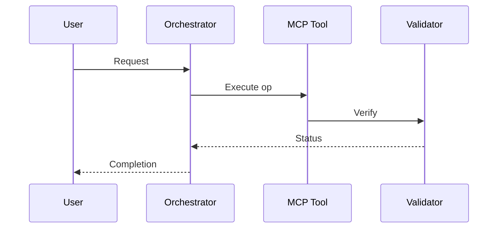

# Request Sequence

```mermaid
sequenceDiagram
  participant U as User
  participant O as Orchestrator
  participant T as MCP Tool
  participant V as Validator
  U->>O: Request
  O->>T: Execute op
  T->>V: Verify
  V-->>O: Status
  O-->>U: Completion
```