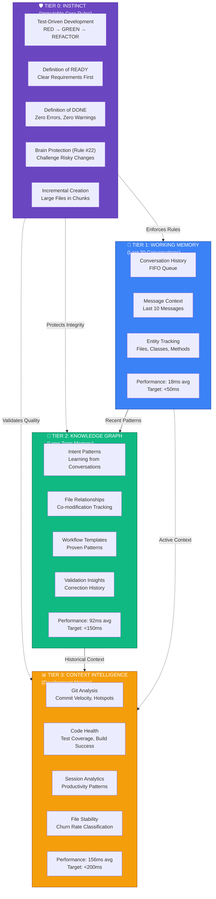

# CORTEX 4-Tier Architecture Preview

**Diagram:** 01-tier-architecture.mmd  
**Description:** Hierarchical cognitive architecture showing Tier 0-3 memory system

---

## Diagram

---

## How to View

1. **Open this markdown file** (PREVIEW-01-tier-architecture.md)
2. **Press:** `Ctrl+Shift+V` (Windows) or `Cmd+Shift+V` (Mac)
3. **Or:** Right-click → "Open Preview"

The Markdown Preview Mermaid Support extension will render the diagram automatically.
