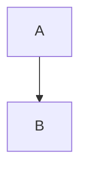
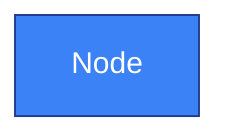

# CORTEX Mermaid Diagrams

**Purpose:** Complete set of Mermaid diagrams illustrating CORTEX architecture, capabilities, and workflows  
**Generated:** November 16, 2025  
**Format:** Mermaid (.mmd) scripts for rendering in documentation

---

## 📊 Diagram Catalog

### Architecture Diagrams

| # | Diagram | File | Description |
|---|---------|------|-------------|
| 01 | **4-Tier Architecture** | `01-tier-architecture.mmd` | Shows Tier 0-3 hierarchy with responsibilities and performance |
| 02 | **Agent System** | `02-agent-system.mmd` | Dual-hemisphere (LEFT/RIGHT) agent coordination |
| 03 | **TDD Workflow** | `03-tdd-workflow.mmd` | RED → GREEN → REFACTOR cycle enforcement |
| 07 | **Brain Protection** | `07-brain-protection.mmd` | 6 protection layers (Rule #22) |

### Process Flow Diagrams

| # | Diagram | File | Description |
|---|---------|------|-------------|
| 04 | **Intent Routing** | `04-intent-routing.mmd` | Natural language → Agent routing |
| 05 | **Agent Coordination** | `05-agent-coordination.mmd` | Multi-agent sequence for feature implementation |
| 06 | **Conversation Memory** | `06-conversation-memory.mmd` | Capture → Storage → FIFO flow |
| 10 | **Feature Planning** | `10-feature-planning.mmd` | Interactive planning with Work Planner |
| 14 | **Complete Data Flow** | `14-data-flow-complete.mmd` | End-to-end: Request → Completion |

### Intelligence Diagrams

| # | Diagram | File | Description |
|---|---------|------|-------------|
| 08 | **Knowledge Graph** | `08-knowledge-graph.mmd` | Pattern learning, reuse, and decay |
| 09 | **Context Intelligence** | `09-context-intelligence.mmd` | Git analysis, file stability, session analytics |

### Performance & Optimization

| # | Diagram | File | Description |
|---|---------|------|-------------|
| 11 | **Performance Benchmarks** | `11-performance-benchmarks.mmd` | Actual vs target metrics (all exceed targets ⚡) |
| 12 | **Token Optimization** | `12-token-optimization.mmd` | Before/after modular refactoring (97.2% reduction) |

### System Capabilities

| # | Diagram | File | Description |
|---|---------|------|-------------|
| 13 | **Plugin System** | `13-plugin-system.mmd` | Zero-footprint plugin architecture |
| 15 | **Before vs After** | `15-before-vs-after.mmd` | Copilot alone vs Copilot + CORTEX |

---

## 🎨 Rendering Diagrams

### Online Rendering (Mermaid Live Editor)

1. Visit: https://mermaid.live/
2. Copy content from `.mmd` file
3. Paste into editor
4. Export as PNG/SVG

### VS Code Rendering (Recommended)

**Install Extension:**
```
Markdown Preview Mermaid Support
Publisher: Matt Bierner
```

**Usage:**
1. Create markdown file with mermaid code block:
   ````markdown
   ```mermaid
   [paste .mmd content here]
   ```
   ````
2. Open preview: `Ctrl+Shift+V` (Windows) or `Cmd+Shift+V` (Mac)
3. Export or screenshot

### CLI Rendering (mermaid-cli)

**Install:**
```bash
npm install -g @mermaid-js/mermaid-cli
```

**Generate PNG:**
```bash
mmdc -i 01-tier-architecture.mmd -o ../generated/01-tier-architecture.png
```

**Batch Process:**
```bash
for file in *.mmd; do
    mmdc -i "$file" -o "../generated/${file%.mmd}.png" -b transparent
done
```

### Documentation Integration (MkDocs)

**Install Plugin:**
```bash
pip install mkdocs-mermaid2-plugin
```

**mkdocs.yml:**
```yaml
plugins:
  - mermaid2

markdown_extensions:
  - pymdownx.superfences:
      custom_fences:
        - name: mermaid
          class: mermaid
          format: !!python/name:pymdownx.superfences.fence_code_format
```

**Usage in Docs:**
````markdown

````

---

## 🎨 Style Guide

All diagrams follow **CORTEX Visual Style Guide** (`../STYLE-GUIDE.md`):

### Color Palette

| Element | Color | Hex | Usage |
|---------|-------|-----|-------|
| **Tier 0** | Deep Purple | `#6B46C1` | Instinct/Governance |
| **Tier 1** | Bright Blue | `#3B82F6` | Working Memory |
| **Tier 2** | Emerald Green | `#10B981` | Knowledge Graph |
| **Tier 3** | Warm Orange | `#F59E0B` | Context Intelligence |
| **LEFT Brain** | Cool Blue | `#3B82F6` | Execution agents |
| **RIGHT Brain** | Warm Orange | `#F59E0B` | Strategy agents |

### Styling in Mermaid


---

## 📝 File Naming Convention

**Pattern:** `##-diagram-name.mmd`

**Examples:**
- `01-tier-architecture.mmd` (Architecture overview)
- `05-agent-coordination.mmd` (Process flow)
- `12-token-optimization.mmd` (Metrics/impact)

**Version Control:**
- v1 suffix if multiple versions exist
- Keep all versions (storage is cheap, history is valuable)

---

## 🔄 Diagram Update Workflow

### When to Update Diagrams

1. **Architecture Changes** - New tiers, agents, or components added
2. **Performance Updates** - Benchmark metrics change significantly
3. **Feature Additions** - New workflows or capabilities
4. **Optimization Results** - Token/cost metrics improve
5. **Visual Improvements** - Better clarity or layout

### Update Process

1. **Edit .mmd file** - Update Mermaid script
2. **Regenerate PNG/SVG** - Use rendering method above
3. **Update narrative** - Sync `../narratives/##-diagram-name.md`
4. **Version increment** - Add v2 suffix if major change
5. **Commit with message** - `docs(diagrams): Update agent coordination flow`

### Validation Checklist

- [ ] Colors match style guide
- [ ] Text is readable (test at 50% zoom)
- [ ] Layout is balanced (not cramped)
- [ ] Arrows show clear flow direction
- [ ] Labels are concise but clear
- [ ] Subgraphs are properly styled
- [ ] File naming convention followed

---

## 🎓 Usage Examples

### Example 1: Architecture Presentation

**Goal:** Explain CORTEX architecture to stakeholders

**Diagrams to Use:**
1. `01-tier-architecture.mmd` - Overview of 4 tiers
2. `02-agent-system.mmd` - Agent coordination
3. `11-performance-benchmarks.mmd` - Metrics proof
4. `15-before-vs-after.mmd` - Value proposition

**Order:** Overview → Agents → Performance → Value

### Example 2: Developer Onboarding

**Goal:** Help new developers understand CORTEX internals

**Diagrams to Use:**
1. `02-agent-system.mmd` - Agent roles
2. `03-tdd-workflow.mmd` - Development process
3. `04-intent-routing.mmd` - How requests are handled
4. `08-knowledge-graph.mmd` - Learning mechanism

**Order:** Agents → TDD → Routing → Learning

### Example 3: Technical Documentation

**Goal:** Document complete system for external developers

**All Diagrams:**
- Architecture: 01, 02, 07
- Workflows: 03, 04, 05, 06, 10, 14
- Intelligence: 08, 09
- Performance: 11, 12
- System: 13, 15

---

## 🛠️ Troubleshooting

### Diagram Won't Render

**Issue:** Syntax error in Mermaid script

**Fix:**
1. Validate at https://mermaid.live/
2. Check for unclosed quotes, brackets
3. Verify subgraph syntax: `subgraph name["Label"]`
4. Ensure style statements are at end

### Colors Not Showing

**Issue:** Style statements incorrect or missing

**Fix:**


### Text Overflow

**Issue:** Labels too long for node boxes

**Fix:**
- Use `<br/>` for line breaks
- Shorten labels (use subtext in narrative)
- Increase node width: `A["Long<br/>Label"]`

### Arrows Crossing

**Issue:** Complex graph with overlapping arrows

**Fix:**
- Rearrange node order
- Use subgraphs to group related nodes
- Consider splitting into multiple diagrams

---

## 📚 Resources

**Mermaid Documentation:** https://mermaid.js.org/  
**Live Editor:** https://mermaid.live/  
**VS Code Extension:** Search "Mermaid" in Extensions  
**CORTEX Style Guide:** `../STYLE-GUIDE.md`  
**Narrative Examples:** `../narratives/`

---

## 🔗 Related Documentation

| Document | Purpose |
|----------|---------|
| `../README.md` | Diagram overview and philosophy |
| `../STYLE-GUIDE.md` | Visual standards and guidelines |
| `../narratives/*.md` | Detailed explanations for each diagram |
| `../generated/*.png` | Rendered diagram images |
| `../../awakening-of-cortex.md` | CORTEX story document |

---

**Author:** Asif Hussain  
**Copyright:** © 2024-2025 Asif Hussain. All rights reserved.  
**License:** Proprietary - See LICENSE file for terms  
**Version:** 1.0  
**Last Updated:** November 16, 2025

---

*Generated from CORTEX 2.1 architecture specifications*
