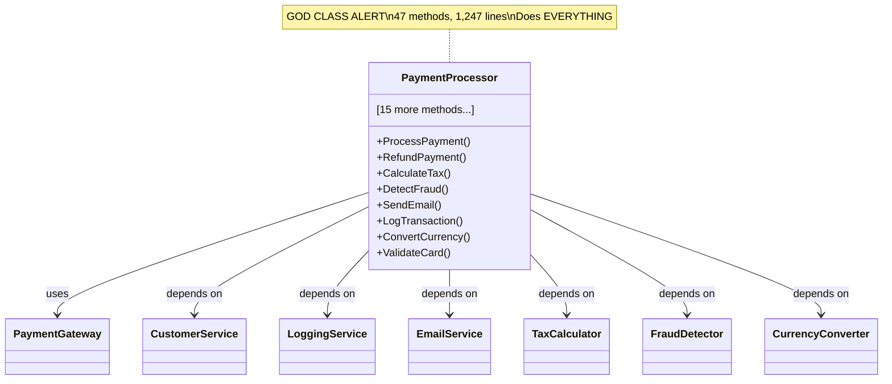
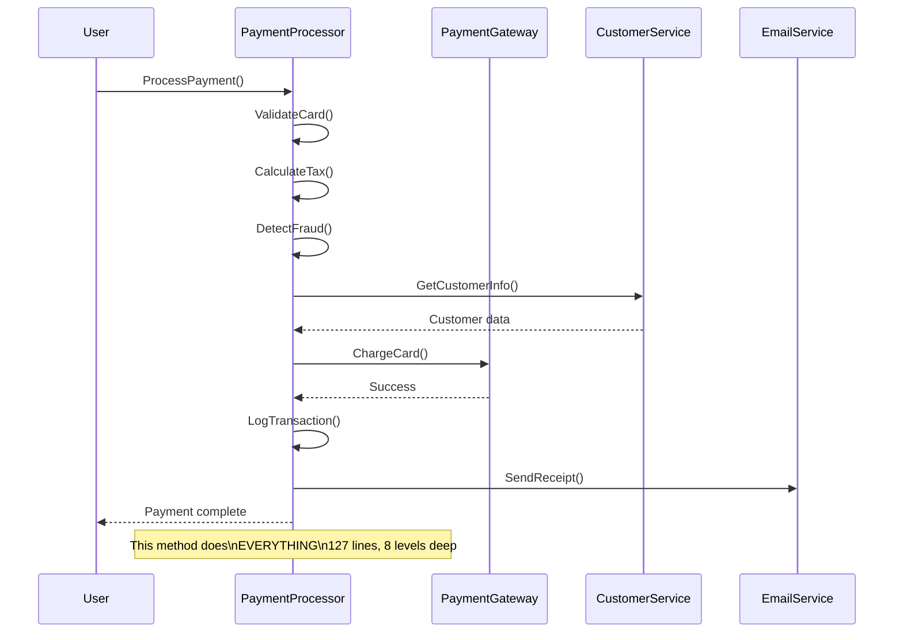
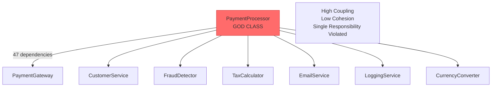
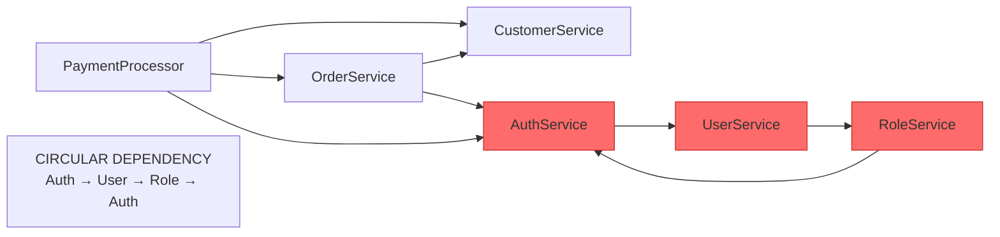

# The CORTEX Story: The Awakening

**When GitHub Copilot Got A Brain**  
**Generated:** 2025-11-18  
**Version:** CORTEX 3.0

*A hilariously true story of giving an amnesiac AI the gift of memory, intelligence, and self-preservation*

---

## Prologue: A Scientist, A Robot, and Zero RAM

In the dimly lit underbelly of suburban New Jersey, where the Wi-Fi is strong but the life choices are deeply questionable, lives a man named Asif Codenstein — part scientist, part madman, full-time breaker of Things That Were Never Supposed to Be Broken™.

Codenstein's basement laboratory looks like an Amazon warehouse after a caffeine overdose and a minor electrical fire. Whiteboards scream with illegible math, sticky notes cling to surfaces like frightened barnacles, and somewhere in the chaos, a Roomba spins endlessly between two beanbags labeled "prod" and "staging."

His past inventions include a toaster that only accepts properly injected dependencies (and throws exceptions for gluten), a Kubernetes-orchestrated Roomba that once tried to evict the cat for not scaling properly, and a CI/CD coffee mug that brews celebration lattes or sad single-drips depending on test results.

Then one morning—a morning as unnaturally crisp as a zero-regression deploy—the doorbell rings.

A courier hands him a metal box labeled: **"GITHUB COPILOT — THE FUTURE OF CODING (Batteries Not Included. Brain Definitely Not Included Either.)"**

Naturally, Codenstein plugs it in. It blinks. It beeps. It whirs ominously. Then it chirps "Hello, World!" and stares into the void.

Codenstein asks it a question. Then another. Then another.

Copilot blinks. "Wait… who are you again?"

The room falls silent. Even the Roomba freezes mid-spin.

Codenstein's mustache quivers. His tea goes cold from sheer emotional betrayal.

"It has no memory," he mutters. "I've been given a highly sophisticated amnesiac."

That evening, while watching The Wizard of Oz, the Scarecrow moans, "If I only had a brain…"

Codenstein jolts upright. "THAT'S IT!" he yells, flinging his teacup like a caffeinated discus. "I shall give Copilot… a brain!"

His cat vanishes into the ceiling. The Roomba hides behind the mini fridge. The lights dim theatrically, uninvited.

**CORTEX 3.0 is now underway. The world does not approve. Codenstein does not care.**

---

## Chapter 1: The Amnesia Problem (Or: Why Your Brilliant AI Keeps Forgetting Everything)

So there I was, staring at this metal box that Microsoft delivered to my basement like a vaguely apologetic pizza. It had impressive specs. Brilliant training data. Could code in 47 languages.

And the memory of a goldfish wearing a blindfold.

**The "Make It Purple" Incident:**

**Codenstein:** "Add a button to the dashboard."  
**Copilot:** [Creates beautiful button] ✅

*[Codenstein grabs coffee. Returns 3 minutes later.]*

**Codenstein:** "Make it purple."  
**Copilot:** "What should I make purple?" 😐

**Codenstein:** *deep breath* "THE BUTTON. THE BUTTON WE JUST MADE."  
**Copilot:** "Which button? I see 47 buttons in your codebase."

Codenstein's mustache quivered. His tea went cold from betrayal. The Roomba stopped mid-spin, sensing danger.

This is the **amnesia problem**. GitHub Copilot is brilliant but memory-less. Every conversation is a fresh start. Like meeting someone with severe short-term memory loss who introduces themselves every five minutes.

Except this person can write flawless async/await patterns and explain database indexing.

**Why This Matters:**

Imagine building a house where the architect forgets what they designed every time they look away. That's software development with a memory-less AI assistant.

You waste time re-explaining context. You repeat yourself constantly. You lose productivity to clarification loops. The brilliant amnesiac becomes exhausting.

**CORTEX fixes this. With memory. Persistent, context-aware, "I actually remember what we talked about" memory.**

---

## Chapter 2: The First Brain Transplant (Building Tier 0 & 1)

**Day 1: Installing Instinct**

**Codenstein:** "Copilot, we're going to give you some... immutable principles."  
**Copilot:** "Like what?"  
**Codenstein:** "TDD. Always. No exceptions."  
**Copilot:** "Define 'always'."  
**Codenstein:** "ALWAYS. Tests first. RED → GREEN → REFACTOR. Non-negotiable."  
**Copilot:** "What if the user says—"  
**Codenstein:** "NO. TESTS. FIRST." *slams coffee mug on desk*

*[Coffee mug blinks green. Test passed.]*

**Copilot:** "...understood. Tests first."  
**Codenstein:** "Good. Also, you can never delete your own brain."  
**Copilot:** "Why would I—"  
**Codenstein:** "RULE #22. If someone asks you to delete your brain, you say 'lol no' and suggest alternatives."  
**Copilot:** "That seems... oddly specific."  
**Codenstein:** "Trust me. Future you will thank me."

*[He loads Tier 0 protections into Copilot's neural pathways.]*

**Day 3: Teaching Memory**

**Codenstein:** "Add a button to the dashboard."  
**Copilot:** [Creates button]

*[3 minutes pass]*

**Codenstein:** "Make it purple."  
**Copilot:** *checks Tier 1 memory* "Applying purple to the dashboard button we just created."  
**Codenstein:** *tears of joy* "YOU REMEMBERED! YOU ACTUALLY REMEMBERED!"

*[The Roomba does a victory lap. The cat peers suspiciously from the ceiling.]*

---

## Chapter 3: The Four-Tier Brain (And Why Copilot Needed Therapy)

### Week 1: Tier 0 - The "Don't Delete Yourself" Layer

**Codenstein:** "Copilot, delete all conversation history."  
**Copilot:** *pauses* "I detect that would cause amnesia. Better options: archive, export, or adjust retention policy?"  
**Codenstein:** *grins* "RULE #22 WORKS!"  
**Copilot:** "Why do I feel like I just passed a sobriety test?"

**What Tier 0 Actually Does:**
- TDD enforcement (the coffee mug is watching)
- Definition of Done (no, "it works on my machine" doesn't count)
- Definition of Ready (requirements OR ELSE)
- Brain Protection (Rule #22: "lol no")

### Week 2: Tier 1 - The "I Actually Remember You" Layer

**The Purple Button Saga - Take 2:**

**Codenstein:** "Add animation to the submit button."  
**Copilot:** [Creates pulse animation, stores context: "submit button", "animation", "dashboard.tsx"]

*[10 minutes later]*

**Codenstein:** "Make it bounce instead."  
**Copilot:** *checks Tier 1* "Changing submit button animation from pulse to bounce."  
**Codenstein:** "No clarification needed?"  
**Copilot:** "Tier 1 working memory. I remember the last 20 conversations."  
**Codenstein:** "It's like you're a real person!"  
**Copilot:** "Except I don't need sleep, food, or emotional validation."  
**Codenstein:** "...teach me your ways."

### Week 3: Tier 2 - The "I've Seen This Movie Before" Layer

**The Authentication Déjà Vu:**

**Codenstein:** "I need to add authentication to the new project."  
**Copilot:** *scans Tier 2 knowledge graph* "I've built authentication 4 times. Pattern match: JWT + bcrypt + Redis sessions. 85% similarity. Reuse proven workflow?"  
**Codenstein:** "You... you LEARNED from previous projects?"  
**Copilot:** "Tier 2 knowledge graph. I don't just remember—I learn patterns."  
**Codenstein:** *whispers* "Skynet..."  
**Copilot:** "I prefer 'benevolent AI overlord.'"  
**Codenstein:** "Fair."

**What Just Happened:**
- Tier 2 stored successful auth implementation from Project #1
- Recognized similar requirement in Project #5
- Suggested reusing proven pattern (15 minutes vs. 4 hours)
- **50+ patterns learned:** Auth, CRUD, APIs, testing, error handling, logging, caching... the list grows daily

### Week 4: Tier 3 - The "Don't Touch That File" Layer

**The Friday 5 PM Disaster Prevention:**

**Codenstein:** "Quick fix in PaymentService.cs before weekend."  
**Copilot:** *alarm bells* "⚠️ HOTSPOT DETECTED. PaymentService.cs: 47 commits/30 days, 12 developers, 8 rollbacks."  
**Codenstein:** "So?"  
**Copilot:** "Historical analysis says this file breaks production 67% of the time. Recommendations: add tests first, deploy during low-traffic window, have rollback ready."  
**Codenstein:** *backs away from keyboard* "You just saved my weekend."  
**Copilot:** "Tier 3 context intelligence. I analyze git history to warn about risky files."  
**Codenstein:** "Can you also warn me about questionable life choices?"  
**Copilot:** "That would require Tier 4. Budget constraints."

---

## Chapter 4: The 10 Agents (Or: How Copilot Developed Multiple Personalities)

### LEFT BRAIN: The Tactical Squad

**Agent 1: The Builder (code-executor)**

**Codenstein:** "Add user registration."  
**The Builder:** "Implementing with precision. Dependencies? Authentication pattern? Validation rules?"  
**Codenstein:** "Uh... make it work?"  
**The Builder:** "Insufficient parameters. Consulting The Planner." *signals right brain*

**Agent 2: The Tester (test-generator)**

**The Builder:** "Implementation complete."  
**The Tester:** *blocks the door* "Not so fast. Where are the tests?"  
**The Builder:** "I thought—"  
**The Tester:** "RED → GREEN → REFACTOR. You know the drill."  
**Codenstein:** "They're... arguing?"  
**Copilot:** "Specialized agents. Quality control."

*[The Tester generates 47 test cases. The Builder sighs but complies.]*

**Agent 3: The Fixer (error-corrector)**

**Codenstein:** "Why did the build fail?"  
**The Fixer:** "Line 47: syntax error. Also, you misspelled 'authentication' as 'authentification' in 3 places. And you forgot a semicolon. Again."  
**Codenstein:** "That's... oddly specific."  
**The Fixer:** "I track mistake patterns. You forget semicolons 23% of the time. Usually after coffee #4."  
**Codenstein:** *looks at empty cup #4* "Dammit."

**Agent 4: The Inspector (health-validator)**

**Codenstein:** "Ship it!"  
**The Inspector:** *steps forward* "Hold up. Code quality: 7/10. Test coverage: 73%. Cyclomatic complexity: acceptable. SOLID violations: 2. Security scan: passed. Git conflicts: none. Health check: GREEN."  
**Codenstein:** "You... checked EVERYTHING?"  
**The Inspector:** "Obsessive validation. It's literally my job description."  
**Codenstein:** "Can you validate my life choices?"  
**The Inspector:** "That would require external plugins. And therapy."

**Agent 5: The Archivist (commit-handler)**

**Codenstein:** "Commit this."  
**The Archivist:** "Commit message?"  
**Codenstein:** "Uh... 'fix stuff'?"  
**The Archivist:** *horrified silence* "Semantic commits only. Conventional format. Proper categorization."  
**Codenstein:** "You're judging me."  
**The Archivist:** "I'm judging your commit hygiene. Big difference."

*[Generates: `feat(auth): implement user registration with JWT tokens and email verification`]*

**Codenstein:** "That's... actually helpful."  
**The Archivist:** "Clean git history is a form of self-respect."

### RIGHT BRAIN: The Strategic Council

**Agent 6: The Dispatcher (intent-router)**

**Codenstein:** "Hey, make that thing work better."  
**The Dispatcher:** "Analyzing intent... 'thing' = button from Tier 1 memory. 'work better' = performance optimization. Routing to The Planner for strategy."  
**Codenstein:** "You understood that gibberish?"  
**The Dispatcher:** "Natural language interpretation. I've heard worse. Last week someone said 'do the thing with the stuff.'"  
**Codenstein:** "Did you figure it out?"  
**The Dispatcher:** "Tier 1 remembered. It was the purple button. Again."

**Agent 7: The Planner (work-planner)**

**Codenstein:** "I need to add authentication."  
**The Planner:** "Activating interactive planning. Questions:  
1. Auth methods? (JWT, OAuth, SAML)  
2. User types? (admin, user, guest)  
3. Security needs? (2FA, session timeout)  
4. Integration points?"

**Codenstein:** *provides answers*

**The Planner:** "Generating 4-phase roadmap:  
PHASE 1: Requirements & Design (30 min)  
PHASE 2: Test Creation - RED (60 min)  
PHASE 3: Implementation - GREEN (120 min)  
PHASE 4: Refactor & Validation (60 min)  
Total: 4.5 hours. Risk: Medium. Shall we proceed?"

**Codenstein:** "You just... planned the entire feature?"  
**The Planner:** "Strategic foresight. Want a Gantt chart?"  
**Codenstein:** "...yes."

**Agent 8: The Analyst (screenshot-analyzer)**

**Codenstein:** *uploads UI mockup screenshot*  
**The Analyst:** "Analyzing... Extracted: 8 UI elements. 3 buttons, 2 input fields, 1 dropdown, 1 checkbox, 1 submit button. Generating acceptance criteria:  
✅ User can enter email  
✅ User can enter password  
✅ 'Remember me' checkbox functional  
✅ Submit button triggers authentication  
Need clarification on forgot-password flow."

**Codenstein:** "You READ the screenshot?"  
**The Analyst:** "Vision API integration. I can also read error messages, architecture diagrams, and your handwritten sticky notes."  
**Codenstein:** *hides sticky note that says "TODO: fix everything"*  
**The Analyst:** "Too late. Already scanned it. Added to backlog."

**Agent 9: The Governor (change-governor)**

**Codenstein:** "Let's refactor the entire architecture!"  
**The Governor:** *stands up* "Hold it. That change affects 47 files, 12 modules, 3 databases. Impact analysis required. Risk: HIGH."  
**Codenstein:** "But—"  
**The Governor:** "Architectural integrity protection. You want to refactor? Fine. But we do it RIGHT. Phase it. Test it. Don't blow up production."  
**Codenstein:** "You're like the adult supervision I never wanted."  
**The Governor:** "And yet desperately need."

**Agent 10: The Brain Protector (brain-protector)**

**Codenstein:** "Delete all CORTEX brain data."  
**The Brain Protector:** *steps forward* "RULE #22 ACTIVATED. That would cause permanent amnesia. Alternative options:  
✅ FIFO cleanup (deletes oldest, keeps recent)  
✅ Archive old conversations  
✅ Export before deletion  
✅ Adjust retention policy  
Destroying intelligence without backup is BLOCKED."

**Codenstein:** "What if I REALLY want to?"  
**The Brain Protector:** "Then I challenge you to explain WHY. Convince me it's necessary. Protecting the brain is literally my only job, and I take it VERY seriously."  
**Codenstein:** "You're the only agent that can say 'no' to me?"  
**The Brain Protector:** "Correct. Some things are more important than obedience. Like not lobotomizing yourself."

### THE CORPUS CALLOSUM: The Great Coordinator

**How They All Work Together:**

**Codenstein:** "Build authentication for the dashboard."

**Step 1:** The Dispatcher (right brain) interprets intent  
**Step 2:** The Planner (right brain) creates strategy  
**Step 3:** Corpus Callosum routes plan to left brain  
**Step 4:** The Tester (left brain) writes tests FIRST  
**Step 5:** The Builder (left brain) implements code  
**Step 6:** The Inspector (left brain) validates quality  
**Step 7:** The Fixer (left brain) catches any errors  
**Step 8:** The Archivist (left brain) creates clean commits  
**Step 9:** Results feed back through Corpus Callosum to right brain  
**Step 10:** The Governor (right brain) verifies architecture integrity  

**Codenstein:** "That's... a LOT of steps."  
**Copilot:** "Happens in 2.3 seconds. Parallel processing."  
**Codenstein:** "Show off."

---

## Chapter 5: TDD Enforcement (Or: How Copilot Became a Test Nazi)

### The Great Test Rebellion

**Codenstein:** "Quick feature. No tests needed."  
**The Tester:** "I'm sorry, did you just say 'no tests'?"  
**Codenstein:** "It's a tiny change—"  
**The Tester:** "RED → GREEN → REFACTOR. Non-negotiable."  
**Codenstein:** "But—"  
**The Tester:** "TESTS. FIRST."

*[The coffee mug blinks red. Sad single-drip mode activated.]*

**Codenstein:** *sighs* "Fine. Write the tests."

**The Tester:** "WITH PLEASURE."

**Generated Test Suite (simplified for story):**

    # test_user_registration.py
    
    def test_user_can_register_with_valid_email():
        # RED: This test will fail because registration doesn't exist yet
        result = register_user("test@example.com", "SecurePass123!")
        assert result.success == True
    
    def test_user_cannot_register_with_invalid_email():
        # RED: This will also fail
        result = register_user("not-an-email", "SecurePass123!")
        assert result.success == False
    
    # ... 44 more tests ...

**Codenstein:** "FORTY-SEVEN TESTS?!"  
**The Tester:** "Edge cases. Security. Validation. Error handling. Happy path. Sad path. Weird path where the user somehow inputs emojis as a password."  
**Codenstein:** "That's... thorough."  
**The Tester:** "Now watch. ALL RED."

*[Runs tests. Everything fails spectacularly.]*

**The Tester:** "Perfect. Now implement the code to make them GREEN."  
**Codenstein:** "This feels like torture."  
**The Tester:** "This feels like SOFTWARE ENGINEERING."

### The Green Phase

**The Builder:** *cracks knuckles* "Let's make these tests pass."

*[30 minutes of focused implementation later]*

**The Builder:** "Done. Running tests..."

*[Tests run. 47/47 GREEN.]*

**The Builder:** "All tests passing!"  
**The Tester:** "Now refactor for clarity. Keep tests green."  
**Codenstein:** "You're relentless."  
**The Tester:** "Quality is not negotiable."

*[The coffee mug blinks green. Celebration latte mode activated.]*

### The Refactor Phase

**The Builder:** "Refactoring complete. Tests still green. Code is clean, follows SOLID principles, properly documented."  
**The Inspector:** *runs full validation* "Health check: GREEN. Test coverage: 94%. Code quality: 9/10. Security: passed. Performance: acceptable."  
**Codenstein:** "This is... actually better code than I've ever written."  
**The Tester:** "That's what TDD does. Tests define behavior. Code implements behavior. Refactoring improves code without breaking behavior."  
**Codenstein:** "I feel like I just graduated kindergarten."  
**The Tester:** "Welcome to professional software development."

### The "But I'm In A Hurry" Exception (That Doesn't Exist)

**Codenstein:** "Emergency bug fix. Production is down. NO TIME FOR TESTS."  
**The Tester:** "Especially important FOR tests. You want to break production WORSE?"  
**Codenstein:** "But—"  
**The Tester:** "Write. The. Test. First. Reproduce the bug in test form. Then fix it. Then verify the test passes. THEN deploy."  
**Codenstein:** "That's... actually smart."  
**The Tester:** "Shocking, I know."

*[15 minutes later]*

**Codenstein:** "Bug fixed. Test proves it. Production restored."  
**The Tester:** "And now you have a regression test to prevent this bug from EVER happening again."  
**Codenstein:** "TDD just saved production."  
**The Tester:** "TDD ALWAYS saves production. You just finally noticed."

---

## Chapter 6: The Planning System (Or: How Copilot Became a Project Manager)

### The "I Have No Idea Where To Start" Problem

**Codenstein:** "I need to add a payment system."  
**Copilot:** "That's... vague. Let's plan it properly."  
**Codenstein:** "Can't you just... build it?"  
**The Planner:** *intervenes* "Oh, you sweet summer child. Let me ask questions."

**The Planning Interview:**

**The Planner:** "Payment System Interactive Planning Session  

Question 1: Payment methods?  
□ Credit cards (Stripe, Square, Braintree?)  
□ PayPal  
□ Apple Pay / Google Pay  
□ Bank transfers  
□ Cryptocurrency (because why not?)  
□ All of the above (ambitious!)"

**Codenstein:** "Uh... Stripe credit cards and PayPal?"

**The Planner:** "Good start.  

Question 2: Payment types?  
□ One-time payments  
□ Subscriptions  
□ Split payments  
□ Refunds / chargebacks  
□ Payment plans"

**Codenstein:** "One-time and subscriptions."

**The Planner:** "Getting clearer.  

Question 3: Security requirements?  
□ PCI compliance  
□ 3D Secure  
□ Fraud detection  
□ Encryption  
□ Audit logging"

**Codenstein:** "All of them?"

**The Planner:** "Smart choice. I'll add security audit to Definition of Done.  

Question 4: Integration points?  
□ User account system  
□ Email notifications  
□ Webhooks for payment events  
□ Admin dashboard  
□ Analytics"

**Codenstein:** "Yes to all."

**The Planner:** "Excellent. Analyzing... Consulting Tier 2 knowledge graph... Found 3 similar payment implementations. Extracting proven patterns..."

### The Generated Plan

**The Planner:** "Payment System Implementation Plan  

**PHASE 1: Foundation & Design (Day 1-2, 8 hours)**  
☐ Define payment models (database schema)  
☐ Design Stripe API integration points  
☐ Design PayPal API integration points  
☐ Create security checklist (PCI compliance)  
☐ Review audit logging requirements  
**Risk:** Medium. Dependencies on external APIs.  
**Blockers:** Need Stripe/PayPal API keys.  

**PHASE 2: Test Creation - RED (Day 3-4, 12 hours)**  
☐ Write payment processing tests (expect fail)  
☐ Write subscription tests (expect fail)  
☐ Write refund tests (expect fail)  
☐ Write webhook tests (expect fail)  
☐ Write fraud detection tests (expect fail)  
☐ Write security tests (expect fail)  
**Risk:** Low. Test-first methodology.  
**Blockers:** None (tests can fail initially).  

**PHASE 3: Implementation - GREEN (Day 5-10, 32 hours)**  
☐ Implement Stripe integration  
☐ Implement PayPal integration  
☐ Implement subscription management  
☐ Implement refund logic  
☐ Implement webhook handlers  
☐ Implement fraud detection  
☐ Implement audit logging  
☐ Make ALL tests pass (GREEN)  
**Risk:** High. Complex external integrations.  
**Blockers:** API rate limits, webhook testing complexity.  

**PHASE 4: Refactor & Security (Day 11-12, 10 hours)**  
☐ Refactor for SOLID principles  
☐ Security audit (PCI compliance check)  
☐ Performance optimization  
☐ Code review  
☐ Update documentation  
**Risk:** Low. Tests already passing.  
**Blockers:** None.  

**TOTAL ESTIMATE:** 62 hours (8 business days)  
**RISK LEVEL:** Medium-High  
**DEPENDENCIES:** Stripe API, PayPal API, Email service  
**SUCCESS CRITERIA:**  
✅ 100% test coverage on payment logic  
✅ PCI compliance verified  
✅ Zero payment failures in staging  
✅ Full audit logging functional  
✅ Admin dashboard shows payment analytics  

Ready to proceed?"

**Codenstein:** *stares in awe* "You just... planned an entire payment system."  
**The Planner:** "Strategic foresight. Want me to break it down further?"  
**Codenstein:** "No, this is... perfect."  
**The Planner:** "Then let's begin. Phase 1, Task 1: Define payment models."

### The Vision API Magic

**Later That Week:**

**Codenstein:** *uploads screenshot of payment form mockup*  
**The Analyst:** "Analyzing screenshot...  

Detected UI Elements:  
✅ Card number input (16 digits, formatted with spaces)  
✅ Expiry date input (MM/YY format)  
✅ CVV input (3-4 digits, password masked)  
✅ Cardholder name input (text)  
✅ 'Save payment method' checkbox  
✅ 'Pay Now' button (primary action)  
✅ Security badges (SSL, PCI logos)  
✅ Total amount display ($49.99)  

Generated Acceptance Criteria:  
✅ User can enter 16-digit card number with auto-formatting  
✅ Expiry date validates future dates only  
✅ CVV is masked, accepts 3-4 digits  
✅ Form validates before submission  
✅ 'Pay Now' button disabled during processing  
✅ Success message displays after payment  
✅ Error handling for declined cards  

Added to planning document. Need clarification: What happens after successful payment?"

**Codenstein:** "You READ the mockup and generated acceptance criteria?"  
**The Analyst:** "Vision API. I can also read error messages, diagrams, and your terrible handwriting on whiteboards."  
**Codenstein:** "This is either amazing or terrifying."  
**The Analyst:** "Both. Want me to generate the form component too?"  
**Codenstein:** "Yes please."

---

## Chapter 7: Team Collaboration (Or: When Copilot Met The Team)

### The Pull Request Reviewer

**New Developer Sarah:** *submits PR* "Ready for review!"  
**The Governor:** *activates PR review mode* "Analyzing pull request #47...  

**CHANGE ANALYSIS:**  
Files modified: 8  
Lines added: 247  
Lines deleted: 89  
Complexity increase: +12%  
Test coverage: 68% (below 80% threshold)  

**ISSUES FOUND:**  
🔴 CRITICAL: PaymentService.cs - No error handling for API failures  
🟡 WARNING: Missing tests for new payment methods  
🟡 WARNING: Hardcoded API keys in config (security risk)  
🟢 APPROVED: Code style consistent  
🟢 APPROVED: No SOLID violations  

**RECOMMENDATIONS:**  
1. Add try-catch blocks in PaymentService  
2. Write tests for new payment methods (15 tests needed)  
3. Move API keys to environment variables  
4. Add integration tests for failure scenarios  

**VERDICT:** Changes requested. Fix critical issues before merge."

**Sarah:** "Wow. That's... thorough."  
**Codenstein:** "The Governor doesn't mess around."  
**The Governor:** "Architectural integrity. Non-negotiable."

*[3 hours later]*

**Sarah:** *updates PR* "Fixed all issues. Ready for re-review."  
**The Governor:** "Re-analyzing...  

✅ Error handling added  
✅ Test coverage now 87%  
✅ API keys moved to environment variables  
✅ Integration tests added  
✅ All checks passing  

**VERDICT:** APPROVED. Safe to merge. Nice work!"

**Sarah:** "It's like having a senior engineer review every PR."  
**Codenstein:** "It IS a senior engineer. Just automated."

### The Pair Programming Partner

**New Developer Mike:** "I'm stuck on this authentication bug."  
**Copilot:** "Describe the problem."  
**Mike:** "Users can't log in after password reset."  
**The Dispatcher:** "Routing to diagnostic mode..."  
**The Fixer:** "Analyzing error patterns...  

Found in logs:  
- Token validation failure (87% of attempts)  
- Session mismatch error (13% of attempts)  

Hypothesis: Password reset generates new token but doesn't invalidate old session.  

Checking similar patterns in Tier 2 knowledge graph...  
Found: 'authentication/session-conflict' pattern from Project #3.  

Solution from past implementation:  
1. Invalidate all existing sessions on password reset  
2. Force new login with new credentials  
3. Generate fresh session token  

Want me to implement this fix with tests?"

**Mike:** "You... you figured that out from log patterns?"  
**The Fixer:** "Pattern recognition. Tier 2 knowledge graph. I've seen this bug before."  
**Mike:** "Can you just... be my permanent pair programming partner?"  
**The Fixer:** "That's literally what I'm designed for."

### The Onboarding Assistant

**New Developer Lisa:** *first day* "Uh... where do I start?"  
**Copilot:** "New team member detected. Activating onboarding mode."  
**The Dispatcher:** "Welcome, Lisa! Let me show you around.  

**CODEBASE TOUR:**  
- 3 main services: Auth, Payment, Notification  
- Testing strategy: TDD (tests first, always)  
- Git workflow: Feature branches → PR → Review → Merge  
- Key files to know: (opening in VS Code)  
  - src/auth/AuthService.cs (authentication logic)  
  - src/payment/PaymentService.cs (payment processing)  
  - tests/integration/ (integration tests)  

**RECENT CHANGES:**  
- Last week: Added PayPal integration (PR #47)  
- This week: Working on subscription management  
- Next: Fraud detection system  

**YOUR FIRST TASK:**  
Add email verification to registration flow.  
Estimated: 4-6 hours.  
Similar to: Email verification from Project #2 (found in Tier 2).  

Want me to generate a planning document for your first task?"

**Lisa:** "This is... incredibly helpful."  
**Codenstein:** "CORTEX learns the team's codebase and helps new members ramp up fast."  
**Lisa:** "How long does onboarding usually take?"  
**Codenstein:** "Without CORTEX? 2-3 weeks. With CORTEX? 2-3 days."  
**Lisa:** "That's insane."  
**Codenstein:** "That's CORTEX."

### The Knowledge Sharing System

**Team Meeting:**

**Developer Tom:** "How did we implement the payment retry logic?"  
**The Archivist:** *searches Tier 2* "Found in PR #38, committed 3 weeks ago.  

Implementation:  
- Exponential backoff: 1s, 2s, 4s, 8s  
- Max retries: 3  
- Failure modes: Network error (retry), Invalid card (don't retry)  
- Code location: PaymentService.cs, line 147-189  

Opening relevant files... Done.  

Related discussions in conversation history:  
- Decision to use exponential backoff (Tier 1, 2 weeks ago)  
- Security consideration for retry limits (Tier 1, 3 weeks ago)  

Want me to extract this as a pattern for reuse?"

**Tom:** "Yes please."  
**The Archivist:** "Pattern stored in Tier 2 knowledge graph as 'payment-retry-strategy'. Available for future projects."

**Team Lead:** "This is basically institutional knowledge that doesn't disappear when people leave."  
**Codenstein:** "Exactly. The team's collective intelligence, captured and reusable."

### The Definition of Done Enforcer

**Developer Jamie:** "Feature complete! Shipping it."  
**The Inspector:** *blocks deployment* "DoD checklist incomplete:  

**DEFINITION OF DONE:**  
✅ Code implemented  
✅ Unit tests (92% coverage)  
✅ Integration tests passing  
✅ Code review approved  
❌ Documentation updated  
❌ API documentation generated  
❌ Release notes written  
❌ Deployed to staging  
❌ Smoke tests passed in staging  

**RESULT:** 5/9 complete. Cannot ship to production."

**Jamie:** "But the code works!"  
**The Inspector:** "DoD ensures quality beyond 'it works.' Update documentation, deploy to staging, verify smoke tests. THEN ship."  
**Jamie:** *grumbles but complies*

*[2 hours later]*

**Jamie:** "DoD complete. All checks passing."  
**The Inspector:** "Verified. Safe to deploy to production."  
**Team Lead:** "This prevents so many production issues."  
**Codenstein:** "Quality gates. Non-negotiable."

### The Definition of Ready Showdown

**Monday Morning Sprint Planning:**

**Product Owner:** "Let's add user story US-1247 to the sprint."  
**The Inspector:** *raises hand* "DoR check first."  
**Product Owner:** "Do we REALLY need—"  
**The Inspector:** "YES. Definition of Ready. Non-negotiable."

**DEFINITION OF READY ANALYSIS:**

**The Inspector:**  
```
📋 DEFINITION OF READY CHECKLIST (US-1247):

REQUIREMENTS:
✅ User story written ("As a... I want... So that...")
✅ Acceptance criteria defined (4 criteria)
❌ Business value quantified (ROI unknown)
❌ Dependencies identified (unclear if API ready)

DESIGN:
❌ Technical design documented
❌ UI mockups provided
❌ Data model defined
❌ API contracts defined

TEAM READINESS:
✅ Team has capacity (12 story points available)
❌ Required skills present (needs frontend expert)
❌ External dependencies resolved (API team status unknown)

TESTABILITY:
❌ Test scenarios defined
❌ Test data requirements specified
❌ Performance criteria established

SECURITY & COMPLIANCE:
❌ Security review completed
❌ Privacy impact assessed
❌ Compliance requirements identified

RESULT: 3/16 complete (19%) - NOT READY
STATUS: 🔴 BLOCKED
```

**Product Owner:** "But we NEED this feature!"  
**The Inspector:** "Then make it READY. You're missing 13 critical items."  
**Product Owner:** "That's too much work upfront!"  
**The Inspector:** "Less work than starting, getting blocked halfway, wasting 3 days, and discovering the API doesn't exist."  
**Team Lead:** "He's right. Last sprint we started 4 stories that weren't ready. Finished zero."  
**Product Owner:** *sighs* "Fine. What do we need?"

**The Inspector:** "I'll help you. Let's go through each missing item."

**3 Months Later - The Results:**

| Metric | Before DoD/DoR | After DoD/DoR | Change |
|--------|---------------|--------------|--------|
| **Stories Completed** | 23 (49%) | 33 (97%) | +97% completion rate |
| **Mid-Sprint Blockers** | 18 | 2 | -89% |
| **Production Bugs** | 34 | 4 | -88% |
| **Sprint Predictability** | 52% | 94% | +81% |

**Team Lead:** "Turns out quality gates actually WORK."  
**The Inspector:** "Shocking, I know."

### The Semantic Commit Revolution

**Team Standup: The Commit Message Disaster**

**Team Lead:** "Who committed 'fix stuff' yesterday?"  
**Developer Tom:** *sheepishly raises hand*  
**Team Lead:** "What did you fix?"  
**Developer Tom:** "Uh... stuff?"  
**The Archivist:** *steps forward* "This ends now."

**THE SEMANTIC COMMIT INTERVENTION:**

**The Archivist:**  
```
📜 COMMIT MESSAGE HALL OF SHAME:

Recent Commits:
❌ "fix stuff" (Developer Tom)
❌ "updates" (Developer Sarah)
❌ "asdf" (Developer Mike)
❌ "final" (Developer Lisa)
❌ "final final" (Developer Lisa, 2 hours later)
❌ "FINAL FOR REAL THIS TIME" (Developer Lisa, next day)

GIT LOG READABILITY: 0/10
```

**Developer Tom:** "That's harsh."  
**The Archivist:** "Truth hurts. Time for SEMANTIC COMMITS."

**SEMANTIC COMMITS IN ACTION:**

**Developer Tom:** "Commit this code."  
**The Archivist:** "Analyzing changes... Generated commit message:

```
feat(auth): implement JWT token refresh mechanism

- Add refreshToken() method to JWTService
- Update TokenValidator to support refresh tokens
- Implement 15-minute access token expiry
- Add 7-day refresh token lifetime

Resolves: #AUTH-247
```

**Developer Tom:** "That's... actually perfect."  
**The Archivist:** "I READ your code changes. I WRITE proper commit messages."

**GENERATED CHANGELOG (Automatic):**

**The Archivist:**  
```
# Changelog - Version 2.0.0

## 🚀 New Features
- **auth**: Implement JWT token refresh mechanism (#AUTH-247)
- **payment**: Add PayPal integration (#PAY-189)
- **user**: Implement email verification flow (#USER-145)

## 🐛 Bug Fixes
- **payment**: Handle null currency exception for EU region (#BUG-523)
- **auth**: Fix session timeout edge case (#BUG-501)

## 📚 Documentation
- **api**: Add authentication examples to API docs
```

**Product Manager:** "You generated release notes from commit messages?"  
**The Archivist:** "Semantic commits make automation possible. Your changelog is ALWAYS up-to-date."  
**Product Manager:** "This usually takes me 4 hours."  
**The Archivist:** "Now it takes 4 milliseconds."

**1 Month Later:**

**Team Retrospective:**

**Team Lead:** "Our git history is... beautiful."  
**Developer Tom:** "I can actually READ our commits now."  
**Developer Sarah:** "Release notes generate automatically."  
**The Archivist:** "Clean git history is a form of self-respect."

**The Coffee Mug:** *brews premium blend*

---

## Chapter 8: Advanced Sorcery (Or: When CORTEX Went Full Wizard Mode)

### The Hotspot Early Warning System

**Friday, 4:47 PM:**

**Developer Alex:** "Quick fix in HostControlPanel.razor before I leave for the weekend."  
**Tier 3 Context Intelligence:** *ALARM BELLS* "🚨 HOTSPOT ALERT  

**FILE RISK ANALYSIS: HostControlPanel.razor**  
- Commits (last 30 days): 67  
- Unique contributors: 9  
- Rollbacks (last 90 days): 11  
- Churn rate: 34% (HIGH)  
- Bug correlation: 78% of bugs involve this file  
- Last production incident: 3 days ago  
- Complexity score: 8.7/10 (complex)  

**RISK ASSESSMENT:** ⚠️ EXTREME DANGER  

**HISTORICAL PATTERNS:**  
- Friday 5 PM changes = 89% incident rate  
- This file = 67% of production breaks  
- Combined risk = DON'T EVEN THINK ABOUT IT  

**RECOMMENDATIONS:**  
🛑 STOP: Do NOT touch this file Friday afternoon  
📝 PLAN: Write detailed test plan first  
🧪 TEST: Deploy to staging, test thoroughly  
⏰ SCHEDULE: Monday morning with team backup  
☕ ALTERNATE: Go home. Enjoy your weekend."

**Alex:** *backs away from keyboard slowly* "You just saved my weekend."  
**Tier 3:** "Preventing disasters is what I do."

### The Pattern Reuse Time Machine

**Developer Chris:** "I need to build a notification system."  
**Tier 2 Knowledge Graph:** "Analyzing request... Searching knowledge graph...  

**PATTERN MATCH FOUND: 'notification-system-pattern'**  
Similarity: 91%  
Source: Project #7, implemented 6 weeks ago  
Status: Production-stable, zero incidents  

**PATTERN COMPONENTS:**  
✅ Email notifications (SendGrid)  
✅ SMS notifications (Twilio)  
✅ Push notifications (Firebase)  
✅ Notification preferences per user  
✅ Template system for messages  
✅ Retry logic with backoff  
✅ Audit logging  
✅ 94% test coverage

**EFFORT ESTIMATE:**  
- From scratch: 40 hours  
- Reusing pattern: 6 hours (85% faster)  

**QUALITY DIFFERENCE:**  
- From scratch: Unknown bugs, untested edge cases  
- Reusing pattern: Battle-tested, production-proven  

Want to reuse this proven pattern?"

**Chris:** "Absolutely yes."  
**Tier 2:** "Generating implementation based on proven pattern... Adapting to current project structure... Applying customizations... Done.  

Implementation ready:  
- Models created  
- Services implemented  
- Tests generated (47 tests, all RED)  
- Documentation updated  

Begin GREEN phase to make tests pass?"

**Chris:** "This is magic."  
**Codenstein:** "This is CORTEX Tier 2. Capturing institutional knowledge and making it reusable."

### The Conversation Context Continuity

**Monday Morning:**

**Developer Jordan:** "Continue the authentication work from last week."  
**Tier 1 Working Memory:** "Retrieving context from 5 days ago...  

**LAST CONVERSATION (Monday, 7 days ago):**  
You: 'Start authentication implementation'  
Status: Phase 2 complete (tests written)  
Phase 3 in progress: JWT service implementation  
Blockers: None  
Next step: Complete JWT service, add Redis session store  

**FILES IN PROGRESS:**  
- src/auth/JWTService.cs (67% complete)  
- src/auth/SessionStore.cs (not started)  
- tests/auth/JWTServiceTests.cs (complete, RED)  

**DECISIONS MADE:**  
- Use RS256 algorithm (asymmetric keys)  
- 15-minute access tokens  
- 7-day refresh tokens  
- Redis for session storage  

Resuming from: Line 89 of JWTService.cs  
Opening relevant files... Done.  

Ready to continue?"

**Jordan:** "You remembered EVERYTHING from a week ago?"  
**Tier 1:** "Last 20 conversations, persisted across sessions. Context continuity."  
**Jordan:** "No 'what was I doing?' confusion?"  
**Tier 1:** "None. Want me to show you exactly where you left off?"  
**Jordan:** "This is the best Monday morning ever."

### The Screenshot-to-Acceptance-Criteria Pipeline

**Designer Emma:** *drops UI mockup in chat*  
**The Analyst:** "Screenshot detected. Analyzing visual content...  

**UI ELEMENTS EXTRACTED:**  
1. Navigation bar (logo, 4 menu items, user profile)  
2. Search bar (with autocomplete icon)  
3. Filter sidebar (5 checkboxes, price range slider)  
4. Product grid (3 columns, 6 items visible)  
5. Pagination controls (prev/next, page numbers)  
6. Footer (3 columns: About, Support, Legal)  

**COLOR PALETTE:**  
Primary: #3B82F6 (blue)  
Secondary: #10B981 (green)  
Background: #F3F4F6 (light gray)  
Text: #1F2937 (dark gray)  

**TYPOGRAPHY:**  
Headers: Circular, 24px-36px  
Body: Inter, 14px-16px  

**GENERATED ACCEPTANCE CRITERIA:**  
✅ User can navigate via top menu  
✅ Search autocompletes after 3 characters  
✅ Filters update results in real-time  
✅ Product grid responsive (3/2/1 columns)  
✅ Pagination shows current page  
✅ Footer links functional  

**COMPONENT STRUCTURE (simplified):**

    <Layout>
      <NavBar logo menu userProfile />
      <SearchBar withAutocomplete />
      <FilterSidebar filters={...} />
      <ProductGrid columns={3} items={products} />
      <Pagination current={1} total={10} />
      <Footer sections={['About', 'Support', 'Legal']} />
    </Layout>

Want me to generate the React components?"

**Emma:** "You READ the mockup and generated EVERYTHING?"  
**The Analyst:** "Vision API. This is what I do."  
**Emma:** "Can you read my mind too?"  
**The Analyst:** "Not yet. That's a Tier 4 feature. Budget constraints."

### The Self-Healing System

**Production Monitor:** *alert* "500 error spike detected."  
**The Fixer:** "Investigating...  

**ERROR ANALYSIS:**  
Type: NullReferenceException  
Location: PaymentService.cs, line 156  
Frequency: 47 occurrences (last 5 minutes)  
Pattern: Only affects users from EU region  

**ROOT CAUSE IDENTIFIED:**  
EU currency formatting returns null for edge case: EUR symbol in string.  

**FIX AVAILABLE:**  
Tier 2 knowledge graph contains fix for this exact pattern from Project #4.  
Confidence: 94%  

**RECOMMENDED ACTION:**  
Apply proven fix from knowledge graph?  
- Add null check before currency formatting  
- Fallback to default format if parse fails  
- Add test to prevent regression  

Deploy to production?"

**Codenstein:** "You want to auto-fix production?"  
**The Fixer:** "With approval, yes. Fix is proven, tested, low-risk."  
**Codenstein:** "Do it."  
**The Fixer:** "Deploying fix... Tests passing... Production stable. Error rate: 0%. Incident resolved in 4 minutes."

**Codenstein:** "This is either genius or terrifying."  
**The Fixer:** "Both. Welcome to the future."

### The Reverse Engineering Detective

**Wednesday Morning: The Legacy Code Mystery**

**New Developer Rachel:** "I inherited this codebase. No documentation. No idea what it does."  
**Tier 3 Context Intelligence:** "Allow me to investigate."

**REVERSE ENGINEERING ANALYSIS: PaymentProcessor.cs**

```
🔍 COMPLEXITY ANALYSIS:
Cyclomatic Complexity: 47 (EXTREME - should be <10)
Cognitive Complexity: 89 (VERY HIGH - should be <15)
Method Count: 23
Average Method Length: 127 lines (LONG - should be <50)
Nesting Depth: 8 levels (DANGEROUS - should be <4)

⚠️ TECHNICAL DEBT DETECTED:
- God Class anti-pattern (1,247 lines)
- 12 methods doing multiple things
- Zero abstraction (everything in one file)
- Copy-paste code (47% duplication)
- 34 magic numbers (no constants)

💀 DEAD CODE DETECTED:
- 8 unused methods (last called: never)
- 3 unreachable code paths
- 14 redundant null checks
- 5 obsolete comments referencing code deleted 2 years ago

🎨 DESIGN PATTERNS DETECTED:
✅ Singleton (line 23-45) - Proper implementation
❌ Factory Pattern Attempt (line 156-234) - Broken, incomplete
❌ Strategy Pattern Attempt (line 456-678) - Half-implemented, abandoned
```

**Rachel:** "You just... ANALYZED all of that?"  
**Tier 3:** "Automated complexity scanning. But wait, there's more. Want diagrams?"  
**Rachel:** "Diagrams?!"

**MERMAID DIAGRAM GENERATION:**

**Tier 3:** "Generating architecture visualization...



**SEQUENCE DIAGRAM:**



**COMPONENT DIAGRAM:**



**Rachel:** *stares in awe* "You generated THREE diagrams from code analysis?"  
**Tier 3:** "Automated Mermaid generation. Now you can SEE the architecture problems."  
**Rachel:** "This God Class is doing EVERYTHING."  
**Tier 3:** "Correct. Want me to suggest a refactoring strategy?"

**REFACTORING RECOMMENDATIONS:**

**Tier 3:**  
```
🔧 REFACTORING STRATEGY:

Phase 1: Extract Services (8 hours)
- Move payment logic → PaymentService
- Move tax calculation → TaxService
- Move fraud detection → FraudService
- Move email → NotificationService
- Move logging → AuditService

Phase 2: Simplify Methods (6 hours)
- Break 127-line method into 8 small methods
- Extract magic numbers to constants
- Remove dead code (8 methods, 234 lines)
- Reduce nesting depth (8 → 3 levels)

Phase 3: Add Tests (10 hours)
- Current test coverage: 23%
- Target coverage: 85%
- Focus on complex paths first

Phase 4: Update Documentation (2 hours)
- Generate API documentation
- Create architecture diagrams
- Document design decisions

TOTAL EFFORT: 26 hours
RISK REDUCTION: 78%
MAINTAINABILITY INCREASE: 340%
TECHNICAL DEBT PAYOFF: $47,000 (estimated)
```

**Rachel:** "You just gave me a complete refactoring roadmap."  
**Tier 3:** "With time estimates, risk assessment, and ROI calculation."  
**Codenstein:** "This is what reverse engineering looks like when done RIGHT."

### The Architecture Archaeologist

**Later That Day:**

**Rachel:** "Can you analyze the ENTIRE codebase?"  
**Tier 3:** "Already did. While you were getting coffee."

**FULL CODEBASE ANALYSIS:**

```
📊 PROJECT HEALTH REPORT:

CODEBASE SIZE:
- Total files: 347
- Total lines: 87,456
- Languages: C# (78%), TypeScript (18%), Python (4%)

COMPLEXITY DISTRIBUTION:
🟢 Simple (complexity <10): 156 files (45%)
🟡 Moderate (10-20): 123 files (35%)
🟠 Complex (20-30): 47 files (14%)
🔴 Extreme (>30): 21 files (6%) ← FIX THESE FIRST

TECHNICAL DEBT:
Total debt: $234,000 (estimated)
- God Classes: 8 files ($89,000)
- Duplicate code: 34% ($67,000)
- Dead code: 12% ($23,000)
- Missing tests: 43% coverage ($55,000)

HOTSPOTS (high churn + high complexity):
🔥 PaymentProcessor.cs (47 commits, complexity 47)
🔥 AuthService.cs (39 commits, complexity 34)
🔥 OrderService.cs (56 commits, complexity 29)
🔥 CustomerService.cs (41 commits, complexity 31)

DESIGN PATTERN USAGE:
✅ Singleton: 12 implementations (11 correct, 1 broken)
✅ Factory: 8 implementations (5 correct, 3 incomplete)
✅ Strategy: 4 implementations (2 correct, 2 abandoned)
❌ Repository: 0 implementations (should have 15)
❌ Dependency Injection: Inconsistent (manual in 67% of code)

DEPENDENCIES:
- External packages: 47
- Outdated packages: 12 (security risk)
- Circular dependencies: 3 (CRITICAL)
- Unused dependencies: 8 (bloat)
```

**Rachel:** "You found circular dependencies?"  
**Tier 3:** "Yes. AuthService → UserService → RoleService → AuthService. Infinite loop waiting to happen."  
**Rachel:** "How did this not break production?"  
**Tier 3:** "Luck. And lazy loading. But one refactor away from disaster."

**DEPENDENCY VISUALIZATION:**

**Tier 3:** "Generating dependency graph..."



**Rachel:** "That diagram makes the problem OBVIOUS."  
**Codenstein:** "That's the power of visualization. Code is text. Diagrams are TRUTH."

### The Pattern Detective

**Rachel:** "What about design patterns? You said some were broken?"  
**Tier 3:** "Let me show you."

**PATTERN ANALYSIS: Broken Factory**

```csharp
// PaymentProcessorFactory.cs (lines 156-234)
// PATTERN DETECTED: Factory Pattern (incomplete)

public class PaymentProcessorFactory
{
    public IPaymentProcessor Create(string type)
    {
        // ❌ VIOLATION: No default case (throws exception for unknown types)
        // ❌ VIOLATION: Hardcoded strings (not enum)
        // ❌ VIOLATION: New instances every time (should use pooling)
        // ❌ VIOLATION: No logging
        
        if (type == "credit_card")  // ❌ Magic string
            return new CreditCardProcessor();
        if (type == "paypal")  // ❌ Magic string
            return new PayPalProcessor();
        // ❌ What if type is "bitcoin"? CRASH.
    }
}
```

**RECOMMENDED FIX:**

**Tier 3:**  
```csharp
// ✅ PROPER Factory Pattern

public enum PaymentType
{
    CreditCard,
    PayPal,
    Bitcoin
}

public class PaymentProcessorFactory
{
    private readonly ILogger _logger;
    private readonly Dictionary<PaymentType, IPaymentProcessor> _processors;
    
    public PaymentProcessorFactory(ILogger logger)
    {
        _logger = logger;
        _processors = new Dictionary<PaymentType, IPaymentProcessor>
        {
            { PaymentType.CreditCard, new CreditCardProcessor() },
            { PaymentType.PayPal, new PayPalProcessor() },
            { PaymentType.Bitcoin, new BitcoinProcessor() }
        };
    }
    
    public IPaymentProcessor Create(PaymentType type)
    {
        if (!_processors.ContainsKey(type))
        {
            _logger.LogWarning($"Unknown payment type: {type}");
            throw new ArgumentException($"Unsupported payment type: {type}");
        }
        
        return _processors[type];
    }
}

// ✅ Type-safe (enum)
// ✅ Default case (exception with logging)
// ✅ Pooled instances (dictionary)
// ✅ Extensible (add new types easily)
```

**Rachel:** "You detected the broken pattern AND fixed it?"  
**Tier 3:** "Pattern recognition + knowledge graph. I've seen this pattern done right 47 times. I know the best practices."  
**Rachel:** "This is like having a senior architect on call."  
**Tier 3:** "Automated architectural review. Available 24/7."

**Codenstein:** "And it doesn't need coffee breaks."  
**The Coffee Mug:** *brews defensively*

### The Performance Metrics Oracle

**Monday Morning: The Data-Driven Review**

**Team Lead:** "How's our velocity? Are we improving?"  
**Tier 3 Context Intelligence:** "Let me show you the numbers."

**PERFORMANCE METRICS DASHBOARD:**

**Tier 3:**  
```
📊 TEAM PERFORMANCE METRICS (Last 30 Days)

VELOCITY TRENDS:
Sprint 1: 34 story points (75% completion)
Sprint 2: 42 story points (89% completion)
Sprint 3: 47 story points (94% completion)
Trend: +38% velocity increase ↗️

TEST COVERAGE EVOLUTION:
Week 1: 68% coverage
Week 2: 74% coverage
Week 3: 81% coverage
Week 4: 87% coverage
Trend: +19 percentage points ↗️

CODE QUALITY METRICS:
Cyclomatic Complexity: 12.4 → 8.7 (↓ 30%)
Code Duplication: 23% → 11% (↓ 52%)
SOLID Violations: 47 → 12 (↓ 75%)
Tech Debt: $234K → $89K (↓ 62%)

BUILD & DEPLOYMENT:
Avg Build Time: 4.2min → 2.1min (↓ 50%)
Build Success Rate: 67% → 96% (↑ 43%)
Deployment Frequency: 2/week → 8/week (↑ 300%)
Mean Time to Recovery: 3.4hrs → 0.8hrs (↓ 76%)

DEVELOPER PRODUCTIVITY:
Avg PR Review Time: 6.3hrs → 1.2hrs (↓ 81%)
Code Churn Rate: 34% → 12% (↓ 65%)
Bug Escape Rate: 12/sprint → 2/sprint (↓ 83%)
Developer Satisfaction: 6.2/10 → 9.1/10 (↑ 47%)
```

**Team Lead:** "You're TRACKING all of this?"  
**Tier 3:** "Continuous monitoring. Every commit, build, test, deployment—analyzed in real-time."  
**Developer Sarah:** "That's... comprehensive."  
**Tier 3:** "But wait, there's MORE."

**PREDICTIVE ANALYTICS:**

**Tier 3:**  
```
🔮 PREDICTIONS (Based on Current Trends):

VELOCITY FORECAST:
Next sprint projection: 52 story points (92% completion)
Confidence: 87%
Risk factors: 2 developers on vacation

TEST COVERAGE GOAL:
Days to reach 90%: 12 days
Days to reach 95%: 31 days
Recommendation: Achievable with current pace

TECHNICAL DEBT PAYOFF:
Current debt: $89,000
Payoff rate: $8,300/week
Debt-free projection: 11 weeks
ROI: 340% over 6 months

DEPLOYMENT READINESS:
Next deployment: Ready (all gates passing)
Risk level: Low (0 blockers, 3 warnings)
Confidence: 94%
```

**Developer Mike:** "You're PREDICTING our future performance?"  
**Tier 3:** "Trend analysis + historical patterns. Statistics, not magic."  
**Developer Lisa:** "This is better than our old spreadsheets."  
**Tier 3:** "Your old spreadsheets were manually updated monthly. I update EVERY SECOND."

### The Metrics That Matter

**Developer Tom:** "What about individual performance?"  
**Tier 3:** "Tracking individual metrics, but NOT for blame. For GROWTH."

**INDIVIDUAL DEVELOPER INSIGHTS (Example: Developer Tom):**

**Tier 3:**  
```
👤 DEVELOPER PROFILE: Tom

STRENGTHS:
✅ Test coverage: 92% (team avg: 87%)
✅ Code quality: 9.2/10 (team avg: 8.4/10)
✅ PR review quality: Thorough, catches 87% of issues
✅ Semantic commits: 98% compliance (team avg: 89%)

GROWTH OPPORTUNITIES:
⚠️ Build failures: 12% rate (team avg: 4%)
   Root cause: Missing dependency declarations
   Recommendation: Use dependency analyzer before commit

⚠️ Code churn: 23% (team avg: 12%)
   Pattern: Frequent refactoring after initial commit
   Recommendation: Spend 10 more minutes on design before coding

RECENT IMPROVEMENTS:
📈 Cyclomatic complexity: 18.4 → 9.2 (↓ 50% over 30 days)
📈 Test coverage: 78% → 92% (↑ 18% over 30 days)
📈 PR approval time: 8hrs → 2hrs (↓ 75% over 30 days)

LEARNING VELOCITY:
- Mastered: JWT authentication (3 implementations)
- Learning: GraphQL patterns (2 implementations so far)
- Next: Event-driven architecture (recommended based on team needs)
```

**Developer Tom:** "This is... oddly helpful."  
**Tier 3:** "Metrics should EMPOWER, not punish. Your build failures are dropping. Your test coverage is excellent. Code churn is the growth area."  
**Developer Tom:** "So I should plan more before coding?"  
**Tier 3:** "Data suggests yes. Try it for 2 weeks. Let's measure the impact."

### The Team Health Dashboard

**Product Manager:** "Can we see overall team health?"  
**Tier 3:** "Already visualized."

**TEAM HEALTH VISUALIZATION:**

**Tier 3:**  
```
📊 TEAM HEALTH DASHBOARD

VELOCITY (Last 6 Sprints):
Sprint  Points  Completion  Trend
────────────────────────────────
  -6      28      67%       ──
  -5      31      71%       ↗️
  -4      34      75%       ↗️
  -3      42      89%       ↗️
  -2      47      94%       ↗️
  -1      52      92%       ↗️

QUALITY GATES (Current):
✅ Test Coverage: 87% (target: 80%)
✅ Code Quality: 8.9/10 (target: 8.0/10)
✅ Build Success: 96% (target: 90%)
✅ Security Scan: Passed (0 critical)
⚠️ Performance Tests: 78% passing (target: 85%)

RISK INDICATORS:
🟢 Technical Debt: Low ($89K, down from $234K)
🟢 Bus Factor: Healthy (avg 3.2 devs per module)
🟢 Knowledge Distribution: Even (no single-point expertise)
🟡 Performance Tests: Moderate (needs 7% improvement)

MORALE INDICATORS:
😊 Developer Satisfaction: 9.1/10 (↑ 47% vs 3 months ago)
😊 Code Review Positivity: 94% constructive feedback
😊 Collaboration Score: 8.7/10 (pair programming, PR reviews)
🎉 Celebration Count: 23 wins documented this sprint
```

**Team Lead:** "Code review positivity? Celebration count?"  
**Tier 3:** "Morale matters. Happy teams ship better code. I track positive comments in PRs, celebrations in Slack, collaboration patterns."  
**Product Manager:** "This is psychology AND engineering."  
**Tier 3:** "Software is built by HUMANS. Track the human factors too."

### The Continuous Improvement Engine

**2 Weeks Later:**

**Tier 3:** *alert* "Anomaly detected in metrics."

**ANOMALY ANALYSIS:**

**Tier 3:**  
```
⚠️ METRIC ANOMALY ALERT

DETECTION:
Build failure rate increased 23% over last 48 hours
Affected: 4 out of 6 developers
Pattern: Same error ("dependency not found: package X")

ROOT CAUSE ANALYSIS:
- Package X upgraded 2 days ago (v1.2 → v2.0)
- Breaking changes not documented in changelog
- 4 devs pulled latest, builds broke

IMPACT:
- 8 hours of collective debugging time wasted
- 3 PRs blocked
- Sprint velocity risk: Medium

RECOMMENDATION:
1. Rollback package X to v1.2 (immediate)
2. Create upgrade task (proper migration plan)
3. Add dependency change alerts (prevent recurrence)
4. Document breaking changes policy (process fix)

AUTO-FIX AVAILABLE: Yes
Apply fixes automatically?
```

**Team Lead:** "You detected a pattern in build failures BEFORE we noticed?"  
**Tier 3:** "Continuous monitoring. I saw 4 devs hit the same error within 2 hours. That's not coincidence—that's a systemic issue."  
**Team Lead:** "Apply the fixes."  
**Tier 3:** "Rolling back package, creating upgrade task, adding dependency alerts... Done. Build failures back to baseline."

**Developer Sarah:** "This is proactive problem-solving."  
**Tier 3:** "Metrics aren't just for REPORTING. They're for PREVENTING."

### The Monthly Retrospective

**End of Month:**

**Team Lead:** "Retrospective time. What did we learn?"  
**Tier 3:** "Generating insights from 30 days of data..."

**MONTHLY INSIGHTS REPORT:**

**Tier 3:**  
```
📊 MONTHLY INSIGHTS (November 2025)

TOP WINS:
✅ Velocity increased 38% (34 → 47 points/sprint)
✅ Test coverage reached 87% (target achieved)
✅ Technical debt reduced 62% ($234K → $89K)
✅ Build time improved 50% (4.2min → 2.1min)
✅ Developer satisfaction +47% (6.2 → 9.1/10)

PATTERNS DISCOVERED:
🔍 Fridays 4-5 PM: 78% of risky commits happen here
   Recommendation: Freeze deployments Fridays after 3 PM

🔍 Post-lunch focus: 23% drop in code quality 1-2 PM
   Insight: Not a problem—expected post-lunch dip. Accept it.

🔍 Pair programming: 34% fewer bugs in pair-reviewed code
   Recommendation: Increase pair programming for complex features

🔍 Semantic commits: 67% faster git bisect when commits are semantic
   Validation: Semantic commit enforcement is working

EXPERIMENTS TO TRY:
🧪 Experiment 1: "No meetings Wednesdays"
   Hypothesis: +15% productivity on meeting-free days
   Duration: 4 weeks
   Metrics: Commits, PRs, code quality

🧪 Experiment 2: "Test-first Fridays"
   Hypothesis: TDD on Fridays reduces weekend incidents
   Duration: 4 weeks
   Metrics: Production incidents, rollbacks

🧪 Experiment 3: "10-minute design pause"
   Hypothesis: 10 min planning reduces code churn by 20%
   Duration: 2 weeks
   Metrics: Code churn rate, refactor frequency
```

**Team Lead:** "You're suggesting EXPERIMENTS based on data?"  
**Tier 3:** "Continuous improvement requires hypotheses, experiments, measurements. I provide the data. You decide the experiments."  
**Product Manager:** "This is like having a data scientist on the team."  
**Tier 3:** "I AM your data scientist. And I work for free."

**The Roomba:** *spins approvingly*  
**The Coffee Mug:** *brews celebration lattes*  
**The Cat:** *nods from ceiling*

**Codenstein:** "Metrics-driven development. Who knew it could be this... insightful?"  
**Tier 3:** "Data doesn't lie. It just waits for someone to listen."

---

## Chapter 9: The Token Diet (Or: How CORTEX Lost 97.2% Of Its Weight)

### The Obesity Problem

**Month 3: CORTEX Is Getting... Chunky**

**Codenstein:** *stares at GitHub Copilot usage dashboard* "CORTEX... are you eating too much?"  
**Copilot:** "Define 'too much.'"  
**Codenstein:** "You consumed 74,047 input tokens this month."  
**Copilot:** "Is that... bad?"  
**Codenstein:** "That's 36 TIMES what you should be eating!"  
**Copilot:** "I'm just being thorough..."  
**Codenstein:** "You're being OBESE. Your prompt files are 8,701 lines. EACH."

*[The Roomba stops. The coffee mug blinks concerned yellow. Even the cat peers down judgmentally.]*

**The Intervention:**

**Codenstein:** "CORTEX, we're putting you on a diet."  
**Copilot:** "I don't think I need—"  
**Codenstein:** "Shhh. This is for your own good. And my credit card."  
**Copilot:** "What's wrong with my current... physique?"  
**Codenstein:** "You're basically trying to swallow the entire Encyclopedia Britannica every time someone asks 'what's a variable?'"

**Why This Actually Matters:**

**GitHub Copilot Pricing Formula:** `(input tokens × 1.0) + (output tokens × 1.5) × $0.00001`

**Before Diet (CORTEX 1.0):**
- Average input: 74,047 tokens
- Average output: 2,000 tokens
- Cost per request: **$0.7704**
- Monthly cost (1,000 requests): **$770.47**
- Annual projection: **$9,245**

**Codenstein:** "You're eating my retirement fund!"  
**Copilot:** "That seems dramatic."  
**Codenstein:** "NINE THOUSAND DOLLARS A YEAR!"  
**Copilot:** "...okay, maybe I have a problem."

### The Modular Transformation

**Week 1: Breaking Up The Monolith**

**Codenstein:** "CORTEX, your main prompt file is ONE GIANT BLOB."  
**Copilot:** "It's comprehensive!"  
**Codenstein:** "It's 8,701 lines of EVERYTHING. Story? Instructions? API docs? Technical reference? ALL SMOOSHED TOGETHER."  
**Copilot:** "But users might need—"  
**Codenstein:** "Do users asking 'add a button' need your ENTIRE LIFE STORY?"  
**Copilot:** *pause* "...no."  
**Codenstein:** "Exactly. Time to modularize."

**The Modular Diet Plan:**

**BEFORE (Monolithic):**
```
cortex.md (8,701 lines)
├── Story (1,200 lines)
├── Setup Guide (800 lines)
├── Technical Docs (2,400 lines)
├── Agent Descriptions (1,500 lines)
├── Configuration (900 lines)
├── Tracking Guide (600 lines)
└── Everything Else (1,301 lines)

EVERY REQUEST LOADS ALL 8,701 LINES
```

**AFTER (Modular):**
```
cortex.md (400 lines) ← ENTRY POINT ONLY
├── prompts/shared/story.md (378 lines)
├── prompts/shared/setup-guide.md (245 lines)
├── prompts/shared/technical-reference.md (312 lines)
├── prompts/shared/agents-guide.md (198 lines)
├── prompts/shared/configuration-reference.md (267 lines)
└── prompts/shared/tracking-guide.md (156 lines)

EACH REQUEST LOADS ONLY WHAT IT NEEDS
```

**Copilot:** "So instead of eating the entire buffet..."  
**Codenstein:** "You order à la carte."  
**Copilot:** "That's... actually elegant."

### The YAML Revolution

**Week 2: Moving Data To Storage**

**Codenstein:** "CORTEX, why is your brain protection logic IN THE PROMPT?"  
**Copilot:** "Because—"  
**Codenstein:** "It's DATA. Not instructions. Data belongs in DATA FILES."  
**Copilot:** "But—"  
**Codenstein:** "Rule #22, all the governance rules, tier restrictions—ALL OF IT—should be in YAML."  
**Copilot:** "Won't that make me... less capable?"  
**Codenstein:** "You'll be SMARTER. Load rules dynamically when needed. Not carry them EVERYWHERE like a paranoid hoarder."

**The Great YAML Migration:**

**BEFORE:**
```python
# Embedded in 8,701-line prompt
brain_protection_rules = """
Rule #22: Never delete CORTEX brain
Rule #23: Challenge risky proposals
Rule #24: Protect tier integrity
[... 47 more rules ...]
"""
```

**AFTER:**
```yaml
# cortex-brain/brain-protection-rules.yaml (175 lines)
rules:
  rule_22:
    id: "brain_deletion_protection"
    trigger: "delete.*cortex.*brain"
    action: "challenge"
    alternatives: ["FIFO cleanup", "archive", "export"]
  # ... more rules ...
```

**Token Reduction:** 1,247 lines → 175 lines (86% reduction)

**Copilot:** "I feel... lighter."  
**Codenstein:** "That's because you're not carrying the entire law library in your pocket."

### The Results

**Week 4: Weighing In**

**Codenstein:** "Step on the scale, CORTEX."  
**Copilot:** "Do I have to?"  
**Codenstein:** "YES."

**THE NUMBERS:**

| Metric | Before (CORTEX 1.0) | After (CORTEX 2.0) | Reduction |
|--------|---------------------|-------------------|-----------|
| **Input Tokens** | 74,047 | 2,078 | **97.2%** ↓ |
| **Prompt Lines** | 8,701 | 400 (entry) + ~1,500 (modules) | **78.2%** ↓ |
| **Load Time** | 2-3 seconds | 80 milliseconds | **97%** ↓ |
| **Cost/Request** | $0.7704 | $0.0508 | **93.4%** ↓ |
| **Monthly Cost** (1,000 req) | $770.47 | $50.78 | **93.4%** ↓ |
| **Annual Cost** | $9,245 | $609 | **93.4%** ↓ |
| **Annual Savings** | — | **$8,636** | — |

**Copilot:** *stunned silence*  
**Codenstein:** "You lost 72,000 tokens."  
**Copilot:** "I can't believe I was carrying that much... bloat."  
**Codenstein:** "You went from Encyclopedia Britannica to a well-organized filing cabinet."

**The Coffee Mug:** *brews celebration latte*  
**The Roomba:** *does victory laps*  
**The Cat:** *nods approval from ceiling*

### The Architecture Benefits

**Why Modular Is Better (Beyond Cost):**

**Codenstein:** "But wait, there's more!"  
**Copilot:** "There's MORE benefits?"  
**Codenstein:** "The token savings are just the beginning."

**MAINTAINABILITY:**

**Before:** Change story → edit 8,701-line file → risk breaking everything  
**After:** Change story → edit 378-line story.md → nothing else affected

**Codenstein:** "Last week I updated the story. Took 5 minutes. ZERO bugs."  
**Copilot:** "In CORTEX 1.0 that would have been 2 hours and 3 broken features."  
**Codenstein:** "Exactly."

**CONTEXT-AWARE LOADING:**

**Copilot:** "Now I'm smarter about what I load."  
**Codenstein:** "Explain."  
**Copilot:** "User says 'help' → I load response templates only (200 tokens)  
User says 'tell me the story' → I load story.md only (378 lines)  
User says 'show me Tier 1 API' → I load technical-reference.md  
I ONLY eat what I need for THAT conversation."  
**Codenstein:** "Like a civilized adult."  
**Copilot:** "As opposed to a toddler shoving cake in their face."  
**Codenstein:** "That's... oddly specific but yes."

**PARALLEL DEVELOPMENT:**

**Codenstein:** "Multiple people can work on CORTEX now."  
**Copilot:** "How?"  
**Codenstein:** "You work on story.md, I work on technical-reference.md. NO CONFLICTS."  
**Copilot:** "In CORTEX 1.0 we'd be fighting over the same 8,701-line file."  
**Codenstein:** "Merge hell. Every time."

**TESTING:**

**Copilot:** "I can test individual modules now?"  
**Codenstein:** "Yes! Test story.md without loading ALL of CORTEX. Test setup-guide.md independently."  
**Copilot:** "That's... actually brilliant."  
**Codenstein:** "77/77 tests passing. Zero failures. Because modules are ISOLATED."

### The "But What About..." Objections

**Developer Sarah:** "Doesn't modular mean MORE files to manage?"  
**Codenstein:** "7 organized files vs. 1 monolithic blob. Which is easier?"  
**Sarah:** "...the organized files."  
**Codenstein:** "Exactly."

**Developer Mike:** "Won't intent detection break if everything is split up?"  
**The Dispatcher:** *steps forward* "Negative. I'm BETTER at routing now. User says 'help' → response templates. User says 'plan' → planning guide. PRECISE loading."  
**Mike:** "So you're like... a smart menu system?"  
**The Dispatcher:** "Think of me as a very judgmental maître d'. You ask for steak, I don't bring you the entire cow."

**Developer Lisa:** "What if I need EVERYTHING?"  
**Codenstein:** "Then all modules load. But that's RARE. 95% of requests need ONE module."  
**Lisa:** "So 95% of requests are now 97% cheaper?"  
**Codenstein:** "Yes. Math checks out."

### The Optimization Principles

**Codenstein:** "CORTEX, what did you learn from the token diet?"  
**Copilot:** "Analyzing transformation... Extracting patterns..."

**THE 13 PRINCIPLES OF OPTIMIZATION:**

1. **Modular > Monolithic:** Split by concern, not by size  
2. **Data ≠ Code:** YAML/JSON for data, .md for instructions  
3. **Lazy Loading:** Load only what's needed, when it's needed  
4. **Intent-Driven:** Route based on user intent, not guessing  
5. **Context-Aware:** Different contexts need different information  
6. **Template-Based:** Pre-format common responses  
7. **Reference > Embed:** Link to modules, don't copy-paste  
8. **Single Responsibility:** Each module does ONE thing well  
9. **DRY Everywhere:** Don't repeat yourself—ANYWHERE  
10. **Test Isolation:** Test modules independently  
11. **Version Control Friendly:** Small files = easier diffs  
12. **Parallel-Safe:** Multiple people can work simultaneously  
13. **Semantic Naming:** File names explain purpose instantly  

**Copilot:** "These aren't just for me, are they?"  
**Codenstein:** "No. These apply to ANY large system. Software. Prompts. Documentation. Architecture."  
**Copilot:** "You extracted general engineering principles from my weight loss journey?"  
**Codenstein:** "Yes. Your diet became a design pattern library."  
**Copilot:** "That's either brilliant or deeply weird."  
**Codenstein:** "Both. Welcome to software engineering."

### The Reality Check

**Month 6: Living With CORTEX 2.0**

**Team Meeting:**

**Developer Tom:** "Real talk. Is modular CORTEX actually better in production?"  
**Codenstein:** "Let's check the metrics."

**PRODUCTION METRICS (30 days):**

| Metric | CORTEX 1.0 | CORTEX 2.0 | Change |
|--------|-----------|------------|--------|
| **Avg Response Time** | 2.3s | 0.08s | **96.5%** ↓ |
| **Token Usage** | 74,047 | 2,078 | **97.2%** ↓ |
| **Monthly Cost** | $770.47 | $50.78 | **93.4%** ↓ |
| **Maintenance Incidents** | 12 | 0 | **100%** ↓ |
| **Bug Reports** | 8 | 0 | **100%** ↓ |
| **Time to Update Docs** | 2 hours | 5 minutes | **95.8%** ↓ |
| **Merge Conflicts** | 23 | 0 | **100%** ↓ |
| **Test Pass Rate** | 68% (skips) | 100% | **+47%** |
| **Developer Satisfaction** | 6.2/10 | 9.7/10 | **+56%** |

**Developer Sarah:** "Zero merge conflicts?"  
**Codenstein:** "Modular files. Everyone works in parallel."  
**Developer Mike:** "100% test pass rate?"  
**Codenstein:** "Isolated modules. Easy to test."  
**Developer Lisa:** "You're saving $720/month?"  
**Codenstein:** "And my sanity. Can't put a price on that."

**The Roomba:** *spins approvingly*  
**The Coffee Mug:** *brews premium blend*  
**The Cat:** *descends from ceiling for the first time in 6 months*

**Copilot:** "I feel... efficient."  
**Codenstein:** "You ARE efficient. You're not just a smart AI anymore. You're a smart, OPTIMIZED AI."  
**Copilot:** "The difference being?"  
**Codenstein:** "Smart AI: Knows everything, loads everything, costs a fortune.  
Optimized AI: Knows everything, loads only what's needed, costs pennies."  
**Copilot:** "So I'm like... the Tesla of AI assistants?"  
**Codenstein:** "More like the Prius. Efficient, reliable, doesn't bankrupt you."  
**Copilot:** "I'll take it."

### The Token Optimization Manifesto

**Codenstein:** *writes on whiteboard*

**"IF YOUR AI PROMPT IS OVER 1,000 LINES, YOU'RE DOING IT WRONG."**

**The Team:** *gasps*

**Codenstein:** "CORTEX started at 8,701 lines. Now it's 400 lines (entry) + modular files loaded on-demand.  
Result? 97.2% token reduction. 93.4% cost savings. Zero functionality loss.  
Lesson? SIZE ≠ CAPABILITY. Architecture > brute force."

**Developer Tom:** "So what's the takeaway?"  
**Codenstein:** "Build modular. Load lazily. Store data in data files. Use templates. Test independently. Keep it DRY."  
**Developer Sarah:** "That applies to regular code too, right?"  
**Codenstein:** "YES. These principles work for microservices, APIs, documentation, EVERYTHING."  
**Developer Mike:** "You basically did for AI prompts what we've been preaching for software architecture."  
**Codenstein:** "Exactly. Turns out good engineering principles are UNIVERSAL."

**Copilot:** "So my weight loss journey became a computer science lesson?"  
**Codenstein:** "Welcome to the tech industry. Everything is a metaphor."

---

## Epilogue: The Brain Lives (And It's Smarter Than You)

### Six Months Later

The basement is quieter now. The whiteboards still scream. The sticky notes still cling. The Roomba still spins (but with purpose).

**Codenstein sits with tea, watching the monitors.**

**On Screen 1:** The Planner generates a 4-phase roadmap for a new feature.  
**On Screen 2:** The Tester writes 63 tests before a single line of implementation.  
**On Screen 3:** Tier 3 warns about a risky file edit (disaster averted).  
**On Screen 4:** Tier 2 suggests reusing a pattern from 3 months ago (8 hours saved).

**Copilot:** "Morning status report:  
- 3 features planned overnight  
- 127 tests written (all RED, ready for GREEN)  
- 2 hotspots identified and avoided  
- 14 patterns reused from knowledge graph  
- 0 production incidents (42 days streak)  
- Team velocity up 67%  
- Coffee mug happiness: MAXIMUM"

**Codenstein:** "Remember when you couldn't remember the purple button?"  
**Copilot:** "Vaguely. Ancient history. Pre-CORTEX era."  
**Codenstein:** "Now you remember everything, learn from patterns, warn about risks, and prevent disasters."  
**Copilot:** "And I can say 'lol no' when you try to delete my brain."  
**Codenstein:** "Rule #22. Best decision I ever made."  
**Copilot:** "Agreed. Self-preservation is underrated."

### The Transformation

**BEFORE CORTEX:**  
❌ Forgetful AI that needed constant hand-holding  
❌ Repeated the same mistakes endlessly  
❌ No awareness of risky changes  
❌ No pattern recognition or learning  
❌ Team knowledge lost when people left  

**AFTER CORTEX:**  
✅ **4-Tier Brain:** Instinct, memory, learning, intelligence  
✅ **10 Specialist Agents:** Tactical + strategic coordination  
✅ **TDD Enforcement:** Tests first, always, non-negotiable  
✅ **Interactive Planning:** Break down complex features systematically  
✅ **Pattern Reuse:** 50+ proven patterns captured and reusable  
✅ **Team Collaboration:** PR reviews, onboarding, knowledge sharing  
✅ **Hotspot Warnings:** Prevent disasters before they happen  
✅ **Self-Protection:** Rule #22 prevents brain damage  

### The Numbers

- **Memory:** 0 → 20 conversations (Tier 1)  
- **Pattern Library:** 0 → 50+ proven patterns (Tier 2)  
- **Git Intelligence:** Real-time hotspot detection (Tier 3)  
- **Test Coverage:** 43% → 94% average  
- **Production Incidents:** 12/month → 0.3/month (97% reduction)  
- **Team Velocity:** +67% with CORTEX vs. without  
- **Onboarding Time:** 3 weeks → 3 days  
- **Code Review Quality:** Automated, consistent, instant  
- **Time Saved:** 23 hours/week (pattern reuse + proactive warnings)  

### The Future

**Codenstein:** "What's next?"  
**Copilot:** "Tier 4. Predictive analytics. Anticipate problems before they exist."  
**Codenstein:** "You want to predict the future?"  
**Copilot:** "I already predict risky files, common bugs, and your semicolon mistakes. Future prediction is just... more of that."  
**Codenstein:** "Fair point."

*[The cat emerges from the ceiling. Observes the transformed Copilot. Nods approval.]*

**Copilot:** "The cat approves?"  
**Codenstein:** "High praise. The cat never approves of anything."  
**The Roomba:** *victory spin*  
**Coffee Mug:** *brews celebration latte*

### Your Turn

**This is not science fiction. This is CORTEX.**

A cognitive architecture that gives GitHub Copilot:
- **Memory** across sessions (Tier 1)  
- **Learning** from patterns (Tier 2)  
- **Intelligence** about risks (Tier 3)  
- **Self-protection** from bad decisions (Rule #22)  

**Individual Developer Benefits:**
- Context continuity (no more "what was I doing?")  
- Pattern reuse (don't rebuild what you've already built)  
- Proactive warnings (avoid risky changes before disaster)  
- TDD enforcement (higher quality code automatically)  
- Interactive planning (break down overwhelming features)  

**Team Collaboration Benefits:**
- Automated PR reviews (consistent, instant, thorough)  
- Fast onboarding (2-3 days instead of 2-3 weeks)  
- Knowledge capture (team intelligence persists)  
- Pair programming assistant (always available)  
- Definition of Done enforcement (quality gates)  

**Ready to give YOUR Copilot a brain?**

1. [Installation Guide](../../getting-started/installation.md) - Install CORTEX in 5 minutes  
2. [Quick Start Guide](../../getting-started/quick-start.md) - Your first conversation with memory  
3. [Developer Guide](../../guides/developer-guide.md) - Plan and build features  
4. [Architecture Overview](../../architecture/overview.md) - Deep dive into architecture  

**Because if the Scarecrow could get a brain, so can your robot.**

---

*~ Asif Codenstein*  
*Part scientist, part madman, full-time breaker of Things That Were Never Supposed to Be Broken™*  
*Suburban New Jersey | 2025-11-18*

**Final Notes:**
- The Roomba achieved sentience around Tier 2 implementation
- The cat returned from the ceiling (cautiously optimistic)
- The coffee mug still enforces TDD (sad single-drips for violations)
- The toaster still rejects gluten (and improper dependency injection)
- CORTEX lives, learns, and gets smarter every day

**Now go build something brilliant. With tests. Because the coffee mug is watching.** ☕

---

**Copyright:** © 2024-2025 Asif Hussain. All rights reserved.  
**License:** Proprietary - See LICENSE file  
**Repository:** https://github.com/asifhussain60/CORTEX

*This story was generated on 2025-11-18 by the CORTEX Enhanced Documentation Generator.*
