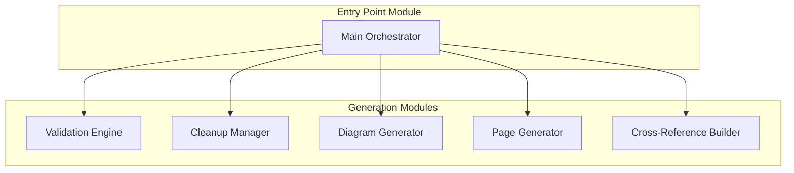

```mermaid
graph TB
    subgraph EPM["Entry Point Module"]
        Main[Main Orchestrator]
    end
    
    subgraph Modules["Generation Modules"]
        Valid[Validation Engine]
        Clean[Cleanup Manager]
        Diagram[Diagram Generator]
        Page[Page Generator]
        XRef[Cross-Reference Builder]
    end
    
    Main --> Valid
    Main --> Clean
    Main --> Diagram
    Main --> Page
    Main --> XRef
```