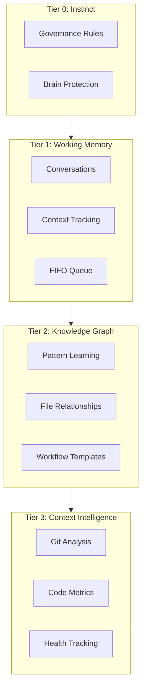

```mermaid
graph TB
    subgraph Tier0["Tier 0: Instinct"]
        T0_Rules[Governance Rules]
        T0_Protection[Brain Protection]
    end
    
    subgraph Tier1["Tier 1: Working Memory"]
        T1_Conv[Conversations]
        T1_Context[Context Tracking]
        T1_FIFO[FIFO Queue]
    end
    
    subgraph Tier2["Tier 2: Knowledge Graph"]
        T2_Patterns[Pattern Learning]
        T2_Relations[File Relationships]
        T2_Workflows[Workflow Templates]
    end
    
    subgraph Tier3["Tier 3: Context Intelligence"]
        T3_Git[Git Analysis]
        T3_Metrics[Code Metrics]
        T3_Health[Health Tracking]
    end
    
    Tier0 --> Tier1
    Tier1 --> Tier2
    Tier2 --> Tier3
```