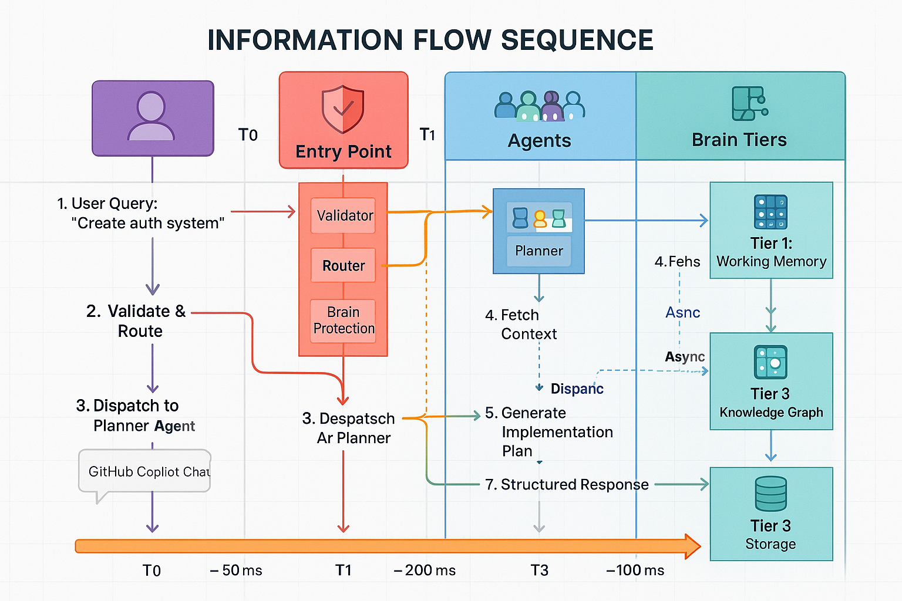

# 🔗 Integration Diagrams

Visual representations of CORTEX's data flows and system integrations.

---

## Information Flow Pipeline

End-to-end data flow through CORTEX components from user input to response generation.

<figure>
  
  <figcaption><strong>Input Processing:</strong> GitHub Copilot Chat → Intent Router → Template Matching → Agent Selection 
  <strong>Execution Flow:</strong> Agent Coordinator → Memory Retrieval → Operation Execution → Validation 
  <strong>Response Generation:</strong> Result Compilation → Template Formatting → User Response</figcaption>
</figure>

**Pipeline Stages:**
- 🎯 **Input**: Natural language from GitHub Copilot Chat
- 🧭 **Routing**: Intent detection and template matching
- 🤖 **Agent Selection**: Corpus Callosum chooses specialist agent
- 🧠 **Memory**: Context retrieval from three-tier system
- ⚡ **Execution**: Agent performs operation
- ✅ **Validation**: Brain protection and health checks
- 📤 **Response**: Formatted output to user

**Related Documentation:**
- [FEATURES.md](FEATURES.md) - Feature descriptions
- [HELP-SYSTEM.md](HELP-SYSTEM.md) - User interaction guide

---

## Conversation Tracking System

Dual-channel capture system feeding Tier 1 working memory for contextual intelligence.

<figure>
  
  <figcaption><strong>Ambient Capture:</strong> Background daemon monitoring GitHub Copilot Chat conversations 
  <strong>Manual Import:</strong> User-initiated conversation file import with validation 
  <strong>Storage:</strong> SQLite database with entity extraction, relevance scoring, and metadata</figcaption>
</figure>

**Capture Channels:**
- 📡 **Ambient Daemon**: Automatic background capture during development
- 📁 **Manual Import**: `capture conversation #file:path.md` command
- 🔍 **Entity Extraction**: Identifies classes, functions, files, intent
- 📊 **Relevance Scoring**: Keywords, file overlap, recency weighting
- 🗄️ **Storage**: Tier 1 SQLite database with full-text search

**Related Documentation:**
- [HELP-SYSTEM.md](HELP-SYSTEM.md) - Conversation tracking commands
- [CAPABILITIES-MATRIX.md](CAPABILITIES-MATRIX.md) - Memory capabilities

---

## Plugin Architecture

Extensible plugin system with discovery, registration, and lifecycle management.

<figure>
  
  <figcaption><strong>Discovery:</strong> Automatic plugin scanning from src/plugins/ directory 
  <strong>Registration:</strong> Plugin Registry with command mapping and health validation 
  <strong>Lifecycle:</strong> Initialize → Execute → Cleanup with error handling</figcaption>
</figure>

**Plugin Components:**
- 🔌 **Plugin Base Class**: Abstract interface for all plugins
- 📂 **Discovery**: Automatic scanning of plugin directory
- 📋 **Registry**: Central command and capability registration
- 🏥 **Health Check**: Validation of plugin integrity
- 🔄 **Lifecycle**: Init → Execute → Cleanup phases
- ⚠️ **Error Handling**: Graceful degradation on plugin failure

**Built-in Plugins:**
- 🔄 **Platform Switch**: Cross-platform environment configuration
- 🗑️ **Cleanup Orchestrator**: Intelligent file cleanup with safety rules
- 📊 **Git Monitor**: Repository change tracking and validation
- 📝 **ADO Planner**: Azure DevOps work item planning

**Related Documentation:**
- [FEATURES.md](FEATURES.md) - Plugin capabilities
- [HELP-SYSTEM.md](HELP-SYSTEM.md) - Plugin commands

---

## Navigation

- **[Home](index.md)** - Return to documentation home
- **[Architecture Diagrams](architecture-diagrams.md)** - Core system architecture
- **[Operational Diagrams](operational-diagrams.md)** - Workflows and processes
- **[Planning Diagrams](planning-diagrams.md)** - Strategic and planning systems

---

**Image Source:** Generated from DALL-E 3 prompts created by Enterprise Documentation Orchestrator  
**Diagram Metadata:** See [IMAGE-CATALOG.yaml](images/diagrams/IMAGE-CATALOG.yaml)  
**Copyright:** © 2024-2025 Asif Hussain. All rights reserved.
