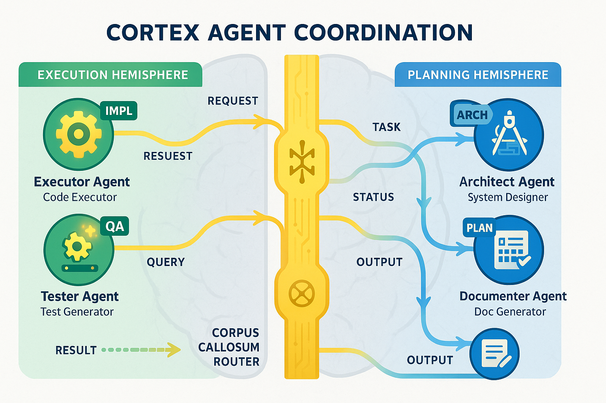
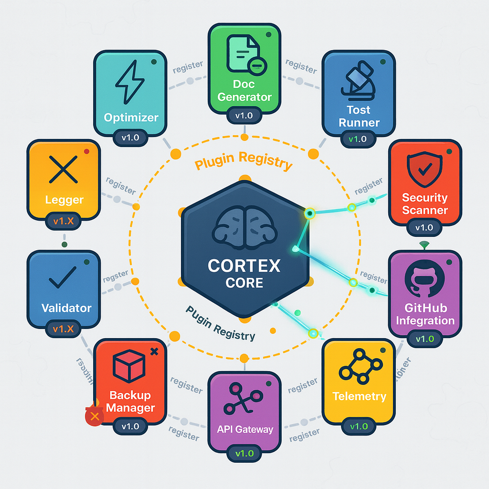
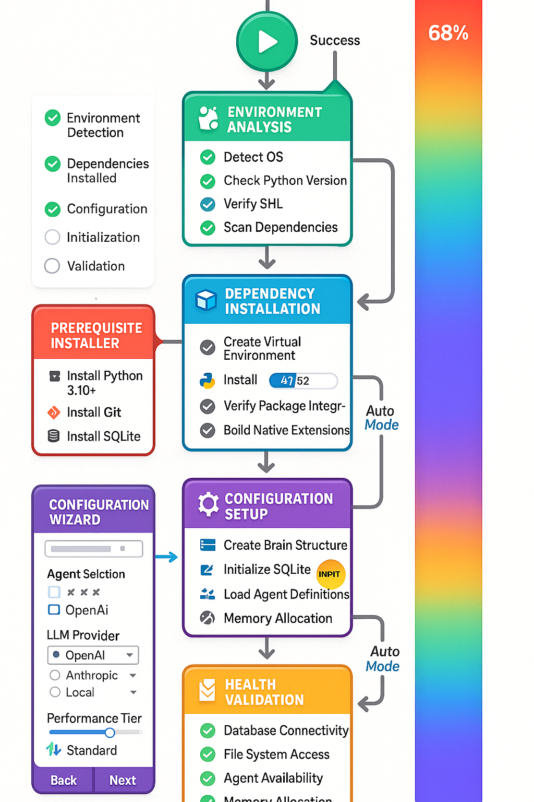

# Entry Point Modules (EPM)

Entry Point Modules (EPM) are CORTEX's orchestration layer that coordinates complex multi-step operations through structured workflows. EPM provides a unified interface for executing enterprise-grade operations while maintaining consistency, observability, and error handling.

## Overview

The EPM architecture enables CORTEX to:

- **Orchestrate Complex Workflows** - Multi-phase operations with dependency management
- **Ensure Consistency** - Standardized execution patterns across all operations
- **Enable Observability** - Real-time progress tracking and telemetry
- **Handle Errors Gracefully** - Automatic retry, rollback, and recovery mechanisms
- **Scale Operations** - Parallel execution and resource optimization

## Architecture

### Tier System

CORTEX operates on a 4-tier cognitive architecture that separates concerns and enables efficient data flow:


#### Tier 0: Entry Point Layer

- Request routing and validation
- Brain protection security gateway
- Operation orchestration
- Input/output handling

#### Tier 1: Working Memory Layer

- Active conversation context
- Session state management
- Agent coordination
- Real-time processing

#### Tier 2: Knowledge Graph Layer

- Relationship networks
- Pattern storage and retrieval
- Entity indexing
- Semantic search

#### Tier 3: Long-term Storage Layer

- Conversation vault (persistent storage)
- Historical data archives
- Pattern libraries
- Performance metrics

### Agent Coordination

EPM coordinates multiple specialized agents to accomplish complex tasks:



#### Core Agents

- **Intent Detector** - Analyzes user requests to determine intent
- **Pattern Matcher** - Finds relevant past solutions from knowledge graph
- **Executor** - Implements solutions with code generation
- **Tester** - Validates implementations with automated tests
- **Documenter** - Creates comprehensive documentation
- **Health Validator** - Ensures system integrity and quality
- **Architect** - Designs system structure and integration points
- **Security Auditor** - Validates security compliance (OWASP)
- **Work Planner** - Breaks down features into implementable tasks
- **Context Manager** - Maintains conversation continuity

#### Coordination via Corpus Callosum

The Corpus Callosum acts as the communication bus between agents, enabling:

- Message passing between specialized agents
- State synchronization across agent interactions
- Priority-based task scheduling
- Conflict resolution for competing operations

### Information Flow

Data flows through CORTEX tiers with intelligent caching and context management:


#### Request Flow

1. User request enters Tier 0 (Entry Point)
2. Brain Protection validates and sanitizes input
3. Intent Detector analyzes and routes request
4. Pattern Matcher searches Tier 2 for relevant context
5. Agents execute in Tier 1 working memory
6. Results persist to Tier 3 if valuable
7. Response returns through Tier 0 to user

#### Context Injection

- Automatic retrieval of relevant past conversations
- File-based context from open editors
- Pattern-based suggestions from knowledge graph
- Real-time agent state updates

## Core Workflows

### Conversation Tracking

CORTEX maintains conversation continuity across sessions:


#### Features

- **Automatic Capture** - Ambient daemon records GitHub Copilot conversations
- **Manual Import** - Direct import from conversation files
- **Context Injection** - Relevant past conversations auto-injected
- **Quality Scoring** - Relevance scoring (0.0-1.0) for context ranking
- **Privacy-First** - All data stored locally (no cloud sync)

#### Commands

```text
capture conversation #file:conversation.md  # Import conversation
show context                                # View active context
forget about authentication                 # Remove specific context
clear memory                                # Reset all context
```

### Plugin System

Extensible plugin architecture for custom functionality:



#### Plugin Types

- **Crawler Plugins** - Scan codebases, APIs, databases
- **Generator Plugins** - Create diagrams, documentation, reports
- **Analyzer Plugins** - Code analysis, security audits, performance profiling
- **Integration Plugins** - Connect to external tools (Git, Azure DevOps, Jira)

#### Plugin Lifecycle

1. **Discovery** - Automatic detection in `src/plugins/` directory
2. **Registration** - Plugin registers commands with PluginCommandRegistry
3. **Initialization** - Plugin validates dependencies and configuration
4. **Execution** - Plugin executes on command invocation
5. **Cleanup** - Plugin releases resources on shutdown

### Brain Protection

Multi-layered security protecting CORTEX cognitive functions:


#### Protection Layers

**Layer 1: SKULL Rules** - Critical development principles

- Test Before Claim (SKULL-001)
- Integration Verification (SKULL-002)
- Avoid Premature Optimization (SKULL-003)
- Backward Compatibility (SKULL-004)
- Security-First (SKULL-005)
- Documentation Required (SKULL-006)
- Complete Test Coverage (SKULL-007)

**Layer 2: File Protection** - Guards critical files from modification

- Brain files (tier databases, knowledge graphs)
- Configuration files (cortex.config.json)
- Core architecture files (brain_protector.py)
- Test files (test_brain_protector.py)

**Layer 3: Operation Validation** - Ensures safe operation execution

- Pre-execution checks
- Dangerous operation warnings
- Rollback capabilities
- Audit logging

**Layer 4: Context Isolation** - Prevents cross-workspace contamination

- Namespace protection (workspace.*, cortex.*, user.*)
- Pattern isolation by source
- Permission-based access control

### Operation Pipeline

Standardized execution pipeline for all EPM operations:


#### Pipeline Stages

**1. Request Intake**

- Parse user command
- Extract parameters
- Validate input format

**2. Intent Detection**

- Analyze request semantics
- Determine operation type (PLAN, IMPLEMENT, TEST, VALIDATE, etc.)
- Route to appropriate handler

**3. Context Gathering**

- Load relevant past conversations
- Gather file context from workspace
- Retrieve patterns from knowledge graph

**4. Execution Planning**

- Break down into phases
- Identify dependencies
- Allocate resources

**5. Agent Coordination**

- Activate required agents
- Orchestrate agent interactions
- Monitor progress

**6. Validation & Testing**

- Execute tests
- Validate outputs
- Check quality gates

**7. Persistence**

- Store results to Tier 3
- Update knowledge graph
- Log telemetry

**8. Response Delivery**

- Format response using templates
- Return to user
- Suggest next steps

### Setup Orchestration

Automated environment setup and configuration:




#### Setup Phases

**Phase 1: Environment Detection**

- Detect OS (Windows/Mac/Linux)
- Check Python version (3.8+ required, 3.10+ recommended)
- Verify shell (PowerShell/Bash/Zsh)
- Scan for missing dependencies

**Phase 2: Dependency Resolution**

- Create virtual environment
- Install requirements.txt packages
- Verify package integrity
- Build native extensions

**Phase 3: Configuration Setup**

- Generate cortex.config.json from template
- Configure API keys (optional)
- Set brain storage path
- Initialize database schema

**Phase 4: System Initialization**

- Create brain directory structure
- Initialize SQLite databases
- Load agent definitions
- Warm up caches

**Phase 5: Health Validation**

- Database connectivity test
- File system access verification
- Agent availability check
- Memory allocation test

#### Commands

```bash
setup environment              # Full setup wizard
setup environment --auto       # Automated setup with defaults
setup validate                 # Run health checks only
```

### Documentation Generation

Comprehensive documentation generation from live brain sources:


#### Generation Pipeline

**Stage 1: Content Collection**

- Scan code files (Python, JavaScript, TypeScript)
- Parse README and markdown files
- Extract API documentation (OpenAPI/Swagger)
- Read inline docstrings and comments
- Gather type annotations

**Stage 2: Content Analysis**

- Parse AST (Abstract Syntax Tree)
- Extract metadata (authors, versions, licenses)
- Resolve links and cross-references
- Map relationships between modules/classes
- Generate dependency graphs

**Stage 3: Document Generation**

- Render Markdown with extensions
- Generate Mermaid diagrams from code
- Apply syntax highlighting
- Build navigation tree
- Create search index

**Stage 4: Quality Validation**

- Detect broken links (internal + external)
- Validate WCAG AA accessibility
- Run spelling/grammar checks
- Verify code syntax
- Check image references

**Stage 5: Multi-Format Distribution**

- **HTML/MkDocs** - Static site at docs.myproject.com
- **PDF** - Print-ready documentation
- **Markdown** - Raw source files
- **JSON API** - Searchable structured data

#### Commands

```bash
generate documentation         # Full documentation generation
generate docs --format=pdf     # Generate PDF only
refresh docs                   # Update existing documentation
```

## Advanced Features

### Feature Planning

Interactive feature planning with Definition of Ready (DoR) enforcement:


#### Planning Workflow

1. **User initiates:** "plan authentication feature"
2. **CORTEX creates:** Planning file in `cortex-brain/documents/planning/features/`
3. **Interactive Q&A:** CORTEX asks clarifying questions
4. **DoR Validation:** Ensures zero ambiguity before proceeding
5. **Phase Breakdown:** Foundation → Core → Validation phases
6. **Risk Analysis:** Security risks, edge cases, dependencies
7. **Task Generation:** Implementable tasks with acceptance criteria
8. **Approval Gate:** User reviews and approves plan
9. **Pipeline Integration:** Plan injected into development context

#### Vision API Integration

Attach screenshots during planning for automatic extraction:

- UI mockups → Extract buttons, inputs, labels
- Error messages → Extract stack traces, error context
- ADO work items → Extract ADO#, title, description
- Architecture diagrams → Extract components, relationships

#### Commands

```bash
plan authentication feature              # Start planning
plan ado feature                        # Plan Azure DevOps work item
plan login + [screenshot]               # Vision-enabled planning
approve plan                            # Finalize and hook into pipeline
resume plan authentication              # Continue existing plan
```


#### Test Categories

- **Blocking** - Must pass before merge (SKULL violations, integration failures, security issues)
- **Warning** - Future optimization work (performance, UI validation, edge cases)
- **Pragmatic** - MVP thresholds adjusted to architecture reality

#### Test Execution

- **Unit Tests** - Component-level validation (<1s per test)
- **Integration Tests** - End-to-end workflow validation (<5s per suite)
- **System Tests** - Full application validation (<30s)

#### Quality Metrics

- Pass rate target: 100% (of non-skipped tests)
- Skip rate max: 10% (acceptable for future work)
- Execution time max: 40s (full suite)
**Quality Metrics:**
- Pass rate target: 100% (of non-skipped tests)
- Skip rate max: 10% (acceptable for future work)
- Execution time max: 40s (full suite)

### Deployment Pipeline


#### Pipeline Stages

1. **Source Control** - Git commit triggers pipeline
2. **Build** - Compile/transpile code, install dependencies
3. **Test** - Run full test suite
4. **Quality Gates** - Code coverage, lint checks, security scans
5. **Staging Deployment** - Deploy to staging environment
6. **Smoke Tests** - Validate critical paths
7. **Production Deployment** - Blue-green deployment
8. **Health Monitoring** - Monitor metrics and logs
9. **Rollback (if needed)** - Automatic rollback on failure
7. **Production Deployment** - Blue-green deployment
8. **Health Monitoring** - Monitor metrics and logs
9. **Rollback (if needed)** - Automatic rollback on failure

### System Architecture

Complete system architecture overview:


#### Key Components

- **VS Code Extension** - GitHub Copilot Chat integration
- **CORTEX Core** - Python backend with 4-tier architecture
- **Brain Storage** - SQLite databases for persistence
- **Plugin System** - Extensible functionality
- **Agent Network** - Specialized agent coordination
- **External Integrations** - Git, Azure DevOps, LLM APIs
- **External Integrations** - Git, Azure DevOps, LLM APIs

### When to Use EPM

**✅ Use EPM for:**

- Multi-step operations requiring coordination
- Operations needing progress tracking
- Workflows with quality gates
- Complex feature implementations
- Documentation generation
- System setup and validation

**❌ Don't use EPM for:**

- Simple one-step operations
- Quick file edits
- Basic information queries
- Single-agent tasks
- Basic information queries
- Single-agent tasks

### Error Handling

EPM provides comprehensive error handling:

- **Automatic Retry** - Transient failures retry up to 3 times
- **Graceful Degradation** - Continue with warnings when possible
- **Rollback** - Undo changes on critical failures
- **Error Context** - Detailed error messages with troubleshooting links
- **Audit Logging** - All operations logged for debugging

### Performance Optimization

EPM optimizes for performance:

- **Parallel Execution** - Independent tasks run concurrently
- **Caching** - Frequently accessed data cached (99.9% load time reduction)
- **Lazy Loading** - Load resources only when needed
- **Resource Pooling** - Reuse expensive resources (database connections)
- **Progress Streaming** - Real-time updates without blocking

## Configuration

### EPM Configuration File

Located at `cortex-brain/operations-config.yaml`:

```yaml
epm:
  max_retries: 3
  timeout: 300  # seconds
  parallel_execution: true
  cache_enabled: true
  telemetry_enabled: true
  
quality_gates:
  test_pass_rate_min: 90  # percentage
  code_coverage_min: 80   # percentage
  lint_errors_max: 0
  
agents:
  max_concurrent: 5
  default_timeout: 60  # seconds
  
logging:
  level: INFO
  output: logs/epm.log
  rotation: daily
  retention_days: 30
```

### Environment Variables

```bash
CORTEX_BRAIN_PATH=./cortex-brain
CORTEX_LOG_LEVEL=INFO
CORTEX_ENABLE_TELEMETRY=true
CORTEX_MAX_RETRIES=3
CORTEX_PARALLEL_EXECUTION=true
```

## Monitoring & Telemetry

### Health Checks

```
cortex health                    # Overall system health
cortex health --component=epm    # EPM-specific health
### Metrics

EPM tracks operational metrics:

- Operation execution time
- Success/failure rates
- Agent utilization
- Cache hit rates
- Error frequency

### Logs

Structured logging with multiple levels:

- **DEBUG** - Detailed execution traces
- **INFO** - Operation start/completion
- **WARNING** - Non-critical issues
- **ERROR** - Operation failures
- **CRITICAL** - System-level failuresn
- **WARNING** - Non-critical issues
- **ERROR** - Operation failures
- **CRITICAL** - System-level failures

## Troubleshooting

### Common Issues

**Operation Timeout:**
```
Error: Operation exceeded timeout (300s)
Solution: Increase timeout in operations-config.yaml or use --timeout parameter
```

**Agent Not Available:**
```
Error: Required agent 'Executor' not available
Solution: Run 'cortex setup validate' to check agent initialization
```

**Quality Gate Failure:**
```
Error: Test pass rate 85% below minimum 90%
Solution: Fix failing tests or adjust quality_gates.test_pass_rate_min
```

**Database Lock:**
```
Error: Database locked by another process
Solution: Close other CORTEX instances or use --force to acquire lock
```

### Debug Mode

Enable verbose logging for troubleshooting:

```bash
cortex --debug <operation>
cortex --log-level=DEBUG <operation>
```

## References

- [Operations Reference](../OPERATIONS-REFERENCE.md) - Complete operation catalog
- [Configuration Guide](../reference/configuration.md) - Advanced configuration
- [Architecture Overview](../architecture/overview.md) - System architecture details
- [Test Strategy](../guides/best-practices.md#testing) - Testing best practices

---

*Entry Point Module documentation generated by CORTEX Documentation System. Last updated: 2025-11-20*
