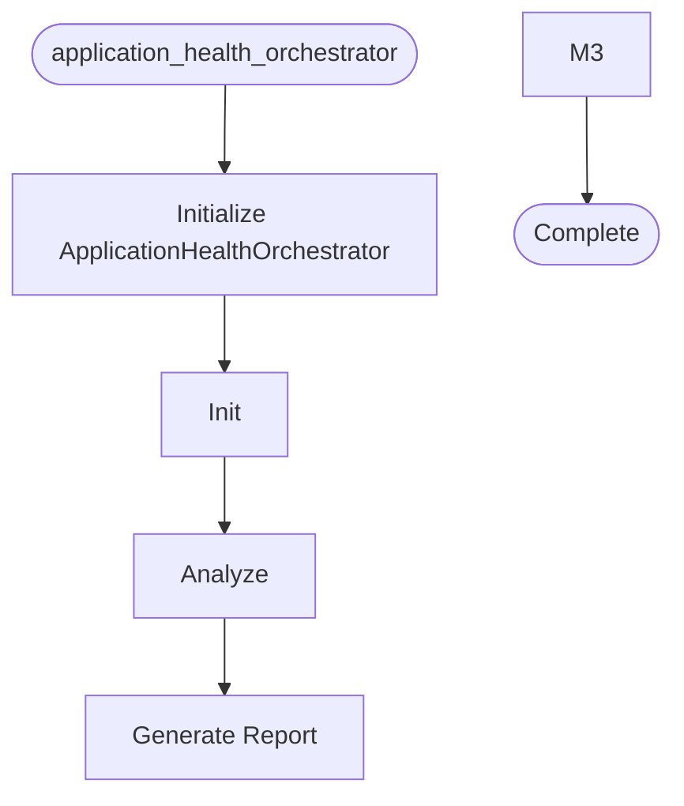

# Application Health Orchestrator

**Author:** Asif Hussain | **Copyright:** © 2024-2025 Asif Hussain. All rights reserved.

---

## Overview

Application Health Orchestrator

Coordinates application health analysis by integrating:
- CrawlerOrchestrator (file discovery)
- Language analyzers (code analysis)
- Report generation (formatted output)
- Caching (performance optimization)

## Workflow

## Class: ApplicationHealthOrchestrator

Orchestrates application health analysis

Coordinates scanning, analysis, and reporting for application health assessment.
Integrates with existing CORTEX crawler infrastructure.

### Methods

#### `__init__(self)`

Initialize orchestrator with language analyzers

#### `analyze(self, project_path, scan_level)`

Analyze application health

Args:
    project_path: Path to project root directory
    scan_level: Scan depth ('overview', 'standard', 'deep')

Returns:
    Dictionary with analysis results:
        - total_files: Total files analyzed
        - languages: Language breakdown with metrics
        - scan_duration: Time taken in seconds
        - scan_level: Level used
        - timestamp: Analysis timestamp

#### `generate_report(self, analysis_result)`

Generate formatted text report from analysis results

Args:
    analysis_result: Results from analyze() method

Returns:
    Formatted markdown report string

#### `_get_language_name(self, extension)`

Map file extension to language name

---

**Source:** `src/orchestrators/application_health_orchestrator.py`
