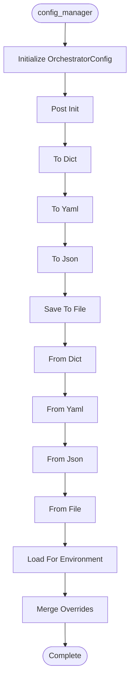

# Config Manager

**Author:** Asif Hussain | **Copyright:** © 2024-2025 Asif Hussain. All rights reserved.

---

## Overview

Extended Orchestrator Configuration

Adds Phase 5 configuration management features to OrchestratorConfig.
Supports environment-specific configs, file-based loading, feature flags.

Version: 3.0.0
Author: Asif Hussain

## Workflow

## Class: OrchestratorConfig

Extended orchestrator configuration with environment support.

Supports loading from YAML/JSON files, environment-specific overrides,
and centralized feature flag management.

### Methods

#### `to_dict(self)`

Serialize to dictionary.

#### `to_yaml(self)`

Serialize to YAML string.

#### `to_json(self)`

Serialize to JSON string.

#### `save_to_file(self, file_path)`

Save configuration to file.

Args:
    file_path: Path to save config (YAML or JSON based on extension)

#### `from_dict(cls, data)`

Deserialize from dictionary.

Args:
    data: Configuration dictionary
    
Returns:
    OrchestratorConfig instance

#### `from_yaml(cls, yaml_str)`

Deserialize from YAML string.

Args:
    yaml_str: YAML string
    
Returns:
    OrchestratorConfig instance

#### `from_json(cls, json_str)`

Deserialize from JSON string.

Args:
    json_str: JSON string
    
Returns:
    OrchestratorConfig instance

#### `from_file(cls, file_path)`

Load configuration from file.

Args:
    file_path: Path to config file (YAML or JSON)
    
Returns:
    OrchestratorConfig instance

#### `load_for_environment(cls, cortex_root, environment)`

Load environment-specific configuration.

Looks for config files in this order:
1. cortex-brain/config/orchestrator-config-{environment}.yaml
2. cortex-brain/config/orchestrator-config.yaml
3. Default configuration

Args:
    cortex_root: CORTEX root path
    environment: Environment name (development, staging, production)
    
Returns:
    OrchestratorConfig instance

#### `merge_overrides(self, overrides)`

Merge configuration overrides.

Args:
    overrides: Dictionary of configuration overrides

## Functions

### `create_development_config(cortex_root)`

Create development configuration template.

### `create_production_config(cortex_root)`

Create production configuration template.

### `create_ci_cd_config(cortex_root)`

Create CI/CD configuration template.

---

**Source:** `src/orchestrators/config_manager.py`
