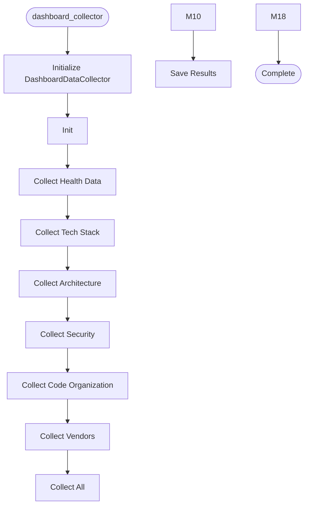

# Dashboard Collector

**Author:** Asif Hussain | **Copyright:** © 2024-2025 Asif Hussain. All rights reserved.

---

## Overview

Dashboard Data Collection Orchestrator

Purpose: Generate complete dashboard data for any repository by orchestrating
         all data collectors (tech stack, architecture, security, etc.)

Usage:
    python -m src.orchestrators.dashboard_collector --path "C:\PROJECTS\MyRepo"
    python -m src.orchestrators.dashboard_collector --path "C:\PROJECTS\MyRepo" --output custom-name

Features:
- Auto-detects repository languages and frameworks
- Runs all collectors in parallel for speed
- Generates complete dashboard data set
- Saves to cortex-brain/dashboards/{repo-name}/
- Supports custom output directory names

Author: Asif Hussain
Copyright: © 2024-2025 Asif Hussain. All rights reserved.
License: Source-Available (Use Allowed, No Contributions)

## Workflow

## Class: DashboardDataCollector

Orchestrates collection of all dashboard data for a repository.

### Methods

#### `__init__(self, repo_path, output_name, skip_consolidation)`

Initialize collector.

Args:
    repo_path: Path to repository to analyze
    output_name: Optional custom name for output directory
    skip_consolidation: Skip consolidation/reconciliation steps (faster, raw data only)

#### `collect_health_data(self)`

Collect overall health metrics with deep analysis ONLY.

#### `collect_tech_stack(self)`

Collect technology stack information with deep analysis ONLY.

#### `collect_architecture(self)`

Collect architecture information with deep analysis ONLY.

#### `collect_security(self)`

Collect security analysis with deep analysis ONLY.

#### `collect_code_organization(self)`

Collect code organization metrics with deep analysis ONLY.

#### `collect_vendors(self)`

Collect vendor/dependency information with deep analysis ONLY.

#### `collect_all(self)`

Collect all dashboard data using parallel execution.

Returns:
    Dictionary with all collected data

#### `_validate_collector_data(self, results)`

Independent validation layer - verifies collector data against ground truth.

Fixes common issues:
- False positive languages (files in Tools/, External/)
- Version hallucinations (.NET 8.0 when actually Framework 4.7.2)
- Third-party noise (type definition files, library internals)
- Incorrect primary language ordering
- Narrative mismatches (mentioning non-existent languages)

Args:
    results: Raw collector data
    
Returns:
    Validated and corrected data

#### `_consolidate_data(self, results)`

Consolidate all collected data to ensure narrative consistency.
All metrics must tell the same story - no contradictions.

Args:
    results: Raw collected data
    
Returns:
    Consolidated data with narrative analysis

#### `_reconcile_data(self, results)`

Reconcile dashboard data for accuracy and consistency.
Uses industry standards (CVSS, OWASP) to validate metrics.

Args:
    results: Consolidated dashboard data
    
Returns:
    Reconciliation result dictionary or None if failed

#### `save_results(self, results)`

Save collected data to dashboard directory.

Args:
    results: Collected data dictionary

Returns:
    True if successful, False otherwise

#### `_fix_executive_summary_narrative(self, results)`

Post-save fix: Ensure executive summary narrative uses primary language from tech-stack.
Fixes issue where consolidation generates narrative before validator runs.

#### `_count_files(self)`

Count total files in repository.

#### `_count_lines_of_code(self)`

Count total lines of code.

#### `_detect_languages(self)`

Detect programming languages in repository.

#### `_detect_frameworks(self)`

Detect frameworks in repository.

#### `_get_cortex_version(self)`

Get CORTEX version.

#### `_consolidate_data(self, results)`

Consolidate and validate collected data.

This critical step:
- Validates each collector's output
- Cross-validates metrics for consistency
- Detects anomalies and contradictions
- Triggers specialized deep scans if needed
- Calculates accurate holistic scores
- Generates prioritized recommendations

Args:
    results: Raw collected data from all collectors
    
Returns:
    Consolidated data with validation, scoring, and recommendations

## Functions

### `main()`

Main entry point.

---

**Source:** `src/orchestrators/dashboard_collector.py`
