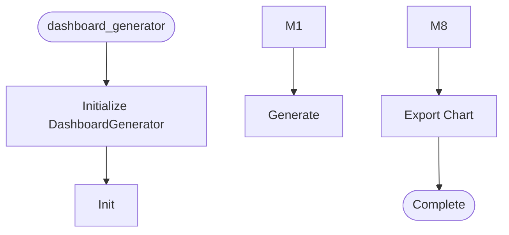

# Dashboard Generator

**Author:** Asif Hussain | **Copyright:** © 2024-2025 Asif Hussain. All rights reserved.

---

## Overview

Dashboard Generator Orchestrator

Purpose: Generate interactive D3.js-powered dashboards for CORTEX system health,
         architecture quality, test coverage, and development metrics.

Author: Asif Hussain
Copyright: © 2024-2025 Asif Hussain. All rights reserved.
License: Source-Available (Use Allowed, No Contributions)

## Workflow

## Class: DashboardGenerator

Generates interactive HTML dashboards with D3.js visualizations.

Features:
- Health trend charts with forecasts
- Integration heatmaps (7-layer scoring)
- Test coverage gauges
- Code quality radar charts
- Responsive layout with export functionality

### Methods

#### `__init__(self, cortex_root)`

Initialize dashboard generator.

Args:
    cortex_root: Path to CORTEX root directory (auto-detect if None)

#### `_detect_cortex_root(self)`

Auto-detect CORTEX root directory.

#### `generate(self, output_filename, days, include_charts)`

Generate complete dashboard with all charts.

Args:
    output_filename: Custom filename (default: dashboard-{timestamp}.html)
    days: Number of days of historical data to include
    include_charts: List of chart types to include (None = all)

Returns:
    Dict with keys: success, file_path, message, charts_generated

#### `_collect_all_data(self, days)`

Collect data from all Tier databases.

Args:
    days: Number of days of historical data

Returns:
    Dict with keys: health_snapshots, test_results, code_metrics, 
                   git_activity, performance_data

#### `_build_chart_configs(self, data, include_charts)`

Build D3.js chart configurations.

Args:
    data: Collected data from databases
    include_charts: List of chart types to include

Returns:
    Dict mapping chart_id to D3.js config

#### `_render_dashboard(self, data, chart_configs)`

Render HTML dashboard using Jinja2 template.

Args:
    data: Collected data
    chart_configs: Chart configurations

Returns:
    Complete HTML content

#### `_create_default_template(self, template_path)`

Create default Jinja2 template if it doesn't exist.

#### `_get_color_palette(self)`

Get dashboard color palette.

#### `_get_cortex_version(self)`

Get CORTEX version from VERSION file.

#### `export_chart(self, chart_id, format, output_filename)`

Export individual chart to PNG/SVG/PDF.

Args:
    chart_id: Chart identifier (health_trend, integration_heatmap, etc.)
    format: Export format ('png', 'svg', 'pdf')
    output_filename: Custom filename (default: {chart_id}-{timestamp}.{format})

Returns:
    Dict with keys: success, file_path, message

---

**Source:** `src/orchestrators/dashboard_generator.py`
