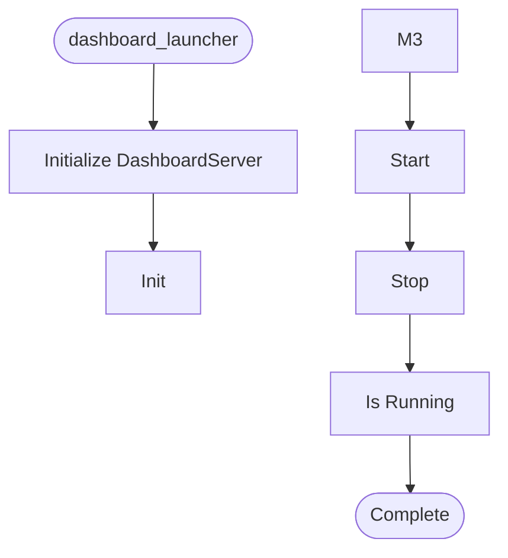

# Dashboard Launcher

**Author:** Asif Hussain | **Copyright:** © 2024-2025 Asif Hussain. All rights reserved.

---

## Overview

Dashboard Launcher Orchestrator

Purpose: Launch CORTEX dashboard with HTTP server and auto-open browser.
         Serves dashboard UI from cortex-brain/dashboards/ parent directory.

📖 COMPLETE DOCUMENTATION: cortex-brain/documents/implementation-guides/dashboard-operation-guide.md
   Read this guide for:
   - Launch commands and options
   - Data structure and file locations
   - Server configuration details
   - Troubleshooting common issues

Trigger: "load dashboard", "/CORTEX load dashboard", "launch dashboard", "open dashboard"

CRITICAL CONFIGURATION:
- Server MUST serve from cortex-brain/dashboards/ (parent directory)
- NOT from cortex-brain/dashboards/ui/ (breaks data file access)
- This allows both /ui/index.html and /data/mock/*.json to work

Features:
- Auto-detect cortex-brain/dashboards/ directory
- Launch HTTP server on available port (default: 8080, fallback: 8081-8089)
- Auto-open browser to dashboard with specified data source
- Background server process (non-blocking)
- Graceful shutdown on Ctrl+C
- CORS support for local development
- Comprehensive error handling

Usage:
    from src.orchestrators.dashboard_launcher import launch_dashboard
    
    # Launch with defaults
    result = launch_dashboard()
    
    # Launch with custom port
    result = launch_dashboard(port=9000)
    
    # Launch without auto-opening browser
    result = launch_dashboard(auto_open=False)
    
    # Launch with specific data source
    result = launch_dashboard(source="luum-fresh")

Data Sources:
    - "mock" - Demo data in cortex-brain/dashboards/data/mock/
    - "{repo-id}" - Repository data in cortex-brain/dashboards/data/repos/{repo-id}/

Author: Asif Hussain
Copyright: © 2024-2025 Asif Hussain. All rights reserved.
License: Source-Available (Use Allowed, No Contributions)

## Workflow

## Class: CORSHTTPRequestHandler

HTTP request handler with CORS support for local development.

**Inherits from:** http.server.SimpleHTTPRequestHandler

### Methods

#### `__init__(self)`

Initialize handler with specific directory.

#### `end_headers(self)`

Add CORS headers to all responses.

#### `do_OPTIONS(self)`

Handle OPTIONS requests for CORS preflight.

#### `log_message(self, format)`

Suppress default server logs (use Python logger instead).

## Class: DashboardServer

HTTP server wrapper for dashboard UI.

### Methods

#### `__init__(self, dashboard_dir, port)`

Initialize dashboard server.

Args:
    dashboard_dir: Path to dashboard UI directory
    port: Port to serve on (default: 8080)

#### `_kill_process_on_port(self, port)`

Kill any process using the specified port.

Args:
    port: Port number to free up

Returns:
    True if port was freed, False otherwise

#### `_is_port_available(self, port)`

Check if a port is available.

Args:
    port: Port number to check

Returns:
    True if port is available, False otherwise

#### `_resolve_data_source(self, path_or_source)`

Resolve a file path or source name to a valid data source key.

Args:
    path_or_source: Repository path or data source key

Returns:
    Valid data source key (e.g., 'mock', 'v5-webservices-prevalidationws')

#### `start(self, auto_open, source)`

Start HTTP server and optionally open browser.

Args:
    auto_open: Auto-open browser to dashboard
    source: Data source to load (mock, noor-canvas, etc.) or repository path

Returns:
    Result dict with success, port, url, message

#### `stop(self)`

Stop the HTTP server.

#### `is_running(self)`

Check if server is running.

## Functions

### `_detect_cortex_root()`

Auto-detect CORTEX root directory.

Returns:
    Path to CORTEX root or None if not found

### `launch_dashboard(port, auto_open, source, cortex_root)`

Launch CORTEX dashboard with HTTP server.

Args:
    port: Port to serve on (default: 8080, auto-fallback to 8081-8089)
    auto_open: Auto-open browser to dashboard (default: True)
    source: Data source to load (default: "mock")
    cortex_root: Path to CORTEX root (auto-detect if None)

Returns:
    Dict with keys:
        - success: bool
        - port: int (actual port used)
        - url: str (dashboard URL)
        - message: str (status message)
        - directory: str (dashboard directory path)
        - server: DashboardServer instance (if successful)

### `main()`

CLI entry point for testing.

---

**Source:** `src/orchestrators/dashboard_launcher.py`
