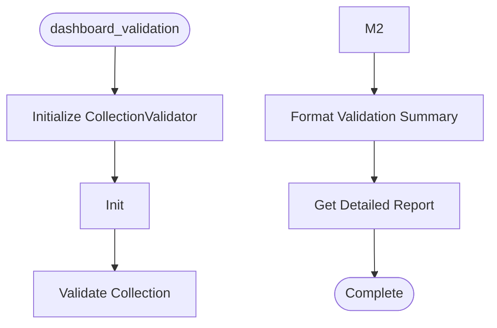

# Dashboard Validation

**Author:** Asif Hussain | **Copyright:** © 2024-2025 Asif Hussain. All rights reserved.

---

## Overview

Dashboard Data Collection Validator

Validates collected data files against configured benchmarks to ensure
comprehensive analysis was performed.

Author: Asif Hussain
Copyright: © 2024-2025 Asif Hussain. All rights reserved.
License: Source-Available (Use Allowed, No Contributions)

## Workflow

## Class: CollectionValidator

Validates data collection against file size benchmarks.

Ensures that "deep analysis" collectors actually produce comprehensive data
by checking file sizes against configured minimums and targets.

### Methods

#### `__init__(self)`

Initialize validator with config

#### `validate_collection(self, repo_path)`

Validate all collected data files against benchmarks.

Args:
    repo_path: Path to repository data directory

Returns:
    {
        "success": bool,
        "files_checked": int,
        "passed": int,
        "failed": int,
        "warnings": List[str],
        "details": {...}
    }

#### `_check_file_size(self, actual, min_size, target, variance)`

Check file size against benchmarks.

Args:
    actual: Actual file size in bytes
    min_size: Minimum acceptable size
    target: Target size
    variance: Acceptable variance as percentage (0.3 = 30%)

Returns:
    (status, message) tuple where status is 'passed', 'warning', or 'failed'

#### `format_validation_summary(self, validation)`

Format validation results as human-readable summary.

Args:
    validation: Validation results dictionary

Returns:
    Formatted summary string

#### `get_detailed_report(self, validation)`

Get detailed validation report with per-file breakdown.

Args:
    validation: Validation results dictionary

Returns:
    Detailed report string

---

**Source:** `src/orchestrators/dashboard_validation.py`
