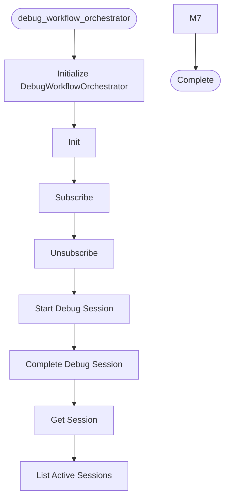

# Debug Workflow Orchestrator

**Author:** Asif Hussain | **Copyright:** © 2024-2025 Asif Hussain. All rights reserved.

---

## Overview

CORTEX Debug Workflow Orchestrator

Minimal debug workflow orchestrator focused on RCA (Root Cause Analysis) pattern capture.
Integrates with LearningObserver to automatically store bug resolutions in Tier 2.

Author: Asif Hussain
Copyright: © 2025 Asif Hussain. All rights reserved.

Design:
    - Observer pattern (subscribe/unsubscribe/notify)
    - Session-based debugging (start → investigate → complete)
    - Automatic RCA pattern emission on completion
    - <50ms overhead for event emission

Usage:
    from src.orchestrators.debug_workflow_orchestrator import DebugWorkflowOrchestrator
    from src.orchestrators.learning_observer import LearningObserver
    from src.tier2.knowledge_graph import KnowledgeGraph
    
    kg = KnowledgeGraph()
    observer = LearningObserver(kg)
    debug_orchestrator = DebugWorkflowOrchestrator()
    
    debug_orchestrator.subscribe(observer)
    
    # Start debug session
    session_id = debug_orchestrator.start_debug_session(
        symptom="Application crashes on login",
        target="authentication_module"
    )
    
    # Complete with RCA
    debug_orchestrator.complete_debug_session(
        session_id=session_id,
        root_cause="Null pointer exception in session validation",
        fix_applied="Added null check before session access",
        prevention="Add unit tests for null session scenarios",
        recurrence_risk="low",
        affected_features=["authentication", "sessions"]
    )
    
    # Observer automatically stores RCA pattern in Tier 2

## Workflow

## Class: DebugWorkflowOrchestrator

Orchestrator for debug workflows with RCA pattern capture.

Responsibilities:
    - Manage debug session lifecycle (start → investigate → complete)
    - Track active debug sessions
    - Emit debug_session_completion events to observers
    - Provide session metadata for RCA analysis

Events Emitted:
    - debug_session_completion: When debug session is completed with RCA

Event Payload:
    {
        "session_id": str,
        "symptom": str,
        "target": str,
        "root_cause": str,
        "fix_applied": str,
        "prevention": str,
        "recurrence_risk": "high|medium|low",
        "affected_features": List[str],
        "duration_seconds": float,
        "started_at": str (ISO format),
        "completed_at": str (ISO format)
    }

### Methods

#### `__init__(self)`

Initialize debug workflow orchestrator.

#### `subscribe(self, observer)`

Subscribe an observer to debug events.

Args:
    observer: Observer instance with on_debug_session_completion() method

#### `unsubscribe(self, observer)`

Unsubscribe an observer from debug events.

Args:
    observer: Observer instance to remove

#### `start_debug_session(self, symptom, target, metadata)`

Start a new debug session.

Args:
    symptom: Observable issue description
    target: Component/module being debugged
    metadata: Optional additional session metadata

Returns:
    Session ID for tracking

#### `complete_debug_session(self, session_id, root_cause, fix_applied, prevention, recurrence_risk, affected_features)`

Complete a debug session and emit RCA pattern event.

Args:
    session_id: Session identifier from start_debug_session()
    root_cause: Identified root cause
    fix_applied: Fix that was implemented
    prevention: Strategy to prevent recurrence
    recurrence_risk: 'high', 'medium', or 'low'
    affected_features: List of affected features/components

#### `get_session(self, session_id)`

Get session details by ID.

Args:
    session_id: Session identifier

Returns:
    Session dict or None if not found

#### `list_active_sessions(self)`

List all active (in-progress) debug sessions.

Returns:
    List of active session dicts

#### `_notify_observers(self, event)`

Notify all observers of debug_session_completion event.

Args:
    event: Event payload with RCA details

---

**Source:** `src/orchestrators/debug_workflow_orchestrator.py`
