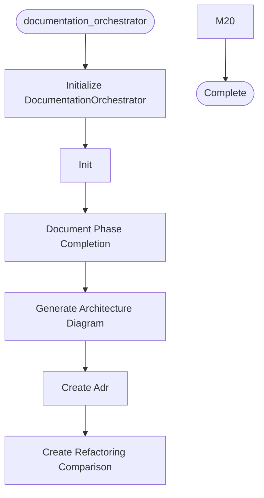

# Documentation Orchestrator

**Author:** Asif Hussain | **Copyright:** © 2024-2025 Asif Hussain. All rights reserved.

---

## Overview

Documentation Orchestrator for CORTEX Learning Library
Generates and maintains documentation for multi-phase refactoring projects.

## Workflow

## Class: DocumentationOrchestrator

Automates documentation generation for learning library.
Integrates with Planning Orchestrator for phase-based updates.

### Methods

#### `__init__(self, project_name, learning_lib_path)`

Initialize documentation orchestrator.

Args:
    project_name: Name of the project (e.g., 'badmonolith-refactoring')
    learning_lib_path: Path to learning library (default: cortex-brain/learning)

#### `document_phase_completion(self, phase_number, phase_name, tasks_completed, metrics, duration_hours, lessons_learned)`

Generate phase completion documentation.

Args:
    phase_number: Phase number (1-7)
    phase_name: Descriptive name
    tasks_completed: List of completed task IDs
    metrics: Dictionary of metrics (coverage, complexity, LOC, etc.)
    duration_hours: Actual duration
    lessons_learned: List of lessons learned
    
Returns:
    Path to generated document

#### `generate_architecture_diagram(self, diagram_type, title, elements, output_filename)`

Generate Mermaid architecture diagram.

Args:
    diagram_type: 'layers' | 'components' | 'dataflow' | 'state'
    title: Diagram title
    elements: List of diagram elements
    output_filename: Optional custom filename
    
Returns:
    Path to generated diagram file

#### `create_adr(self, title, context, decision, consequences, alternatives, status)`

Create Architecture Decision Record.

Args:
    title: ADR title
    context: Problem context
    decision: The decision made
    consequences: Impact of decision
    alternatives: Other options considered
    status: 'Accepted' | 'Proposed' | 'Deprecated'
    
Returns:
    Path to ADR document

#### `create_refactoring_comparison(self, task_id, title, before_code, after_code, before_metrics, after_metrics, anti_pattern, solution_pattern)`

Create before/after refactoring comparison.

Args:
    task_id: Task identifier
    title: Comparison title
    before_code: Code before refactoring
    after_code: Code after refactoring
    before_metrics: Metrics before
    after_metrics: Metrics after
    anti_pattern: Anti-pattern description
    solution_pattern: Solution pattern description
    
Returns:
    Path to comparison document

#### `_format_objectives(self, phase_number)`

Format phase objectives based on phase number.

#### `_format_tasks(self, tasks)`

Format task list with checkmarks.

#### `_format_metrics(self, metrics)`

Format metrics table.

#### `_format_tdd_workflow(self, phase_number)`

Format TDD workflow section.

#### `_format_lessons(self, lessons)`

Format lessons learned.

#### `_format_related_docs(self, phase_number)`

Format related documentation links.

#### `_get_next_phase(self, phase_number)`

Get next phase reference.

#### `_generate_mermaid(self, diagram_type, elements)`

Generate Mermaid diagram code.

#### `_generate_layers_diagram(self, elements)`

Generate Clean Architecture layers diagram.

#### `_generate_diagram_description(self, diagram_type, elements)`

Generate diagram description.

#### `_format_alternatives(self, alternatives)`

Format alternatives list.

#### `_get_related_adrs(self, current_num)`

Get related ADR links.

#### `_format_code_metrics(self, metrics)`

Format code metrics.

#### `_calculate_improvements(self, before, after)`

Calculate improvement percentages.

#### `_format_improvements(self, improvements)`

Format improvements list.

#### `_generate_takeaways(self, anti_pattern, solution, improvements)`

Generate key takeaways.

---

**Source:** `src/orchestrators/documentation_orchestrator.py`
