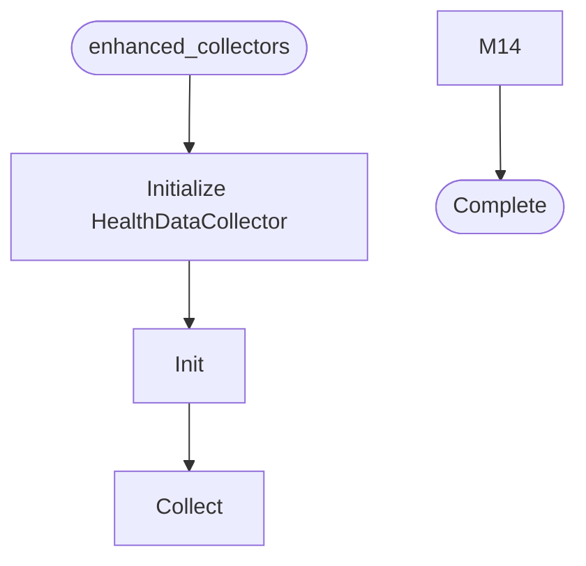

# Enhanced Collectors

**Author:** Asif Hussain | **Copyright:** © 2024-2025 Asif Hussain. All rights reserved.

---

## Overview

Enhanced Dashboard Data Collectors

Deep analysis modules for comprehensive repository insights.

Author: Asif Hussain
Copyright: © 2024-2025 Asif Hussain. All rights reserved.

## Workflow

## Class: HealthDataCollector

Enhanced health data collection with deep analysis

### Methods

#### `__init__(self, repo_path)`

#### `collect(self)`

Collect comprehensive health metrics

#### `_scan_code_files(self)`

Scan for code files

#### `_analyze_complexity(self, files)`

Analyze code complexity

#### `_python_complexity(self, file)`

Calculate Python function complexity

#### `_calculate_cyclomatic(self, node)`

Calculate cyclomatic complexity

#### `_detect_code_smells(self, files)`

Detect code smells

#### `_count_method_lines(self, lines)`

Count lines in a method

#### `_analyze_file_metrics(self, files)`

Analyze individual file metrics

#### `_calculate_maintainability(self, complexity)`

Calculate maintainability index

#### `_calculate_health_score(self, complexity, smells, maintainability)`

Calculate overall health score

#### `_determine_status(self, complexity, smells)`

Determine health status

#### `_identify_hotspots(self, file_metrics, complexity)`

Identify code hotspots

#### `_calculate_complexity_score(self, complexity)`

Calculate complexity score

#### `_calculate_doc_score(self, files)`

Calculate documentation score

## Class: TechStackCollector

Enhanced tech stack analysis

### Methods

#### `__init__(self, repo_path)`

#### `collect(self)`

Collect comprehensive tech stack info with schema-compliant structure

#### `_detect_all_technologies(self)`

Detect all technologies with complete schema-compliant fields

#### `_is_frontend_tech(self, name)`

Check if technology is frontend-related

#### `_is_backend_tech(self, name)`

Check if technology is backend-related

#### `_should_include(self, file)`

Check if file should be included

---

**Source:** `src/orchestrators/enhanced_collectors.py`
