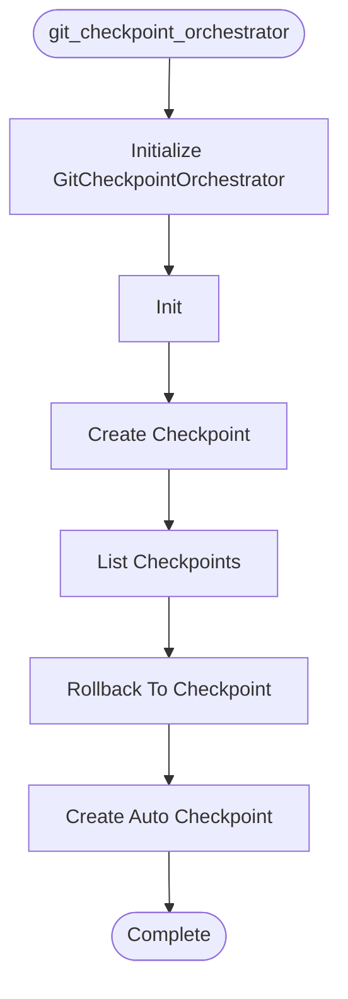

# Git Checkpoint Orchestrator

**Author:** Asif Hussain | **Copyright:** © 2024-2025 Asif Hussain. All rights reserved.

---

## Overview

Git Checkpoint Orchestrator

Manages git-based checkpoints for TDD workflow phases.
Creates lightweight commits at RED/GREEN/REFACTOR boundaries.

Author: Asif Hussain
Copyright: © 2024-2025 Asif Hussain. All rights reserved.
License: Source-Available (Use Allowed, No Contributions)

## Workflow

## Class: GitCheckpointOrchestrator

Git checkpoint orchestrator for TDD workflow.

Creates automatic git commits at phase boundaries to enable:
- Rollback to previous phase
- Progress tracking
- Audit trail of TDD workflow

### Methods

#### `__init__(self, project_root)`

Initialize git checkpoint orchestrator.

Args:
    project_root: Root directory of git repository

#### `create_checkpoint(self, session_id, checkpoint_type, message, metadata)`

Create a git checkpoint.

Args:
    session_id: TDD session identifier
    checkpoint_type: Type of checkpoint (e.g., "phase-RED", "phase-GREEN")
    message: Checkpoint message
    metadata: Optional metadata dict (supports: task_id, feature_name, work_item_id)
    
Returns:
    Dict with success, checkpoint_id, commit_sha

#### `list_checkpoints(self, session_id)`

List git checkpoints.

Args:
    session_id: Optional session filter
    
Returns:
    List of checkpoint dicts

#### `rollback_to_checkpoint(self, checkpoint_id)`

Rollback to a specific checkpoint.

Args:
    checkpoint_id: Checkpoint to rollback to
    
Returns:
    Dict with success status

#### `create_auto_checkpoint(self, operation, message, metadata)`

Create an automatic git checkpoint with simplified interface.

This is a convenience wrapper around create_checkpoint that auto-generates
session IDs and checkpoint types. Used by orchestrators for automatic
commit-on-phase-completion workflows.

Args:
    operation: Type of operation (e.g., "plan", "phase-1", "phase-2")
    message: Checkpoint message
    metadata: Optional metadata dict
    
Returns:
    Dict with success, checkpoint_id, commit_sha
    
Example:
    >>> orchestrator.create_auto_checkpoint(
    ...     operation="plan-phase-1",
    ...     message="Phase 1: Foundation complete"
    ... )

---

**Source:** `src/orchestrators/git_checkpoint_orchestrator.py`
