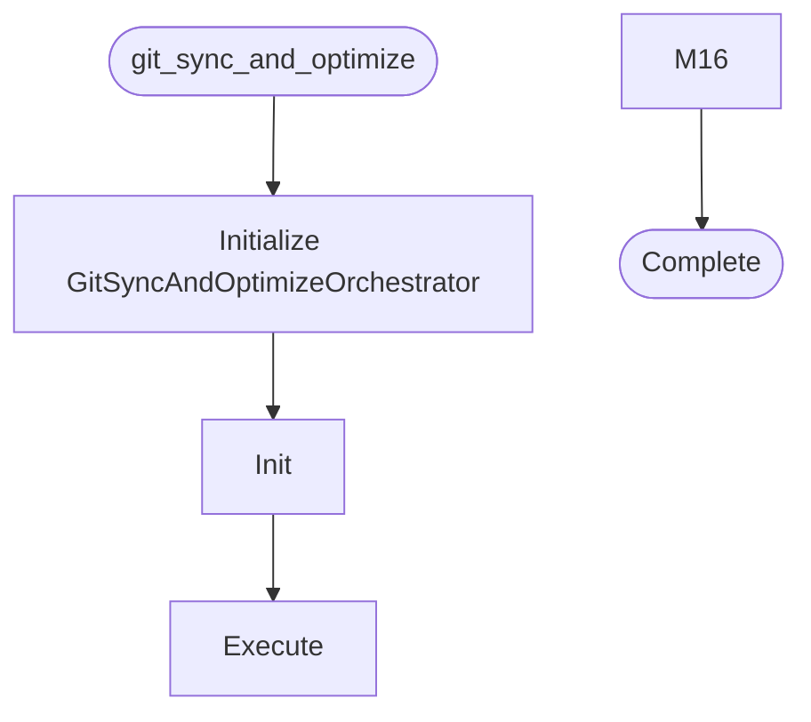

# Git Sync And Optimize

**Author:** Asif Hussain | **Copyright:** © 2024-2025 Asif Hussain. All rights reserved.

---

## Overview

Git Sync and Optimize Orchestrator

Comprehensive workflow for safely syncing with remote and optimizing CORTEX state.

Workflow:
1. Stash current work with descriptive message
2. Pull latest changes from origin
3. Intelligently merge stashed work (auto-resolve or prompt)
4. Run system alignment to validate integration
5. Run optimization to improve performance
6. Run cleanup to remove obsolete artifacts
7. Push merged changes to remote
8. Sync with origin to ensure consistency

Safety Features:
- Automatic stash backup with timestamps
- Conflict detection and resolution strategies
- Rollback capability on merge failures
- Validation checkpoints between phases
- Detailed logging and status reporting

Version: 3.2.1
Author: Asif Hussain
Copyright: © 2024-2025 Asif Hussain. All rights reserved.
License: Source-Available (Use Allowed, No Contributions)

## Workflow

## Class: GitSyncAndOptimizeOrchestrator

Orchestrates safe git sync with remote and system optimization.

### Methods

#### `__init__(self, repo_path)`

Initialize orchestrator.

Args:
    repo_path: Path to git repository (defaults to CORTEX root)

#### `execute(self, auto_resolve_conflicts)`

Execute the complete sync and optimize workflow.

Args:
    auto_resolve_conflicts: Automatically resolve simple conflicts
    
Returns:
    Dictionary with operation results

#### `_phase1_pre_status(self)`

Phase 1: Check pre-sync repository status.

#### `_phase2_stash_work(self)`

Phase 2: Stash current work with descriptive message.

#### `_phase3_pull_remote(self)`

Phase 3: Pull latest changes from remote.

#### `_phase4_merge_stash(self, auto_resolve)`

Phase 4: Intelligently merge stashed work.

#### `_auto_resolve_conflicts(self, conflicts)`

Attempt to auto-resolve conflicts using intelligent strategies.

Args:
    conflicts: List of conflicted file paths
    
Returns:
    True if all conflicts resolved

#### `_phase5_align(self)`

Phase 5: Run system alignment.

#### `_phase6_optimize(self)`

Phase 6: Run system optimization.

#### `_phase7_cleanup(self)`

Phase 7: Run system cleanup.

#### `_phase8_push(self)`

Phase 8: Push changes to remote.

#### `_phase9_sync(self)`

Phase 9: Final sync with remote.

#### `_phase10_post_status(self)`

Phase 10: Final status check.

#### `_print_success_summary(self)`

Print final success summary.

#### `_run_git_command(self, command)`

Run git command and return result.

Args:
    command: Git command as list
    
Returns:
    Dictionary with returncode, stdout, stderr

#### `_rollback_stash(self)`

Rollback by reapplying stash.

#### `_build_error_result(self, message, rollback)`

Build error result dictionary.

Args:
    message: Error message
    rollback: Whether to attempt rollback
    
Returns:
    Error result dictionary

## Functions

### `main()`

CLI entry point.

---

**Source:** `src/orchestrators/git_sync_and_optimize.py`
