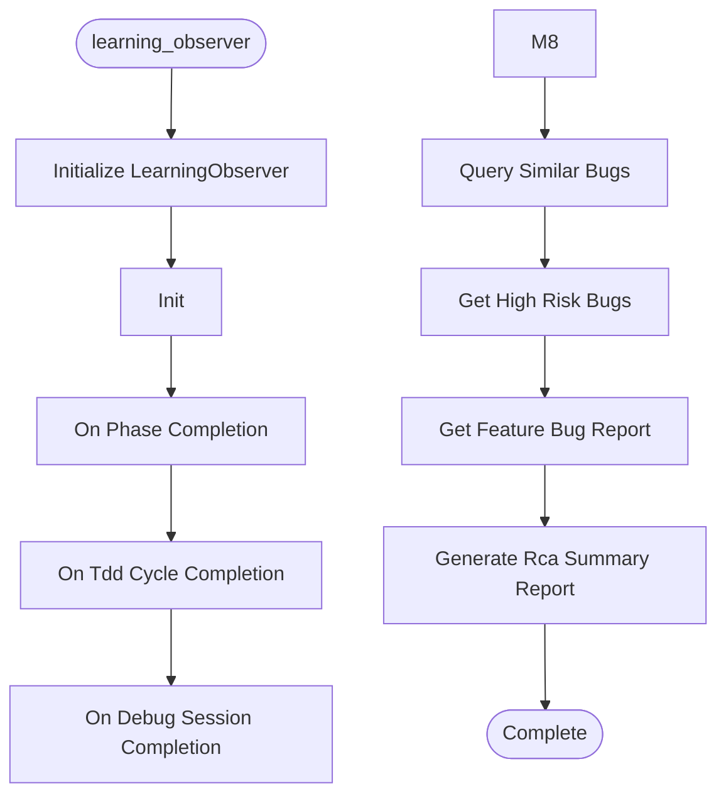

# Learning Observer

**Author:** Asif Hussain | **Copyright:** © 2024-2025 Asif Hussain. All rights reserved.

---

## Overview

CORTEX Learning Observer

Event-driven pattern capture system for automated Knowledge Graph updates.
Subscribes to orchestrator lifecycle events to extract and store patterns.

Author: Asif Hussain
Copyright: © 2025 Asif Hussain. All rights reserved.

Design:
    - Observer pattern (decoupled from orchestrators)
    - <50ms overhead per event
    - Automatic Tier 2 storage
    - No blocking operations

Usage:
    from src.orchestrators.learning_observer import LearningObserver
    from src.tier2.knowledge_graph import KnowledgeGraph
    
    kg = KnowledgeGraph()
    observer = LearningObserver(kg)
    
    # Subscribe to orchestrator events
    planning_orchestrator.subscribe(observer)
    tdd_orchestrator.subscribe(observer)
    
    # Observer automatically captures patterns on phase completion

## Workflow

## Class: LearningObserver

Observer that captures patterns from orchestrator lifecycle events.

Events:
    - phase_completion: Planning phase completed
    - tdd_cycle_completion: RED→GREEN→REFACTOR cycle completed
    - debug_session_completion: Bug resolution completed

Pattern Types:
    - planning_decision: DoR/DoD decisions, threat model outcomes
    - tdd_cycle: Test-to-code ratios, refactoring frequency
    - bug_resolution: RCA with symptom, root_cause, fix, prevention

### Methods

#### `__init__(self, knowledge_graph)`

Initialize observer with Knowledge Graph connection.

Args:
    knowledge_graph: KnowledgeGraph instance for pattern storage

#### `on_phase_completion(self, event)`

Handle planning phase completion event.

Event payload:
    - phase_id: str (e.g., "1.1", "2.3")
    - phase_name: str
    - duration_seconds: float
    - dor_compliant: bool
    - dod_compliant: bool
    - threat_model_applied: bool
    - acceptance_criteria_defined: bool
    - estimated_hours: int
    - actual_hours: int (if completed)

Patterns captured:
    - DoR/DoD compliance patterns
    - Estimation accuracy (estimated vs actual)
    - Threat modeling decisions

#### `on_tdd_cycle_completion(self, event)`

Handle TDD cycle completion event.

Event payload:
    - cycle_phase: str ("RED", "GREEN", "REFACTOR")
    - test_count: int
    - code_lines_changed: int
    - duration_seconds: float
    - tests_passed: bool
    - coverage_delta: float

Patterns captured:
    - RED→GREEN→REFACTOR timing
    - Test-to-code ratios
    - Refactoring frequency

#### `on_debug_session_completion(self, event)`

Handle debug session completion event.

Event payload:
    - session_id: str
    - symptom: str
    - root_cause: str
    - fix_applied: str
    - prevention: str
    - affected_features: List[str]
    - recurrence_risk: str ("low", "medium", "high")
    - target: str
    - duration_seconds: float

Patterns captured:
    - RCA (Root Cause Analysis)
    - Bug resolution patterns
    - Recurrence prevention strategies

#### `_extract_planning_content(self, event)`

Extract planning pattern content from event.

#### `_extract_tdd_content(self, event)`

Extract TDD pattern content from event.

#### `_extract_rca_content(self, event)`

Extract RCA pattern content from event.

#### `_calculate_confidence(self, event)`

Calculate pattern confidence based on event data.

#### `_calculate_estimation_accuracy(self, event)`

Calculate estimation accuracy (1.0 = perfect, <1.0 = under, >1.0 = over).

#### `query_similar_bugs(self, symptom, limit)`

Find similar bug resolutions by symptom.

Args:
    symptom: Bug symptom description
    limit: Maximum results

Returns:
    List of similar RCA patterns with prevention strategies

#### `get_high_risk_bugs(self, feature, limit)`

Get high-risk bugs, optionally filtered by feature.

Args:
    feature: Optional feature filter
    limit: Maximum results

Returns:
    List of high-risk RCA patterns

#### `get_feature_bug_report(self, feature)`

Generate bug impact report for a feature.

Args:
    feature: Feature name

Returns:
    Report with bug count, risk distribution, prevention strategies

#### `generate_rca_summary_report(self)`

Generate comprehensive RCA summary across all patterns.

Returns:
    Summary with total count, risk distribution, feature impact

---

**Source:** `src/orchestrators/learning_observer.py`
