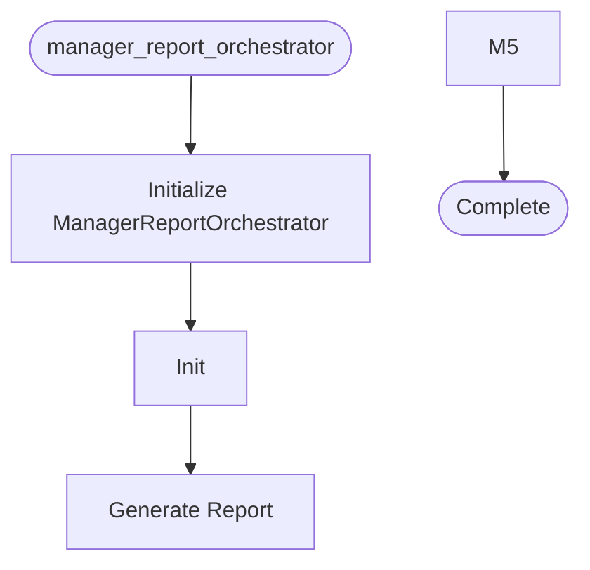

# Manager Report Orchestrator

**Author:** Asif Hussain | **Copyright:** © 2024-2025 Asif Hussain. All rights reserved.

---

## Overview

Manager Report Orchestrator

Generates comprehensive manager-level reports for CORTEX development metrics.
Provides velocity, coverage, productivity, and quality insights for team oversight.

Author: Asif Hussain
Copyright: © 2024-2025 Asif Hussain. All rights reserved.
License: Source-Available (Use Allowed, No Contributions)

## Workflow

## Class: ManagerReportOrchestrator

Orchestrates generation of manager-level performance reports.

Combines velocity metrics, test coverage, code quality, and productivity
insights into executive-friendly markdown reports.

### Methods

#### `__init__(self, cortex_root)`

Initialize manager report orchestrator.

Args:
    cortex_root: Root directory of CORTEX installation

#### `generate_report(self, period, output_path)`

Generate comprehensive manager report.

Args:
    period: Report period ("weekly", "monthly", "quarterly")
    output_path: Optional custom output path
    
Returns:
    Dict with success, report_path, metrics summary

#### `_get_days_for_period(self, period)`

Get number of days for report period.

#### `_calculate_summary(self, velocity_data, git_metrics, coverage_trends, file_hotspots, insights)`

Calculate summary statistics for report.

#### `_format_report(self, period, days, summary, velocity_data, git_metrics, coverage_trends, file_hotspots, insights)`

Format report as markdown.

#### `_format_duration(self, seconds)`

Format duration in human-readable format.

## Functions

### `main()`

CLI entry point for manager reports.

---

**Source:** `src/orchestrators/manager_report_orchestrator.py`
