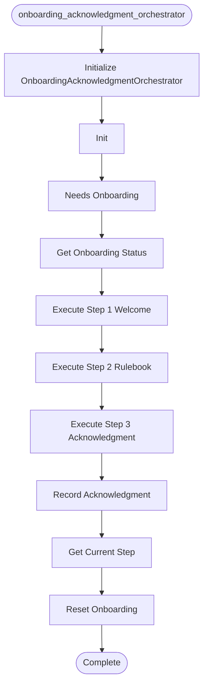

# Onboarding Acknowledgment Orchestrator

**Author:** Asif Hussain | **Copyright:** © 2024-2025 Asif Hussain. All rights reserved.

---

## Overview

Onboarding Acknowledgment Orchestrator - Sprint 1 Day 3

Manages 3-step governance acknowledgment flow for first-time users.

FLOW STEPS:
1. Welcome & Introduction
   - Greet user
   - Explain CORTEX governance approach
   - Set expectations

2. Rulebook Display
   - Show key governance rules
   - Highlight protection layers
   - Provide examples

3. Explicit Acknowledgment
   - Request confirmation
   - Record acknowledgment
   - Complete onboarding

USAGE:
    from src.orchestrators.onboarding_acknowledgment_orchestrator import OnboardingAcknowledgmentOrchestrator
    
    orchestrator = OnboardingAcknowledgmentOrchestrator()
    
    if orchestrator.needs_onboarding():
        # Start onboarding flow
        step1 = orchestrator.execute_step_1()
        # ... user proceeds through steps
        orchestrator.record_acknowledgment()

INTEGRATION:
- Called by UnifiedEntryPointOrchestrator for first-time users
- Skipped for returning users (acknowledged_rulebook=1)
- Works alongside WelcomeBannerAgent (banner is per-session, this is one-time)

SPRINT 1 DAY 3-4: First-Time Acknowledgment
Author: Asif Hussain (CORTEX Enhancement System)
Date: November 28, 2025

## Workflow

## Class: OnboardingStep

Onboarding flow steps.

**Inherits from:** Enum

## Class: OnboardingAcknowledgmentOrchestrator

Orchestrates 3-step governance acknowledgment for first-time users.

Features:
- Progressive disclosure (3 steps)
- User-paced progression
- Persistent state tracking
- Skip for returning users

### Methods

#### `__init__(self, db_path)`

Initialize onboarding orchestrator.

Args:
    db_path: Optional custom database path

#### `needs_onboarding(self)`

Check if user needs to go through onboarding.

Returns:
    True if user hasn't acknowledged rulebook, False otherwise

#### `get_onboarding_status(self)`

Get detailed onboarding status for user.

Returns:
    Dict with acknowledgment status and onboarding needs

#### `execute_step_1_welcome(self)`

Execute Step 1: Welcome & Introduction.

Returns:
    Dict with welcome content and next step info

#### `execute_step_2_rulebook(self)`

Execute Step 2: Rulebook Display.

Returns:
    Dict with rulebook content and next step info

#### `execute_step_3_acknowledgment(self)`

Execute Step 3: Acknowledgment.

This step requests explicit acknowledgment from the user.

Returns:
    Dict with acknowledgment prompt and instructions

#### `record_acknowledgment(self)`

Record user's acknowledgment and complete onboarding.

Returns:
    Dict with success status and completion message

#### `get_current_step(self)`

Get the current onboarding step.

Returns:
    OnboardingStep enum value

#### `reset_onboarding(self)`

Reset onboarding status (for testing or re-onboarding).

Returns:
    True if successful, False otherwise

---

**Source:** `src/orchestrators/onboarding_acknowledgment_orchestrator.py`
