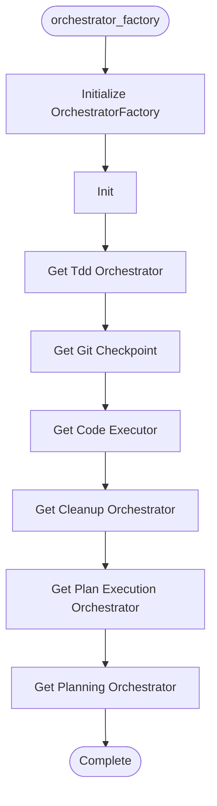

# Orchestrator Factory

**Author:** Asif Hussain | **Copyright:** © 2024-2025 Asif Hussain. All rights reserved.

---

## Overview

Orchestrator Factory - Dependency Injection & Configuration Management

Eliminates redundant initialization across orchestrators by providing:
- Centralized orchestrator instantiation
- Shared dependency injection
- Configuration-driven setup
- Testability via mock injection

Based on holistic analysis findings:
- 180+ lines of duplicated initialization code
- Tight coupling between orchestrators
- No dependency injection
- Manual import/initialization in each orchestrator

Author: Asif Hussain
Created: December 6, 2025
Version: 2.0.0 (Updated with Phase 2-5 integration)

## Workflow

## Class: ITDDOrchestrator

Interface for TDD orchestrators.

**Inherits from:** Protocol

### Methods

#### `start_session(self, feature_name, task_id)`

Start TDD session.

#### `execute_red_phase(self, session_id)`

Execute RED phase.

#### `execute_green_phase(self, session_id)`

Execute GREEN phase.

#### `execute_refactor_phase(self, session_id)`

Execute REFACTOR phase.

## Class: IGitCheckpointOrchestrator

Interface for Git checkpoint orchestrators.

**Inherits from:** Protocol

### Methods

#### `create_checkpoint(self, message, checkpoint_type)`

Create git checkpoint.

#### `create_auto_checkpoint(self, operation, message)`

Create automatic checkpoint.

#### `rollback_to_checkpoint(self, checkpoint_id)`

Rollback to checkpoint.

## Class: ICodeExecutor

Interface for code execution agents.

**Inherits from:** Protocol

### Methods

#### `can_handle(self, request)`

Check if can handle request.

#### `execute(self, request)`

Execute code implementation.

## Class: ICleanupOrchestrator

Interface for cleanup orchestrators.

**Inherits from:** Protocol

### Methods

#### `execute_cleanup(self, scope, dry_run)`

Execute cleanup operations.

## Class: OrchestratorFactory

Factory for creating orchestrators with dependency injection.

Eliminates:
- 180+ lines of redundant initialization code
- Tight coupling between orchestrators
- Manual dependency management
- Testing difficulties

Usage:
    config = OrchestratorConfig(cortex_root=Path("/path/to/cortex"))
    factory = OrchestratorFactory(config)
    
    # Get orchestrator with all dependencies injected
    plan_executor = factory.get_plan_execution_orchestrator()
    
    # For testing: inject mocks
    factory_with_mocks = OrchestratorFactory(config, tdd_orchestrator=MockTDD())

### Methods

#### `__init__(self, config, tdd_orchestrator, git_checkpoint, code_executor, cleanup_orchestrator)`

Initialize factory with configuration and optional mock dependencies.

Args:
    config: Orchestrator configuration
    tdd_orchestrator: Optional TDD orchestrator (for testing)
    git_checkpoint: Optional git checkpoint (for testing)
    code_executor: Optional code executor (for testing)
    cleanup_orchestrator: Optional cleanup orchestrator (for testing)

#### `get_tdd_orchestrator(self)`

Get or create TDD implementation orchestrator.

#### `get_git_checkpoint(self)`

Get or create Git checkpoint orchestrator.

#### `get_code_executor(self)`

Get or create Code Executor agent.

#### `get_cleanup_orchestrator(self)`

Get or create Cleanup orchestrator.

#### `get_plan_execution_orchestrator(self)`

Get or create Plan Execution Orchestrator with injected dependencies.

Returns:
    Plan execution orchestrator with all dependencies injected

#### `get_planning_orchestrator(self)`

Get or create Planning Orchestrator with injected dependencies.

Returns:
    Planning orchestrator with all dependencies injected

## Functions

### `create_orchestrator_factory(cortex_root)`

Convenience function to create factory with default configuration.

Args:
    cortex_root: Path to CORTEX root directory
    **config_overrides: Override default configuration values

Returns:
    Configured orchestrator factory

Example:
    factory = create_orchestrator_factory(
        cortex_root="/path/to/cortex",
        enable_vision_api=False,
        tdd_auto_debug=True
    )

---

**Source:** `src/orchestrators/orchestrator_factory.py`
