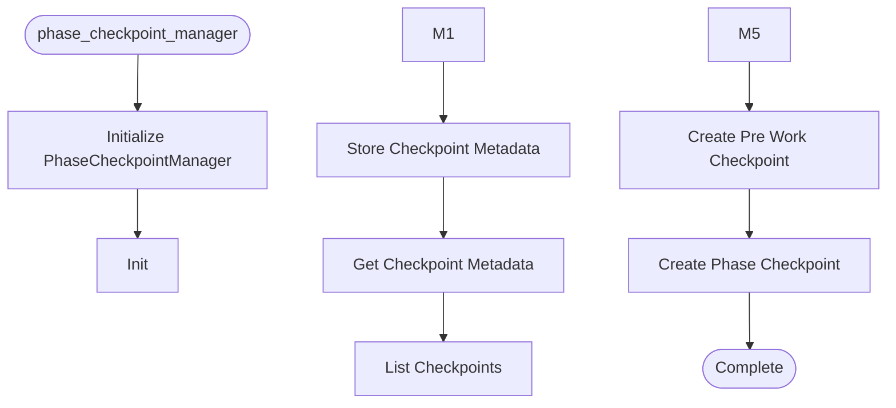

# Phase Checkpoint Manager

**Author:** Asif Hussain | **Copyright:** © 2024-2025 Asif Hussain. All rights reserved.

---

## Overview

Phase Checkpoint Manager for workflow phase tracking.

This module manages metadata for workflow phase checkpoints, enabling
rollback to specific phases and progress tracking.

Example:
    >>> manager = PhaseCheckpointManager()
    >>> checkpoint_id = manager.create_pre_work_checkpoint(
    ...     operation="Authentication feature",
    ...     session_id="feature-auth-001"
    ... )
    >>> print(f"Pre-work checkpoint created: {checkpoint_id}")
    >>> 
    >>> checkpoint_id = manager.create_phase_checkpoint(
    ...     phase="phase-1-foundation",
    ...     session_id="feature-auth-001",
    ...     metrics={"tests_passing": 25, "coverage": 92.5}
    ... )
    >>> print(f"Phase checkpoint created: {checkpoint_id}")

## Workflow

## Class: PhaseCheckpointManager

Manages phase checkpoint metadata for workflows.

Stores checkpoint metadata in .cortex/phase-checkpoints-{session_id}.json
files for resumable workflows and rollback support.

Integrates with GitCheckpointOrchestrator for automated checkpoint creation
during workflow phases.

Attributes:
    cortex_root: Path to repository root
    checkpoint_dir: Path to .cortex metadata directory
    git_checkpoint: GitCheckpointOrchestrator instance for checkpoint creation

### Methods

#### `__init__(self, cortex_root)`

Initialize manager with cortex root directory.

Args:
    cortex_root: Path to repository root (default: current directory)

#### `_get_metadata_file(self, session_id)`

Get metadata file path for session.

#### `store_checkpoint_metadata(self, session_id, phase, checkpoint_id, commit_sha, metrics)`

Store checkpoint metadata for workflow phase.

Args:
    session_id: Unique session identifier (e.g., "feature-xyz")
    phase: Phase name (e.g., "phase-1-foundation")
    checkpoint_id: Checkpoint identifier (e.g., "ckpt-001")
    commit_sha: Git commit SHA for checkpoint
    metrics: Optional performance/progress metrics

Example:
    >>> manager = PhaseCheckpointManager()
    >>> manager.store_checkpoint_metadata(
    ...     session_id="auth-feature",
    ...     phase="phase-2-implementation",
    ...     checkpoint_id="ckpt-002",
    ...     commit_sha="def456abc789",
    ...     metrics={"tests_passing": 45, "coverage": 92.5}
    ... )

#### `get_checkpoint_metadata(self, session_id, phase)`

Get checkpoint metadata for specific phase.

Args:
    session_id: Session identifier
    phase: Phase name to retrieve

Returns:
    Checkpoint metadata dictionary or None if not found

Example:
    >>> manager = PhaseCheckpointManager()
    >>> metadata = manager.get_checkpoint_metadata("auth-feature", "phase-1")
    >>> if metadata:
    ...     print(f"Checkpoint: {metadata['checkpoint_id']}")

#### `list_checkpoints(self, session_id)`

List all checkpoints for session.

Args:
    session_id: Session identifier

Returns:
    List of checkpoint dictionaries (empty if session doesn't exist)

Example:
    >>> manager = PhaseCheckpointManager()
    >>> checkpoints = manager.list_checkpoints("auth-feature")
    >>> for cp in checkpoints:
    ...     print(f"{cp['phase']}: {cp['commit_sha'][:7]}")

#### `_create_checkpoint_with_metadata(self, checkpoint_type, message, session_id, phase, metrics)`

Internal helper to create checkpoint and store metadata.

Args:
    checkpoint_type: Type for git checkpoint (e.g., "pre-work", "phase-X")
    message: Commit message
    session_id: Session identifier
    phase: Phase name for metadata storage
    metrics: Optional metrics to store

Returns:
    Checkpoint ID if successful, None if failed

#### `create_pre_work_checkpoint(self, operation, session_id)`

Create pre-work checkpoint before operation starts.

This checkpoint captures the repository state before any work begins,
enabling complete rollback if needed.

Args:
    operation: Description of operation about to begin
    session_id: Unique session identifier

Returns:
    Checkpoint ID if successful, None if failed

Example:
    >>> manager = PhaseCheckpointManager()
    >>> checkpoint_id = manager.create_pre_work_checkpoint(
    ...     operation="Authentication feature implementation",
    ...     session_id="feature-auth-001"
    ... )
    >>> if checkpoint_id:
    ...     print(f"✅ Pre-work checkpoint created: {checkpoint_id}")
    ... else:
    ...     print("⚠️ Checkpoint creation failed")

#### `create_phase_checkpoint(self, phase, session_id, metrics)`

Create phase checkpoint after phase completion.

This checkpoint captures progress after completing a workflow phase,
enabling rollback to specific phases if issues arise.

Args:
    phase: Phase name (e.g., "phase-1-foundation", "phase-2-implementation")
    session_id: Unique session identifier
    metrics: Optional performance/progress metrics (e.g., tests_passing, coverage)

Returns:
    Checkpoint ID if successful, None if failed

Example:
    >>> manager = PhaseCheckpointManager()
    >>> checkpoint_id = manager.create_phase_checkpoint(
    ...     phase="phase-2-implementation",
    ...     session_id="feature-auth-001",
    ...     metrics={"tests_passing": 45, "coverage": 92.5, "duration": 300}
    ... )
    >>> if checkpoint_id:
    ...     print(f"✅ Phase checkpoint created: {checkpoint_id}")
    ... else:
    ...     print("⚠️ Checkpoint creation failed")

---

**Source:** `src/orchestrators/phase_checkpoint_manager.py`
