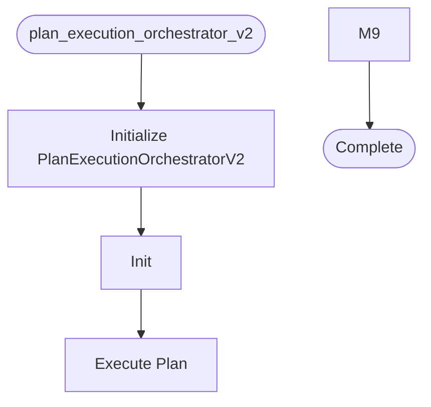

# Plan Execution Orchestrator V2

**Author:** Asif Hussain | **Copyright:** © 2024-2025 Asif Hussain. All rights reserved.

---

## Overview

Plan Execution Orchestrator V2 - Refactored with Dependency Injection

Improvements over V1:
- Dependency injection via constructor (no manual initialization)
- Protocol-based interfaces (testable, mockable)
- Shared configuration via OrchestratorConfig
- Eliminated 80+ lines of redundant initialization
- Backward compatible with existing plans

Migration Path:
- V1 remains available (plan_execution_orchestrator.py)
- V2 used via factory (recommended)
- Gradual migration of calling code

Author: Asif Hussain
Created: December 6, 2025
Version: 2.0.0

## Workflow

## Class: PlanExecutionOrchestratorV2

Executes feature implementation plans with injected dependencies.

Key Improvements:
- Dependencies injected via constructor (no manual initialization)
- Testable via mock injection
- No redundant try/except blocks
- Configuration-driven behavior

Workflow:
1. Load plan (YAML or Markdown)
2. Execute each phase sequentially
3. Automatically add Integration & Consolidation phase
4. Execute cleanup and wiring operations
5. Validate production readiness

### Methods

#### `__init__(self, cortex_root, tdd_orchestrator, git_checkpoint, code_executor, cleanup_orchestrator)`

Initialize orchestrator with injected dependencies.

Args:
    cortex_root: Path to CORTEX root directory
    tdd_orchestrator: TDD orchestrator (injected)
    git_checkpoint: Git checkpoint orchestrator (injected)
    code_executor: Code executor agent (injected)
    cleanup_orchestrator: Cleanup orchestrator (injected)

#### `execute_plan(self, plan_path, auto_consolidate, dry_run, execution_mode, force_execution)`

Execute a feature implementation plan.

Args:
    plan_path: Path to plan file (YAML or Markdown)
    auto_consolidate: Automatically add Integration & Consolidation phase
    dry_run: Preview execution without making changes
    execution_mode: "autonomous" or "approval_gated"
    force_execution: Skip DoR validation (DANGEROUS)

Returns:
    Tuple of (success, execution_report)

#### `_execute_phase(self, phase, dry_run)`

Execute a single phase of the plan.

#### `_execute_task(self, task)`

Execute a single task using appropriate orchestrator.

Routing:
- TDD orchestrator available → use TDD workflow
- Code executor available → use direct execution
- Neither available → error

#### `_execute_task_with_tdd(self, task, task_result)`

Execute task using TDD workflow.

#### `_execute_integration_consolidation_phase(self, plan_data, dry_run)`

Execute Integration & Consolidation phase.

#### `_validate_task_implementation_requirements(self, task)`

Validate task implementation requirements.

Checks from CRITICAL-ARCHITECTURE-REVIEW.md findings.

#### `_check_dor_item(self, item)`

Check if DoR item is satisfied.

#### `_load_plan(self, plan_path)`

Load and validate plan from file.

#### `_save_execution_report(self, report)`

Save execution report to file.

---

**Source:** `src/orchestrators/plan_execution_orchestrator_v2.py`
