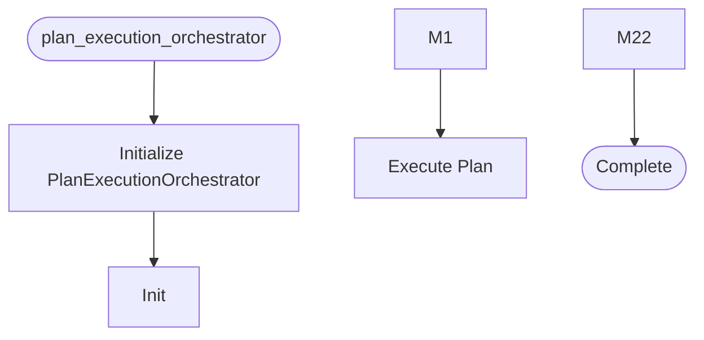

# Plan Execution Orchestrator

**Author:** Asif Hussain | **Copyright:** © 2024-2025 Asif Hussain. All rights reserved.

---

## Overview

Plan Execution Orchestrator for CORTEX

Executes feature implementation plans created by PlanningOrchestrator
and ADO Work Item Orchestrator. Autonomously implements phases with
automatic Integration & Consolidation phase at the end.

The Integration & Consolidation phase:
- Identifies and removes deprecated/obsolete code
- Eliminates duplicate implementations
- Organizes files into proper folder structures
- Updates references across the application
- Verifies new features are properly wired and functional
- Runs integration tests to validate production readiness

Author: GitHub Copilot (CORTEX 3.0)
Created: 2025-12-04

## Workflow

## Class: PlanExecutionOrchestrator

Orchestrates autonomous execution of feature implementation plans.

Workflow:
1. Load plan (YAML or Markdown)
2. Execute each phase sequentially
3. Automatically add Integration & Consolidation phase
4. Execute cleanup and wiring operations
5. Validate production readiness

Features:
- Phase-by-phase execution with checkpoints
- Automatic rollback on failure
- Integration & Consolidation phase (always added automatically)
- Production readiness validation
- Progress tracking and reporting

### Methods

#### `__init__(self, cortex_root)`

Initialize plan execution orchestrator.

Args:
    cortex_root: Path to CORTEX root directory

#### `_init_execution_agents(self)`

Initialize agents and orchestrators used for execution.

#### `execute_plan(self, plan_path, auto_consolidate, dry_run, execution_mode, force_execution)`

Execute a feature implementation plan.

Args:
    plan_path: Path to plan file (YAML or Markdown)
    auto_consolidate: Automatically add Integration & Consolidation phase
    dry_run: Preview execution without making changes
    execution_mode: "autonomous" (run all phases without stopping) or 
                  "approval_gated" (stop after each phase for approval)
    force_execution: Skip DoR validation (DANGEROUS - use only with remediation plan)

Returns:
    Tuple of (success, execution_report)

#### `_execute_phase(self, phase, dry_run)`

Execute a single phase of the plan.

Args:
    phase: Phase data from plan
    dry_run: Preview without making changes

Returns:
    Phase execution result

#### `_execute_task(self, task)`

Execute a single task.

Uses TDD workflow if task specifies TDD mode, otherwise uses CodeExecutor.

Args:
    task: Task data from phase

Returns:
    Task execution result

#### `_execute_task_with_tdd(self, task, task_result)`

Execute task using TDD workflow (RED→GREEN→REFACTOR).

Args:
    task: Task data
    task_result: Pre-initialized task result dict
    
Returns:
    Updated task result with TDD execution data

#### `_execute_integration_consolidation_phase(self, plan_data, dry_run)`

Execute Integration & Consolidation phase automatically.

This phase:
1. Identifies deprecated/obsolete code
2. Removes duplicates
3. Organizes files into proper structures
4. Updates references across application
5. Verifies features are wired and functional
6. Runs integration tests

Args:
    plan_data: Original plan data for context
    dry_run: Preview without making changes

Returns:
    Consolidation execution result

#### `_validate_task_implementation_requirements(self, task)`

Validate task specifies necessary implementation requirements.

Based on CORTEX-Clean-v2 review findings:
- Security requirements (auth, validation, sanitization)
- Error handling strategy
- Configuration externalization
- Transaction management (for data operations)
- Domain model richness (behavior vs data)

Args:
    task: Task data from plan
    
Returns:
    Dict with validation results and warnings

#### `_gather_affected_files(self, plan_data)`

Gather list of files affected by plan implementation.

#### `_find_deprecated_code(self, files)`

Find deprecated code markers in affected files.

#### `_remove_deprecated_code(self, items)`

Remove deprecated code using CleanupOrchestrator.

#### `_find_duplicate_code(self, files)`

Find duplicate code patterns in affected files.

#### `_eliminate_duplicates(self, duplicates)`

Eliminate duplicate code.

#### `_organize_files(self, files)`

Organize files into proper folder structures.

#### `_update_references(self, files)`

Update import statements and references after file moves.

#### `_verify_feature_wiring(self, plan_data)`

Verify new features are properly wired and accessible.

#### `_run_integration_tests(self, plan_data)`

Run integration tests to validate production readiness.

#### `_check_definition_of_ready(self, plan_data)`

Check if Definition of Ready is satisfied.

Args:
    plan_data: Plan dictionary

Returns:
    Tuple of (satisfied, list of violations)

#### `_generate_remediation_plan(self, plan_data, dor_violations)`

Generate remediation plan to address DoR violations.

Args:
    plan_data: Original plan data
    dor_violations: List of DoR violations

Returns:
    Remediation plan dictionary

#### `_load_plan(self, plan_path)`

Load plan from file (YAML or Markdown).

Args:
    plan_path: Path to plan file

Returns:
    Tuple of (success, plan_data, errors)

#### `_run_post_execution_quality_gate(self, phase)`

Run post-execution quality gate using Review Orchestrator.

Planning System 3.0 feature: Optional quality validation after phase execution.
Reviews code quality and provides score for decision-making.

Args:
    phase: Phase data (for configuration)
    
Returns:
    Quality gate result with score, validation status, checkpoint decision

#### `_parse_markdown_plan(self, plan_path)`

Parse Markdown plan into structured data.

#### `_save_execution_report(self, report)`

Save execution report to disk.

---

**Source:** `src/orchestrators/plan_execution_orchestrator.py`
