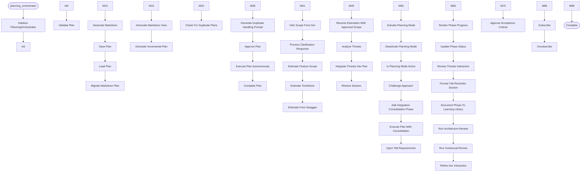

# Planning Orchestrator

**Author:** Asif Hussain | **Copyright:** © 2024-2025 Asif Hussain. All rights reserved.

---

## Overview

YAML Planning Orchestrator for CORTEX
Addresses Gap #6: Plans stored in .md not .yaml

Purpose:
- Validates YAML plans against plan-schema.yaml
- Generates readable Markdown views from YAML
- Migrates existing .md plans to .yaml format
- Provides programmatic access to plan data

Author: GitHub Copilot
Created: 2024-01-15

## Workflow

## Class: PlanningOrchestrator

Orchestrates YAML-based feature planning with validation and Markdown generation.

### Methods

#### `__init__(self, cortex_root)`

Initialize planning orchestrator.

Args:
    cortex_root: Path to CORTEX root directory

#### `_validate_manifest_compliance(self)`

Validate orchestrator compliance with manifest on initialization.
Logs drift warnings but does not block execution.

#### `_load_template_flags(self)`

Load planning-related flags from response templates.

#### `_load_schema(self)`

Load plan schema from YAML file.

#### `_get_default_schema(self)`

Return minimal default schema if file not found.

#### `validate_plan(self, plan_data)`

Validate plan against schema.

Now uses validation framework for consistent, centralized validation.
Legacy validation kept for backward compatibility.

Args:
    plan_data: Plan data dictionary

Returns:
    Tuple of (is_valid, error_messages)

#### `_validate_metadata(self, metadata)`

Validate metadata section.

#### `_validate_phases(self, phases)`

Validate phases section.

#### `_validate_tasks(self, tasks, task_ids, phase_label)`

Validate tasks within a phase.

#### `_validate_risks(self, risks)`

Validate risks section.

#### `_is_valid_iso8601(self, date_string)`

Check if string is valid ISO 8601 format.

#### `generate_markdown(self, plan_data)`

Generate Markdown view from YAML plan.

Args:
    plan_data: Validated plan data

Returns:
    Markdown-formatted string

#### `save_plan(self, plan_data, output_path)`

Save plan to YAML file (with validation).

AUTO-INJECTS TDD requirements into DoR/DoD before saving.

Args:
    plan_data: Plan data dictionary
    output_path: Optional custom output path (defaults to active plans dir)

Returns:
    Tuple of (success, message)

#### `load_plan(self, plan_path)`

Load and validate plan from YAML file.

Args:
    plan_path: Path to plan YAML file

Returns:
    Tuple of (success, plan_data, errors)

#### `migrate_markdown_plan(self, md_path)`

Migrate Markdown plan to YAML format.

Args:
    md_path: Path to Markdown plan file

Returns:
    Tuple of (success, plan_data, message)

#### `_parse_markdown_plan(self, content, md_path)`

Parse Markdown plan into YAML structure.

#### `generate_markdown_view(self, plan_path, output_path)`

Generate Markdown view from YAML plan file.

Args:
    plan_path: Path to YAML plan
    output_path: Optional output path for Markdown (defaults to same name with .md)

Returns:
    Tuple of (success, message)

#### `generate_incremental_plan(self, feature_requirements, checkpoint_callback, output_filename)`

Generate feature plan incrementally with token budgets and user checkpoints.

This method implements token-efficient planning by:
1. Generating a 200-token skeleton → user approval checkpoint
2. Filling Phase 1 sections (500 tokens each) → user approval checkpoint
3. Filling Phase 2 sections (500 tokens each) → user approval checkpoint
4. Filling Phase 3 sections (500 tokens each) → user approval checkpoint
5. Writing complete plan to disk using streaming writer

Args:
    feature_requirements: Natural language description of feature to plan
    checkpoint_callback: Optional callback(checkpoint_id, section_name, preview) -> approved
                         If None, auto-approves all checkpoints
    output_filename: Optional custom filename (default: auto-generated from session ID)

Returns:
    Tuple of (success, output_path, message)

Example:
    >>> def my_checkpoint_handler(cp_id, section, preview):
    ...     print(f"Checkpoint: {section}")
    ...     print(preview[:100])
    ...     return input("Approve? (y/n): ").lower() == 'y'
    ...
    >>> success, path, msg = orchestrator.generate_incremental_plan(
    ...     "User authentication system with JWT tokens",
    ...     checkpoint_callback=my_checkpoint_handler
    ... )

#### `_create_empty_plan_file(self, feature_name, output_filename)`

Create empty plan file with minimal metadata.

Args:
    feature_name: Feature name for the plan
    output_filename: Optional custom filename
    
Returns:
    Path to created plan file

#### `_append_phase_to_plan(self, plan_path, phase_name, sections)`

Append a phase to an existing plan file.

Args:
    plan_path: Path to plan file
    phase_name: Name of phase to append
    sections: List of section dicts with 'name' and 'content' keys

#### `_handle_checkpoint(self, callback, checkpoint_id, section_name, content_preview)`

Handle checkpoint approval via callback or auto-approve.

Args:
    callback: User-provided checkpoint handler
    checkpoint_id: Unique checkpoint identifier
    section_name: Name of section at checkpoint
    content_preview: Preview of content to approve

Returns:
    True if approved, False if rejected

#### `_handle_phase_checkpoint(self, callback, checkpoint_id, phase_name, section_names)`

Handle phase completion checkpoint.

Args:
    callback: User-provided checkpoint handler
    checkpoint_id: Unique checkpoint identifier
    phase_name: Name of completed phase
    section_names: List of section names in phase

Returns:
    True if approved, False if rejected

#### `_write_incremental_plan(self, output_filename)`

Write complete plan using StreamingPlanWriter.

Args:
    output_filename: Optional custom filename

Returns:
    Path to written plan file

#### `_get_section_content(self, section_name)`

Get content for a section from incremental generator.

#### `check_for_duplicate_plans(self, proposed_filename, proposed_content)`

Check for duplicate planning documents before creation.

Uses DocumentGovernance for semantic similarity detection.
Searches across all planning subdirectories (active, approved, completed).

Args:
    proposed_filename: Filename for proposed plan
    proposed_path: Path to proposed plan location
    proposed_content: Content of proposed plan

Returns:
    List of duplicate matches with:
    - existing_path: Path to existing document
    - similarity_score: Float 0-1 (1.0 = exact match)
    - algorithm: Detection algorithm used
    - recommendation: Human-readable suggestion

#### `_simple_duplicate_detection(self, proposed_filename, proposed_content)`

Simplified duplicate detection without DocumentGovernance.
Uses basic title and keyword matching.

#### `_extract_simple_title(self, content)`

Extract title from markdown content

#### `_extract_simple_keywords(self, content)`

Extract keywords from content (simple word extraction)

#### `_calculate_simple_similarity(self, str1, str2)`

Calculate simple similarity between two strings

#### `generate_duplicate_handling_prompt(self, duplicates)`

Generate user-friendly prompt for handling duplicates.

Args:
    duplicates: List of duplicate matches from check_for_duplicate_plans()

Returns:
    Markdown-formatted prompt with options

#### `approve_plan(self, plan_filename)`

Approve a plan, moving it from active to approved directory.

Args:
    plan_filename: Filename of plan to approve

Returns:
    Dictionary with:
    - success: bool
    - message: str
    - old_status: str
    - new_status: str
    - old_path: Optional[Path]
    - new_path: Optional[Path]

#### `execute_plan_autonomously(self, plan_filename)`

Execute an approved plan autonomously from start to finish.

This method executes all phases and tasks in sequence with:
- Phase-by-phase execution
- Progress tracking with visual updates
- TDD workflow enforcement (RED→GREEN→REFACTOR)
- Git checkpoints at phase boundaries
- Automatic plan completion and documentation

Args:
    plan_filename: Name of the plan file (with .yaml extension)

Returns:
    Dict with execution results, completed tasks, and documentation reminder

#### `complete_plan(self, plan_filename)`

Mark a plan as completed, moving it from approved to completed directory.
Adds completion timestamp to the plan.

Args:
    plan_filename: Filename of plan to complete

Returns:
    Dictionary with:
    - success: bool
    - message: str
    - old_status: str
    - new_status: str
    - old_path: Optional[Path]
    - new_path: Optional[Path]
    - completed_date: str

#### `_generate_progress_bar(self, current, total, width)`

Generate ASCII progress bar.

Args:
    current: Current progress value
    total: Total value for 100%
    width: Width of progress bar in characters

Returns:
    Progress bar string like [████████░░]

#### `_generate_mitigation_progress_bar(self, threat_analysis)`

Generate progress bar for threat mitigation implementation.

Args:
    threat_analysis: Threat analysis data
    
Returns:
    Progress bar showing mitigation status

#### `_format_stride_summary(self, stride_summary)`

Format STRIDE summary for display.

Args:
    stride_summary: Dict with STRIDE category counts
    
Returns:
    Formatted string like "Spoofing: 3, Tampering: 0, ..."

#### `_render_threat_section_for_progress(self, threat_analysis)`

Render threat analysis section for progress template.

Args:
    threat_analysis: Threat analysis data
    
Returns:
    Formatted markdown section

#### `_format_execution_log(self, execution_log, max_entries)`

Format execution log for display.

Args:
    execution_log: List of execution log entries
    max_entries: Maximum number of entries to show

Returns:
    Formatted log string

#### `_generate_documentation_reminder(self, context)`

Generate documentation reminder for learning library with dashboard link.

Intelligently determines when documentation is valuable:
- plan_completion: Always document (major milestone)
- phase_completion: Only document phases with significant learnings
- plan_approval: Only if plan has novel approach

Args:
    context: Context of the reminder (plan_completion, phase_completion, plan_approval, ado_completion)
    **kwargs: Additional context-specific parameters

Returns:
    Formatted documentation reminder string with dashboard link

#### `_generate_phase_documentation_reminder(self)`

Intelligently determine if phase warrants documentation.

Only suggest documentation for phases with:
- Novel technical approaches
- Complex problem-solving
- Significant architectural decisions
- Integration challenges overcome

Args:
    **kwargs: Phase context (phase_name, phase_number, tasks_completed, etc.)

Returns:
    Documentation reminder string or empty if phase doesn't warrant docs

#### `_update_status_in_content(self, content, new_status)`

Update status field in plan content.

Args:
    content: Original content
    new_status: New status value

Returns:
    Updated content

#### `_add_completion_timestamp(self, content, completion_date)`

Add completion timestamp to plan content.

Args:
    content: Plan content
    completion_date: Completion date (YYYY-MM-DD)

Returns:
    Updated content

#### `infer_scope_from_dor(self, dor_responses)`

Infer feature scope from DoR responses (Q3 + Q6)

This is the SWAGGER Entry Point - automatically extracts scope boundaries
from DoR answers to reduce interrogation by 70%

Args:
    dor_responses: Dictionary with keys 'Q3' (functional scope) and 'Q6' (dependencies)

Returns:
    Dictionary with:
        - entities: Extracted scope entities (tables, files, services, dependencies)
        - confidence: Confidence score (0.0-1.0)
        - validation: Validation result
        - needs_clarification: Boolean indicating if clarification is needed
        - clarification_prompt: Optional prompt for user (if needs_clarification=True)

#### `process_clarification_response(self, user_response)`

Process user's response to clarification questions

Args:
    user_response: User's text response with additional scope details

Returns:
    Dictionary with:
        - entities: Re-extracted scope entities
        - confidence: Updated confidence score
        - is_vague: Boolean indicating if response is still vague

#### `estimate_feature_scope(self, feature_name, dor_responses, max_clarification_rounds)`

Complete scope estimation workflow with automatic clarification

This is the main entry point for the SWAGGER scope estimation system

Args:
    feature_name: Name of the feature being planned
    dor_responses: DoR responses (Q3 + Q6 minimum)
    max_clarification_rounds: Maximum clarification iterations (default 2)

Returns:
    Dictionary with:
        - final_scope: Final extracted scope entities
        - confidence: Final confidence score
        - rounds_completed: Number of clarification rounds used
        - workflow_log: List of workflow steps taken
        - success: Boolean indicating if confidence threshold was met

#### `estimate_timeframe(self, complexity, scope, team_size, velocity, include_three_point, scope_boundary)`

Generate time estimates from SWAGGER complexity score

⚠️ CRITICAL: Estimates BLOCKED unless scope is user-approved (CORTEX 3.2.1)

Natural language triggers:
- "timeframe", "estimate", "time estimate", "how long", "duration"
- "story points", "sprint estimate", "team size", "velocity"

This method integrates TIMEFRAME Entry Point Module with SWAGGER.
Call this after scope inference when user asks about time estimates.

Args:
    complexity: SWAGGER complexity score (0-100)
    scope: Optional SWAGGER scope dict (for detailed breakdown)
    team_size: Number of developers on team (default: 1)
    velocity: Optional team velocity (story points per sprint)
    include_three_point: Generate PERT three-point estimate
    scope_boundary: Optional ScopeBoundary with approval tracking (NEW 3.2.1)

Returns:
    Dictionary with:
        - story_points: Fibonacci story points
        - hours_single: Single developer hours
        - hours_team: Team hours (with communication overhead)
        - days_single: Single developer days
        - days_team: Team calendar days
        - sprints: Sprint allocation
        - confidence: Estimate confidence (HIGH/MEDIUM/LOW)
        - breakdown: Effort breakdown by entity type
        - assumptions: List of estimation assumptions
        - report: Formatted markdown report
        - three_point: Optional PERT estimates (best/likely/worst)
    
    OR (if scope approval required):
        - status: 'scope_approval_required'
        - swagger_context_id: Context ID for later retrieval
        - confidence: Scope confidence score
        - clarification_prompt: User-facing prompt
        - next_action: 'plan'
        - message: Detailed explanation for user

Example:
    >>> # After SWAGGER scope inference
    >>> scope_result = orchestrator.infer_scope_from_dor(dor_responses)
    >>> complexity = scope_result['validation']['complexity']
    >>> 
    >>> # User asks: "what's the timeframe for this?"
    >>> timeframe = orchestrator.estimate_timeframe(
    ...     complexity=complexity,
    ...     scope=scope_result['entities'],
    ...     team_size=2,
    ...     scope_boundary=scope_result['scope_boundary']  # NEW
    ... )
    >>> 
    >>> if timeframe.get('status') == 'scope_approval_required':
    >>>     # User approval needed - hand off to planner
    >>>     print(timeframe['message'])
    >>> else:
    >>>     # Approved - show estimate
    >>>     print(timeframe['report'])

#### `estimate_from_swagger(self, swagger_file_path, team_size, velocity)`

Estimate project complexity and effort from Swagger/OpenAPI specification (REQ-004).

Parses Swagger 2.0 or OpenAPI 3.0 files to extract API complexity metrics
and generate time/effort estimates integrated with estimate_timeframe().

Args:
    swagger_file_path: Path to swagger.json, swagger.yaml, or openapi.yaml
    team_size: Number of developers (default: 1)
    velocity: Optional team velocity (story points per sprint)
    
Returns:
    Dictionary with:
        - success: bool
        - swagger_metrics: Parsed API metrics
        - estimate: Time/effort estimates (from estimate_timeframe)
        - metadata: Swagger metadata stored in plan
        
Example:
    >>> result = orchestrator.estimate_from_swagger(
    ...     swagger_file_path="api/swagger.yaml",
    ...     team_size=2
    ... )
    >>> print(f"Estimated: {result['estimate']['days_team']} days")

#### `_hand_off_to_planner_for_approval(self, complexity, scope_boundary, scope, team_size, velocity)`

Hand off to planner when scope requires user approval

Preserves SWAGGER context for return path to estimator after user
reviews and approves scope boundaries.

Args:
    complexity: SWAGGER complexity score
    scope_boundary: ScopeBoundary with approval status
    scope: Optional scope dict
    team_size: Team size for estimation
    velocity: Optional velocity

Returns:
    Handoff response with clarification prompt and context ID

#### `_store_swagger_context(self, context_id, complexity, scope_boundary, scope, team_size, velocity)`

Store SWAGGER context in Tier 1 working memory

#### `_generate_scope_clarification_prompt(self, scope_boundary, scope, confidence)`

Generate user-facing clarification prompt

#### `resume_estimation_with_approved_scope(self, swagger_context_id, approved_scope)`

Resume estimation after user approves scope via planning workflow

Called when:
1. User completes planning workflow
2. User explicitly approves scope preview
3. Planner returns to estimator with validated scope

Args:
    swagger_context_id: Context ID from original handoff
    approved_scope: Optional updated scope from planning workflow

Returns:
    Time estimate dictionary (same format as estimate_timeframe)

#### `analyze_threats(self, feature_description, plan_data)`

Analyze security threats for a feature using ThreatModelerAgent.

This method integrates threat modeling into the planning workflow,
providing STRIDE-based threat analysis with mitigations.

Args:
    feature_description: Natural language description of feature
    plan_data: Optional plan data for enhanced context

Returns:
    Threat analysis result with:
    - threats: List of identified threats
    - mitigations: Mitigation strategies
    - owasp_mapping: OWASP Top 10 mappings
    - risk_summary: Risk rating summary

#### `integrate_threats_into_plan(self, plan_data, threat_analysis)`

Integrate threat analysis results into plan data.

Adds security section and updates DoD with threat mitigations.

Args:
    plan_data: Existing plan data
    threat_analysis: Results from analyze_threats()

Returns:
    Updated plan data with integrated threats

#### `restore_session(self, plan_file_path)`

Restore planning session from existing plan file.

Enables cross-chat resumption: Open new chat → Reference plan file → Say 'continue'

Args:
    plan_file_path: Path to plan file, or None to find most recent active plan

Returns:
    Restoration result with plan data and resume point

#### `_find_most_recent_plan(self)`

Find most recent active plan file.

#### `_find_resume_point(self, plan_content)`

Parse plan content to find first incomplete task.

#### `activate_planning_mode(self, context)`

Activate planning mode - all user input treated as plan refinement.

#### `deactivate_planning_mode(self)`

Deactivate planning mode after 'approve plan' command.

#### `is_planning_mode_active(self)`

Check if planning mode is currently active.

#### `challenge_approach(self, requirements)`

Challenge potentially suboptimal approaches during DoR validation.

Proactively presents alternatives with trade-offs before proceeding.

Args:
    requirements: Feature requirements from DoR validation

Returns:
    Challenge result with alternatives and recommendations

#### `add_integration_consolidation_phase(self, plan_data)`

Automatically add Integration & Consolidation phase to plan.

This final phase ensures:
- Deprecated code is removed
- Duplicates are eliminated
- Files are organized properly
- References are updated across application
- New features are wired and functional in production

Args:
    plan_data: Original plan data

Returns:
    Updated plan data with Integration & Consolidation phase

#### `execute_plan_with_consolidation(self, plan_path, auto_execute, dry_run)`

Execute plan with automatic Integration & Consolidation phase.

Workflow:
1. Load plan
2. Add Integration & Consolidation phase if not present
3. Optionally execute plan automatically
4. Return execution results

Args:
    plan_path: Path to plan file
    auto_execute: Execute plan immediately (default: False, plan only)
    dry_run: Preview execution without making changes

Returns:
    Tuple of (success, result_data)

#### `inject_tdd_requirements(self, plan_data)`

Inject mandatory TDD Mastery requirements AND intelligent test strategy into plan DoR/DoD.

This ensures Copilot cannot miss TDD workflow and SKULL enforcement.

SKULL Compliance:
- TDD_ENFORCEMENT: RED→GREEN→REFACTOR workflow
- RED_PHASE_VALIDATION: Tests must fail before implementation
- BRAIN_PROTECTION: All Tier 0 rules enforced

NEW (v3.8.4): Test Intelligence Integration
- Detects test types from feature description
- Recommends frameworks based on user preferences
- Provides headed/headless execution guidance

Args:
    plan_data: Plan dictionary with metadata, phases, DoR, DoD
    
Returns:
    Enriched plan with TDD requirements AND test strategy in DoR/DoD

#### `_inject_test_strategy(self, plan_data, dor, dod)`

Detect test requirements from feature description and inject into DoR/DoD.

Uses test intelligence module to:
1. Analyze feature description for test types
2. Recommend execution modes (headed/headless)
3. Suggest frameworks based on user preferences
4. Format requirements for DoR/DoD

Args:
    plan_data: Plan dictionary with metadata
    dor: Definition of Ready list (modified in place)
    dod: Definition of Done list (modified in place)
    
Returns:
    True if test strategy was injected, False if skipped

#### `_run_threat_analysis(self, feature_description, feature_name)`

Run threat modeling analysis using ThreatModelerAgent.

Args:
    feature_description: Description of the feature to analyze
    feature_name: Name of the feature
    
Returns:
    Threat analysis results or None if analysis fails

#### `_append_threat_analysis_to_plan(self, plan_path, threat_analysis)`

Append threat modeling section to plan file.

Args:
    plan_path: Path to plan file
    threat_analysis: Threat analysis results from ThreatModelerAgent

#### `render_phase_progress(self)`

Render visual phase progress for response templates (REQ-005).

Returns:
    Markdown-formatted progress visualization

#### `update_phase_status(self, phase_name, status, progress)`

Update phase status and progress for visual tracking (REQ-005).

Args:
    phase_name: Name of phase to update
    status: Status ('pending', 'in_progress', 'completed')
    progress: Progress percentage (0-100)

#### `review_threats_interactive(self, threat_analysis, checkpoint_callback)`

Interactive threat review workflow (REQ-007).

Presents threats to user with options to:
- Accept threat as-is
- Dismiss with justification
- Adjust priority
- Add mitigation notes

Args:
    threat_analysis: Results from ThreatModelerAgent
    checkpoint_callback: Optional callback for user interaction
    
Returns:
    Updated threat analysis with user decisions

#### `format_tdd_reminder_section(self)`

Format TDD requirements reminder for visibility (REQ-008).

Returns:
    Markdown section with TDD requirements and guide link

#### `document_phase_to_learning_library(self, phase_name, phase_details, decisions_made, challenges_faced, solutions_applied)`

Auto-document phase completion to learning library (REQ-006).

Creates structured lesson-learned entry after phase completion,
capturing planning decisions, challenges, and solutions for
future reference by business users, engineers, and product owners.

Args:
    phase_name: Name of completed phase
    phase_details: Phase metadata (tasks, duration, etc.)
    decisions_made: List of key decisions made during phase
    challenges_faced: List of challenges encountered
    solutions_applied: List of solutions that worked
    
Returns:
    Lesson ID if documented, None if failed

#### `run_architecture_review(self)`

Run Architectural Review before planning (REQ-003 from manifest).

DEPRECATED: Use run_contextual_review() for feature-scoped analysis.

Returns:
    Review results dict with overall_score, summary, findings
    None if review fails

#### `run_contextual_review(self, feature_requirements)`

Run context-aware architectural review before planning (REQ-003 Enhanced).

Executes comprehensive review with scope filtering:
- Assess code quality in context of user request
- Identify blockers that prevent feature implementation
- Classify findings by relevance (blocker/critical/improvement)
- Add remediation tasks for blocking issues

Args:
    feature_requirements: User's feature request for scope filtering

Returns:
    Review results dict with:
    - overall_score: 0-100
    - blocking_issues: List of findings that prevent feature
    - critical_issues: List of findings that should be fixed
    - improvements: List of optional enhancements
    - report_path: Path to detailed report
    None if review fails

#### `refine_dor_interactive(self, feature_requirements, checkpoint_callback)`

Interactive DoR Workflow (REQ-002 from manifest).

Iteratively refines Definition of Ready items with user. Each DoR item
must be validated individually before proceeding to planning.

Args:
    feature_requirements: Feature description
    checkpoint_callback: Callback for user interaction
    
Returns:
    List of approved DoR items

#### `_generate_initial_dor(self, feature_requirements)`

Generate initial DoR items based on feature description

#### `_format_dor_checklist(self, dor_items, approved_items, feature_requirements)`

Format DoR checklist for user review

#### `approve_acceptance_criteria(self, plan_path, checkpoint_callback, plan_data)`

Acceptance Criteria Approval Gate (REQ-001 from manifest).

Blocks plan execution until user explicitly approves acceptance criteria.
Shows visual checklist of DoD items and critical acceptance criteria.

Args:
    plan_path: Path to plan file
    checkpoint_callback: Callback(checkpoint_id, title, content) -> approved
    plan_data: Optional plan data (avoids reloading)
    
Returns:
    True if approved, False if rejected

#### `_extract_acceptance_criteria(self, plan_data)`

Extract acceptance criteria from plan

#### `_format_acceptance_approval_prompt(self, acceptance_section, dod_items, plan_path)`

Format acceptance criteria approval prompt with visual checklist

#### `_format_threat_section(self, threat_analysis)`

Format threat analysis results as markdown section.

Args:
    threat_analysis: Threat analysis results
    
Returns:
    Formatted markdown string

#### `_extract_scope_keywords(self, feature_requirements)`

Extract scope keywords from feature requirements for focused review.

Args:
    feature_requirements: User's feature description
    
Returns:
    List of keywords (e.g., ['auth', 'api', 'database'])

#### `_extract_findings_from_sections(self, sections)`

Extract individual findings from review sections.

Args:
    sections: List of ReviewSection dicts from review orchestrator
    
Returns:
    Flattened list of finding dicts

#### `_classify_findings_by_relevance(self, findings, feature_requirements)`

Classify findings by relevance to user's feature request.

Classification rules:
- BLOCKER: Prevents feature implementation (e.g., broken auth when adding auth)
- CRITICAL: Will cause issues if not fixed (e.g., security flaw in related code)
- IMPROVEMENT: Nice-to-have cleanup (e.g., refactor unrelated code)

Args:
    findings: List of ReviewFinding dicts
    feature_requirements: User's feature request
    
Returns:
    Dict with 'blockers', 'critical', 'improvements' lists

#### `_calculate_finding_relevance(self, finding, scope_keywords, requirements_lower)`

Calculate how relevant a finding is to the user's request.

Args:
    finding: ReviewFinding dict
    scope_keywords: Detected scope keywords
    requirements_lower: Lowercase feature requirements
    
Returns:
    Relevance score 0.0 - 1.0

#### `_challenge_blockers(self, blocking_issues, feature_requirements, checkpoint_callback)`

Challenge user when critical blockers are detected.

Presents blocking issues and asks user to:
- Auto-fix: Add remediation tasks to plan (recommended)
- Skip: Continue with blockers (not recommended)
- Abort: Cancel planning

Args:
    blocking_issues: List of blocking findings
    feature_requirements: User's original request
    checkpoint_callback: Callback for user interaction
    
Returns:
    'auto-fix', 'skip', or 'abort'

#### `_format_blocker_challenge(self, blocking_issues, feature_requirements)`

Format blocker challenge message for user.

#### `_generate_remediation_phase(self, blocking_issues, critical_issues)`

Generate Phase 0: Remediation tasks from blocking/critical issues.

Args:
    blocking_issues: List of blocking findings
    critical_issues: List of critical findings
    
Returns:
    List of section dicts for Phase 0

#### `subscribe(self, observer)`

Subscribe observer to planning events.

Args:
    observer: Observer instance with on_phase_completion method

#### `unsubscribe(self, observer)`

Unsubscribe observer from planning events.

Args:
    observer: Observer instance to remove

#### `_emit_phase_completion_event(self, phase_id, phase_name, duration_seconds, dor_compliant, dod_compliant, threat_model_applied, acceptance_criteria_defined, estimated_hours, actual_hours)`

Emit phase completion event to all observers.

Args:
    phase_id: Phase identifier (e.g., "1.1", "2.3")
    phase_name: Human-readable phase name
    duration_seconds: Phase duration in seconds
    dor_compliant: Whether DoR criteria met
    dod_compliant: Whether DoD criteria met
    threat_model_applied: Whether threat modeling was performed
    acceptance_criteria_defined: Whether acceptance criteria exist
    estimated_hours: Original time estimate
    actual_hours: Actual time spent (if completed)

---

**Source:** `src/orchestrators/planning_orchestrator.py`
