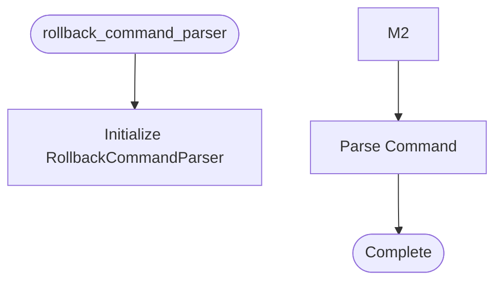

# Rollback Command Parser

**Author:** Asif Hussain | **Copyright:** © 2024-2025 Asif Hussain. All rights reserved.

---

## Overview

Rollback Command Parser

Purpose: Parse natural language rollback commands into structured format
Author: Asif Hussain
Created: 2025-11-27

Command Formats Supported:
- "rollback to checkpoint-X"
- "rollback session session-Y to checkpoint-X"  
- "rollback checkpoint-X" (shorthand)

Integration Points:
- RollbackOrchestrator: Uses parsed checkpoint_id for validation
- User interaction: Translates natural language to structured commands

## Workflow

## Class: RollbackCommandParser

Parse natural language rollback commands into structured format.

Supports multiple command formats and validates checkpoint ID format.

### Methods

#### `_create_error_response(self, error_message)`

Create standardized error response.

#### `_create_success_response(self, checkpoint_id, session_id)`

Create standardized success response.

#### `_validate_checkpoint_id(self, checkpoint_id, command_format)`

Validate checkpoint ID format.

Returns:
    Error response dict if invalid, None if valid

#### `parse_command(self, command)`

Parse rollback command into structured format.

Args:
    command: Natural language rollback command
    
Returns:
    Dict with keys:
    - valid (bool): Whether command is valid
    - checkpoint_id (str|None): Extracted checkpoint ID
    - session_id (str|None): Extracted session ID (if specified)
    - error_message (str|None): Error description if invalid
    
Example:
    >>> parser = RollbackCommandParser()
    >>> parser.parse_command("rollback to checkpoint-abc123")
    {'valid': True, 'checkpoint_id': 'checkpoint-abc123', 'session_id': None}
    
    >>> parser.parse_command("rollback session session-1 to checkpoint-xyz")
    {'valid': True, 'checkpoint_id': 'checkpoint-xyz', 'session_id': 'session-1'}

---

**Source:** `src/orchestrators/rollback_command_parser.py`
