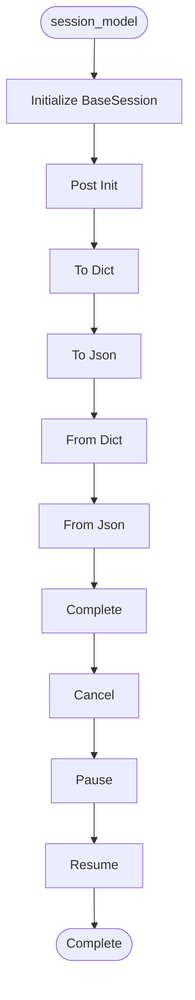

# Session Model

**Author:** Asif Hussain | **Copyright:** © 2024-2025 Asif Hussain. All rights reserved.

---

## Overview

Unified Session Model for CORTEX Orchestrators

Provides type-safe, consistent state management across all orchestrators.
Eliminates Dict-based state management issues.

Version: 1.0.0
Author: Asif Hussain

## Workflow

## Class: SessionStatus

Standard session statuses across all orchestrators.

**Inherits from:** Enum

### Methods

#### `is_active(self)`

Check if session is in active state.

#### `is_terminal(self)`

Check if session is in terminal state.

## Class: BaseSession

Base session model for all orchestrators.

Provides common fields and serialization for all session types.

### Methods

#### `to_dict(self)`

Serialize to dictionary.

#### `to_json(self)`

Serialize to JSON string.

#### `from_dict(cls, data)`

Deserialize from dictionary.

#### `from_json(cls, json_str)`

Deserialize from JSON string.

#### `complete(self, success, error_message)`

Mark session as completed.

#### `cancel(self, reason)`

Cancel session.

#### `pause(self)`

Pause session.

#### `resume(self)`

Resume paused session.

## Class: TDDPhase

TDD workflow phases.

**Inherits from:** Enum

## Class: TDDSession

TDD-specific session state.

Tracks RED→GREEN→REFACTOR workflow, test/implementation files,
checkpoints, and metrics.

**Inherits from:** BaseSession

### Methods

#### `transition_to_phase(self, phase, checkpoint_id)`

Transition to new TDD phase.

Args:
    phase: Target phase
    checkpoint_id: Optional git checkpoint ID

#### `to_dict(self)`

Serialize with TDD-specific fields.

## Class: PlanningSession

Planning-specific session state.

Tracks interactive planning workflow, DoR/DoD, phases, and validation.

**Inherits from:** BaseSession

### Methods

#### `add_phase(self, phase_name, tasks)`

Add phase to plan.

#### `validate_plan(self)`

Validate plan completeness.

Returns:
    True if valid, False otherwise

#### `approve(self)`

Approve plan for execution.

#### `get_phase_progress(self)`

Get phase completion progress for visual rendering (REQ-005).

Returns:
    Dictionary with phase progress details for rendering

#### `render_progress_table(self)`

Render visual progress table in Markdown (REQ-005).

Returns:
    Markdown table with phase progress

#### `_render_mini_progress_bar(self, percentage, width)`

Render a mini progress bar for tables.

## Class: ExecutionMode

Execution modes.

**Inherits from:** Enum

## Class: PhaseExecution

Single phase execution record.

### Methods

#### `to_dict(self)`

Serialize to dictionary.

## Class: ExecutionSession

Execution-specific session state.

Tracks plan execution progress, phase completion, approval gates.

**Inherits from:** BaseSession

### Methods

#### `start_phase(self, phase_name)`

Start executing a phase.

Args:
    phase_name: Phase name
    
Returns:
    PhaseExecution record

#### `complete_phase(self, success, error_message)`

Complete current phase.

#### `request_approval(self)`

Request user approval before continuing.

#### `grant_approval(self)`

Grant approval to continue.

#### `get_progress_percentage(self)`

Calculate execution progress.

Returns:
    Progress percentage (0-100)

#### `to_dict(self)`

Serialize with execution-specific fields.

## Class: GitCheckpointSession

Git checkpoint session state.

Tracks git operations, commits, branches.

**Inherits from:** BaseSession

### Methods

#### `record_commit(self, commit_sha, files_changed)`

Record git commit.

## Class: SessionFactory

Factory for creating typed sessions.

### Methods

#### `create_tdd_session(feature_name)`

Create TDD session.

#### `create_planning_session(plan_title)`

Create planning session.

#### `create_execution_session(plan_path, mode)`

Create execution session.

#### `create_git_checkpoint_session(commit_message)`

Create git checkpoint session.

---

**Source:** `src/orchestrators/session_model.py`
